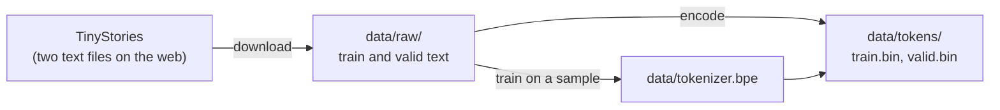
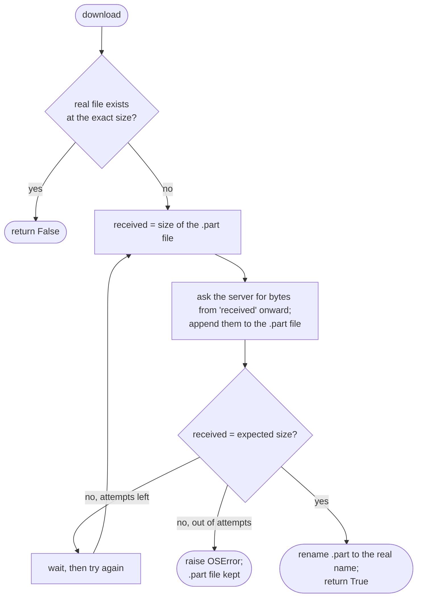

# 1. Setup and the data

Before a single line of model code, two things must be true: the machine can run PyTorch on its
graphics card, and the text the model will learn from is on disk, complete and uncorrupted. This
chapter builds both. The first is a one-command machine check that fails in seconds rather than
hours into a training run. The second is a downloader for a 2.2 GB dataset that survives dropped
connections and can never leave behind a file that only looks finished. Neither is machine learning
yet, but every later chapter stands on them.

**Code:** [`hello_tokens/__main__.py`](../../hello_tokens/__main__.py) ·
[`hello_tokens/corpus/download.py`](../../hello_tokens/corpus/download.py) ·
[`pyproject.toml`](../../pyproject.toml)
**Tests:** [`tests/test_main.py`](../../tests/test_main.py) ·
[`tests/corpus/test_download.py`](../../tests/corpus/test_download.py)

## Words

- **Language model**: a program that, given some text, assigns a probability to every possible next
  piece of text. Writing a story is repeatedly picking a next piece and appending it.
- **Token**: one of those pieces. A token can be a single byte, part of a word or a whole word; the
  set of all tokens is the **vocabulary**. [Chapter 2](02-byte-pair-encoding.md) builds the
  program that decides what the tokens are.
- **Training**: adjusting the model's numbers, its **parameters**, so that it assigns higher
  probability to the text it is shown. The text used for this is the **training data** or
  **corpus**.
- **Held-out data** (also **validation data**): text kept aside and never trained on, used to
  measure whether the model has learned something general rather than memorized its training data.
- **Tensor**: PyTorch's name for a grid of numbers with any number of dimensions. A list of numbers
  is a one-dimensional tensor; a table is two-dimensional.
- **GPU**: the graphics card. It performs thousands of arithmetic operations at once, which is what
  training needs. PyTorch talks to NVIDIA GPUs through **CUDA**, NVIDIA's programming layer.
- **bf16**: a 16-bit number format, half the size of the usual 32-bit float. Later chapters use it
  to train faster and in less memory.

## The idea

A language model learns from a large amount of text, and learning takes many minutes of GPU time.
That combination makes failures expensive. A broken GPU driver discovered after the first hour of
training wastes the hour; a training file silently cut short teaches the model from the wrong data,
and nothing downstream would notice.

So the project begins with two commands, both reached through one entry point,
`python -m hello_tokens <command>`:

- **`check`** reports the Python and PyTorch versions, then makes the GPU do one real computation
  and waits for the answer. If the setup is broken, this is where it fails.
- **`prepare`** fetches the training text. It is also the first step of a longer pipeline: after the
  download it trains the tokenizer and encodes the whole corpus into token files. This chapter
  covers the download; [chapter 2](02-byte-pair-encoding.md) and chapter 3 cover the other two
  steps.



The data is [TinyStories](https://arxiv.org/abs/2305.07759) (Eldan and Li, 2023): short children's
stories written by a larger language model, using a deliberately small vocabulary. Its narrow world
is what makes it useful here. A model small enough to train on a laptop can learn to write coherent
stories in it, where the same model trained on general web text would produce little that reads as
language. The dataset is licensed CDLA-Sharing-1.0 and is downloaded locally, never committed to the
repository.

## Setting up the environment

The project pins its environment so that anyone can rebuild it exactly. It uses Python 3.14 and
PyTorch 2.14, managed by [uv](https://docs.astral.sh/uv/), which records the exact version of every
library in `uv.lock`. One detail needs explaining: PyTorch's builds for NVIDIA GPUs are not published
on PyPI, the usual Python package index, but on PyTorch's own index. The project file says so:

<!-- from: pyproject.toml -->
```toml
# PyTorch's CUDA builds are published on PyTorch's own index, not on PyPI.
[[tool.uv.index]]
name = "pytorch-cu130"
url = "https://download.pytorch.org/whl/cu130"
explicit = true

[tool.uv.sources]
torch = [{ index = "pytorch-cu130" }]
```

The `[[tool.uv.index]]` table names PyTorch's index for CUDA 13.0 builds (`cu130`).
`explicit = true` means the index is used only for packages that ask for it, and the
`[tool.uv.sources]` table makes `torch` the only one that does. Every other library still comes
from PyPI.

## The shapes

Only one tensor appears in this chapter, in the machine check:

| Expression | Shape | What it is |
|---|---|---|
| `torch.randn(1024, 1024, device="cuda")` | 1024 × 1024 | random numbers, stored on the GPU |
| `matrix @ matrix` | 1024 × 1024 | their matrix product, computed on the GPU |
| `.sum()` | a single number, still a tensor on the GPU | |
| `.item()` | a plain Python `float` | copied back to the CPU |

## The code

### The machine check

<!-- from: hello_tokens/__main__.py -->
```python
def check() -> int:
    """Report the Python and PyTorch versions, and confirm the GPU can run PyTorch code."""
    print(f"python   {platform.python_version()}")
    print(f"torch    {torch.__version__}")
    if not torch.cuda.is_available():
        print("gpu      not available: training would fall back to the CPU")
        return 1

    props = torch.cuda.get_device_properties(0)
    print(f"gpu      {props.name}, {props.total_memory / 2**30:.1f} GiB")

    # Run one real computation on the GPU. .item() copies the answer back to the CPU,
    # which forces the GPU to finish the work, so a broken setup fails here, not later.
    matrix = torch.randn(1024, 1024, device="cuda")
    (matrix @ matrix).sum().item()
    print("compute  ok: a 1024x1024 matrix product ran on the GPU")

    bf16 = "supported" if torch.cuda.is_bf16_supported() else "not supported"
    print(f"bf16     {bf16}")
    return 0
```

The function returns an integer because that integer becomes the program's exit code: 0 for success,
anything else for failure. Scripts and other programs can then test the result without reading the
printed text.

The first two lines print the versions. `torch.cuda.is_available()` asks whether PyTorch can see an
NVIDIA GPU at all; if it cannot, the check stops there and returns 1. Otherwise
`torch.cuda.get_device_properties(0)` describes GPU number 0. Its memory is reported in bytes, and
dividing by 2<sup>30</sup> converts bytes to gibibytes.

The next two lines are the heart of the check. `torch.randn(1024, 1024, device="cuda")` creates a
square tensor of random numbers directly in GPU memory, and `matrix @ matrix` multiplies it by
itself. The model built in later chapters is made mostly of matrix products, so running one is the
right thing to test.

The call to `.item()` is the subtle part. GPU work in PyTorch is *asynchronous*: when Python asks for
a matrix product, PyTorch queues the work on the GPU and returns immediately, without waiting for
the result. A broken setup might therefore not raise an error on the line that caused it, but
somewhere much later. `.item()` copies the single summed number back into a Python `float`, and to
do that the GPU must actually finish the computation. If anything is wrong with the driver or the
CUDA libraries, the error surfaces on this line.

The last lines report whether the GPU supports bf16, the 16-bit format that the training run in
chapter 7 relies on.

### One entry point

All commands are subcommands of one program, built with Python's standard `argparse` module. The
two this chapter uses are declared like this:

<!-- from: hello_tokens/__main__.py -->
```python
commands.add_parser("check", help="check that Python, PyTorch and the GPU are ready")
prepare = commands.add_parser("prepare", help="download TinyStories and train the tokenizer")
prepare.add_argument("--data-dir", type=Path, default=Path("data"), help="where to store it")
prepare.add_argument("--sample-mb", type=float, default=20, help="text used to train the tokenizer")
prepare.add_argument("--vocab-size", type=int, default=4096, help="tokenizer vocabulary size")
```

`prepare` takes three options: the folder to store everything in (`data` by default, a folder the
repository's `.gitignore` excludes), and two settings for the tokenizer that chapters 2 and 3
explain. Once the arguments are parsed, each command is dispatched to its function:

<!-- from: hello_tokens/__main__.py -->
```python
if args.command == "check":
    return check()
if args.command == "prepare":
    download_all(args.data_dir)
    train_tokenizer(args.data_dir, args.sample_mb, args.vocab_size)
    encode_corpus(args.data_dir)
    return 0
```

`prepare` is three steps in a fixed order. Each one skips its work if its output already exists, so
running `prepare` a second time costs almost nothing, and a run interrupted halfway can simply be
started again.

### What to download

<!-- from: hello_tokens/corpus/download.py -->
```python
BASE_URL = "https://huggingface.co/datasets/roneneldan/TinyStories/resolve/main/"

# The GPT-4-only generations (the cleaner part of the dataset), with their exact sizes in bytes.
FILES = {
    "TinyStoriesV2-GPT4-train.txt": 2_227_753_162,
    "TinyStoriesV2-GPT4-valid.txt": 22_502_601,
}

CHUNK = 1 << 20  # read 1 MiB at a time, so the whole file is never held in memory
ATTEMPTS = 20  # a long download over a flaky connection may drop several times

# open_url(url, start) returns a stream of the file's bytes, beginning at byte `start`.
Opener = Callable[[str, int], BinaryIO]
```

Two files are fetched: the training stories and a smaller held-out file. TinyStories was released
in several versions; these two hold only the stories generated by GPT-4, which the comment calls the
cleaner part of the dataset.

Each file is listed with its **exact size in bytes**. This single number is the project's definition
of "complete": a file is finished when, and only when, it has exactly that many bytes. Python allows
underscores in number literals, so `2_227_753_162` reads as roughly 2.2 billion bytes.

`CHUNK = 1 << 20` shifts 1 left by 20 bits, giving 2<sup>20</sup> bytes, one mebibyte. The file is
read and written one chunk at a time, so memory use stays at about 1 MiB however large the file is.

`Opener` is a type: a function that takes a URL and a starting byte and returns something with a
`read` method. Making this a named type matters for testing, as the next sections show.

### Asking for the rest of a file

<!-- from: hello_tokens/corpus/download.py -->
```python
def open_from(url: str, start: int) -> BinaryIO:
    """Open url over HTTP, asking the server to start at byte `start` (a Range request)."""
    request = urllib.request.Request(url)
    if start:
        request.add_header("Range", f"bytes={start}-")
    response = urllib.request.urlopen(request, timeout=60)
    if start and response.status != 206:  # 206 Partial Content: the server honoured the range
        response.close()
        raise OSError("the server does not support resuming this download")
    return response
```

This is the only function that touches the network. When `start` is zero it is an ordinary request.
Otherwise it adds an HTTP `Range` header, `bytes=<start>-`, which asks the server for everything
from that byte to the end.

A server that honours the request answers with status **206 Partial Content**. A server that ignores
the header answers with the whole file from the beginning, and appending that to a half-finished
file would corrupt it. So any other status is refused with an error rather than trusted.

### The download loop

<!-- from: hello_tokens/corpus/download.py -->
```python
def download(
    url: str,
    destination: Path,
    expected_size: int,
    open_url: Opener = open_from,
    attempts: int = ATTEMPTS,
    wait_seconds: float = 5.0,
) -> bool:
...
    if destination.exists() and destination.stat().st_size == expected_size:
        return False

    destination.parent.mkdir(parents=True, exist_ok=True)
    # Write to a temporary name first, so an unfinished download never looks finished.
    partial = destination.with_name(destination.name + ".part")
```

The function first checks for a finished copy. If the destination already has exactly the expected
number of bytes, it returns `False`, meaning "nothing was downloaded".

Otherwise it writes to a second name, the destination with `.part` appended. The real name is only
ever given to a file that is known to be complete. Anything that later finds a file called
`TinyStoriesV2-GPT4-train.txt` can trust it.

<!-- from: hello_tokens/corpus/download.py -->
```python
    for attempt in range(1, attempts + 1):
        received = partial.stat().st_size if partial.exists() else 0
        if received >= expected_size:
            break
        try:
            with open_url(url, received) as response, open(partial, "ab") as out:
                while chunk := response.read(CHUNK):
                    out.write(chunk)
                    received += len(chunk)
            if received >= expected_size:
                break
        except OSError as error:  # dropped connection, timeout, server error
            print(f"  {destination.name}: interrupted at {received / expected_size:.0%} ({error})")
        print(f"  {destination.name}: resuming from {received:,} bytes (attempt {attempt + 1})")
        time.sleep(wait_seconds)

    size = partial.stat().st_size if partial.exists() else 0
    if size != expected_size:
        raise OSError(f"{destination.name}: expected {expected_size} bytes, got {size}")
    partial.replace(destination)
    return True
```

Each attempt starts by measuring how much is already in the `.part` file. That size is both the
progress so far and the byte to resume from. The attempt asks `open_url` for the file from that
byte, and opens the `.part` file in mode `"ab"`: append, binary. New bytes go after the old ones.

`while chunk := response.read(CHUNK):` uses Python's assignment expression (`:=`). It reads up to
1 MiB, stores it in `chunk`, and keeps looping while the chunk is non-empty. An empty read means
the server has stopped sending.

A stream can end in two ways: the file is complete, or the connection dropped. A dropped connection
may raise an `OSError` (a timeout, a reset, a failed address lookup) or may simply end early. In
both cases the loop prints where it stopped, waits `wait_seconds`, and tries again from the new
size. After `attempts` tries it stops.

The final four lines are the guarantee. Whatever happened in the loop, the size of the `.part` file
is compared with the expected size. Only an exact match is renamed to the real name, with
`Path.replace`; anything else raises an error and leaves the `.part` file for the next run to
resume.

<!-- from: hello_tokens/corpus/download.py -->
```python
def download_all(data_dir: Path, open_url: Opener = open_from) -> None:
    """Fetch every TinyStories file into data_dir/raw, skipping files already complete."""
    for name, size in FILES.items():
        print(f"{name}: fetching ({size / 1e6:,.1f} MB)", flush=True)
        fetched = download(BASE_URL + name, data_dir / "raw" / name, size, open_url)
        print(f"{name}: {'downloaded' if fetched else 'already present'}")
```

`download_all` is what `prepare` calls: one `download` per file, into `data/raw/`, reporting whether
each was fetched or already present.



## What would go wrong the other way

**Writing straight to the final name.** If the download wrote directly to
`TinyStoriesV2-GPT4-train.txt`, an interruption would leave a file with the right name and the wrong
contents. Every later step would read it without complaint. The tokenizer would be trained, the
corpus encoded and the model trained on part of the data, and the only symptom would be a model
somewhat worse than it should be. The `.part` name plus the exact-size check makes that state
impossible.

**Starting over after every failure.** The first version of this downloader already detected a
short download and refused it, but it could only begin again from zero. The
build log records that the first real download dropped at 622 MB of 2.2 GB. On a connection that
drops every few hundred megabytes, restarting from zero would never finish. Resuming turns each
attempt's progress into permanent progress.

**Trusting any answer to a range request.** Appending a full response to a partial file would
produce a file that is too large, or of the right size by coincidence but with the wrong contents.
Checking for status 206 before appending rules that out.

**Reaching for the real network in the code.** If `download` called `urllib` directly, every test of
it would download from the internet: slow, dependent on a connection, and unable to simulate a drop
at an exact byte. Passing the opener in as a parameter, with the real one as its default, lets the
tests substitute a stand-in. This technique is called **dependency injection**: the function receives
the things it depends on instead of reaching out for them.

**Skipping the GPU check.** Without `check`, the first sign of a broken CUDA installation would be an
error deep inside the training loop, possibly after the data had been prepared and a run configured.
The check costs a second.

## Proving it works

The download tests never touch the network. They serve a small in-memory file through a fake opener:

<!-- from: tests/corpus/test_download.py -->
```python
CONTENT = b"Once upon a time, there was a little dog." * 1000
URL = "https://example.test/stories.txt"


def fake_open(url, start):
    # Stands in for the network: serves the content from byte `start`.
    return io.BytesIO(CONTENT[start:])
```

`io.BytesIO` wraps a `bytes` object in the same `read` interface a network response has, and slicing
`CONTENT[start:]` is exactly what a server honouring a range request would send. With it, five tests
cover the behaviour that matters:

- a fresh download writes exactly the right bytes;
- a file already complete is not downloaded again; its opener raises an error if it is ever called;
- a resumed download asks only for the missing part;
- a connection that drops is retried from where it stopped;
- giving up leaves no file under the real name.

The resume test shows how precisely a stand-in can check behaviour:

<!-- from: tests/corpus/test_download.py -->
```python
def test_an_interrupted_download_resumes_where_it_stopped(tmp_path):
    destination = tmp_path / "stories.txt"
    destination.with_name("stories.txt.part").write_bytes(CONTENT[:5000])
    requested_from = []

    def recording_open(url, start):
        requested_from.append(start)
        return fake_open(url, start)

    assert download(URL, destination, len(CONTENT), recording_open, wait_seconds=0)
    assert requested_from == [5000]  # asked only for the missing part
    assert destination.read_bytes() == CONTENT
```

The test creates a `.part` file holding the first 5,000 bytes, as if an earlier run had been cut
off. The opener records every starting byte it is asked for. The assertions check three things: the
download reports that it fetched something, it asked exactly once and from byte 5,000, and the
finished file is byte-for-byte the original. `tmp_path` is a pytest feature that gives each test a
fresh, empty folder.

The last test is the one that guards the central promise:

<!-- from: tests/corpus/test_download.py -->
```python
def test_giving_up_leaves_no_finished_looking_file(tmp_path):
    destination = tmp_path / "stories.txt"

    def always_short(url, start):
        return io.BytesIO(b"")  # the server never sends anything

    with pytest.raises(OSError):
        download(URL, destination, len(CONTENT), always_short, attempts=3, wait_seconds=0)
    assert not destination.exists()
```

A server that never sends anything exhausts three attempts. The download must raise an error and
must not leave a file under the real name.

The machine check has two tests in [`tests/test_main.py`](../../tests/test_main.py). On a machine with
a CUDA GPU, `check` must return 0; on a machine without one, that test is skipped rather than failed,
so the suite still runs anywhere. The second test asks `main` for a command that does not exist and
expects it to be rejected rather than ignored.

These tests are enough because they exercise each path through the loop: no work needed, one clean
pass, a resume from a partial file, a retry after a drop, and a failure. The real network adds only
latency and errors, and the stand-ins already produce both.

## Run it

From a fresh clone, with an NVIDIA GPU and uv installed:

```
uv sync
uv run python -m hello_tokens check
uv run python -m hello_tokens prepare
```

`uv sync` creates the environment from `uv.lock`. `uv run` runs a command inside it. `check` prints
five labelled lines, `python`, `torch`, `gpu`, `compute` and `bf16`, in the formats shown in the
code above, and exits with 0 if all is well.

`prepare` prints one line as each file starts, with its size in megabytes, and one as it finishes.
On a first run, the download step prints:

```
TinyStoriesV2-GPT4-train.txt: fetching (2,227.8 MB)
TinyStoriesV2-GPT4-train.txt: downloaded
TinyStoriesV2-GPT4-valid.txt: fetching (22.5 MB)
TinyStoriesV2-GPT4-valid.txt: downloaded
```

and on any later run each `downloaded` becomes `already present`. If the connection drops, the
`interrupted at` and `resuming from` lines appear between them. The same command then goes on to
train the tokenizer and encode the corpus, the subjects of the next two chapters.

The tests run on the CPU, without a network or the dataset:

```
uv run pytest tests/test_main.py tests/corpus/test_download.py
```

## What we got

- An environment pinned in `uv.lock`: Python 3.14 and PyTorch 2.14, the CUDA 13.0 build. The
  project's measurements were taken on an RTX 4060 Laptop GPU with 8 GB of memory.
- Two files in `data/raw/`: `TinyStoriesV2-GPT4-train.txt`, 2,227,753,162 bytes (2.23 GB), for
  training, and `TinyStoriesV2-GPT4-valid.txt`, 22,502,601 bytes (22.5 MB), held out for
  evaluation.
- A downloader that streams in 1 MiB pieces and resumes with HTTP range requests over up to 20
  attempts. Its size check was exercised for real: the first download, made by the earlier version
  that could only start over, dropped at 622 MB and was caught by that check. Resuming was added
  afterwards, and the tests prove it.

## Check yourself

1. In `check`, what could go wrong if the line `(matrix @ matrix).sum().item()` ended at
   `(matrix @ matrix)`?
2. Why does `download` write to a `.part` file and rename it at the end, instead of checking the
   size of the final file afterwards?
3. Why is the network opener a parameter of `download` rather than a direct call to `urllib`?

<details>
<summary>Answers</summary>

1. GPU work is asynchronous: the multiplication would be queued and Python would move on at once.
   A broken setup might then not report an error until some later operation forced the GPU to
   finish, far from the cause. `.item()` copies a result back to the CPU, which forces the work to
   complete and any error to appear on that line.
2. A check afterwards only helps if it is run. Between the interruption and the next check, a
   correctly named file with the wrong contents would exist, and any step reading it would trust
   it. With the `.part` name, the real name means complete by construction, and the partial file
   doubles as the record of where to resume.
3. So the tests can replace it. A stand-in serving bytes from memory makes the tests fast and
   offline, and lets them simulate exactly the situations that matter, such as a connection that
   drops after 7,000 bytes, which the real network cannot be made to do on demand.

</details>

Next: [2. A tokenizer from scratch: byte-pair encoding](02-byte-pair-encoding.md)
