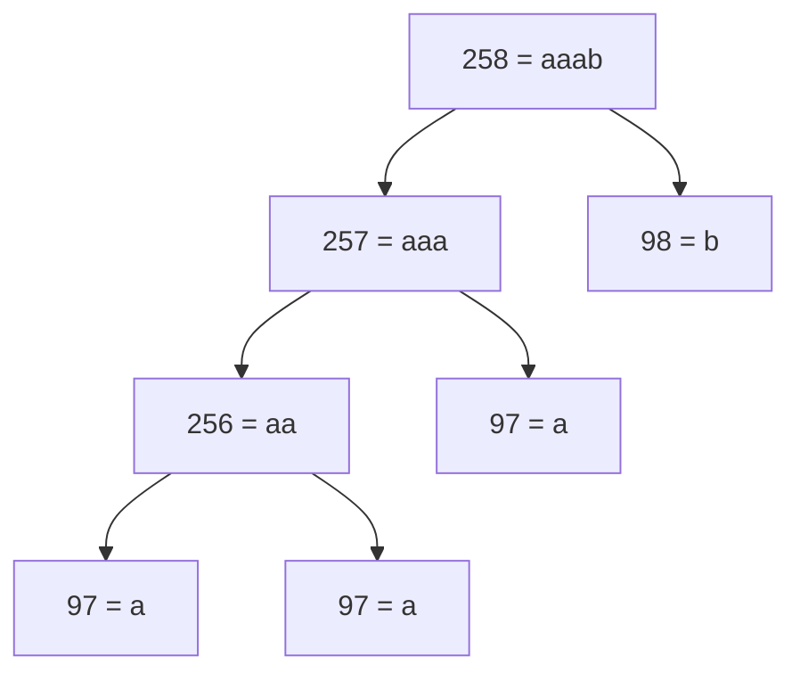
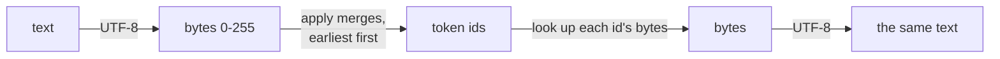

# 2. A tokenizer from scratch: byte-pair encoding

A language model does not read letters or words. It reads a sequence of integers, one per token,
and it predicts the next integer. Something has to turn text into those integers and back again,
and the choice of how to cut text into pieces shapes everything after it: how long sequences are,
how large the model's vocabulary is, and whether some inputs simply cannot be represented. This
chapter builds that piece, a **tokenizer**, using byte-pair encoding, the method behind the
tokenizers of many widely used language models. The whole algorithm fits in under seventy lines
of plain Python, with no libraries at all.

**Code:** [`hello_tokens/tokenizer/bpe.py`](../../hello_tokens/tokenizer/bpe.py)
**Tests:** [`tests/tokenizer/test_bpe.py`](../../tests/tokenizer/test_bpe.py)

## Words

- **Token**, **vocabulary**: see [chapter 1](01-setup-and-the-data.md#words). A token is one piece of
  text; the vocabulary is the set of all of them. Each token is identified by an integer, its
  **id**.
- **Tokenizer**: the program that converts text to token ids (**encoding**) and token ids back to
  text (**decoding**).
- **Byte**: an integer from 0 to 255, the unit computers store text in.
- **UTF-8**: the standard rule for storing text as bytes. Plain English letters take one byte each;
  other characters take two, three or four.
- **Byte-pair encoding (BPE)**: a way to build a vocabulary by starting from single bytes and
  repeatedly gluing the most frequent neighbouring pair into a new token.
- **Merge**: one such gluing rule, written `(left, right) → new id`. The ordered list of merges is
  the trained tokenizer.

## The idea

There are two obvious ways to cut text into tokens, and both fail.

**One token per character** gives a small vocabulary, but long sequences: every story becomes as
many tokens as it has letters. A model can only look at a fixed number of tokens at once, so
character tokens mean it sees very little text at a time, and it must spend effort relearning that
`t`, `h`, `e` usually go together.

**One token per word** gives short sequences, but an enormous vocabulary, and no answer for a word
it has never seen: a misspelling, a name, a word in another language. Such inputs become an
"unknown" token and their content is lost.

Byte-pair encoding sits between the two, and it lets the data decide where. It starts from the
smallest possible pieces and builds larger ones only where the text repeats itself:

1. Convert the text to UTF-8 bytes. Every byte value, 0 to 255, is a token from the start.
2. Count every pair of neighbouring tokens.
3. Take the most frequent pair, give it a new id (256, then 257, and so on) and replace every
   occurrence of it.
4. Record the merge, and go back to step 2 until the vocabulary is the size we want.

Frequent words end up as single tokens; rare words are spelled out from smaller pieces; and anything
at all, even a character never seen in training, can still be written as its raw bytes. Nothing is
ever unknown. This is why the method is called **byte-level** BPE.

Starting from bytes rather than characters is the key decision. There are 256 byte values, but
Unicode defines vastly more characters; a vocabulary that began with every character would be
huge before a single merge. Bytes give a small, complete starting point.

<!-- illustration -->
```python
list("hi".encode("utf-8"))   # [104, 105]: one byte per English letter
list("é".encode("utf-8"))    # [195, 169]: two bytes
list("🍰".encode("utf-8"))   # [240, 159, 141, 176]: four bytes
```

## The code

The whole module is five small functions: two building blocks, then training, encoding and
decoding.

### Counting neighbouring pairs

<!-- from: hello_tokens/tokenizer/bpe.py -->
```python
Pair = tuple[int, int]


def pair_counts(ids: list[int]) -> dict[Pair, int]:
    """Count how often each pair of neighbouring ids occurs."""
    counts: dict[Pair, int] = {}
    for pair in zip(ids, ids[1:]):
        counts[pair] = counts.get(pair, 0) + 1
    return counts
```

`Pair` is a type alias: a pair of token ids such as `(97, 98)`.

`zip(ids, ids[1:])` lines the list up against a copy of itself shifted by one place, so it yields
the first and second ids, then the second and third, and so on: every neighbouring pair, in order.
`counts.get(pair, 0)` reads the current count, or 0 the first time a pair is seen.

Because Python dictionaries remember the order in which keys were inserted, `counts` also records
which pair was seen *first*. Training relies on that in a moment.

### Gluing a pair

<!-- from: hello_tokens/tokenizer/bpe.py -->
```python
def merge(ids: list[int], pair: Pair, new_id: int) -> list[int]:
    """Replace every occurrence of pair in ids with new_id, scanning left to right."""
    merged = []
    i = 0
    while i < len(ids):
        if i + 1 < len(ids) and (ids[i], ids[i + 1]) == pair:
            merged.append(new_id)
            i += 2
        else:
            merged.append(ids[i])
            i += 1
    return merged
```

`merge` walks the list once, left to right. Where the current id and the next one form the pair, it
writes the new id and skips both; otherwise it copies one id and moves on. The check
`i + 1 < len(ids)` stops it looking past the end of the list.

The left-to-right rule settles overlaps. In `a a a`, the pair `a a` appears twice, overlapping in the
middle, but only one of them can be glued. The scan glues the first and leaves the third `a` alone.

### Training: learning the merges

<!-- from: hello_tokens/tokenizer/bpe.py -->
```python
def train(text: str, vocab_size: int) -> dict[Pair, int]:
    """Learn merges from text until the vocabulary has vocab_size tokens."""
    if vocab_size < 256:
        raise ValueError("vocab_size must be at least 256, one token per byte value")
    ids = list(text.encode("utf-8"))
    merges: dict[Pair, int] = {}
    for new_id in range(256, vocab_size):
        counts = pair_counts(ids)
        if not counts:
            break  # the text is a single token: nothing left to merge
        # The most frequent pair. On a tie, max keeps the pair seen first, so training is repeatable.
        best = max(counts, key=counts.get)
        ids = merge(ids, best, new_id)
        merges[best] = new_id
    return merges
```

The vocabulary starts with 256 tokens, one per byte value, so a smaller target makes no sense and is
refused. The text becomes a list of byte values, and the loop then creates one new token per
iteration, numbered from 256 up to `vocab_size - 1`.

Each iteration is the four-step idea above, line for line: count the pairs, pick the most frequent,
glue it everywhere, and record the merge. If the text has shrunk to a single token, there are no
pairs left and training stops early.

`max(counts, key=counts.get)` returns the pair with the highest count. When several pairs share the
highest count, Python's `max` returns the first one it meets, and since `counts` is in the order
pairs were first seen, that is the pair that appears earliest in the text. This makes training
**deterministic**: the same text always produces the same merges, so the tokenizer can be rebuilt
exactly.

The result is a dictionary from pair to new id. It also preserves insertion order, so it doubles as
the ordered list of merges. Those merges are the entire trained tokenizer; nothing else needs to be
saved.

### Training by hand

The tests use a classic example, the string `aaabdaaabac`. Its eleven characters are all plain
letters, so it starts as eleven bytes: `a` is 97, `b` 98, `c` 99 and `d` 100. Training to a
vocabulary of 259 makes three merges:

| Step | Tokens (letters stand for bytes) | Most frequent pair | New token |
|---|---|---|---|
| start | `a a a b d a a a b a c` | `a a`, 4 times | 256 = `aa` |
| 1 | `256 a b d 256 a b a c` | `256 a` and `a b` tie at 2; `256 a` was seen first | 257 = `aaa` |
| 2 | `257 b d 257 b a c` | `257 b`, twice | 258 = `aaab` |
| 3 | `258 d 258 a c` | | |

Eleven bytes have become five tokens. That shrinking is the point: the same text, in fewer and more
meaningful pieces.

The first row also shows a quirk of the simple counter. `a a` is counted four times because each
`aaa` holds two overlapping pairs, yet only two replacements happen. The count is used only to
choose which pair to merge next, so the result is still a valid tokenizer; it simply favours runs of
a repeated character a little.

Each new token is defined in terms of earlier ones, so the merges form a tree:



### Encoding new text

Training produced tokens for its own text. Encoding must turn *any* text into tokens, and make the
same decisions training would have made.

<!-- from: hello_tokens/tokenizer/bpe.py -->
```python
def encode(text: str, merges: dict[Pair, int]) -> list[int]:
    """Turn text into token ids by applying the learned merges, earliest-learned first."""
    ids = list(text.encode("utf-8"))
    while len(ids) >= 2:
        # Of the pairs present, apply the one learned earliest: the order training used.
        pair = min(pair_counts(ids), key=lambda p: merges.get(p, float("inf")))
        if pair not in merges:
            break  # no learned merge applies any more
        ids = merge(ids, pair, merges[pair])
    return ids
```

Encoding starts, like training, from bytes. Then, while at least two tokens remain, it looks at
every neighbouring pair present and asks which was learned earliest. `merges.get(p, float("inf"))`
gives each pair its new id, which is also its position in the learning order, and gives a pair that
was never learned the value infinity. `min` picks the pair with the smallest id.

If even that pair has never been learned, no merge applies anywhere and encoding is finished.
Otherwise every occurrence of the pair is glued, and the loop repeats.

Applying merges in the order they were learned is what makes encoding agree with training. Training
glued `aa` before it could ever glue `aaa`, because `aaa` is built from `aa`. Encoding must follow the
same order, or it would look for pieces that do not exist yet. Applied to the training text itself,
encoding reproduces exactly the tokens training ended with.

Two small examples with the merges learned above:

<!-- illustration -->
```python
encode("aaab", merges)   # a a a b -> 256 a b -> 257 b -> 258: one token, [258]
encode("abac", merges)   # no learned pair is present: four bytes, [97, 98, 97, 99]
```

The second example shows the fallback in action. Text the tokenizer has no merges for is not an
error; it is simply encoded one byte per token.

### Decoding

<!-- from: hello_tokens/tokenizer/bpe.py -->
```python
def decode(ids: list[int], merges: dict[Pair, int]) -> str:
    """Turn token ids back into text."""
    pieces = {i: bytes([i]) for i in range(256)}
    for (left, right), new_id in merges.items():  # merges are in learned order
        pieces[new_id] = pieces[left] + pieces[right]
    return b"".join(pieces[i] for i in ids).decode("utf-8", errors="replace")
```

Decoding needs the bytes each token stands for. The first 256 are single bytes. Every later token is
its left piece followed by its right piece, and because the merges are visited in learned order,
both pieces are already known when each new token is reached: 256 becomes `aa`, then 257 becomes
`aa` + `a`, then 258 becomes `aaa` + `b`. Decoding is then a lookup per id and one join.

The last step turns bytes back into text with UTF-8. The argument `errors="replace"` matters because
a token boundary can fall inside a character: a token may hold only the first two of an emoji's four
bytes. A sequence of ids that ends in the middle of a character, as a model's output can, is not
valid UTF-8. With `errors="replace"`, the incomplete character becomes the replacement symbol `�`
instead of raising an exception.



## What would go wrong the other way

**Starting from characters instead of bytes.** The starting vocabulary would have to include every
character that might ever appear, and any character missing from it, such as an emoji first seen
after training, would have no representation. With bytes, the 256 starting tokens cover every
possible input.

**Breaking ties arbitrarily.** If ties were broken by something unordered, two training runs on the
same text could produce different merges, and a tokenizer saved from one run would not match one
rebuilt from another. Choosing the first-seen pair makes training a pure function of its text.

**Encoding by frequency, or longest match first.** Encoding must replay the training decisions in
the same order. A different rule, such as gluing the longest known piece first, would sometimes cut
the same word differently from how it was cut during training, and the model would then meet token
sequences on new text that it never saw while learning.

**Decoding strictly.** With the default `errors="strict"`, decoding any id sequence that splits a
character would raise an exception. A model writing one token at a time produces exactly such
sequences in passing, so strict decoding would crash on ordinary output.

**Keeping this version for real data.** This implementation is correct but slow on large text: every
new token re-counts every pair in the entire text, and the full-size tokenizer learns thousands of
merges. Chapter 3 ([`tokenizer.py`](../../hello_tokens/tokenizer/tokenizer.py)) keeps this algorithm but
first cuts text into words and counts each distinct word once; the build log records that a 2 MB sample of
2,417 stories contains only 5,989 distinct chunks. It also keeps merges from crossing word
boundaries and adds a special token that marks the end of a story.

## Proving it works

The tests check each function, then the algorithm against a result worked out by hand, then the
property that matters most: nothing is lost.

<!-- from: tests/tokenizer/test_bpe.py -->
```python
def test_training_on_a_toy_sentence_by_hand():
    # The classic example: "aaabdaaabac".
    # 1. "aa" occurs 4 times, more than any other pair       -> 256 = "aa"
    # 2. now "aa"+"a" and "a"+"b" tie at 2; the first one seen wins -> 257 = "aaa"
    # 3. "aaa"+"b" occurs twice                                -> 258 = "aaab"
    merges = train("aaabdaaabac", vocab_size=259)
    assert merges == {(A, A): 256, (256, A): 257, (257, B): 258}
    assert encode("aaabdaaabac", merges) == [258, D, 258, A, C]
```

This is the table above, as a test. It pins three things at once: the merges, their order, and the
tie-break, since a different tie rule would have made `a b` token 257. The second assertion checks
that encoding the training text reproduces training's own result.

Two smaller tests check the building blocks: `pair_counts([a, a, a, b])` must give `a a` twice and
`a b` once, and `merge` applied to `a a a b` must glue only the first `a a`.

<!-- from: tests/tokenizer/test_bpe.py -->
```python
def test_round_trip_gives_back_the_exact_text():
    text = "Once upon a time, a café served 🍰 to everyone."
    merges = train(text, vocab_size=300)
    assert decode(encode(text, merges), merges) == text


def test_text_never_seen_in_training_still_round_trips():
    # Byte-level: any text can be encoded, even characters training never saw.
    merges = train("aaabdaaabac", vocab_size=259)
    text = "zebra 🦓 and ünïcode"
    assert decode(encode(text, merges), merges) == text
```

The **round trip** is the tokenizer's contract: decoding the encoding of any text must give back
exactly that text. The first test checks it on a sentence with an accented letter and an emoji, so
multi-byte characters are covered. The second is the stronger claim of byte-level BPE: a tokenizer
trained only on `aaabdaaabac` has never seen a `z`, an emoji or an umlaut, and still encodes and
decodes them exactly, by falling back to their bytes.

Together these are enough. The hand-worked test fixes the exact behaviour of training and encoding
on a case small enough to check by eye, and the round-trip tests check the property that every later
chapter depends on, on the inputs most likely to break it.

## Run it

This chapter has no command of its own: the tokenizer is trained as part of `prepare`, which
chapter 3 completes. The tests run on the CPU:

```
uv run pytest tests/tokenizer/test_bpe.py
```

The functions can also be tried directly in a Python session started with `uv run python`:

<!-- illustration -->
```python
from hello_tokens.tokenizer.bpe import decode, encode, train

merges = train("aaabdaaabac", vocab_size=259)
ids = encode("aaabdaaabac", merges)   # [258, 100, 258, 97, 99]
decode(ids, merges)                    # 'aaabdaaabac'
```

## What we got

A complete byte-level BPE tokenizer in five small functions: training, encoding and decoding, built on
pair counting and merging; deterministic and lossless on any text. On the toy example it turns 11 bytes into 5 tokens. The same algorithm,
made fast enough for real data in the next chapter, produces the project's 4,096-token vocabulary,
which averages 3.96 bytes of text per token.

## Check yourself

1. Why can a byte-level tokenizer never meet a character it cannot encode?
2. In the hand-worked example, which pair would have become token 257 if ties went to the pair seen
   *last*, and why does the code avoid leaving this to chance?
3. Why does `encode` apply the earliest-learned merge first, rather than the most frequent pair in
   the new text?

<details>
<summary>Answers</summary>

1. Every text is stored as UTF-8 bytes, and each of the 256 possible byte values is a token from the
   start. A character the tokenizer has no merges for is simply encoded as its bytes, one token each.
2. After step 1 the tokens are `256 a b d 256 a b a c`, and `256 a` and `a b` both occur twice. Seen
   last, the tie would go to `a b`. The code takes the first-seen pair so that training on the same
   text always gives the same merges; otherwise a tokenizer could not be rebuilt identically.
3. Because the merges only make sense in the order they were learned: a later token is built from
   earlier ones, and training applied them in that order. Following the same order reproduces
   training's decisions on new text, so the model sees the same kind of token sequences it learned
   from. Frequency in a short new text says nothing about how training cut it.

</details>

Next: [3. Tokenizing real stories, and the token files](03-real-text-and-token-files.md)
