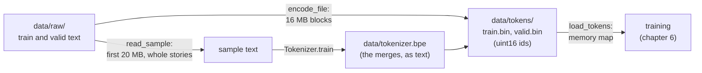
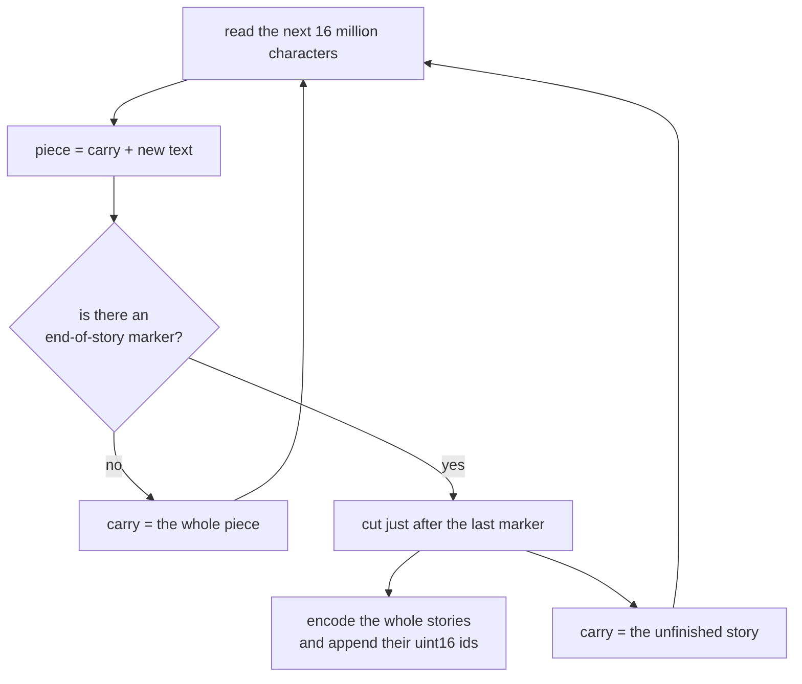

# 3. Tokenizing real stories, and the token files

[Chapter 2](02-byte-pair-encoding.md) built byte-pair encoding in its plainest form and checked it on
an eleven-letter string. The training data from [chapter 1](01-setup-and-the-data.md) is 2.2 GB of
stories. This chapter closes that gap in two steps. First, the tokenizer learns to handle real text:
it trains in minutes rather than days, its tokens line up with words, and it treats the marker
between stories as one special token. Second, the whole corpus is encoded once, ahead of training,
into flat files of token ids that the training loop can read straight from disk. With this chapter,
the `prepare` command is complete, and everything after it works with integers rather than text.

**Code:** [`hello_tokens/tokenizer/tokenizer.py`](../../hello_tokens/tokenizer/tokenizer.py) ·
[`hello_tokens/corpus/sample.py`](../../hello_tokens/corpus/sample.py) ·
[`hello_tokens/corpus/encode.py`](../../hello_tokens/corpus/encode.py) ·
[`hello_tokens/__main__.py`](../../hello_tokens/__main__.py)
**Tests:** [`tests/tokenizer/test_tokenizer.py`](../../tests/tokenizer/test_tokenizer.py) ·
[`tests/corpus/test_sample.py`](../../tests/corpus/test_sample.py) ·
[`tests/corpus/test_encode.py`](../../tests/corpus/test_encode.py)

## Words

- **Token**, **vocabulary**, **tokenizer**, **merge**, **byte-pair encoding**: see
  [chapter 2](02-byte-pair-encoding.md#words).
- **Regular expression**: a small pattern language for describing text, built into Python as the
  `re` module. Here it describes what counts as a word, a number or a symbol.
- **Chunk**: one piece of text cut out by that pattern, such as a word with its leading space. Merges
  are only ever made inside a chunk.
- **Special token**: a token that stands for a fixed marker rather than for text learned from data.
  This project has one, `<|endoftext|>`, which separates one story from the next.
- **Token file**: the corpus after encoding, stored as one long array of token ids and nothing else.
- **uint16**: an unsigned 16-bit integer, a whole number from 0 to 65,535 stored in two bytes.
- **Memory map**: a way of opening a file so that it behaves like an array in memory, while the
  operating system reads from disk only the parts that are actually used.

## The idea

The algorithm of chapter 2 is correct, but three things stop it from being used on real data:

- **It is too slow.** Every new token re-counts every pair in the entire text, thousands of times over.
- **Its tokens ignore words.** Nothing stops a merge from gluing the end of one word to the start of
  the next, producing tokens such as `e d` that belong to neither.
- **It knows nothing of stories.** TinyStories separates its stories with the text `<|endoftext|>`.
  As ordinary text, that marker would be chopped into pieces such as `<`, `|` and `end`, and merges
  could join one story to the next.

One idea fixes the first two: **cut the text into chunks before training, and never merge across a
chunk boundary.** A chunk is a word with its leading space, a number, a run of punctuation, or
whitespace. Tokens can then no longer span two words. And because children's stories repeat the same
words endlessly, the distinct chunks are few: the build log records that a 2 MB sample holds 2,417
stories but only 5,989 distinct chunks. Training counts each distinct chunk once, with its frequency.

The third is fixed by splitting the text on the marker first and giving the marker one reserved id.
The model will later learn to produce that id when a story is over, which is how it knows to stop.

Finally, the corpus is encoded **once**, ahead of time. Training reads the stories over and over, and
running a Python tokenizer on every read would spend the effort on tokenizing rather than learning.



## The shapes

There are no tensors in this chapter, but there is one array, and its shape is the point:

| Object | Shape | Type | What it is |
|---|---|---|---|
| `load_tokens("data/tokens/train.bin")` | one dimension, 562,963,642 entries | `uint16` | every training token, one story after another |
| `load_tokens("data/tokens/valid.bin")` | one dimension, 5,683,948 entries | `uint16` | every held-out token |

The stories are not stored separately. Each one is followed by the special token, and the next begins
straight after it.

## The code

### Cutting text into chunks

<!-- from: hello_tokens/tokenizer/tokenizer.py -->
```python
END_OF_TEXT = "<|endoftext|>"

# Every character falls into exactly one branch, so the chunks always join back into the input:
#   letters (with an optional leading space) | digits | other symbols | underscores | whitespace.
# "\s+(?!\S)" keeps the last space of a run of spaces free to start the next word.
SPLIT = re.compile(r" ?[^\W\d_]+| ?\d+| ?[^\s\w]+| ?_+|\s+(?!\S)|\s+")
```

The pattern is six alternatives separated by `|`. At each point in the text, the regular-expression
engine tries them from left to right and takes the first that matches:

1. `" ?[^\W\d_]+"`: an optional space, then one or more letters. `\W` means "not a word character",
   `\d` a digit, and `_` an underscore; a class `[^...]` matches anything *not* listed. A character that
   is not a non-word character, not a digit and not an underscore is exactly a letter, in any
   alphabet. So `" dog"`, space included, is one chunk.
2. `" ?\d+"`: an optional space, then digits, such as `" 42"`.
3. `" ?[^\s\w]+"`: an optional space, then a run of characters that are neither whitespace nor word
   characters: punctuation, quotation marks, emoji.
4. `" ?_+"`: underscores, which Python counts as word characters and which would otherwise match none
   of the branches above.
5. `"\s+(?!\S)"`: a run of whitespace, with a condition. `(?!\S)` is a *lookahead*: it checks, without
   consuming anything, that the next character is not a non-space. If a word follows the run, the
   engine gives back the run's last space, so that space can begin the word's chunk.
6. `"\s+"`: any whitespace left over.

Every character in any text is a letter, a digit, a symbol, an underscore or whitespace, so every
character is matched by exactly one branch. Nothing is dropped and nothing is matched twice, which
means the chunks always join back into the original text.

<!-- from: hello_tokens/tokenizer/tokenizer.py -->
```python
def split_chunks(text: str) -> list[str]:
    """Cut text into the chunks that merges are not allowed to cross."""
    return SPLIT.findall(text)
```

`findall` returns every match in order. Three examples, run in a Python session:

<!-- illustration -->
```python
split_chunks("Once upon a time, there was a dog.")
# ['Once', ' upon', ' a', ' time', ',', ' there', ' was', ' a', ' dog', '.']
split_chunks("Max said: “Wow!” 42 times.")
# ['Max', ' said', ':', ' “', 'Wow', '!”', ' 42', ' times', '.']
split_chunks("  two  spaces")
# [' ', ' two', ' ', ' spaces']
```

The first line shows the common case: each word carries the space before it. The second shows a run
of symbols kept together (`'!”'`) and a number as its own chunk. The third shows the lookahead at
work: of the two spaces before `two`, the first stands alone and the second starts the word, so
`" two"` looks exactly like the same word after a single space.

### Training on distinct chunks

The tokenizer is now a class, `Tokenizer`, so that the merges and everything derived from them travel
together. Training is a class method that returns a new tokenizer:

<!-- from: hello_tokens/tokenizer/tokenizer.py -->
```python
    @classmethod
    def train(cls, text: str, vocab_size: int) -> "Tokenizer":
        """Learn merges from text so the vocabulary, special token included, has vocab_size ids."""
        if vocab_size < 257:
            raise ValueError("vocab_size must leave room for the 256 bytes and the special token")
        # Count each distinct chunk once: "the" may occur a million times but is stored once.
        counts = Counter(
            chunk
            for story in text.split(END_OF_TEXT)
            for chunk in split_chunks(story)
        )
        chunks = [list(chunk.encode("utf-8")) for chunk in counts]
        weights = list(counts.values())
```

The text is first split on the end-of-story marker, so the marker itself never takes part in
training. Each story is cut into chunks, and `Counter`, from Python's `collections` module, counts how
often each distinct chunk occurs. Then every distinct chunk becomes its list of UTF-8 bytes, and its
count becomes its **weight**. The two lists line up: `chunks[i]` occurred `weights[i]` times.

<!-- from: hello_tokens/tokenizer/tokenizer.py -->
```python
        merges: dict[Pair, int] = {}
        for new_id in range(256, vocab_size - 1):
            pair_totals: Counter[Pair] = Counter()
            for ids, weight in zip(chunks, weights):
                for pair in zip(ids, ids[1:]):
                    pair_totals[pair] += weight
            if not pair_totals:
                break  # every chunk is a single token: nothing left to merge
            # Ties go to the pair seen first, so training is repeatable.
            best = max(pair_totals, key=pair_totals.__getitem__)
            chunks = [merge(ids, best, new_id) if len(ids) > 1 else ids for ids in chunks]
            merges[best] = new_id
        return cls(merges)
```

This is chapter 2's loop with one change: a pair inside a chunk that occurred 500 times adds 500 to
its total, but is visited once. The totals are what counting the whole text would give, at a small
fraction of the work. And since pairs are counted chunk by chunk, no merge can cross a word boundary.

The loop stops one id short of `vocab_size`, keeping the last id for the special token. If every chunk
is already a single token, no pairs are left and training ends early with a smaller vocabulary. Ties
go to the pair seen first, as in chapter 2, so the same text always produces the same merges. `merge`
and `Pair` are imported unchanged from chapter 2's module.

### The layout of the vocabulary

<!-- from: hello_tokens/tokenizer/tokenizer.py -->
```python
class Tokenizer:
    def __init__(self, merges: dict[Pair, int]):
        self.merges = merges
        # Ids 0-255 are the bytes, then one id per merge, then the end-of-story token last.
        self.end_of_text_id = 256 + len(merges)
        self.vocab_size = self.end_of_text_id + 1
        self.pieces = {i: bytes([i]) for i in range(256)}
        for (left, right), new_id in merges.items():  # merges are in learned order
            self.pieces[new_id] = self.pieces[left] + self.pieces[right]
        # A word repeats millions of times in a corpus; work out its tokens once, then look it up.
        self._cache: dict[str, list[int]] = {}
```

Everything about the vocabulary follows from the merges. The ids run in three blocks: 0 to 255 are
the bytes, the merges come next in the order they were learned, and the special token takes the one
id after the last merge. For the project's vocabulary of 4,096, that is 256 byte tokens, 3,839
merges (ids 256 to 4,094), and `<|endoftext|>` at 4,095.

`self.pieces` maps every id to the bytes it stands for, built exactly as chapter 2's `decode` built
it. Computing it once here means decoding later is a plain lookup. The `_cache` is explained with
encoding below.

A small example shows the whole layout, including an early stop. Fifty copies of a two-sentence story
contain only six distinct chunks, which are used up after twelve merges:

<!-- illustration -->
```python
text = ("The dog ran. The dog sat." + END_OF_TEXT) * 50
tokenizer = Tokenizer.train(text, vocab_size=270)
tokenizer.vocab_size, tokenizer.end_of_text_id, len(tokenizer.merges)
# (269, 268, 12)
[tokenizer.pieces[i] for i in range(256, 268)]
# [b'Th', b'The', b' d', b' do', b' dog', b' r', b' ra', b' ran', b' The', b' s', b' sa', b' sat']
```

The vocabulary asked for 270 ids and got 269, because every chunk was a single token after twelve
merges. Every learned token is a word or the start of a word, and none contains a space anywhere but
at its front.

### Encoding, with a cache

<!-- from: hello_tokens/tokenizer/tokenizer.py -->
```python
    def _encode_chunk(self, chunk: str) -> list[int]:
        if (cached := self._cache.get(chunk)) is not None:
            return cached
        ids = list(chunk.encode("utf-8"))
        while len(ids) >= 2:
            # Apply the earliest-learned merge present, the order training used.
            pair = min(zip(ids, ids[1:]), key=lambda p: self.merges.get(p, float("inf")))
            if pair not in self.merges:
                break
            ids = merge(ids, pair, self.merges[pair])
        self._cache[chunk] = ids
        return ids
```

The middle of this method is chapter 2's `encode`, applied to one chunk: start from the bytes, and
repeatedly apply the earliest-learned merge present until none applies. The new part is the first two
lines and the last two. Before doing any work, the method looks the chunk up in `self._cache`; after
doing the work, it stores the answer there. Each distinct chunk is therefore worked out once, and
every later occurrence costs one dictionary lookup. This technique is called **memoization**.

It pays off because the text is so repetitive: the build log records that 20 MB of stories contain
only 12,682 distinct chunks. Nearly every chunk the encoder meets is one it has already seen.

<!-- from: hello_tokens/tokenizer/tokenizer.py -->
```python
    def encode(self, text: str) -> list[int]:
        """Turn text into token ids. The end-of-story marker becomes its single special id."""
        ids: list[int] = []
        for i, story in enumerate(text.split(END_OF_TEXT)):
            if i > 0:
                ids.append(self.end_of_text_id)
            for chunk in split_chunks(story):
                ids.extend(self._encode_chunk(chunk))
        return ids
```

Encoding a text mirrors training. The text is split on the marker; between every two stories the
special id is written; each story is cut into chunks, and each chunk is encoded on its own. A text
with no marker is a single story, and its ids contain no special token.

<!-- from: hello_tokens/tokenizer/tokenizer.py -->
```python
    def decode(self, ids: list[int]) -> str:
        """Turn token ids back into text."""
        out = bytearray()
        for i in ids:
            out += END_OF_TEXT.encode("utf-8") if i == self.end_of_text_id else self.pieces[i]
        return out.decode("utf-8", errors="replace")
```

Decoding writes the marker's text back for the special id and looks up every other id's bytes. The
final step, and its `errors="replace"`, are the same as in chapter 2.

With the small tokenizer from above, a text with a word it has never seen shows all three cases at
once: learned tokens, the special token, and the fallback to bytes:

<!-- illustration -->
```python
ids = tokenizer.encode("The dog ran." + END_OF_TEXT + "The cat")
# [257, 260, 263, 46, 268, 257, 32, 99, 97, 116]
[tokenizer.decode([i]) for i in ids]
# ['The', ' dog', ' ran', '.', '<|endoftext|>', 'The', ' ', 'c', 'a', 't']
```

### Saving and loading

Training on the 20 MB sample takes minutes, so the result is saved and training happens once.

<!-- from: hello_tokens/tokenizer/tokenizer.py -->
```python
    def save(self, path: Path) -> None:
        """Write the merges as plain text, one "left right" pair per line, in learned order."""
        path.parent.mkdir(parents=True, exist_ok=True)
        lines = [FORMAT] + [f"{left} {right}" for left, right in self.merges]
        path.write_text("\n".join(lines) + "\n", encoding="utf-8")

    @classmethod
    def load(cls, path: Path) -> "Tokenizer":
        lines = path.read_text(encoding="utf-8").splitlines()
        if not lines or lines[0] != FORMAT:
            raise ValueError(f"{path} is not a {FORMAT} file")
        merges = {}
        for new_id, line in enumerate(lines[1:], start=256):
            left, right = map(int, line.split())
            merges[(left, right)] = new_id
        return cls(merges)
```

The merges are the whole tokenizer, so they are all that is saved: a line naming the format
(`FORMAT` is `"hello-tokens bpe v1"`), then one merge per line, as the two ids it joins. A merge's
new id is implied by its position, 256 for the first, and `load` recovers it with
`enumerate(..., start=256)`. A file with the wrong first line is refused rather than misread. The
small tokenizer above saves to a file that begins:

<!-- illustration -->
```python
tokenizer.save(Path("tokenizer.bpe"))
open("tokenizer.bpe").read().splitlines()[:5]
# ['hello-tokens bpe v1', '84 104', '256 101', '32 100', '258 111']
```

`84 104` is `T` then `h`, id 256; `256 101` is that token then `e`, the token `The`. Plain text can be
read by eye and compared between two runs with any diff tool.

### A sample of whole stories

The tokenizer is trained on a sample from the start of the training file, not on all 2.2 GB:

<!-- from: hello_tokens/corpus/sample.py -->
```python
def read_sample(path: Path, megabytes: float) -> str:
    """Return about `megabytes` of text, cut at the last complete story."""
    with open(path, "rb") as f:
        raw = f.read(int(megabytes * 1_000_000))
    # The cut may land inside a multi-byte character; drop the broken tail, then the partial story.
    text = raw.decode("utf-8", errors="ignore")
    end = text.rfind(END_OF_TEXT)
    return text[:end] if end != -1 else text
```

The first `megabytes` million bytes are read. The cut can land inside a character that UTF-8 stores
in several bytes, such as a curly quotation mark; `errors="ignore"` drops that incomplete character.
Then everything after the last end-of-story marker, an unfinished story, is dropped too.

How large should the sample be? The build log records a measurement. The full vocabulary was trained
on samples of 5, 10 and 20 MB, taking 114, 113 and 156 seconds, and all three compressed held-out
text to the same 3.95 bytes per token: 5 MB of a child's vocabulary already covers it. The project
still uses 20 MB, the default of `prepare --sample-mb`, because training happens once and a larger
sample gives rarer words a better chance of being learned.

### The token files

<!-- from: hello_tokens/corpus/encode.py -->
```python
BLOCK = 16_000_000  # read about 16 MB of text at a time


def encode_file(source: Path, destination: Path, tokenizer: Tokenizer, block: int = BLOCK) -> int:
    """Encode source into destination as uint16 token ids. Returns the number of tokens written."""
    if tokenizer.vocab_size > np.iinfo(np.uint16).max + 1:
        raise ValueError("the vocabulary is too large for 16-bit token ids")
    destination.parent.mkdir(parents=True, exist_ok=True)
    partial = destination.with_name(destination.name + ".part")
    total = 0
    carry = ""  # the unfinished story at the end of a block, saved for the next block
```

Every id is written as a `uint16`, whose largest value, `np.iinfo(np.uint16).max`, is 65,535. A
vocabulary of 4,096 fits easily; one that did not would be refused here rather than silently wrapped
around to wrong ids. As in chapter 1's downloader, output goes to a `.part` file, and only a finished
file gets the real name.

<!-- from: hello_tokens/corpus/encode.py -->
```python
    with open(source, encoding="utf-8", newline="") as text, open(partial, "wb") as out:
        while piece := text.read(block):
            piece = carry + piece
            # Encode only whole stories, so a block boundary never splits a word or a story.
            cut = piece.rfind(END_OF_TEXT)
            if cut == -1:
                carry = piece
                continue
            cut += len(END_OF_TEXT)
            ids = tokenizer.encode(piece[:cut])
            np.array(ids, dtype=np.uint16).tofile(out)
            total += len(ids)
            carry = piece[cut:]
        if carry:
            ids = tokenizer.encode(carry)
            np.array(ids, dtype=np.uint16).tofile(out)
            total += len(ids)
    partial.replace(destination)
    return total
```

The text is read in blocks of 16 million characters. A block boundary usually lands mid-story, often
mid-word, and half a word encodes differently from the whole word. So each block is cut back to just
after its last end-of-story marker: the whole stories before the cut are encoded and written, and the
unfinished story after it is **carried** to the front of the next block. When the file runs out, what
is still carried is the final story, which has no marker after it, and it is encoded as it is.

`np.array(ids, dtype=np.uint16).tofile(out)` packs the ids into two-byte numbers and writes their raw
bytes. The file holds nothing but ids: no header, no separators. `newline=""` stops Python's text mode
from translating line endings as it reads, so the tokens describe the file exactly as downloaded.



### Reading the files back

<!-- from: hello_tokens/corpus/encode.py -->
```python
def load_tokens(path: Path) -> np.ndarray:
    """Open a token file without reading it into memory (the operating system pages it in)."""
    return np.memmap(path, dtype=np.uint16, mode="r")
```

`np.memmap` returns an array whose contents stay on disk. Indexing it, as training will with
`tokens[start : start + 257]`, makes the operating system read just the pages of the file that hold
those entries. The training file can be sampled at random positions while using almost no memory.
`mode="r"` opens it read-only, so nothing can overwrite the corpus by accident.

The byte layout is easy to see on a three-id array:

<!-- illustration -->
```python
import numpy as np

np.iinfo(np.uint16).max                                       # 65535
np.array([4095, 7, 256], dtype=np.uint16).tobytes()          # b'\xff\x0f\x07\x00\x00\x01'
np.array([4095, 7, 256], dtype=np.uint16).nbytes              # 6
```

Each id takes exactly two bytes, the low byte first: 4,095 is `ff 0f`, 7 is `07 00`, and 256 is
`00 01`.

### Wiring it into `prepare`

<!-- from: hello_tokens/__main__.py -->
```python
def train_tokenizer(data_dir: Path, sample_mb: float, vocab_size: int) -> None:
    """Train the tokenizer on a sample of the training stories, unless it already exists."""
    path = data_dir / "tokenizer.bpe"
    if path.exists():
        print(f"tokenizer: already present ({path})")
        return
    text = read_sample(data_dir / "raw" / "TinyStoriesV2-GPT4-train.txt", sample_mb)
```

This is the second step of `prepare`; `encode_corpus` is the third, and calls `encode_file` once for
each of `train.bin` and `valid.bin` with the tokenizer loaded from disk. Like the download, each step
skips its work if its output already exists.

## What would go wrong the other way

**Training without chunks.** Besides being slow, tokens could span words. The same word would then be
cut differently depending on its neighbours, and the model would have to learn many token sequences
for one word.

**Treating the marker as ordinary text.** It would cost several tokens per story, its pieces could
merge with neighbouring words, and there would be no single id meaning "the story ends here" for
generation to stop on, as it will in chapter 8.

**Tokenizing during training.** The tokenizer is Python code doing real work per chunk. Inside the
training loop it would make the GPU wait at every step. Encoding once costs a few minutes, once.

**Cutting blocks anywhere.** A word split across two blocks would be encoded as two fragments, and the
token file would depend on the block size, a setting that should not matter.

**Wider integers, or loading everything.** 32-bit or 64-bit ids would double or quadruple the file.
Loading the training file into an ordinary array would cost over a gigabyte of memory, when each
training step reads only 64 windows of 257 tokens, about 33 KB. The memory map gives the same indexing
for almost no memory.

## Proving it works

The tokenizer's tests train on a few short stories, repeated, with the marker between them. Besides
chapter 2's round trip, they check the new promises:

<!-- from: tests/tokenizer/test_tokenizer.py -->
```python
def test_words_keep_their_leading_space():
    assert split_chunks("a big dog.") == ["a", " big", " dog", "."]


def test_vocabulary_has_the_requested_size():
    small = Tokenizer.train(STORIES, vocab_size=300)
    assert small.vocab_size == 300
    assert small.end_of_text_id == 299  # the special token takes the last id
```

The first pins the chunking rule; the second, the layout, with the special token last. A companion
test checks that a request for 400 on the same small text stops early, special token still last.

<!-- from: tests/tokenizer/test_tokenizer.py -->
```python
def test_merges_never_cross_a_word_boundary(tokenizer):
    # Each learned token may start with a space but never contains one in the middle.
    for token_id in range(256, tokenizer.end_of_text_id):
        assert b" " not in tokenizer.pieces[token_id][1:]
```

A space may appear only as a token's first byte. If merges could cross chunks, a token such as
`"a big"` would appear and this test would fail.

Further tests check that awkward texts (double spaces, tabs, underscores, curly quotation marks, the
empty string) split into chunks that join back exactly; that the marker becomes one special id; that
`" upon"` becomes a single token; that saving and loading changes nothing; and that training is
repeatable. The sampling tests check that a sample ends at the last complete story, and that a cut in
the middle of a three-byte quotation mark is harmless.

The encoding tests compare the token file with the tokenizer itself:

<!-- from: tests/corpus/test_encode.py -->
```python
def test_small_blocks_give_the_same_tokens(tokenizer, source, tmp_path):
    # Blocks far smaller than a story force many carry-overs; the result must not change.
    whole, blocks = tmp_path / "whole.bin", tmp_path / "blocks.bin"
    encode_file(source, whole, tokenizer)
    encode_file(source, blocks, tokenizer, block=37)
    assert np.array_equal(load_tokens(whole), load_tokens(blocks))
```

The text is 200 short stories and a final one with no marker. Blocks of 37 characters, shorter than a
story, force a carry on almost every block, and the result must not change. Other tests check the file
against `tokenizer.encode` on the whole text, check exactly two bytes per token with every id inside
the vocabulary, and check that the 200 markers became exactly 200 special tokens.

Each test targets a way the files could be wrong without anything crashing: tokens that straddle
words, a misplaced special id, a file that depends on its block size, or an id outside the vocabulary.

## Run it

`prepare`, from chapter 1, now runs to completion:

```
uv run python -m hello_tokens prepare
```

After the download, it prints two lines for the tokenizer and two for each token file. Their form
comes from `train_tokenizer` and `encode_corpus`; the numbers below are the ones the build log
records for the project's run (on Windows the paths print with backslashes, and the build log does
not record the time for the small validation file):

```
tokenizer: training on 20 MB, vocabulary 4096
tokenizer: 4096 tokens in 197 s -> data/tokenizer.bpe
tokens: encoding TinyStoriesV2-GPT4-train.txt
tokens: train 562,963,642 tokens in 435 s -> data/tokens/train.bin
tokens: encoding TinyStoriesV2-GPT4-valid.txt
tokens: valid 5,683,948 tokens in … s -> data/tokens/valid.bin
```

The sample size and the vocabulary can be changed with
`python -m hello_tokens prepare --sample-mb 5 --vocab-size 4096`, but only before the files exist:
each step skips work whose output is already present, so `data/tokenizer.bpe` and the token files
must be moved out of the way first.

The tests run on the CPU without the dataset:

```
uv run pytest tests/tokenizer tests/corpus
```

## What we got

- **A tokenizer of 4,096 ids:** 256 bytes, 3,839 learned merges and `<|endoftext|>` at 4,095,
  trained on 20 MB of stories in 197 seconds and saved as plain text in `data/tokenizer.bpe`. A
  typical sentence encodes to one token per word.
- **The training file:** 562,963,642 tokens in `data/tokens/train.bin`, 1.13 GB, exactly two bytes per
  token, encoded in 435 seconds at about 5.2 MB of text per second on one CPU core. The 2.2 GB of text
  became about half that in tokens.
- **The held-out file:** 5,683,948 tokens in `data/tokens/valid.bin`, about 11.4 MB.
- **Compression:** 3.96 bytes of text per token over the whole corpus, matching the 3.95 measured on
  held-out samples when choosing the sample size. The model will read roughly a quarter as many
  pieces as there are bytes of text, so more of a story fits in the 256 tokens it sees at once.
- **A check on the files:** the largest id in both is 4,095, the special token. Nothing lies outside
  the vocabulary.

## Check yourself

1. Why does cutting text into chunks before training make the tokenizer both faster to train and
   better?
2. `encode_file` cuts each block back to its last end-of-story marker. What would differ in the token
   file if it encoded each block whole?
3. The tokenizer file stores each merge as two ids, `left right`, but never the merge's own new id.
   How is the new id recovered, and what would break if two lines were swapped?

<details>
<summary>Answers</summary>

1. Faster, because training counts each distinct chunk once with its frequency, and the distinct
   chunks of a repetitive text are few: thousands, against millions of bytes. Better, because merges
   can no longer cross chunk boundaries, so every token is a word, part of a word, a number or
   punctuation, and the same word is tokenized the same way wherever it appears.
2. A word that straddled two blocks would be encoded as two separate fragments, so the file would
   contain token sequences that encoding the whole text never produces, and its contents would change
   with the block size. Cutting at a marker means each block holds only whole stories, and the
   result is identical for any block size, as the 37-character test checks.
3. From its position: the first merge line is id 256, the next 257, and so on. Swapping two lines would
   give both merges the wrong ids, and since later merges refer to earlier ones by id, every token
   built on them would decode to the wrong bytes. The order of the lines is part of the data.

</details>

Next: 4. Embeddings and attention
