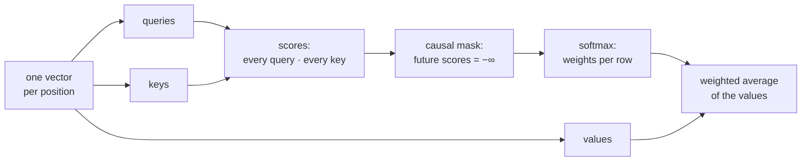

# 4. Embeddings and attention

The token files of [chapter 3](03-real-text-and-token-files.md) hold the stories as integers. A model
cannot do arithmetic on an id such as 1,234 in any useful way: the number is a name, not a quantity,
and token 1,235 is no more similar to it than token 7 is. This chapter builds the two pieces that
turn names into something a model can compute with and reason over. An **embedding** gives every
token a learned list of numbers that can carry meaning. **Attention** then lets each position in a
text gather information from the positions before it, which is how the model comes to know that
"it" in a sentence refers to the cat mentioned three words earlier. Attention is the heart of the
transformer, and here it is written out by hand, in about twenty lines.

**Code:** [`hello_tokens/model/config.py`](../../hello_tokens/model/config.py) ·
[`hello_tokens/model/embedding.py`](../../hello_tokens/model/embedding.py) ·
[`hello_tokens/model/attention.py`](../../hello_tokens/model/attention.py)
**Tests:** [`tests/model/test_attention.py`](../../tests/model/test_attention.py)

## Words

- **Token**, **vocabulary**, **tensor**, **parameters**: see
  [chapter 1](01-setup-and-the-data.md#words). **Logits**, **batch**: see
  [chapter 6](06-the-learning-loop.md#words), which uses the model this chapter starts to build.
- **Softmax**: turns a list of scores into weights that are positive and sum to one. It raises *e*
  (about 2.718) to the power of each score, then divides each result by their total, so a higher
  score always gets a larger share.
- **Training**, **gradient**: training repeatedly nudges every parameter in the direction that makes
  the model's predictions a little better; the gradient is what says, for each parameter, which way
  and how strongly to nudge it. [Chapter 6](06-the-learning-loop.md) explains how it is computed.
- **Vector**: a list of numbers, stored as a one-dimensional tensor. Inside the model, every token is
  represented by a vector.
- **Shape**: the size of each dimension of a tensor, written as a tuple such as `(2, 10, 384)`.
- **Context**: the largest number of tokens the model reads at once: 256 for this project.
- **Width**: the number of numbers in each token's vector: 384 for this project.
- **Embedding**: a learned table with one row per token id. Looking up an id returns its row, a vector
  of `width` numbers. The rows start random and training moves them.
- **Dot product**: multiply two vectors of the same length number by number and add up the results.
  It is large when the two vectors point the same way, near zero when they are unrelated, and
  negative when they point in opposite directions.
- **Matrix product**: written `@` in Python. Each entry of `A @ B` is the dot product of a row of `A`
  with a column of `B`, so one matrix product computes a whole table of dot products at once.
- **Linear layer** (`nn.Linear`): a learned matrix and a learned vector, the **bias**. It turns an
  input vector `x` into `x @ W + b`, a new vector of whatever length the layer was built for.
- **Attention**: the step in which each position computes a weighted average of information from
  other positions, with weights it decides itself.
- **Query**, **key**, **value**: the three vectors each position produces for attention: what it is
  looking for, what it offers to others, and what it passes on when chosen.
- **Causal mask**: the rule that each position may attend only to itself and earlier positions.
- **Head**: one independent copy of attention, working on its own slice of each vector. This model
  runs six heads side by side.

## The idea

### From ids to vectors

The model's first job is to replace each id with something it can calculate with. The answer is a
table, the **token embedding**: 4,096 rows, one per token in the vocabulary, each holding 384 numbers.
Token 1,234 is represented by row 1,234. At the start the numbers are random; during training, each
row is adjusted like any other parameter. Tokens that behave alike in the stories
tend to end up with rows that point in similar directions, so the model can treat "cat" and "dog"
alike where the stories do.

The vector has to say one more thing: *where* the token is. Attention, as we will see, compares
tokens with each other but has no built-in notion of order; without help, "the dog bit the man" and
"the man bit the dog" would look the same to it. So a second table, the **position embedding**, has
one learned row for each position from 0 to 255, and the model adds the row for a token's position to
the row for the token itself. "dog" at position 1 and "dog" at position 4 then start from different
vectors.

### Each position gathers from the past

A token on its own is ambiguous. In "The cat sat on the mat because it was tired", the vector for
"it" says only "a pronoun". To predict what comes next, the model needs that vector to carry "this is
the cat". Attention is the mechanism that lets a position pull in information from the tokens before
it.

Every position produces three vectors from its own, each through a learned linear layer:

- a **query**: what this position is looking for;
- a **key**: what this position offers to positions that are looking;
- a **value**: what this position passes on if another position attends to it.

Position *i* then compares its query with the key of every position it is allowed to see, using a dot
product. A high score means "this is what I was looking for". Softmax turns the scores into weights
that are positive and sum to one, and the output at position *i* is the average of the values, taken
with those weights. After training, the query of "it" can come to match the key of "cat", so the
output for "it" is mostly the value of "cat".



### Never the future

[Chapter 6](06-the-learning-loop.md) trains on every position of a window at once: from token 0
predict token 1, from tokens 0 and 1 predict token 2, and so on. Those predictions are only honest if
position *i* cannot see token *i* + 1, which sits in the same input. The **causal mask** enforces
that: before softmax, every score of a position for a later position is set to minus infinity.
Softmax raises *e* to each score, and *e* to the power of minus infinity is exactly zero, so the
future receives a weight of exactly zero, not merely a small one.

### Several heads

One set of attention weights can only express one kind of relationship at a time. The model therefore
runs six **heads** in parallel. The 384 numbers of each query, key and value are cut into six slices
of 64, each head works on its own slice, and their results are put side by side again. One head is
free to learn to link pronouns to names while another tracks the most recent punctuation mark; which
relationships the heads actually learn is decided by training, not by us.

## The shapes

With the real model's settings (context 256, width 384, six heads of 64) and a batch of `B` windows:

| Tensor | Shape | What it is |
|---|---|---|
| ids | B × 256 | token ids |
| after the embedding | B × 256 × 384 | one vector per position |
| `qkv(x)` | B × 256 × 1,152 | queries, keys and values side by side |
| query, key, value per head | B × 6 × 256 × 64 | split into heads |
| scores, weights | B × 6 × 256 × 256 | every query against every key, per head |
| attention output per head | B × 6 × 256 × 64 | a weighted average of values |
| heads recombined, then `out` | B × 256 × 384 | the same shape as the input |

The last row matters: attention takes one vector per position and returns one vector per position,
of the same width. That is what lets [chapter 5](05-the-block-and-the-full-model.md) stack it eight
times.

## The code

### The model's shape, in one place

<!-- from: hello_tokens/model/config.py -->
```python
@dataclass(frozen=True)
class ModelConfig:
    vocab_size: int = 4096  # token ids, from the tokenizer
    context: int = 256  # the most tokens the model looks at at once
    width: int = 384  # numbers used to represent each token
    layers: int = 8  # transformer blocks stacked on top of each other
    heads: int = 6  # attention heads per block, each width // heads = 64 wide
...
    def __post_init__(self):
        if self.width % self.heads:
            raise ValueError("width must divide evenly between the heads")
...
    @property
    def head_width(self) -> int:
        return self.width // self.heads
```

Every size of the model lives in one frozen dataclass, the same pattern as chapter 7's `TrainConfig`:
the values cannot change after the object is made, so a model can never drift from the settings it
was built with. The five fields are the whole shape of v1: a vocabulary of 4,096 tokens, a context of
256, a width of 384, 8 layers (chapter 5) and 6 heads.

`__post_init__` runs after the generated constructor and refuses a width that does not divide evenly
between the heads, because each head gets an equal slice. `head_width` is 384 / 6 = 64.

> **Later:** the lines cut from this excerpt add four switches, `norm`, `position`, `feed_forward` and
> `kv_heads`, and their checks. Each defaults to v1's design; Part II uses them to build v2.

### Token and position embeddings

`nn.Embedding` is the lookup table described above. A short session shows that it is nothing more:

<!-- illustration -->
```python
torch.manual_seed(0)
table = nn.Embedding(5, 3)            # 5 ids, 3 numbers each
ids = torch.tensor([[4, 0, 4]])       # a batch of one sequence of three ids
vectors = table(ids)
vectors.shape                          # torch.Size([1, 3, 3])
torch.equal(vectors[0, 0], table.weight[4])   # True: id 4 returns row 4
torch.equal(vectors[0, 0], vectors[0, 2])     # True: the same id, the same vector
```

The project's embedding module makes two such tables and adds them:

<!-- from: hello_tokens/model/embedding.py -->
```python
    def __init__(self, config: ModelConfig):
        super().__init__()
        self.context = config.context
        self.token = nn.Embedding(config.vocab_size, config.width)
        # With RoPE, position is applied inside attention instead, so there is no position table.
        self.position = nn.Embedding(config.context, config.width) if config.position == "learned" else None

    def forward(self, ids: torch.Tensor, offset: int = 0) -> torch.Tensor:
        # ids: (batch, time) integers  ->  (batch, time, width) vectors. `offset` is the position of
        # the first id (non-zero when earlier tokens are already in a KV cache).
        length = ids.shape[1]
        if offset + length > self.context:
            raise ValueError(f"sequence of {offset + length} tokens is longer than the context of {self.context}")
...
        positions = torch.arange(offset, offset + length, device=ids.device)
        return self.token(ids) + self.position(positions)
```

`self.token` has one row of 384 numbers for each of the 4,096 ids, and `self.position` one row for
each of the 256 positions. In v1, `config.position` is always `"learned"`, so the position table
always exists.

`forward` takes a batch of id sequences, shape (batch, time). It first refuses a sequence longer than
the context: there is no row in the position table beyond 255, so such a sequence cannot be
represented. `torch.arange(offset, offset + length)` is the list of positions 0, 1, 2, … for the
sequence, since in v1 the offset is always 0.

The last line does all the work. `self.token(ids)` has shape (batch, time, 384), one vector per id.
`self.position(positions)` has shape (time, 384), one vector per position. PyTorch **broadcasts** the
addition: when one tensor has fewer dimensions, it is repeated along the missing ones, so every
sequence in the batch gets the same position vectors added.

> **Later:** Part II replaces the position table with rotary position embeddings (RoPE), applied
> inside attention, which is why the table can be `None`; the cut lines handle that case. The
> `offset` argument serves the KV cache: it is the position of the first new token, after what the
> cache already holds (the cache can take one new token or several at once).

### Attention for one head

<!-- from: hello_tokens/model/attention.py -->
```python
def causal_attention(
    query: torch.Tensor, key: torch.Tensor, value: torch.Tensor
) -> tuple[torch.Tensor, torch.Tensor]:
    """Attention for (..., queries, head_width) against (..., keys, head_width). Returns (output, weights).

    The queries are the *last* tokens of the sequence the keys cover. Without a cache there are as
    many queries as keys; with a cache, a few new queries meet every stored key.
    """
    queries, keys, head_width = query.shape[-2], key.shape[-2], query.shape[-1]
    # How well each query matches each key: (..., queries, keys). Dividing by sqrt(head_width) keeps
    # the scores at a steady size as head_width grows, so softmax doesn't saturate.
    scores = query @ key.transpose(-2, -1) / math.sqrt(head_width)
```

The function works on the last two dimensions only; the `...` in the docstring stands for any
dimensions in front, such as batch and head, which PyTorch carries along. In v1 there is no cache, so
`queries` and `keys` are both the sequence length.

`key.transpose(-2, -1)` swaps the last two dimensions of the keys, turning (time, 64) into
(64, time). The matrix product `query @ key.transpose(-2, -1)` is then a table of shape
(time, time) in which row *i*, column *j* is the dot product of query *i* with key *j*: every
comparison at once, in one operation.

The division by √64 = 8 is the "scaled" in **scaled dot-product attention**. A dot product of 64-number
vectors adds 64 products, so it grows with the vector length. If the numbers in the queries and keys
are typical random values, with a spread (standard deviation) of 1, their dot products have a spread
of about √64 = 8:

<!-- illustration -->
```python
torch.manual_seed(0)
q, k = torch.randn(10000, 64), torch.randn(10000, 64)   # 10,000 random pairs of 64-number vectors
(q * k).sum(dim=-1).std()        # tensor(8.0020): dot products spread about 8 either way
((q * k).sum(dim=-1) / 8).std()  # tensor(1.0002): divided by √64, about 1
```

Scores that large make softmax **saturate**: the largest score takes nearly all the weight, every
other weight is nearly zero, and the gradients that should teach the model to adjust its choices
become vanishingly small. The model starts with small weights (a spread of 0.02, chapter 5), so its
first scores are modest; the danger grows as training enlarges the weights. Dividing by √64 keeps the
scores at a steady size whatever the head width.

<!-- from: hello_tokens/model/attention.py -->
```python
    # Block the future. Query i sits at position (keys - queries + i), so it may see keys up to there.
    # With as many queries as keys this is the usual triangle: position i sees 0..i.
    future = torch.triu(torch.ones(queries, keys, dtype=torch.bool, device=query.device),
                        diagonal=keys - queries + 1)
    scores = scores.masked_fill(future, float("-inf"))
    # softmax turns each row of scores into weights that are positive and sum to 1;
    # the -inf scores become exactly 0.
    weights = torch.softmax(scores, dim=-1)
    return weights @ value, weights
```

`torch.triu` ("triangle, upper") keeps the part of a table on and above a chosen diagonal and sets the
rest to zero. Applied to a table of `True` values with `diagonal=1`, which is what
`keys - queries + 1` equals in v1, it marks every entry strictly above the main diagonal: every pair in
which the column comes later than the row. For four positions:

<!-- illustration -->
```python
torch.triu(torch.ones(4, 4, dtype=torch.bool), diagonal=1)
# tensor([[False,  True,  True,  True],
#         [False, False,  True,  True],
#         [False, False, False,  True],
#         [False, False, False, False]])
```

Row 0 may see only column 0; row 3 may see all four. `masked_fill` writes minus infinity into the
scores wherever the mask is `True`. `torch.softmax(scores, dim=-1)` then normalizes each row, so each
position's weights over the positions it may see sum to one, and the masked entries become exactly 0.

Finally `weights @ value` takes, for every row, the weighted sum of the value vectors: the output for
each position is a mixture of the values of itself and the positions before it. The weights are
returned too, so tests can inspect them. With random queries, keys and values for four positions:

<!-- illustration -->
```python
torch.manual_seed(0)
q, k, v = (torch.randn(4, 8) for _ in range(3))
output, weights = causal_attention(q, k, v)
weights.round(decimals=2)
# tensor([[1.0000, 0.0000, 0.0000, 0.0000],
#         [0.4900, 0.5100, 0.0000, 0.0000],
#         [0.6200, 0.0300, 0.3500, 0.0000],
#         [0.2000, 0.6200, 0.1000, 0.0700]])
output.shape                     # torch.Size([4, 8])
```

The first position has only itself to attend to, so its weight is 1. Every row is zero above the
diagonal, and each row sums to one (the last shows 0.99 only because of the rounding to two places).

> **Later:** the general diagonal, `keys - queries + 1`, lets a few new queries meet a longer list of
> stored keys, which is what the KV cache in Part II needs. With as many queries as keys it is the
> plain triangle above. The same file also holds two Part II functions: `fused_attention`, a faster
> kernel for the same scores, and `masked_attention`, the fixed-shape step that CUDA graphs use, which
> does extra arithmetic over every context slot so that its shapes never change.

### Six heads at once

Today's attention module carries several Part II switches, so its v1 path is easier to read first as
a simplified sketch. This sketch is not in the repository; it is the real class with those switches
removed, and given the same weights it produces exactly the same outputs:

<!-- illustration -->
```python
class CausalSelfAttention(nn.Module):
    def __init__(self, config):
        super().__init__()
        self.heads, self.head_width = config.heads, config.head_width
        self.qkv = nn.Linear(config.width, 3 * config.width)
        self.out = nn.Linear(config.width, config.width)

    def forward(self, x):
        batch, length, width = x.shape
        query, key, value = self.qkv(x).split(width, dim=-1)
        query, key, value = (
            t.view(batch, length, self.heads, self.head_width).transpose(1, 2) for t in (query, key, value)
        )
        output, _ = causal_attention(query, key, value)
        return self.out(output.transpose(1, 2).reshape(batch, length, width))
```

One linear layer, `qkv`, turns each 384-number vector into 1,152 numbers: the queries, keys and
values of all six heads at once, the same arithmetic as eighteen small layers (three kinds of vector
for six heads) but far faster on a GPU. `split(width, dim=-1)` cuts them into three pieces of 384;
`view(batch, length, 6, 64)` relabels each piece as six groups of 64 without moving any data, and
`transpose(1, 2)` moves the head dimension next to the batch, so `causal_attention` runs all six
heads in one call. The reverse steps put the heads side by side again, and `out`, a 384-by-384 linear
layer, mixes what they found into one vector per position.

The real class splits the same steps into helpers:

<!-- from: hello_tokens/model/attention.py -->
```python
    def __init__(self, config: ModelConfig):
        super().__init__()
        self.heads = config.heads
        self.kv_heads = config.kv_head_count
        self.head_width = config.head_width
...
        self.kv_width = self.kv_heads * config.head_width
        self.qkv = nn.Linear(config.width, config.width + 2 * self.kv_width)
        # Mixes what the heads found back into one vector per token.
        self.out = nn.Linear(config.width, config.width)
```

In v1 there is one key/value head per query head (`kv_width` is 6 × 64 = 384), so `qkv` still
produces 384 + 2 × 384 = 1,152 numbers.

<!-- from: hello_tokens/model/attention.py -->
```python
    def _project(self, x: torch.Tensor) -> tuple[torch.Tensor, torch.Tensor, torch.Tensor]:
        """Queries, keys and values for every head: each (batch, heads, time, head_width)."""
        batch, length, width = x.shape
        query, key, value = self.qkv(x).split([width, self.kv_width, self.kv_width], dim=-1)

        # (batch, time, heads * head_width) -> (batch, heads, time, head_width): one slice per head.
        def split_heads(t: torch.Tensor, heads: int) -> torch.Tensor:
            return t.view(batch, length, heads, self.head_width).transpose(1, 2)

        return split_heads(query, self.heads), split_heads(key, self.kv_heads), split_heads(value, self.kv_heads)

    def _combine(self, output: torch.Tensor) -> torch.Tensor:
        # Put the heads back side by side: (batch, heads, time, head_width) -> (batch, time, width).
        batch, _, length, _ = output.shape
        return self.out(output.transpose(1, 2).reshape(batch, length, self.heads * self.head_width))
```

`_project` is the sketch's split into heads, and `_combine` is its reverse followed by `out`.

<!-- from: hello_tokens/model/attention.py -->
```python
    def forward(self, x: torch.Tensor, cache: KVCache | None = None, layer: int = 0) -> torch.Tensor:
        offset = cache.length if cache is not None else 0  # position of the first new token
        query, key, value = self._project(x)
...
            output, _ = causal_attention(query, key, value)
        return self._combine(output)
```

Without a cache, `forward` is the sketch's three steps: project, attend, combine.

> **Later:** the lines cut from `__init__` and `forward` are Part II's switches: rotary positions,
> the KV cache, grouped-query attention (fewer key/value heads than query heads) and PyTorch's fused
> attention kernel. The class's `decode` method, a fixed-shape step for CUDA graphs, is also Part II.

## What would go wrong the other way

**Feeding ids in directly.** An id is a name, not a quantity. A model that multiplied ids by weights
would treat token 1,235 as almost the same as token 1,234, and token 7 as very different, which means
nothing. A table gives every token its own learned vector instead.

**No position embedding.** Attention compares every position with every other through dot products,
and a weighted average does not depend on the order of the things averaged. Without position vectors,
reordering the words before a position would leave its output unchanged, and the model could not tell
"the dog bit the man" from "the man bit the dog".

**No scaling.** As training enlarges the weights, unscaled scores grow with the head width, softmax
puts nearly all the weight on one position, and the gradients that should spread the attention out
are close to zero. Learning would be slow or would stall.

**No mask.** Every position could read the token it is asked to predict. The training loss would fall
quickly by copying, and the model would learn nothing it could use when writing, where the next token
does not yet exist.

**A moderate negative number instead of minus infinity.** A score of, say, −20 gives a weight of
about *e*^−20 ≈ 2 × 10⁻⁹: tiny, but real, so the future leaks into the past a little. Minus infinity
gives exactly zero, so the causality test below can require the past to be unchanged, not merely
nearly unchanged.

**One wide head instead of six narrow ones.** A single head produces one set of weights per position,
one way of mixing the past. Six heads give six independent mixtures for the same number of
parameters, since the `qkv` and `out` layers are the same size either way.

## Proving it works

<!-- from: tests/model/test_attention.py -->
```python
def test_equal_scores_give_the_average_of_the_past():
    # Worked by hand: if every query matches every key equally, position i averages values 0..i.
    q = k = torch.zeros(4, 8)
    v = torch.arange(4.0).unsqueeze(1).expand(4, 8)  # value i is all i's
    output, _ = causal_attention(q, k, v)
    assert torch.allclose(output[:, 0], torch.tensor([0.0, 0.5, 1.0, 1.5]))
```

This is the hand-worked case. With all-zero queries and keys, every score is zero, so every allowed
weight in a row is equal. Position 0 sees one value and takes it whole; position 1 sees two and takes
half of each; position 3 sees four and takes a quarter of each. Value *i* is a vector of *i*'s, so the
outputs are the averages 0, (0 + 1)/2, (0 + 1 + 2)/3 and (0 + 1 + 2 + 3)/4: 0, 0.5, 1.0 and 1.5.
Getting these numbers requires the mask, the softmax and the weighted sum to be right together.

<!-- from: tests/model/test_attention.py -->
```python
def test_causality_changing_a_later_token_never_changes_an_earlier_output():
    embed, attend = Embedding(SMALL), CausalSelfAttention(SMALL)
    ids = torch.randint(0, SMALL.vocab_size, (1, 12))
    changed = ids.clone()
    changed[0, 7] = (ids[0, 7] + 1) % SMALL.vocab_size  # change token 7 only

    before, after = attend(embed(ids)), attend(embed(changed))
    assert torch.allclose(before[0, :7], after[0, :7])  # positions 0-6 can't see token 7
    assert not torch.allclose(before[0, 7:], after[0, 7:])  # positions 7+ can, and do change
```

This is the test that matters most, because it checks the property training depends on, end to end,
through the real embedding and the real attention module, here with four heads. `SMALL` is a model
of the same design shrunk to a vocabulary of 50, a context of 16, a width of 24 and 4 heads, so the
test runs instantly on a CPU. It runs a sequence of 12 tokens, changes only token 7, and runs it again. Outputs
0 to 6 must be unchanged, since none of those positions may see token 7. Outputs 7 to 11 must change,
since they can. The second assertion keeps the test honest: if the outputs did not depend on the
tokens at all, the first assertion would pass without proving anything.

The other tests in the file check the rest: the weights are zero above the diagonal and each row sums
to one; the embedding turns ids of shape (2, 10) into vectors of shape (2, 10, 24); attention returns
the shape it was given; a sequence longer than the context is refused; and a width that does not
divide between the heads is refused.

Together they are enough for this stage. The hand-worked test fixes the arithmetic of one head, and
the causality test fixes the one property whose failure would silently ruin training, on the full
multi-head path.

## Run it

This chapter has no command of its own; the `train` command of [chapter 7](07-the-real-training-run.md)
uses these modules inside the full model. The tests run on the CPU:

```
uv run pytest tests/model/test_attention.py
```

The pieces can also be tried in a Python session started with `uv run python`, with the test file's
small configuration:

<!-- illustration -->
```python
import torch

from hello_tokens.model.attention import CausalSelfAttention
from hello_tokens.model.config import ModelConfig
from hello_tokens.model.embedding import Embedding

SMALL = ModelConfig(vocab_size=50, context=16, width=24, layers=1, heads=4)
torch.manual_seed(0)
embed, attend = Embedding(SMALL), CausalSelfAttention(SMALL)
ids = torch.randint(0, SMALL.vocab_size, (2, 10))
x = embed(ids)
print(ids.shape, x.shape, attend(x).shape)
# torch.Size([2, 10]) torch.Size([2, 10, 24]) torch.Size([2, 10, 24])
```

Two sequences of ten ids become two sequences of ten vectors of 24 numbers, and attention returns the
same shape.

## What we got

- **A shape for the model:** a vocabulary of 4,096, a context of 256, a width of 384 and six heads of
  64 numbers each.
- **Embeddings:** a token table of 4,096 × 384 = 1,572,864 parameters and a position table of 256 × 384
  = 98,304, added together.
- **Causal self-attention, by hand:** scores are query · key / √64, the future is masked to minus
  infinity, softmax gives the weights, and the output is the weighted sum of the values. The tests
  confirm the hand-worked averages 0, 0.5, 1.0 and 1.5, and that changing token 7 leaves outputs 0 to
  6 unchanged.
- **Six heads in one module:** the `qkv` layer has 384 × 1,152 weights and 1,152 biases, the output
  layer 384 × 384 weights and 384 biases: 591,360 parameters for one attention module. The full model
  has eight of them, one per block.
- **No dropout.** Many models switch off random parts of the network during training to discourage
  memorizing. The build log records why v1 does not: with 563 million training tokens and less than one
  pass over them, memorizing is not a risk.

## Check yourself

1. Why does the model need a position embedding at all, when the tokens already arrive in order?
2. A score for a later position is set to minus infinity rather than to zero. Why would zero not
   work?
3. The causality test asserts both that outputs 0 to 6 are unchanged and that outputs 7 to 11 do
   change. What kind of bug would the second assertion catch that the first would miss?

<details>
<summary>Answers</summary>

1. Attention mixes values in proportion to weights computed from dot products, and none of that
   depends on where a vector sits in the sequence. Without position vectors, shuffling the earlier
   tokens would not change a position's output, so "the dog bit the man" and "the man bit the dog"
   would be indistinguishable. Adding a learned vector for each position makes the same token at
   different positions start from different vectors.
2. The scores go through softmax, which raises *e* to each score. *e* to the power 0 is 1, so a score
   of zero would still give the future a substantial weight. *e* to the power of minus infinity is
   exactly 0, which removes the future completely.
3. Any bug that makes the outputs stop depending on the tokens: a module that ignored its input, an
   embedding that returned the same vector for every id, or a test whose change never reached the
   model. Each of these also leaves outputs 0 to 6 unchanged, so the first assertion alone would pass.
   Requiring the later outputs to change proves that the comparison can detect a change, and that
   attention really uses the tokens it is allowed to see.

</details>

Next: [5. The block and the full model](05-the-block-and-the-full-model.md)
