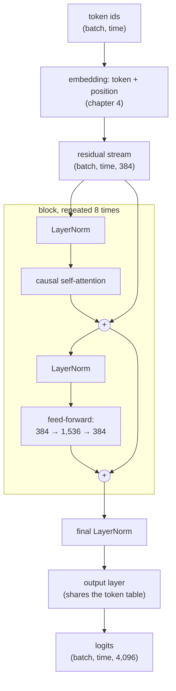

# 5. The block and the full model

[Chapter 4](04-embeddings-and-attention.md) built the two pieces that turn token ids into vectors and
let each position gather information from the positions before it. Attention alone is not yet a
language model. This chapter adds the missing parts, a small network that works on each position by
itself and two techniques that keep a deep stack trainable, wraps them into a **block**, stacks eight
blocks, and puts a layer on top that scores every possible next token. The result is the complete
model: token ids in, 4,096 scores per position out, 15,867,648 parameters, every one of them accounted
for by a formula in the tests.

**Code:** [`hello_tokens/model/block.py`](../../hello_tokens/model/block.py) ·
[`hello_tokens/model/gpt.py`](../../hello_tokens/model/gpt.py) ·
[`hello_tokens/model/norm.py`](../../hello_tokens/model/norm.py)
**Tests:** [`tests/model/test_gpt.py`](../../tests/model/test_gpt.py)

## Words

- **Embedding**, **attention**, **head**, **width**, **context**, **linear layer**, **bias**: see
  [chapter 4](04-embeddings-and-attention.md#words). **Logits**, **softmax**, **loss**, **ln**: see
  [chapter 6](06-the-learning-loop.md#words), which trains the model built here.
- **Feed-forward network**: two linear layers with a non-linearity between them, applied to each
  position's vector on its own.
- **Non-linearity** (also **activation function**): a function applied to every number separately
  that is not a straight line, such as GELU below. Without one, layers stacked on top of each other
  could only ever compute a straight-line function of their input.
- **Residual connection**: adding a part's output to its input, `x + f(x)`, instead of replacing the
  input with it.
- **Mean**, **standard deviation**: the average of a list of numbers, and a measure of how far the
  numbers typically spread from it.
- **Normalization** (here **LayerNorm**): rescaling each position's vector so that its numbers have a
  mean of 0 and a standard deviation of 1, followed by a learned scale and shift.
- **Block** (also **layer**): one attention step and one feed-forward network, each with its
  normalization and residual connection. The model stacks eight.
- **Initialization**: the random values the parameters start from, before any training.
- **Weight tying**: using one table of parameters in two places; here, the token embedding table also
  serves as the output layer.
- **Decoder-only transformer**: a model built from a stack of such blocks with causal attention, which
  reads a text and predicts its next token. GPT models are of this kind.

## The idea

### Thinking about each position

Attention moves information between positions: after it, the vector for "it" carries something of
"cat". What it does not do much of is *compute*. The output of attention is a weighted average of
values, and averaging is a mild operation. Each block therefore follows attention with a
**feed-forward network** that takes every position's vector on its own, widens it to four times its
width, bends it with a non-linearity, and narrows it back. Attention gathers; the feed-forward network
works on what was gathered. A good share of what a transformer knows is thought to be stored in these
layers, which also hold most of each block's parameters.

The non-linearity is essential. A linear layer computes `x @ W + b`, and two in a row compute
`(x @ W1 + b1) @ W2 + b2`, which multiplies out to a single linear layer with the matrix `W1 @ W2`.
However many such layers are stacked, the result can only be a straight-line function of the input.
A bend between them breaks that collapse, and lets the network represent curved, complicated
relationships.

### Adding, not replacing

Each part of a block does not replace the vector it is given. It computes a change, and the change is
**added** to the vector: `x = x + attention(...)`, then `x = x + feed_forward(...)`. This running
vector, passed from block to block and adjusted by each, is often called the **residual stream**.

Residual connections make deep stacks trainable. A block only has to learn a correction to what it
receives, and starting with a correction near zero is easy, so an untrained stack of eight blocks
already passes its input through almost unchanged. Each `+` also gives training a path that skips the
block's weights, so the training signal reaches the first blocks clearly even though eight blocks sit
between them and the output. ([Chapter 6](06-the-learning-loop.md) explains gradients, the form that
signal takes.)

### Keeping the numbers steady

As a vector passes through block after block, each adding its contribution, its numbers can drift in
size. Each part of the block therefore receives a **normalized** copy of the residual stream:
**LayerNorm** subtracts the mean of the vector's 384 numbers, divides by their standard deviation, and
then applies a learned scale and shift for each of the 384 positions in the vector. Attention and the
feed-forward network then always see inputs of a predictable size, however large the stream itself
has become. The normalization is applied to the copy that goes into each part, not to the stream; this
arrangement is called **pre-norm**, and it is the one GPT-2 uses.



### Scoring every next token

After the last block, every position holds a vector of 384 numbers that summarizes what the model
knows about the text up to that point. A final LayerNorm steadies it, and an output layer turns it
into 4,096 scores, one per token in the vocabulary: the **logits** that chapter 6 turns into a loss.

The output layer has one row of 384 weights per token, and the score for token *j* is the dot product
of the final vector with row *j*. The token embedding of chapter 4 is also a table with one row of 384
numbers per token. The model uses the same table for both, which is **weight tying**: reading a token
in and predicting it out use the same vector. It is a natural fit, since a final vector that points
the same way as a token's embedding then scores that token highly, and it saves a whole table of
4,096 × 384 parameters.

## The shapes

For a batch of `B` windows of 256 tokens:

| Tensor | Shape | What it is |
|---|---|---|
| ids | B × 256 | token ids |
| residual stream | B × 256 × 384 | one vector per position, the same shape through all 8 blocks |
| inside the feed-forward network | B × 256 × 1,536 | each vector widened 4× |
| after the final LayerNorm | B × 256 × 384 | |
| logits | B × 256 × 4,096 | a score for every token at every position |

Every block takes and returns the same shape, which is what makes the blocks interchangeable and the
stack easy to deepen.

## The code

### The feed-forward network

<!-- from: hello_tokens/model/block.py -->
```python
class FeedForward(nn.Module):
    """Two layers applied to each token on its own: widen 4x, bend with GELU, narrow back."""

    def __init__(self, config: ModelConfig):
        super().__init__()
        self.up = nn.Linear(config.width, 4 * config.width)
        self.gelu = nn.GELU()
        self.down = nn.Linear(4 * config.width, config.width)

    def forward(self, x: torch.Tensor) -> torch.Tensor:
        return self.down(self.gelu(self.up(x)))
```

`up` turns each 384-number vector into 1,536 numbers, `gelu` bends each of them, and `down` turns
the 1,536 back into 384. A linear layer acts on the last dimension of its input, so a tensor of shape
(batch, time, 384) goes through with every position handled separately and identically: the same
weights, no mixing between positions. Mixing between positions is attention's job.

The factor of 4 is the conventional choice, used since the original transformer paper and by GPT-2:
enough room to compute in, at a cost in parameters that stays in proportion with attention's.

**GELU**, the Gaussian error linear unit, is the non-linearity GPT-2 uses. Large positive numbers pass
almost unchanged and large negative numbers go to about zero; near zero the bend is visible, with 1
becoming 0.84 and −1 becoming −0.16:

<!-- illustration -->
```python
x = torch.tensor([-3.0, -1.0, 0.0, 1.0, 3.0])
F.gelu(x)        # tensor([-0.0040, -0.1587,  0.0000,  0.8413,  2.9960])
```

The collapse that GELU prevents can be checked directly. Two linear layers with nothing between them
give the same result as one linear layer whose matrix is the product of theirs:

<!-- illustration -->
```python
torch.manual_seed(0)
first, second = nn.Linear(3, 5), nn.Linear(5, 3)
x = torch.randn(3)
w = second.weight @ first.weight                   # one 3-by-3 matrix
b = second.weight @ first.bias + second.bias       # one bias
torch.allclose(second(first(x)), w @ x + b)        # True
```

PyTorch stores a linear layer's matrix with one row per output, so it computes `weight @ x + bias`;
the arithmetic is the same as the `x @ W + b` of chapter 4.

### Normalization

<!-- from: hello_tokens/model/norm.py -->
```python
def make_norm(config: ModelConfig) -> nn.Module:
    if config.norm == "layernorm":
        return nn.LayerNorm(config.width)
```

In v1, `config.norm` is always `"layernorm"`, so every normalization in the model is PyTorch's
`nn.LayerNorm` over the 384 numbers of a vector. It is one of the few layers this project takes from
PyTorch rather than writing out; it holds two learned vectors of 384, the scale and the shift, which
start at 1 and 0. On a vector of four numbers, freshly built:

<!-- illustration -->
```python
x = torch.tensor([[2.0, 4.0, 6.0, 8.0]])
y = nn.LayerNorm(4)(x).detach()
y                                # tensor([[-1.3416, -0.4472,  0.4472,  1.3416]])
y.mean(), y.std(unbiased=False)  # (tensor(0.), tensor(1.0000))
```

The output keeps the pattern of the input (evenly spaced, increasing) but has a mean of 0 and a
standard deviation of 1, whatever the size of the numbers that went in. `detach()` only drops the
record PyTorch keeps for computing gradients (chapter 6), so the tensor prints plainly.

> **Later:** the function's last line, not shown, returns an `RMSNorm` instead, a simpler
> normalization that Part II switches to.

### The block

<!-- from: hello_tokens/model/block.py -->
```python
class Block(nn.Module):
    """Attention lets tokens share information; the feed-forward network thinks about each token.

    Each is applied to a normalised copy of x and *added* back onto x (a residual connection), so
    every block refines the running vector instead of replacing it.
    """

    def __init__(self, config: ModelConfig):
        super().__init__()
        self.norm1 = make_norm(config)
        self.attention = CausalSelfAttention(config)
        self.norm2 = make_norm(config)
        self.feed_forward = SwiGLU(config) if config.feed_forward == "swiglu" else FeedForward(config)

    def forward(self, x: torch.Tensor, cache: KVCache | None = None, layer: int = 0) -> torch.Tensor:
        x = x + self.attention(self.norm1(x), cache, layer)
        x = x + self.feed_forward(self.norm2(x))
        return x
```

The block owns four parts: two LayerNorms, the attention module of chapter 4, and the feed-forward
network. In v1, `config.feed_forward` is `"gelu"`, so the last line of `__init__` builds the
`FeedForward` above.

`forward` is the whole idea in two lines. `self.norm1(x)` is a normalized copy of the stream;
attention reads it, and its output is added onto `x`. The same happens with the second LayerNorm and
the feed-forward network. `x` itself is never normalized inside the block, only the copies that the
two parts read. In v1, `cache` is always `None` and `layer` is unused; attention then behaves exactly
as in chapter 4.

> **Later:** Part II adds the `SwiGLU` feed-forward network chosen by the switch in `__init__`, the
> `cache` and `layer` arguments for the KV cache, and the block's `decode` method for CUDA graphs.

### The full model

<!-- from: hello_tokens/model/gpt.py -->
```python
class GPT(nn.Module):
    """Token ids in, a score for every possible next token out, at every position."""

    def __init__(self, config: ModelConfig):
        super().__init__()
        self.config = config
        self.embedding = Embedding(config)
        self.blocks = nn.ModuleList(Block(config) for _ in range(config.layers))
        self.final_norm = make_norm(config)
        # Turns each token's vector into one score per vocabulary entry (the "logits").
        self.output = nn.Linear(config.width, config.vocab_size, bias=False)
        # Weight tying: the output layer reuses the token embedding table. Reading a token in and
        # predicting it out use the same vectors, and it saves 4,096 x 384 = 1.57M parameters.
        self.output.weight = self.embedding.token.weight
```

`nn.ModuleList` holds the eight blocks as a list that PyTorch knows about, so their parameters are
part of the model: they are trained, saved in checkpoints and moved to the GPU with it. A plain Python
list would hide them from PyTorch.

The output layer is a linear layer from 384 numbers to 4,096 scores, without a bias. Its weight
matrix has shape (4,096, 384), one row per token, which is exactly the shape of the token embedding
table. The assignment `self.output.weight = self.embedding.token.weight` makes the two layers hold
*the same* tensor, not a copy: any change training makes to it is seen by both, and its gradient
collects contributions from both uses.

<!-- from: hello_tokens/model/gpt.py -->
```python
        self.apply(self._init_weights)
        # Each block adds two results onto the running vector; shrink those two layers' starting
        # weights so the sum doesn't grow with depth (the GPT-2 recipe).
        for block in self.blocks:
            for layer in (block.attention.out, block.feed_forward.down):
                nn.init.normal_(layer.weight, mean=0.0, std=0.02 / math.sqrt(2 * config.layers))

    @staticmethod
    def _init_weights(module: nn.Module) -> None:
        # Small random starting weights (standard deviation 0.02) and zero biases.
        if isinstance(module, nn.Linear):
            nn.init.normal_(module.weight, mean=0.0, std=0.02)
            if module.bias is not None:
                nn.init.zeros_(module.bias)
        elif isinstance(module, nn.Embedding):
            nn.init.normal_(module.weight, mean=0.0, std=0.02)
```

These lines set the model's **initialization**. `self.apply(fn)` calls `fn` on every module inside
the model. `_init_weights` gives every linear layer and both embedding tables small random weights,
drawn from a bell curve with a standard deviation of 0.02, and sets every bias to zero. LayerNorm's
own starting values (scale 1, shift 0) are left as PyTorch sets them.

Then two layers in every block are made smaller still: the two whose outputs are added onto the
residual stream, attention's `out` and the feed-forward network's `down`. With eight blocks there are
2 × 8 = 16 such additions. Adding sixteen independent random contributions makes the stream's spread
grow by about the square root of their number, so these layers start with a standard deviation
divided by √16 = 4, giving 0.005. The stream then starts at a steady size however deep the model is.
This is the recipe GPT-2 published.

<!-- from: hello_tokens/model/gpt.py -->
```python
    def forward(self, ids: torch.Tensor, cache: KVCache | None = None) -> torch.Tensor:
        # ids: (batch, time)  ->  logits: (batch, time, vocab_size). With a cache, ids are only the new
        # tokens: everything before them is read from the cache, and they are added to it.
        x = self.embedding(ids, cache.length if cache is not None else 0)
        for layer, block in enumerate(self.blocks):
            x = block(x, cache, layer)
        if cache is not None:
            cache.advance(ids.shape[1])
        return self.output(self.final_norm(x))
```

In v1 there is no cache, so the method reduces to three steps: embed the ids (with an offset of 0),
pass the vectors through the eight blocks in order, and turn the final, normalized vectors into
logits. This is all of the model.

> **Later:** the `cache` argument and the methods after `forward` in the file (`decode_step`,
> `use_fused_attention`, `new_cache`) belong to Part II's faster generation.

<!-- from: hello_tokens/model/gpt.py -->
```python
    def parameter_count(self) -> int:
        # .parameters() lists the tied table once, so it is counted once.
        return sum(p.numel() for p in self.parameters())
```

`numel()` is the number of entries in a tensor. Because the output layer and the embedding share one
tensor, `parameters()` returns it once, and the shared table is counted once.

### Where the parameters are

The count can be worked out by hand from the layer sizes, with width *w* = 384. A linear layer from
*a* numbers to *b* numbers has *a* × *b* weights and *b* biases; a LayerNorm has 2*w*.

| Part | Formula | Parameters |
|---|---|---|
| attention: `qkv` | *w* · 3*w* + 3*w* | 443,520 |
| attention: `out` | *w* · *w* + *w* | 147,840 |
| feed-forward: `up` | *w* · 4*w* + 4*w* | 591,360 |
| feed-forward: `down` | 4*w* · *w* + *w* | 590,208 |
| two LayerNorms | 2 · 2*w* | 1,536 |
| **one block** | | **1,774,464** |
| eight blocks | | 14,195,712 |
| token table | 4,096 · *w* | 1,572,864 |
| position table | 256 · *w* | 98,304 |
| final LayerNorm | 2*w* | 768 |
| output layer | tied: the token table | 0 |
| **total** | | **15,867,648** |

Two thirds of each block's parameters are in the feed-forward network, and the eight blocks hold
nearly 90% of the model. The token table is about a tenth, which is also what weight tying saves.

## What would go wrong the other way

**No non-linearity.** The feed-forward network would collapse into one linear layer, and so, between
the attention steps, would everything else. The model could represent far fewer patterns.

**Replacing instead of adding.** With `x = attention(...)` in place of `x = x + attention(...)`, each
block would have to reproduce everything worth keeping as well as add something new, and the gradient
reaching the first blocks would pass through every later block's layers. Deep stacks built this way
are much harder to train.

**Normalizing after each part instead of before.** The original transformer normalized the stream
itself after each addition. Pre-norm leaves the stream untouched, so the residual path from the
embedding to the output stays a pure sum, which is why GPT-2 and most later models train more stably
with it.

**Normal-sized starting weights on the residual layers.** Sixteen additions of the same size would
make the stream grow with depth, and the first steps of training would spend their effort undoing it.

**A separate output table.** It would add 1,572,864 parameters, about a tenth of the model, and the
two tables would learn related things separately.

## Proving it works

<!-- from: tests/model/test_gpt.py -->
```python
def test_the_full_size_model_has_the_planned_parameter_count():
    # Worked out by hand, per block (width w = 384):
    #   attention   qkv w*3w + 3w   +   out w*w + w
    #   feed-fwd    up  w*4w + 4w   +   down 4w*w + w
    #   two norms   2 * 2w
    w, config = 384, ModelConfig()
    block = (w * 3 * w + 3 * w) + (w * w + w) + (w * 4 * w + 4 * w) + (4 * w * w + w) + 2 * 2 * w
    embeddings = config.vocab_size * w + config.context * w  # tokens + positions
    final_norm = 2 * w
    expected = config.layers * block + embeddings + final_norm  # output layer is tied: no extra
    assert expected == 15_867_648
    assert GPT(config).parameter_count() == expected
```

This is the table above, as a test. The first assertion pins the hand count; the second requires the
real model to match it exactly. A missing bias, an extra layer, a feed-forward network of the wrong
width, or tying that silently failed and left a second table would each change the count, so this one
number checks the whole structure.

<!-- from: tests/model/test_gpt.py -->
```python
def test_an_untrained_model_guesses_uniformly():
    # Before training, the model should spread its bets evenly over the vocabulary, so its loss is
    # about ln(vocab_size): the loss of picking uniformly at random. Far above means a bad start.
    config = ModelConfig(vocab_size=4096, context=64, width=64, layers=2, heads=4)
    ids = torch.randint(0, config.vocab_size, (4, 64))
    # Targets the model cannot see. (Using ids themselves would score better than chance: with
    # tied weights an untrained model already leans towards repeating the token it was given.)
    targets = torch.randint(0, config.vocab_size, (4, 64))
    logits = GPT(config)(ids)
    loss = F.cross_entropy(logits.view(-1, config.vocab_size), targets.view(-1))
    assert abs(loss.item() - math.log(4096)) < 0.1  # ln(4096) = 8.318
```

This test checks the initialization. With small random weights, every logit is close to zero, so
softmax spreads the probability almost evenly over 4,096 tokens, and the cross-entropy loss of
chapter 6 should be close to ln(4,096) ≈ 8.32, the loss of a uniform guess. A start far above that
would mean the model begins confidently wrong, and training would first have to undo it.

The comment records a finding. The first version of the test used the inputs themselves as targets,
and the build log records that it scored 7.59, better than chance. The reason is weight tying: at
position *i* the final vector still resembles the embedding of token *i*, because the residual stream
starts as that embedding and the blocks add only small changes, and the tied output layer scores
token *i* by its dot product with that same embedding. An untrained tied model therefore leans
towards repeating its input. With targets drawn independently of the inputs, the test measures what
it means to: the uniform-guess baseline.

The other tests in the file check that the output layer and the token table are the same tensor, that
ids of shape (3, 10) give logits of shape (3, 10, 50) for the small test model, that a block keeps the
shape of its input, and that the whole model is causal: changing token 5 leaves the logits at
positions 0 to 4 unchanged. That last test repeats chapter 4's causality check through all the blocks,
the normalizations and the output layer.

## Run it

This chapter has no command of its own; `train` in [chapter 7](07-the-real-training-run.md) builds
this model. The tests run on the CPU:

```
uv run pytest tests/model/test_gpt.py
```

The full-size model is small enough to build and run on a CPU in a Python session started with
`uv run python`:

<!-- illustration -->
```python
import torch

from hello_tokens.model.config import ModelConfig
from hello_tokens.model.gpt import GPT

torch.manual_seed(0)
model = GPT(ModelConfig())
print(model.parameter_count())                                 # 15867648
logits = model(torch.randint(0, 4096, (1, 8)))
print(logits.shape)                                            # torch.Size([1, 8, 4096])
print(model.output.weight is model.embedding.token.weight)     # True
```

Eight ids in, eight rows of 4,096 scores out, one row for the next token after each position.

In the same session, the test's untrained-loss check, and the finding in its comment, can be repeated:

<!-- illustration -->
```python
import math

import torch.nn.functional as F

torch.manual_seed(0)
config = ModelConfig(vocab_size=4096, context=64, width=64, layers=2, heads=4)
ids = torch.randint(0, config.vocab_size, (4, 64))
targets = torch.randint(0, config.vocab_size, (4, 64))
logits = GPT(config)(ids)
round(F.cross_entropy(logits.view(-1, 4096), targets.view(-1)).item(), 3)   # 8.316
round(F.cross_entropy(logits.view(-1, 4096), ids.view(-1)).item(), 3)       # 7.585
round(math.log(4096), 3)                                                    # 8.318
```

The two losses are the ones explained under the test above: the uniform guess, and the lower score
of an untrained tied model asked to predict its own inputs.

## What we got

- **The complete v1 model:** embedding, eight pre-norm blocks of attention and a GELU feed-forward
  network (384 → 1,536 → 384), a final LayerNorm, and an output layer tied to the token table.
- **15,867,648 parameters,** matched exactly against a hand-derived formula in the tests: 1,774,464
  per block, 14,195,712 in the eight blocks, 1,572,864 in the shared token table, 98,304 in the
  position table and 768 in the final LayerNorm.
- **A sound start:** weights drawn with a standard deviation of 0.02, biases zero, and the two
  residual layers per block scaled by 1/√(2 · 8). The untrained model's loss is ln(4,096) ≈ 8.32, the
  uniform guess, and the training run of chapter 7 starts from exactly there.

## Check yourself

1. What does the `+` in `x = x + self.attention(self.norm1(x), cache, layer)` give the model that
   `x = self.attention(...)` would not?
2. Why does the model need GELU between the feed-forward network's two linear layers?
3. An untrained model scored 7.59 when asked to predict its own inputs, better than the 8.32 of a
   uniform guess. What causes this, and why does the test use independent targets?

<details>
<summary>Answers</summary>

1. A residual connection. Each block only has to learn a correction to the stream, starting from
   almost nothing, so an untrained deep stack passes its input through nearly unchanged. Each `+`
   also gives training a path that skips the block's weights, so the first blocks get a clear training
   signal despite the blocks above them.
2. Two linear layers in a row multiply out to a single linear layer, so without a non-linearity the
   network would be no more expressive than one layer. GELU bends each number, which lets the network
   represent relationships that are not straight lines.
3. Weight tying. At each position the final vector is still close to the input token's embedding,
   since the blocks start by adding only small changes, and the tied output layer scores each token by
   its dot product with that same embedding table, so the input token scores highest. Predicting the
   inputs therefore beats chance before any training. The test is meant to check that the model
   starts from a uniform guess, so it uses targets the model has no way to relate to its inputs.

</details>

Next: [6. The learning loop](06-the-learning-loop.md)
