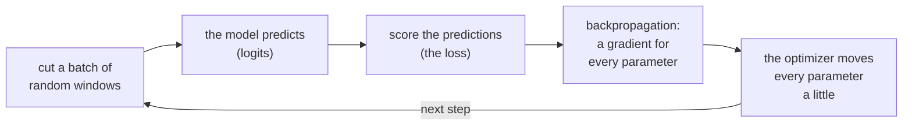

# 6. The learning loop

A freshly built model knows nothing. Its millions of numbers are random, and the next token it
predicts is close to a uniform guess. Learning is the process that changes those numbers, a little at
a time, until the predictions match real text. This chapter builds that process: how training
examples are cut from the token files, how a prediction is scored, how every number in the model is
nudged to make the score better, and how large each nudge should be. It ends with the most useful
test in deep learning, a proof that the whole loop really learns. Chapters 4 and 5 build the model
itself; this chapter needs only what the model takes in and what it gives back.

**Code:** [`hello_tokens/training/batches.py`](../../hello_tokens/training/batches.py) ·
[`hello_tokens/training/optimize.py`](../../hello_tokens/training/optimize.py)
**Tests:** [`tests/training/test_training.py`](../../tests/training/test_training.py) ·
[`tests/conftest.py`](../../tests/conftest.py)

## Words

- **Parameters**: the model's adjustable numbers (see [chapter 1](01-setup-and-the-data.md#words)).
  The project's model has 15,867,648 of them, held in tensors: some are 2-D matrices, some 1-D
  vectors.
- **Logits**: what the model outputs. For every position in its input, it gives one score per
  vocabulary entry, 4,096 scores in all; a higher score means "more likely to come next". Logits are
  not probabilities yet: they can be any size, negative included, and do not sum to one.
- **Softmax**: the function that turns scores into probabilities: raise *e* to each score, then
  divide each result by their total. The largest score gets the largest probability, and the
  probabilities sum to one.
- **Batch**: several training examples processed together, as one tensor.
- **Loss**: a single number measuring how wrong the predictions were. Training tries to make it small.
- **Gradient**: for each parameter, how much the loss would change if that parameter were increased a
  tiny amount. Its sign says which way to move the parameter to lower the loss; its size says how
  sensitive the loss is to it.
- **Backpropagation**: the algorithm that computes every parameter's gradient in one pass backwards
  through the computation. PyTorch performs it automatically (**autograd**), which is one of the few
  things this project does not write by hand.
- **Optimizer**: the rule that turns gradients into updates of the parameters.
- **Learning rate**: how large a step the optimizer takes. **Step**: one update of all parameters.

## The idea

Text is its own answer key. Given any window of the token file, the right answer at each position is
simply the token that follows it. No labels have to be written by anyone: every story already
contains millions of questions ("what comes next?") with their answers.

One training step is then always the same five actions:



Each step changes every parameter by a very small amount, in the direction that would have made this
batch's predictions a little better. A single step barely changes anything. Twenty thousand of them,
each on different text, turn random numbers into a model that writes stories. This method, moving
downhill on the loss a small step at a time, is called **gradient descent**.

## The shapes

With the settings of the real run in [chapter 7](07-the-real-training-run.md) (64 windows per batch, a context of 256 tokens, a
vocabulary of 4,096):

| Tensor | Shape | What it is |
|---|---|---|
| `inputs` | 64 × 256 | token ids, 64 windows of 256 |
| `targets` | 64 × 256 | the same windows shifted one token to the left |
| `model(inputs)` | 64 × 256 × 4,096 | logits: a score for every token at every position |
| logits, flattened | 16,384 × 4,096 | one row per prediction |
| targets, flattened | 16,384 | the right answer for each row |
| `loss` | a single number | the average over all 16,384 predictions |

## The code

### Examples: random windows

<!-- from: hello_tokens/training/batches.py -->
```python
def get_batch(
    tokens: np.ndarray, batch_size: int, context: int, generator: np.random.Generator, device: str = "cpu"
) -> tuple[torch.Tensor, torch.Tensor]:
    """Pick batch_size random windows of `context` tokens. Returns (inputs, targets).

    The target at each position is the token that comes next, so one window of 256 tokens is
    256 next-token predictions at once.
    """
    starts = generator.integers(0, len(tokens) - context - 1, size=batch_size)
    windows = np.stack([tokens[s : s + context + 1] for s in starts]).astype(np.int64)
    windows = torch.from_numpy(windows).to(device)
    return windows[:, :-1], windows[:, 1:]  # inputs: tokens 0..T-1, targets: tokens 1..T
```

`tokens` is the memory-mapped token file from [chapter 3](03-real-text-and-token-files.md). The
function draws `batch_size` random starting points from a NumPy random generator, chosen so that a
whole window fits before the end of the file. From each start it cuts `context + 1` tokens, one more
than the model reads, and `np.stack` piles the windows into a table with one row per window.

The file stores each id in two bytes, but PyTorch's lookup of token ids expects 64-bit integers, so
`.astype(np.int64)` widens them. `torch.from_numpy` turns the table into a tensor without copying it,
and `.to(device)` moves it to the GPU when training runs there.

The last line is the whole trick. `windows[:, :-1]` is every row without its last token, and
`windows[:, 1:]` is every row without its first. Lined up, the target at each position is the token
that follows the input at that position. A window of 257 tokens therefore holds 256 questions: from
token 0 predict token 1, from tokens 0 and 1 predict token 2, and so on, up to predicting token 256
from all 256 before it.

On a "file" holding the numbers 0 to 99, the shift is easy to see:

<!-- illustration -->
```python
tokens = np.arange(100, dtype=np.uint16)
inputs, targets = get_batch(tokens, batch_size=2, context=8, generator=np.random.default_rng(0))
# inputs:  [[77, 78, 79, 80, 81, 82, 83, 84],
#           [57, 58, 59, 60, 61, 62, 63, 64]]
# targets: [[78, 79, 80, 81, 82, 83, 84, 85],
#           [58, 59, 60, 61, 62, 63, 64, 65]]
```

For all 256 predictions in a window to be honest, the model must not be able to see the answer. The
prediction at position 0 must be made from token 0 alone, even though token 1 is sitting in the same
input row. That is why the model's attention, built in chapter 4, is **causal**: each position can
look only at itself and the positions before it.

### Measuring wrongness: cross-entropy

<!-- from: hello_tokens/training/optimize.py -->
```python
def next_token_loss(logits: torch.Tensor, targets: torch.Tensor) -> torch.Tensor:
    """Cross-entropy: how surprised the model was by each true next token, averaged.

    logits (batch, time, vocab) are flattened to (batch*time, vocab) so every position counts as
    one prediction.
    """
    return F.cross_entropy(logits.reshape(-1, logits.shape[-1]), targets.reshape(-1))
```

For each prediction, **cross-entropy** applies softmax to the 4,096 scores and takes the probability
the model gave to the token that actually came next. The loss for that prediction is the negative
logarithm of that probability. The loss of the batch is the average over every prediction.

The negative logarithm has exactly the behaviour a score of wrongness needs:

| Probability given to the true next token | Loss, −ln(p) |
|---|---|
| 1 (certain, and right) | 0 |
| 0.5 | 0.69 |
| 0.1 | 2.30 |
| 1/4,096 (a uniform guess) | 8.32 |

A confident right answer costs nothing, and the cost grows without limit as the probability of the
truth approaches zero, so a confident wrong answer is punished hardest. The last row is the starting
point: a model with random parameters spreads its probability roughly evenly over 4,096 tokens, and
the build log records that the untrained model's loss is indeed ln(4,096) ≈ 8.32.

The `reshape` calls exist because `F.cross_entropy` expects one row of scores per prediction.
`logits.reshape(-1, logits.shape[-1])` folds the batch and time dimensions into one, giving
16,384 rows of 4,096 scores for the real run, and the targets are flattened to match. Every position
of every window then counts as one prediction, equally.

A small example, with three scores and two possible true answers:

<!-- illustration -->
```python
logits = torch.tensor([[2.0, 1.0, 0.1]])
torch.softmax(logits, dim=-1)                   # tensor([[0.6590, 0.2424, 0.0986]])
F.cross_entropy(logits, torch.tensor([0]))      # tensor(0.4170): the likeliest token was right
F.cross_entropy(logits, torch.tensor([2]))      # tensor(2.3170): the least likely was right
```

`F.cross_entropy` computes the softmax and the logarithm in one combined operation. Done separately,
the softmax of a very negative score can round to exactly zero, and its logarithm is then minus
infinity; the combined form avoids that.

### One step

<!-- from: hello_tokens/training/optimize.py -->
```python
def train_step(
    model: nn.Module,
    optimizer: torch.optim.Optimizer,
    inputs: torch.Tensor,
    targets: torch.Tensor,
    learning_rate: float,
    clip: float = 1.0,
    precision: torch.dtype | None = None,
) -> float:
    """One update: predict, measure the loss, work out the gradients, nudge every weight.

    precision=torch.bfloat16 runs the forward pass in 16-bit numbers on the GPU (half the memory,
    faster maths); the weights themselves and their updates stay in full 32-bit precision.
    """
    for group in optimizer.param_groups:
        group["lr"] = learning_rate
    with torch.autocast(inputs.device.type, dtype=precision or torch.float32, enabled=precision is not None):
        loss = next_token_loss(model(inputs), targets)
    optimizer.zero_grad(set_to_none=True)  # forget the previous step's gradients
    loss.backward()  # backpropagation: the gradient of the loss for every weight
    # If the gradients are unusually large all at once, scale them down so one bad batch
    # can't throw the weights far off.
    nn.utils.clip_grad_norm_(model.parameters(), clip)
    optimizer.step()  # move every weight a little against its gradient
    return loss.item()
```

This is the diagram above, in code.

The first two lines set the learning rate for this step. The rate changes during training, by the
schedule below, and the optimizer reads it from its **parameter groups**, so each step writes the
current value into every group.

The `with torch.autocast(...)` block runs the model and computes the loss. `precision` is `None` in
the tests, and then `enabled=False` makes the block do nothing at all. The real run passes bf16, which
chapter 7 explains.

`optimizer.zero_grad(set_to_none=True)` clears the previous step's gradients. PyTorch *adds* new
gradients to whatever is already stored, so without this line every step would use the sum of all
gradients so far.

`loss.backward()` is backpropagation. PyTorch recorded every operation that produced the loss, from
the token ids through the whole model, and now runs that record backwards, applying the chain rule of
calculus at each operation. When it finishes, every parameter `p` has its gradient in `p.grad`.

`nn.utils.clip_grad_norm_(model.parameters(), clip)` is a safety rail. It measures the length, the
**norm**, of all the gradients taken together as one long vector. If it exceeds `clip` (1.0), every
gradient is scaled down by the same factor: the direction is kept, and only a violent step is
shortened.

`optimizer.step()` moves every parameter, using its gradient and the learning rate. Finally,
`loss.item()` copies the loss back to the CPU as a plain Python number, for logging.

### The optimizer: AdamW

<!-- from: hello_tokens/training/optimize.py -->
```python
def make_optimizer(model: nn.Module, learning_rate: float, weight_decay: float = 0.1) -> torch.optim.AdamW:
    """AdamW, with weight decay only on the matrices.

    Weight decay gently pulls weights toward zero so none grows needlessly large. It is applied to
    the 2-D weight matrices (the layers and the embedding table) but not to biases and LayerNorm
    knobs, which are 1-D: pulling those toward zero only hurts.
    """
    matrices = [p for p in model.parameters() if p.dim() >= 2]
    vectors = [p for p in model.parameters() if p.dim() < 2]
    groups = [
        {"params": matrices, "weight_decay": weight_decay},
        {"params": vectors, "weight_decay": 0.0},
    ]
    return torch.optim.AdamW(groups, lr=learning_rate, betas=(0.9, 0.95))
```

The simplest optimizer subtracts the learning rate times the gradient from each parameter. **AdamW**,
the standard choice for transformers, refines that in two ways.

First, it keeps two running averages for every parameter: of its recent gradients
(`betas[0] = 0.9`), which smooths out the noise of individual batches like momentum, and of their
squares (`betas[1] = 0.95`), which tracks how large that parameter's gradients usually are. The step
is divided by the square root of the second, so a parameter with tiny gradients and one with large
gradients move by similar amounts: each gets a sensible step size of its own.

Second, the **W**: **weight decay**. Each step also shrinks every weight slightly towards zero, in
proportion to the learning rate and `weight_decay` (0.1), so the model does not come to rely on a few
very large numbers.

The parameters are split by their number of dimensions. The matrices, which hold almost all the
parameters and do the real computation, are decayed. The 1-D vectors are not: these are biases, small
offsets added after a matrix product, and the scale and shift of the normalization layers that
chapter 5 builds to keep each layer's numbers in a stable range. Pulling a normalization scale towards
zero would shrink the signal through its layer, and a bias has no reason to be near zero.

### How large a step: the schedule

<!-- from: hello_tokens/training/optimize.py -->
```python
def learning_rate_at(step: int, peak: float, warmup: int, total: int, floor_fraction: float = 0.1) -> float:
    """Warm up linearly to `peak`, then follow a cosine curve down to floor_fraction * peak."""
    if step < warmup:
        return peak * (step + 1) / warmup
    progress = min(1.0, (step - warmup) / max(1, total - warmup))
    cosine = 0.5 * (1 + math.cos(math.pi * progress))  # 1 at the start, 0 at the end
    floor = floor_fraction * peak
    return floor + (peak - floor) * cosine
```

The learning rate is not constant. It follows a **schedule** with two phases.

**Warm-up.** For the first `warmup` steps, the rate rises in a straight line from almost nothing to
`peak`. At the start the parameters are random, the gradients erratic, and AdamW's running averages
not yet reliable; full-size steps then could throw the model somewhere it struggles to leave. The
`+ 1` makes the first step small but not zero.

**Cosine decay.** After warm-up, `progress` runs from 0 to 1 over the remaining steps, and
`0.5 * (1 + cos(π · progress))` falls smoothly from 1 to 0 along half a cosine wave. The rate glides
from `peak` down to the floor, 10% of the peak by default. Large steps make fast progress while the
model is far from good; small steps let it settle into fine detail near the end. `min(1.0, ...)` holds
the rate at the floor if training continues past `total`.

With the real run's settings, a peak of 1e-3, 1,000 warm-up steps and 20,000 steps in all, the
schedule gives:

<!-- illustration -->
```python
[f"{learning_rate_at(s, 1e-3, 1000, 20000):.2e}" for s in (0, 499, 999, 10500, 19999)]
# ['1.00e-06', '5.00e-04', '1.00e-03', '5.50e-04', '1.00e-04']
```

The rate reaches the peak at the end of warm-up, is halfway down at the midpoint of the decay, and ends
at the floor of 1e-4.

## What would go wrong the other way

**One prediction per window.** Training only on the last position of each window would discard 255 of
its 256 questions. Every position is a prediction the model must be able to make, so every position
is trained.

**Windows in file order.** Reading the corpus front to back would give consecutive batches from
neighbouring stories, and each step's gradient would pull the model towards whatever those few stories
happen to share. Random windows make each batch a mixture, so every step points towards what is
common to the corpus.

**Forgetting `zero_grad`.** Gradients would accumulate across steps, and each update would follow the
sum of all past gradients rather than the current one. Training would quickly go wrong, and nothing
would raise an error.

**No warm-up, or no decay.** Without warm-up, the first large steps on random parameters can make the
loss jump instead of fall. With a constant rate, the steps stay too large to settle into fine detail.

**No clipping.** One unusual batch can produce gradients many times larger than normal, and a single
update along them can undo many steps of progress.

## Proving it works

Three tests check the pieces, and a fourth checks the whole.

<!-- from: tests/training/test_training.py -->
```python
def test_targets_are_the_inputs_shifted_by_one():
    tokens = np.arange(100, dtype=np.uint16)  # 0, 1, 2, ... so every window is easy to read
    inputs, targets = get_batch(tokens, batch_size=3, context=8, generator=np.random.default_rng(0))
    assert inputs.shape == targets.shape == (3, 8)
    assert torch.equal(targets, inputs + 1)  # each target is the next token
```

On a file of consecutive numbers, the target is the next token exactly when it equals the input plus
one, so a single comparison checks every position of every window.

<!-- from: tests/training/test_training.py -->
```python
def test_the_schedule_warms_up_then_decays_to_the_floor():
    rates = [learning_rate_at(s, peak=1.0, warmup=10, total=100) for s in range(101)]
    assert rates[0] == pytest.approx(0.1)  # 1/10 of the way into warm-up
    assert rates[9] == pytest.approx(1.0)  # warm-up complete: the peak
    assert all(a >= b for a, b in zip(rates[9:], rates[10:]))  # never rises after the peak
    assert rates[100] == pytest.approx(0.1)  # settles at 10% of the peak
```

The schedule test checks the shape: a tenth of the peak at step 0, the peak when warm-up ends, never
rising after it, and the floor at the end. A third test builds the optimizer for a small model and
checks that the decayed group holds only matrices and the other only vectors.

The fourth test is the one that matters most:

<!-- from: tests/training/test_training.py -->
```python
def test_the_model_can_memorise_one_batch():
    # The proof that learning works end to end: on one fixed batch, repeated, the loss must
    # fall from about ln(64) = 4.16 to almost nothing. If it can't do this, it can't learn at all.
    model = GPT(TINY)
    optimizer = make_optimizer(model, learning_rate=3e-3)
    tokens = np.random.default_rng(0).integers(0, TINY.vocab_size, 1000).astype(np.uint16)
    inputs, targets = get_batch(tokens, 4, TINY.context, np.random.default_rng(1))

    first = next_token_loss(model(inputs), targets).item()
    for _ in range(150):
        last = train_step(model, optimizer, inputs, targets, learning_rate=3e-3)
    assert first > 3.5
    assert last < 0.1
```

`TINY` is a model of the same design as the real one, shrunk to a vocabulary of 64, a context of 16,
a width of 32, two layers and four heads, so the test runs in seconds on a CPU. Its tokens are random
numbers, which contain no pattern to learn; the only way to predict them is to memorize them. The
test takes one batch of four windows and trains on it 150 times.

An untrained model guesses uniformly, so its loss starts near ln(64) ≈ 4.16. A model that has
memorized the batch predicts every target with near certainty, so its loss approaches zero. The build
log records the fall: from about 4.2 to 0.007 in 150 steps.

Memorizing is the opposite of what the real model should do, so why is this the best first test?
Because every part of the loop must work for it to pass. If the targets were misaligned, the loss
wrong, the gradients disconnected from some layer, or the optimizer misconfigured,
the loss would stall well above zero. A real run takes over an hour; this test takes seconds and fails
for almost every bug that would waste that hour.

The test file also explains a small engineering fix, in [`tests/conftest.py`](../../tests/conftest.py):

<!-- from: tests/conftest.py -->
```python
# The test models are tiny. Spreading each small operation over every CPU core costs more in
# coordination than it saves, so a few threads run the suite many times faster.
torch.set_num_threads(4)
```

By default, PyTorch splits every operation across all CPU cores. For a model this small, coordinating
the cores costs more than the arithmetic. The build log records that limiting the tests to 4 threads
cut the suite from 42 s to 7 s.

## Run it

The learning loop has no command of its own; chapter 7's `train` command runs it. The tests run on the
CPU in seconds:

```
uv run pytest tests/training/test_training.py
```

The memorize test can also be watched in a Python session started with `uv run python`. With the test's
model, data and seeds, printing the loss every 50 steps gives:

<!-- illustration -->
```python
for step in range(1, 151):
    loss = train_step(model, optimizer, inputs, targets, learning_rate=3e-3)
    if step in (1, 50, 100, 150):
        print(step, round(loss, 3))
# 1 4.172
# 50 0.526
# 100 0.032
# 150 0.007
```

`train_step` returns the loss measured before its own update, so step 1 shows the untrained model.

## What we got

- **Examples:** random windows of 257 tokens, each giving 256 next-token predictions; with the real
  run's batch of 64, that is 16,384 predictions per step.
- **A loss:** cross-entropy, which starts at ln(4,096) ≈ 8.32 for an untrained model.
- **An update rule:** AdamW with betas 0.9 and 0.95, weight decay 0.1 on matrices only, and gradient
  clipping at a norm of 1.0.
- **A schedule:** linear warm-up to the peak, then cosine decay to 10% of it.
- **A proof that it learns:** on one fixed batch, the loss falls from about 4.2 to 0.007 in 150 steps.
- **A faster suite:** 42 s to 7 s by limiting the tests to 4 threads.

## Check yourself

1. Memorizing is exactly what the real model must not do. Why is "memorize one batch" still the best
   first test of a training loop?
2. A window of 257 tokens gives 256 predictions. What property of the model makes all 256 of them
   fair, and what would happen to the loss if the model lacked it?
3. Why does `make_optimizer` decay the matrices but not the 1-D parameters?

<details>
<summary>Answers</summary>

1. Because it is the easiest possible learning task, and it exercises every part of the loop: the
   batches, the loss, backpropagation through every layer, and the optimizer. A loop that cannot drive
   the loss on one repeated batch to near zero has a bug, and finding that out takes seconds instead of
   a wasted training run.
2. Causal attention: each position can see only itself and earlier tokens. Without it, the prediction
   at each position could look at the next input token, which is its own target. The loss would fall
   quickly towards zero by copying, and the model would learn nothing it could use when the next token
   is genuinely unknown.
3. Weight decay keeps the large matrices from relying on a few very large weights, which helps the
   model generalize. The 1-D parameters are biases and normalization scales and shifts. Their right
   values are not near zero, and pulling a normalization scale towards zero would shrink the signal
   through its layer, so decaying them only works against the model.

</details>

Next: [7. The real training run](07-the-real-training-run.md)
