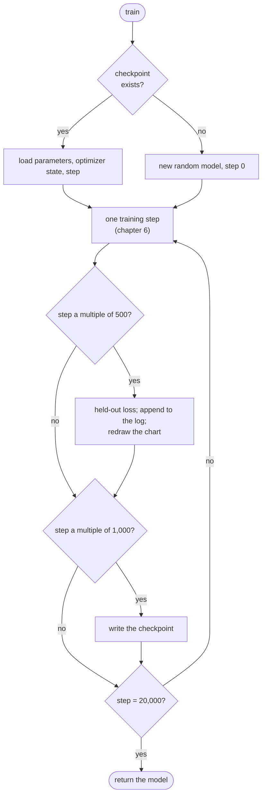

# 7. The real training run

[Chapter 6](06-the-learning-loop.md) built one training step and proved, on a tiny model, that
repeating it learns. This chapter turns that step into a real run: 20,000 steps on the full token
files, with the 15.9-million-parameter model, on a laptop GPU. A run of that length needs things a
test never does: a regular measurement on text the model has never trained on, a log and a chart to
watch, numbers in 16 bits to save memory and time, and checkpoints, so that a crash an hour in costs
minutes rather than the hour. At the end of the chapter, the model writes stories.

**Code:** [`hello_tokens/training/run.py`](../../hello_tokens/training/run.py) ·
[`hello_tokens/training/optimize.py`](../../hello_tokens/training/optimize.py) ·
[`hello_tokens/__main__.py`](../../hello_tokens/__main__.py)
**Tests:** [`tests/training/test_run.py`](../../tests/training/test_run.py)

## Words

- **Step**, **batch**, **loss**, **learning rate**, **optimizer**: see
  [chapter 6](06-the-learning-loop.md#words).
- **Held-out data**: text never trained on (see [chapter 1](01-setup-and-the-data.md#words)). Here it
  is `valid.bin` from [chapter 3](03-real-text-and-token-files.md).
- **Evaluation**: measuring the loss on held-out data without changing the model.
- **Overfitting**: learning the training text itself rather than the patterns in it. An overfitting
  model's training loss keeps falling while its held-out loss stalls or rises. The opposite, doing as
  well on unseen text as on the training text, is **generalizing**.
- **Mixed precision**: running most of the arithmetic in a 16-bit format such as bf16 (chapter 1),
  while the model's parameters and their updates stay in 32-bit numbers.
- **Checkpoint**: a file holding everything needed to continue a run: the parameters, the optimizer's
  state and the step number.
- **Perplexity**: *e* raised to the loss. It reads as "the model is, on average, as unsure as if it were
  choosing uniformly among this many tokens". Chapter 9 measures it over the whole held-out file.

## The idea

A long run must answer four questions while it is running, and survive one event.

**Is it learning, or memorizing?** The training loss alone cannot tell. So every 500 steps the run
pauses, measures the loss on held-out text, and writes both numbers to a log. If the two curves stay
together, the model is learning something general.

**How long should it run?** The run's length was chosen from a rule of thumb rather than tuned: about
20 training tokens per parameter, the amount a widely cited study of compute-efficient training
(Hoffmann et al., the "Chinchilla" paper) found to be a good balance for a model of a given size.
With 15,867,648 parameters, 20,000 steps of 16,384 tokens give 327,680,000 tokens, about 20 per
parameter.

**How large a batch?** The build log records a measurement on the RTX 4060 Laptop GPU: batches of
32, 64 and 96 windows all ran at 73–81 thousand tokens per second. A larger batch was no faster, only
hungrier for memory, so the run uses 64 (16,384 tokens per step, 3.7 GB of the GPU's 8 GB).

**How to make each step cheaper?** Run the model in **bf16**, a 16-bit number format, under PyTorch's
automatic mixed precision. Matrix products in 16 bits need half the memory traffic and run on the
GPU's fastest units.

**What if it stops?** A run of over an hour can be interrupted by a crash, a power cut, or simply the
need to use the laptop. Every 1,000 steps it writes a checkpoint, and running the same command again
continues from the last one.



## The code

### The run's settings

<!-- from: hello_tokens/training/run.py -->
```python
@dataclass(frozen=True)
class TrainConfig:
    name: str = "v1"
    batch_size: int = 64  # 64 windows x 256 tokens = 16,384 tokens per step
    steps: int = 20_000  # about 327M tokens: ~20 per parameter
    peak_lr: float = 1e-3
    warmup: int = 1_000
    eval_every: int = 500
    eval_batches: int = 50
    checkpoint_every: int = 1_000
    seed: int = 0
```

Every setting of the run lives in one **frozen dataclass**: Python generates the constructor, and
`frozen=True` forbids changing a field afterwards, so the settings a run started with are the settings
it ends with. `name` decides where the run's files go: `checkpoints/v1.pt` and the folder `runs/v1/`.
The learning-rate settings feed the schedule of chapter 6: warm-up over 1,000 steps to a peak of
1e-3, then cosine decay to a tenth of that.

### Measuring on held-out text

<!-- from: hello_tokens/training/run.py -->
```python
@torch.no_grad()
def evaluate(model: GPT, tokens: np.ndarray, config: TrainConfig, device: str, precision) -> float:
    """Average loss on held-out text. The same batches every time, so values are comparable."""
    model.eval()
    rng = np.random.default_rng(12345)
    losses = []
    for _ in range(config.eval_batches):
        inputs, targets = get_batch(tokens, config.batch_size, model.config.context, rng, device)
        with torch.autocast(device, dtype=precision or torch.float32, enabled=precision is not None):
            losses.append(next_token_loss(model(inputs), targets).item())
    model.train()
    return sum(losses) / len(losses)
```

`@torch.no_grad()` tells PyTorch not to record the operations for backpropagation. Nothing is learned
during evaluation, so the record would only cost memory and time. `model.eval()` and `model.train()`
switch the model into its measuring mode and back; this model behaves the same in both, but the
switch is the standard courtesy to any layer that does not.

The important line is `np.random.default_rng(12345)`. A fresh generator with a fixed seed is created
on every call, so every evaluation draws exactly the same 50 batches from the held-out file. A change
in the held-out loss between step 500 and step 1,000 is then a change in the model, not in the text it
was measured on. Fifty batches of 64 windows of 256 tokens are 819,200 predictions per evaluation:
enough for a stable number, and with no backpropagation, cheap next to the 500 training steps between
two evaluations.

### Saving and reloading

<!-- from: hello_tokens/training/run.py -->
```python
def save_checkpoint(path: Path, model: GPT, optimizer, step: int, config: TrainConfig) -> None:
    """Save everything needed to resume. Written to .part first, so a crash never leaves half a file."""
    path.parent.mkdir(parents=True, exist_ok=True)
    partial = path.with_name(path.name + ".part")
    torch.save(
        {
            "model": model.state_dict(),
            "optimizer": optimizer.state_dict(),
            "step": step,
            "model_config": asdict(model.config),
            "train_config": asdict(config),
        },
        partial,
    )
    partial.replace(path)
```

A checkpoint is a dictionary saved with `torch.save`. `model.state_dict()` holds every parameter
tensor by name. `optimizer.state_dict()` holds AdamW's two running averages for every parameter,
which are as much a part of the training state as the parameters themselves. The step says where to
pick up, and the two configurations record the model's shape and the run's settings as plain
dictionaries. The file is written under a `.part` name and renamed when complete, the pattern from
chapter 1: a crash during the save leaves the previous checkpoint intact rather than half of a new
one.

<!-- from: hello_tokens/training/run.py -->
```python
def load_model(path: Path, device: str = "cpu") -> GPT:
    """Rebuild a trained model from a checkpoint."""
    checkpoint = torch.load(path, map_location=device)
    model = GPT(ModelConfig(**checkpoint["model_config"])).to(device)
    model.load_state_dict(checkpoint["model"])
    return model
```

Because the checkpoint stores the model's shape, `load_model` needs nothing but the file: it rebuilds
a model of the recorded shape and fills in the trained parameters. Every later command that uses the
trained model, such as `write` and `eval`, starts here.

### The run

<!-- from: hello_tokens/training/run.py -->
```python
def train(
    data_dir: Path,
    out_dir: Path,
    config: TrainConfig = TrainConfig(),
    model_config: ModelConfig = ModelConfig(),
    device: str = "cuda",
    precision=torch.bfloat16,
) -> GPT:
    """Train, or resume a run of the same name. Returns the trained model."""
    train_tokens = load_tokens(data_dir / "tokens" / "train.bin")
    valid_tokens = load_tokens(data_dir / "tokens" / "valid.bin")
    checkpoint_path = out_dir / "checkpoints" / f"{config.name}.pt"
    run_dir = out_dir / "runs" / config.name
    run_dir.mkdir(parents=True, exist_ok=True)
    log_path = run_dir / "log.csv"

    torch.manual_seed(config.seed)
    model = GPT(model_config).to(device)
    optimizer = make_optimizer(model, config.peak_lr)
    step = 0
```

The run opens both token files as memory maps (chapter 3), decides where its files go, and builds a
fresh model and optimizer. `torch.manual_seed(config.seed)` fixes the random starting parameters, so
the same settings always begin from the same model. The defaults say how the real run works: on the
GPU (`"cuda"`), in bf16. The tests pass `device="cpu"` and `precision=None`.

<!-- from: hello_tokens/training/run.py -->
```python
    if checkpoint_path.exists():
        checkpoint = torch.load(checkpoint_path, map_location=device)
...
        model.load_state_dict(checkpoint["model"])
        optimizer.load_state_dict(checkpoint["optimizer"])
        step = checkpoint["step"]
        print(f"resuming {config.name} from step {step}", flush=True)
    elif log_path.exists():
        # A log with no checkpoint belongs to an abandoned run: keep it, but out of the way.
        log_path.replace(run_dir / f"log-abandoned-{int(time.time())}.csv")
```

If a checkpoint of this run's name exists, the fresh model and optimizer are overwritten with the
saved ones and the step counter jumps to where the run stopped. If there is no checkpoint but there is
a log, the log belongs to a run that never reached its first checkpoint; it is renamed out of the way
rather than deleted, and the new run starts a clean log.

> **Later:** the lines cut from this excerpt are already in `train`: they refuse to resume a
> checkpoint whose model shape differs from the one requested. They matter once Part II trains a
> second shape.

<!-- from: hello_tokens/training/run.py -->
```python
    # A different seed per resume point, so a resumed run doesn't replay the same batches.
    rng = np.random.default_rng(config.seed + step)
    tokens_per_step = config.batch_size * model_config.context
    started = time.perf_counter()
    recent = []

    while step < config.steps:
        lr = learning_rate_at(step, config.peak_lr, config.warmup, config.steps)
        inputs, targets = get_batch(train_tokens, config.batch_size, model_config.context, rng, device)
        recent.append(train_step(model, optimizer, inputs, targets, lr, precision=precision))
        step += 1
```

The batches come from a random generator seeded with `config.seed + step`. A fresh run starts at
seed 0; a run resumed at step 7,000 uses seed 7,000. Had the seed been the same, a resumed run would
start a fresh generator at seed 0 and draw again the batches from the start of the run. The new seed
avoids that replay. It does not recreate the exact batches an uninterrupted run would have drawn,
and `started` is set after the load, so the log's `seconds` column restarts from zero on a resume.

The loop itself is three lines of chapter 6: look up the learning rate for this step, cut a batch,
take a step. Each step's training loss is appended to `recent`.

<!-- from: hello_tokens/training/run.py -->
```python
        if step % config.eval_every == 0 or step == config.steps:
            valid_loss = evaluate(model, valid_tokens, config, device, precision)
            train_loss = sum(recent) / len(recent)
            recent.clear()
            new_log = not log_path.exists()
            with open(log_path, "a", newline="") as f:
                writer = csv.writer(f)
                if new_log:
                    writer.writerow(["step", "lr", "train_loss", "valid_loss", "tokens_seen", "seconds"])
                writer.writerow([step, f"{lr:.6f}", f"{train_loss:.4f}", f"{valid_loss:.4f}",
                                 step * tokens_per_step, f"{time.perf_counter() - started:.0f}"])
            save_chart(log_path, run_dir / "loss.png")
            print(f"step {step:>6}  lr {lr:.2e}  train {train_loss:.3f}  held-out {valid_loss:.3f}", flush=True)

        if step % config.checkpoint_every == 0 or step == config.steps:
            save_checkpoint(checkpoint_path, model, optimizer, step, config)
    return model
```

Every 500 steps, and at the very end, the run measures the held-out loss and reports the **training
loss as the average of the steps since the last report**. A single step's loss jumps around with its
batch; the average of 500 is steady enough to plot.

The two numbers go into a CSV file, one row per report, with the learning rate, the number of tokens
seen and the elapsed seconds. The log is opened in append mode, so a resumed run adds rows after the
old ones, and the header is written only when the file is new. `save_chart` redraws `runs/v1/loss.png`
from the whole log each time, using matplotlib in a mode that draws straight to a file, so progress
can be checked by opening an image while the run continues. Every 1,000 steps the checkpoint is
replaced.

### 16-bit arithmetic

The precision switch sits in chapter 6's `train_step`:

<!-- from: hello_tokens/training/optimize.py -->
```python
    with torch.autocast(inputs.device.type, dtype=precision or torch.float32, enabled=precision is not None):
        loss = next_token_loss(model(inputs), targets)
```

Inside a `torch.autocast` block, PyTorch runs each operation in the precision that suits it: matrix
products in bf16, and operations that are sensitive to rounding, such as softmax and the loss, in
32 bits. The parameters stay 32-bit numbers, and so do their gradients and AdamW's updates, so the
small adjustments of a late training step are not lost to rounding. bf16 keeps the same range of
magnitudes as 32-bit floats, with fewer significant digits, so unlike the older 16-bit format fp16 it
needs no extra machinery to keep small gradients from vanishing. The backward pass and the optimizer
step are outside the block, as the PyTorch documentation recommends.

### The command

<!-- from: hello_tokens/__main__.py -->
```python
train_cmd = commands.add_parser("train", help="train the model (resumes a run of the same name)")
train_cmd.add_argument("--name", default="v1", help="run name: checkpoints/<name>.pt, runs/<name>/")
...
train_cmd.add_argument("--steps", type=int, default=TrainConfig.steps)
train_cmd.add_argument("--warmup", type=int, default=TrainConfig.warmup, help="warm-up steps")
train_cmd.add_argument("--seed", type=int, default=TrainConfig.seed)
train_cmd.add_argument("--data-dir", type=Path, default=Path("data"))
```

The command's options default to the dataclass's own values, so there is a single place where the
run's settings are written down. Its dispatch builds a `TrainConfig` from the options and calls
`train`:

<!-- from: hello_tokens/__main__.py -->
```python
if args.command == "train":
    config = TrainConfig(name=args.name, steps=args.steps, warmup=args.warmup, seed=args.seed)
    train(args.data_dir, Path("."), config, MODELS[args.model])
    return 0
```

> **Later:** the option cut from the first excerpt, `--model`, chooses the model's shape, and
> `MODELS[args.model]` looks it up. Its default is `v1`, the model of chapters 4 and 5; Part II adds
> the other shapes.

## What would go wrong the other way

**Watching only the training loss.** Memorizing and learning would look the same.

**Different held-out batches each time.** Part of the change between two reports would come from the
sample of text rather than the model.

**Saving only the parameters.** AdamW's running averages would restart from zero at full learning rate
with no warm-up, and the loss could jump at every resume.

**The same seed on every resume.** Each resume would replay the batches from the start of the run.

**32-bit arithmetic throughout.** Every intermediate result inside the model would take twice the
memory, and the matrix products would not use the GPU's fast 16-bit units. No 32-bit training run was made for comparison,
so the cost of bf16 training is not measured here. What is measured is that the held-out loss computed
in bf16 during training agrees with an exact 32-bit evaluation of the finished model (chapter 9).

**Comparing this loss with other projects' losses.** A loss is measured per token, and a token depends
on the tokenizer. A tokenizer with a larger vocabulary packs more text into each token, so each
prediction is harder and its loss is not on the same scale. The meaningful comparisons are within
this project, with the same tokenizer: v1 against v2 in Part II, or a model before and after
quantization.

## Proving it works

A run takes over an hour on a GPU, so the tests run the same `train` function in seconds, on the CPU,
with the tiny model of chapter 6 and random token files of 5,000 tokens each:

<!-- from: tests/training/test_run.py -->
```python
def run(data_dir, out_dir, steps):
    config = TrainConfig(name="test", batch_size=4, steps=steps, warmup=5, eval_every=10,
                         eval_batches=2, checkpoint_every=10)
    return train(data_dir, out_dir, config, TINY, device="cpu", precision=None)
```

With a report and a checkpoint every 10 steps, a 20-step run exercises everything a real run does.

<!-- from: tests/training/test_run.py -->
```python
def test_an_interrupted_run_resumes_where_it_stopped(data_dir, tmp_path, capsys):
    out = tmp_path / "out"
    run(data_dir, out, steps=20)  # stops at step 20, as if interrupted
    run(data_dir, out, steps=30)  # same run, longer: must continue from 20, not restart
    assert "resuming test from step 20" in capsys.readouterr().out
    assert [r["step"] for r in read_log(out)] == ["10", "20", "30"]
```

The first call stops at step 20, which stands in for an interruption. The second call asks for the
same run with 30 steps. It must announce that it resumes from step 20, and the log must hold exactly
one row each for steps 10, 20 and 30: none lost, none repeated. `capsys` is a pytest feature that
captures what the code printed.

Two more tests cover the rest. The first checks that a 20-step run writes a log with rows for steps 10
and 20, a chart and a checkpoint. The second saves a model, reloads it with `load_model`, and requires
both to give the same outputs for the same input, which proves that the checkpoint holds the whole
model and its shape. Two further tests in the file belong to Part II: one trains the v2 shape, and one
checks that resuming with a different shape is refused.

## Run it

```
uv run python -m hello_tokens train
```

The build log records the run: 20,000 steps in 78.5 minutes on an RTX 4060 Laptop GPU. Every 500
steps the command prints one line in the format of the `print` call above; with the numbers the build
log records for the end of the run, the last line reads:

```
step  20000  lr 1.00e-04  train 1.280  held-out 1.286
```

Interrupting the command and running it again prints `resuming v1 from step N`, where N is the last
multiple of 1,000 reached, and the run continues. A shorter experiment can be given its own name and
length, for example `python -m hello_tokens train --name short --steps 2000`, leaving the main run's
files untouched.

The tests run on the CPU:

```
uv run pytest tests/training
```

Once a checkpoint exists, the model can write. Sampling is the subject of chapter 8, but the command
is already there. The README gives this form for reproducing its samples, with a prompt and a seed
for the random choices:

```
uv run python -m hello_tokens write "The little bird was sad because" --seed 3
```

## What we got

The run's chart, drawn by `save_chart` from the run's log:


- **The result.** Held-out loss fell from 8.32, the uniform guess, to **1.286** in 78.5 minutes. The
  final training loss was 1.280. The perplexity is about 3.6: on average, the model is as unsure as if
  it were choosing among three or four equally likely tokens, out of 4,096.
- **No overfitting.** The two curves lie on top of each other, and they finished 0.006 apart. The run
  read 327,680,000 tokens, about 58% of the 562,963,642 in the training file; with random windows some
  text was seen twice and much was never seen, so there was little to memorize. The model has no
  dropout or other protection against overfitting, and needs none at this scale.
- **Still improving.** The held-out curve was still falling when the run stopped. A longer run would
  do better; the length was fixed in advance by the tokens-per-parameter rule rather than run until
  progress stopped.
- **The first point of the chart.** At step 500, the training curve starts well above the held-out
  curve. That is not a sign of a problem: the training figure is the average of the first 500 steps,
  most of them taken while the model was still close to random, whereas the held-out figure is
  measured at step 500 itself.
- **An independent check.** Chapter 9 scores every one of the 5,683,947 held-out tokens in 32-bit
  arithmetic (the file holds 5,683,948, but the first has nothing before it to predict it from) and finds a loss of 1.2866, agreeing with the 1.286 measured on the 50 fixed batches.
- **A model that writes.** The README shows stories written by this checkpoint, sampled at
  temperature 0.8 and top-p 0.95. These two settings control how adventurous the sampling is, how
  far it strays from the most likely next token; chapter 8 explains them. One, from the prompt in
  bold, written with the command above (seed 3):

> **The little bird was sad because** it did not have any friends. It asked the big bear for help. The
> big bear wanted to help the little bird. They both decided to play a game. The game was to roll down
> the hill. The little bird and the big bear rolled down the hill. They laughed and had fun. The little
> bird was not sad anymore. They were best friends and played together every day. And they lived
> happily ever after.

The story ends because the model produced the end-of-story token from chapter 3 by itself.

## Check yourself

1. Why is it a good sign that the training and held-out losses stayed almost equal throughout the run?
2. A checkpoint saves the optimizer's state as well as the model's parameters. What would happen at a
   resume if it did not?
3. Why does `evaluate` create a new random generator with the same seed on every call, instead of
   drawing from the training run's generator?

<details>
<summary>Answers</summary>

1. The held-out text was never trained on, so a low held-out loss can only come from patterns that
   carry over to new text. If the model were memorizing its training stories, its training loss would
   fall below the held-out loss and the gap would widen. A gap of 0.006 at the end means the model
   learned the language of the stories, not the stories.
2. AdamW's running averages of each parameter's gradients and squared gradients would start again from
   zero, with the learning rate still at its current, possibly peak, value and no warm-up. The early
   steps after a resume would be badly scaled, and the loss would jump. With the state saved, the
   optimizer and the learning rate continue exactly where they stopped. The batches and the log's
   `seconds` clock do not: the resumed run draws from a new seed, and its clock starts again.
3. So that every evaluation measures the same 50 batches. Then a difference between two reports is a
   difference in the model, not in the sample of text. Drawing from the training generator would also
   change which training batches come next, so measuring would alter the run being measured.

</details>

Next: [8. Writing: sampling](08-writing-sampling.md)
