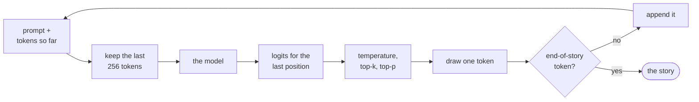

# 8. Writing: sampling

The trained model of [chapter 7](07-the-real-training-run.md) does one thing: given a text, it gives a
score to every one of the 4,096 tokens that could come next. Writing a story needs a second thing, a
rule for turning those scores into one chosen token, and a loop that appends the token and asks again.
That rule matters more than it might seem. Always taking the likeliest token makes dull, repetitive
text; drawing from all 4,096 in proportion to their probabilities lets in the rare nonsense tokens at
the bottom of the list. This chapter builds the loop and three dials that steer between the two, the
`write` command that uses them, and the tests that prove each dial does exactly what it claims.

**Code:** [`hello_tokens/generation/sampling.py`](../../hello_tokens/generation/sampling.py) ·
[`hello_tokens/__main__.py`](../../hello_tokens/__main__.py)
**Tests:** [`tests/generation/test_sampling.py`](../../tests/generation/test_sampling.py)

## Words

- **Logits**, **softmax**: see [chapter 6](06-the-learning-loop.md#words). **Context**: see
  [chapter 4](04-embeddings-and-attention.md#words). **Checkpoint**: see
  [chapter 7](07-the-real-training-run.md#words).
- **Prompt**: the text the model is asked to continue.
- **Generation** (also **decoding**): producing text one token at a time, each new token appended to
  the input before the next is chosen. A model that writes this way, each output becoming part of the
  next input, is called **autoregressive**.
- **Probability distribution**: a list of probabilities, one per possible outcome, that sum to one.
  Softmax turns the model's 4,096 logits into one.
- **Sampling**: choosing an outcome at random, with each outcome's chance equal to its probability.
- **Greedy decoding**: always choosing the single likeliest token, with no randomness.
- **Temperature**: a number the logits are divided by before softmax. Below 1 it sharpens the
  distribution towards the likeliest tokens; above 1 it flattens it.
- **Top-k**: keep only the *k* likeliest tokens and sample among them.
- **Top-p** (also **nucleus sampling**): keep the smallest set of likeliest tokens whose probabilities
  add up to at least *p*, and sample among them.
- **Seed**: the starting value of a random number generator. The same seed gives the same sequence of
  "random" draws, so a sampled story can be reproduced exactly.

## The idea

The model reads a text and returns logits at every position, but writing needs only the last row: the
scores for what comes after everything so far. Softmax turns that row into a probability for each of
the 4,096 tokens, and one token is chosen. It is appended to the text, the longer text is read again,
and the loop repeats until the model produces the end-of-story token of
[chapter 3](03-real-text-and-token-files.md) or a length limit is reached.



The interesting step is the choice. Two simple rules both fail.

**Greedy decoding** takes the likeliest token every time. It is deterministic, which is useful for
tests and measurements, but a likely next token after a likely next token tends to lead into loops:
the same safe phrase, over and over. Real text is not made of the likeliest word at every step.

**Pure sampling** draws from the whole distribution. It gives variety, but every one of the 4,096
tokens keeps some small probability, and thousands of small probabilities add up. Over a story of a
few hundred tokens, some of those draws land in the long tail of unlikely tokens, and one bad word
can derail every sentence after it, because the model then continues from its own mistake.

The three dials sit between these extremes. **Temperature** reshapes the whole distribution, making it
sharper or flatter. **Top-k** and **top-p** cut off the tail, setting the unlikely tokens' probability
to exactly zero, and share the remaining probability among the tokens that are left.

## The shapes

| Tensor | Shape | What it is |
|---|---|---|
| `window` | 1 × *T*, *T* ≤ 256 | the last 256 tokens at most, as a batch of one |
| `model(window)` | 1 × *T* × 4,096 | logits at every position |
| `model(window)[0, -1]` | 4,096 | logits for the next token only |
| filtered probabilities | 4,096 | after the dials; zeros where tokens were cut |
| the choice | a single integer | one token id |

## The code

### The dials

Every test of the dials uses the same four-token example, which is easy to check by hand: tokens 0
to 3 with probabilities 0.5, 0.3, 0.15 and 0.05, written as logits. Softmax raises *e* to each score
and divides by the total, so scores equal to the logarithms of the probabilities give back exactly
those probabilities.

<!-- from: tests/generation/test_sampling.py -->
```python
# Probabilities 0.5, 0.3, 0.15, 0.05 for tokens 0..3, written as scores (log-probabilities).
LOGITS = torch.tensor([math.log(p) for p in (0.5, 0.3, 0.15, 0.05)])
TINY = ModelConfig(vocab_size=32, context=8, width=16, layers=1, heads=2)
```

The function that applies the dials returns the distribution a token is actually drawn from:

<!-- from: hello_tokens/generation/sampling.py -->
```python
def filtered_probabilities(
    logits: torch.Tensor,
    temperature: float = 1.0,
    top_k: int | None = None,
    top_p: float | None = None,
) -> torch.Tensor:
    """The distribution a token is actually drawn from, after the three dials.

    Speculative decoding compares two models' distributions, so it needs exactly this one, not the
    raw softmax. Temperature 0 puts all the probability on the top token.
    """
    if temperature == 0:
        return torch.nn.functional.one_hot(torch.argmax(logits), logits.numel()).float()
    logits = logits.float() / temperature
```

**Temperature 0** is a special case, because dividing by zero is not possible. It means greedy
decoding: `torch.argmax` finds the position of the largest score, and `one_hot` builds a distribution
with 1 at that position and 0 everywhere else.

**Any other temperature** divides every score by it. `logits.float()` first makes sure the arithmetic
is in 32 bits whatever precision the model ran in. On the example:

<!-- illustration -->
```python
for t in (0.5, 1.0, 2.0):
    print(t, torch.softmax(LOGITS / t, dim=-1).round(decimals=3))
# 0.5 tensor([0.6850, 0.2470, 0.0620, 0.0070])
# 1.0 tensor([0.5000, 0.3000, 0.1500, 0.0500])
# 2.0 tensor([0.3790, 0.2940, 0.2080, 0.1200])
```

Dividing by 0.5 doubles every gap between scores, and softmax turns larger gaps into a sharper
distribution: the top token rises from 0.5 to 0.685 and the last falls from 0.05 to 0.007. Dividing
by 2 halves the gaps and flattens it. Temperature 1 leaves the model's own distribution unchanged. The
order of the tokens never changes; only how strongly the likeliest are preferred.

> **Later:** the docstring's mention of speculative decoding refers to Part II, which compares two
> models' filtered distributions and is the reason this function returns the distribution rather than
> the chosen token.

<!-- from: hello_tokens/generation/sampling.py -->
```python
    if top_k is not None:
        kth_best = torch.topk(logits, min(top_k, logits.numel())).values[-1]
        logits = logits.masked_fill(logits < kth_best, float("-inf"))
```

**Top-k.** `torch.topk(logits, k)` returns the *k* largest scores in descending order, so `.values[-1]`
is the *k*-th best. Every score below it is set to minus infinity, which softmax turns into a
probability of exactly zero, as the causal mask did in chapter 4. `min(top_k, logits.numel())` guards
against asking for more tokens than there are.

Top-k keeps a fixed number of tokens whatever the distribution looks like. When the model is almost
certain, *k* = 40 still lets 39 unlikely tokens compete; when it is genuinely unsure among a hundred
good continuations, *k* = 40 cuts off sixty of them. Top-p is designed to fix this.

<!-- from: hello_tokens/generation/sampling.py -->
```python
    if top_p is not None:
        sorted_logits, order = torch.sort(logits, descending=True)
        cumulative = torch.cumsum(torch.softmax(sorted_logits, dim=-1), dim=-1)
        # Drop a token if the tokens ranked above it already reach p. The top token always stays.
        drop = cumulative - torch.softmax(sorted_logits, dim=-1) >= top_p
        logits = logits.masked_fill(drop.scatter(0, order, drop), float("-inf"))
    return torch.softmax(logits, dim=-1)
```

**Top-p.** The scores are sorted from best to worst, keeping `order`, the original position of each.
`torch.cumsum` gives the running total of the sorted probabilities. Subtracting each token's own
probability gives the total of the tokens ranked *above* it; if that already reaches *p*, the token is
not needed and is dropped. On the example with *p* = 0.75:

| Rank | Probability | Running total | Total above it | Dropped? |
|---|---|---|---|---|
| 1 | 0.5 | 0.5 | 0 | no |
| 2 | 0.3 | 0.8 | 0.5 | no |
| 3 | 0.15 | 0.95 | 0.8 | yes |
| 4 | 0.05 | 1.0 | 0.95 | yes |

The first token alone falls short of 0.75, the first two reach it, so exactly those two survive. The
top token always has nothing above it, a total of 0, so it is never dropped, even for a tiny *p*.

`drop` is in sorted order, but the scores are in token order. `drop.scatter(0, order, drop)` writes
each sorted decision back to its token's original position, and `masked_fill` sets the dropped
tokens' scores to minus infinity. The final softmax then shares the probability among the survivors:
0.5 and 0.3 become 0.625 and 0.375.

The size of the kept set adapts to the model's confidence, which is the point:

<!-- illustration -->
```python
def scores(*probabilities):
    return torch.tensor([math.log(p) for p in probabilities])

filtered_probabilities(scores(0.97, 0.01, 0.01, 0.01), top_p=0.95)  # tensor([1., 0., 0., 0.])
filtered_probabilities(scores(0.25, 0.25, 0.25, 0.25), top_p=0.95)  # tensor([0.2500, 0.2500, 0.2500, 0.2500])
```

When the model is sure, only the one token it is sure of remains. When it is unsure, every plausible
token stays in play.

The `write` command's defaults, temperature 0.8 and top-p 0.95, apply both: a slightly sharper
distribution, with the least likely tail removed. On the example they keep three of the four tokens:

<!-- illustration -->
```python
filtered_probabilities(LOGITS, temperature=0.8, top_p=0.95).round(decimals=3)
# tensor([0.5710, 0.3020, 0.1270, 0.0000])
```

### Drawing one token

<!-- from: hello_tokens/generation/sampling.py -->
```python
def sample_next(
    logits: torch.Tensor,
    temperature: float = 1.0,
    top_k: int | None = None,
    top_p: float | None = None,
    generator: torch.Generator | None = None,
) -> int:
    """Choose one token id from a 1-D tensor of scores over the vocabulary."""
    if temperature == 0:
        return int(torch.argmax(logits))  # greedy: no randomness at all
    probabilities = filtered_probabilities(logits, temperature, top_k, top_p)
    return int(torch.multinomial(probabilities, 1, generator=generator))
```

Greedy decoding needs no distribution at all, only the position of the largest score. Otherwise the
filtered distribution is built and `torch.multinomial(probabilities, 1)` draws one index from it at
random, each index with its own probability. A token whose probability is zero can never be drawn.

`generator` is an optional `torch.Generator`, PyTorch's random number generator. Passing one created
with a fixed seed makes the draws repeatable; passing `None` uses PyTorch's global generator.
`int(...)` turns the one-element tensor into a plain Python integer. On a GPU this also waits for the
GPU to finish computing it, a detail that matters when Part II measures speed.

### The loop

Today's generation loop serves several Part II features (a KV cache, CUDA graphs, and per-token
details for the interactive playground). Its v1 path is easier to read first as a simplified sketch.
This sketch is not in the repository; with the same model, prompt and seed it writes exactly the same
tokens as the real `generate` without its Part II switches:

<!-- illustration -->
```python
@torch.no_grad()
def generate(model, ids, max_new_tokens, temperature=0.8, top_k=None, top_p=None, stop_id=None, generator=None):
    model.eval()
    context = model.config.context
    tokens = list(ids)
    new = []
    for _ in range(max_new_tokens):
        window = torch.tensor([tokens[-context:]])
        logits = model(window)[0, -1]
        next_id = sample_next(logits, temperature, top_k, top_p, generator)
        if next_id == stop_id:
            break
        tokens.append(next_id)
        new.append(next_id)
    return new
```

`@torch.no_grad()` turns off the recording that backpropagation needs, as in chapter 7's `evaluate`:
nothing is learned while writing. `tokens[-context:]` keeps at most the last 256 tokens, because the
model has no position embedding beyond position 255 (chapter 4). `model(window)[0, -1]` takes the
first (and only) sequence in the batch and its last position. If the chosen token is the stop token,
the loop ends without adding it; otherwise it is appended and the loop goes round again.

Every step reads the whole window again, all of it, to choose a single new token, although the
earlier positions' work was already done on the previous step. Removing that repetition is the first
subject of Part II.

The real code splits this loop in two. `generate_stream` produces the tokens one at a time, and
`generate` collects them. Inside `generate_stream`, the v1 path is:

<!-- from: hello_tokens/generation/sampling.py -->
```python
    model.eval()
    device = next(model.parameters()).device
    context = model.config.context
    tokens = list(ids)
...
    for _ in range(max_new_tokens):
        started = time.perf_counter()
        if kv is None:
            window = torch.tensor([tokens[-context:]], device=device)
            logits = model(window)[0, -1]  # scores for the token after the last one
...
        next_id = sample_next(logits, temperature, top_k, top_p, generator)  # int(): waits for the GPU
        seconds = time.perf_counter() - started
        if next_id == stop_id:
            return
        tokens.append(next_id)
        pending = [next_id]
        if not details:
            yield Step(next_id, seconds)
            continue
```

These are the sketch's lines with three additions. `device` is wherever the model's parameters live,
so the window is built on the GPU when the model is there. Each step is timed with
`time.perf_counter()`. And instead of collecting tokens into a list, the function **yields** each one,
wrapped in a small `Step` record of the token id and its time. A Python function containing `yield` is
a **generator function**: calling it returns an object that runs the loop lazily, one step each time
the caller asks for the next item, so a caller can show each token as soon as it exists. The line
`pending = [next_id]` serves the KV cache of Part II and is ignored when the cache is off: the next
step of the v1 path reads only `tokens[-context:]`.

<!-- from: hello_tokens/generation/sampling.py -->
```python
def generate(
    model: GPT,
    ids: list[int],
    max_new_tokens: int,
    temperature: float = 0.8,
    top_k: int | None = None,
    top_p: float | None = None,
    stop_id: int | None = None,
    seed: int | None = None,
    cache: bool = False,
    graphs: bool = False,
) -> list[int]:
    """Extend ids until stop_id or max_new_tokens. Returns only the new ids."""
    generator = None
    if seed is not None:
        device = next(model.parameters()).device
        generator = torch.Generator(device=device).manual_seed(seed)
    steps = generate_stream(model, ids, max_new_tokens, temperature, top_k, top_p, stop_id, generator,
                            cache=cache, graphs=graphs)
    return [step.id for step in steps]
```

`generate` turns a seed into a generator on the model's device, runs the stream, and collects the ids
into a list. Only the new ids are returned, not the prompt.

> **Later:** the lines cut from `generate_stream` choose between re-reading the window, a KV cache and
> a recorded CUDA graph, and the `details` branch reports the model's own probabilities for the
> playground. `cache` and `graphs` are off by default, which is the v1 path shown here; Part II adds
> each of them.

### The `write` command

<!-- from: hello_tokens/__main__.py -->
```python
    write = commands.add_parser("write", help="write a story with a trained model")
    write.add_argument("prompt", nargs="?", default="Once upon a time")
    write.add_argument("--name", default="v1", help="which run's checkpoint to use")
    write.add_argument("--max-tokens", type=int, default=300)
    write.add_argument("--temperature", type=float, default=0.8)
    write.add_argument("--top-k", type=int, default=None)
    write.add_argument("--top-p", type=float, default=0.95)
    write.add_argument("--seed", type=int, default=None)
```

The prompt is optional and defaults to "Once upon a time". `--name` chooses the checkpoint,
`checkpoints/v1.pt` by default. A story stops after 300 new tokens if the model has not ended it
first. Temperature 0.8 and top-p 0.95 are on by default and top-k is off. With no seed, every run
writes a different story.

<!-- from: hello_tokens/__main__.py -->
```python
    if args.command == "write":
        device = "cuda" if torch.cuda.is_available() else "cpu"
        tokenizer = Tokenizer.load(args.data_dir / "tokenizer.bpe")
        model = load_model(Path("checkpoints") / f"{args.name}.pt", device)
        new = generate(model, tokenizer.encode(args.prompt), args.max_tokens, args.temperature,
                       args.top_k, args.top_p, stop_id=tokenizer.end_of_text_id, seed=args.seed, cache=args.cache,
                       graphs=args.graphs)
        print(args.prompt + tokenizer.decode(new))
        return 0
```

The command loads the tokenizer of chapter 3 and the checkpoint of chapter 7 (`load_model` rebuilds
the model from the shape stored in the file), encodes the prompt into ids, and generates. The stop
token is the tokenizer's end-of-text id, so a story ends where the model decides it ends. The prompt
is printed followed by the decoded new tokens.

> **Later:** `--cache` and `--graphs`, two options not shown above, switch on Part II's KV cache and
> CUDA graphs; without them, `write` runs the loop shown in this chapter.

## What would go wrong the other way

**Greedy decoding by default.** Every run from the same prompt would write the same, often repetitive,
story.

**Sampling from the full distribution.** Thousands of unlikely tokens would together make an
occasional derailing choice likely over a long story.

**Top-k alone.** A fixed *k* is too many when the model is sure and too few when it is not.

**Feeding the whole story once it passes 256 tokens.** The model has no position embedding beyond
position 255, and the embedding refuses a longer sequence (chapter 4). Keeping the last 256 tokens lets
a story continue past the context, at the price of forgetting its beginning.

**Removing a token by setting its score to zero.** A score of zero is an ordinary score, not a
removal: *e*<sup>0</sup> = 1. Only minus infinity gives a probability of exactly zero.

**No seed.** A story the README quotes could not be reproduced, and a test could not compare two runs.

## Proving it works

Randomness is tested by drawing many times from the four-token example with a fixed seed, and
checking what comes out.

<!-- from: tests/generation/test_sampling.py -->
```python
def draws(n=2000, **dials):
    g = torch.Generator().manual_seed(0)
    return [sample_next(LOGITS, generator=g, **dials) for _ in range(n)]
```

`draws` samples 2,000 tokens with the given dials and a seeded generator, so every test is repeatable.

<!-- from: tests/generation/test_sampling.py -->
```python
def test_plain_sampling_follows_the_probabilities():
    counts = torch.bincount(torch.tensor(draws()), minlength=4) / 2000
    assert torch.allclose(counts, torch.tensor([0.5, 0.3, 0.15, 0.05]), atol=0.03)
```

`torch.bincount` counts how often each token was drawn. With no dials, the share of each token must be
within 0.03 of its probability. Over 2,000 draws, chance alone moves a share by a percentage point or
two; with the test's seed the shares come out at 0.5255, 0.2860, 0.1395 and 0.0490. A sampler that
ignored the probabilities, or applied them to the wrong tokens, would miss by far more.

<!-- from: tests/generation/test_sampling.py -->
```python
def test_top_p_keeps_the_smallest_set_reaching_p():
    # 0.5 alone is short of 0.75; 0.5 + 0.3 = 0.8 reaches it, so tokens 0 and 1 survive.
    assert set(draws(top_p=0.75)) == {0, 1}
    # Even a tiny p keeps the single best token.
    assert set(draws(n=50, top_p=0.01)) == {0}
```

This is the table above, as a test. Of 2,000 draws with *p* = 0.75, every one must be token 0 or 1,
and both must occur. The second assertion pins the edge case: the top token survives any *p*.

<!-- from: tests/generation/test_sampling.py -->
```python
def test_the_filtered_distribution_is_what_is_sampled():
    # 0.5 + 0.3 = 0.8 reaches top-p 0.75: only tokens 0 and 1 remain, renormalised to 0.625 / 0.375.
    p = filtered_probabilities(LOGITS, temperature=1.0, top_p=0.75)
    assert torch.allclose(p, torch.tensor([0.625, 0.375, 0.0, 0.0]))
    assert torch.allclose(filtered_probabilities(LOGITS, top_k=1), torch.tensor([1.0, 0, 0, 0]))
    assert torch.equal(filtered_probabilities(LOGITS, temperature=0), torch.tensor([1.0, 0, 0, 0]))
```

The distribution itself is checked exactly: top-p at 0.75 gives 0.625 and 0.375, and both top-k with
*k* = 1 and temperature 0 put everything on token 0. The rest of this test, not shown, checks the link
between the two functions: for 20 draws at temperature 0.8 and top-p 0.9, `sample_next` must pick
exactly the token that `torch.multinomial` picks from `filtered_probabilities` at the same dials, with
the same seed. It does not draw from the 0.625 / 0.375 distribution above.

The remaining tests cover the other dials and the loop. Temperature 0 always returns token 0. A
temperature of 0.3 picks token 0 more often than a temperature of 1. Top-k with *k* = 2 never picks
outside tokens 0 and 1. On a tiny random model with a context of 8, generation stops after the
requested number of tokens; it returns nothing when the stop token would be the first choice; a
20-token prompt, longer than the context, is handled; and the same seed writes the same tokens twice.

## Run it

Writing needs the trained checkpoint of chapter 7 and the tokenizer of chapter 3. The README's
samples are reproduced with commands of this form:

```
uv run python -m hello_tokens write "Lily found a shiny key." --seed 4
```

The README records the result, written by the trained model at temperature 0.8 and top-p 0.95, from
the prompt in bold:

> **Lily found a shiny key.** She put it in the lock and opened the box. Inside, she found a pretty
> flower. The flower was red and pretty. Lily was very happy. She wanted to show her mom the flower.
> But, when Lily showed the flower to her mom, something unexpected happened. The flower started to
> talk! It said, "Thank you for finding me, Lily. I am a magic flower. I will give you one wish." Lily
> was very surprised. She thought for a moment and said, "I wish for a new friend." The magic flower
> made her wish come true. Lily and the magic flower became best friends and played together every
> day.

The story ends because the model produced its own end-of-story token. The same seed writes the same
story with the same checkpoint and software; a different GPU or library version can round differently
and change a draw. The dials can be changed from the command line:

```
uv run python -m hello_tokens write "Lily found a shiny key." --temperature 0
uv run python -m hello_tokens write --top-k 40 --max-tokens 100
```

The first writes greedily, the same story on every run without a seed; the second adds top-k to the
default top-p and stops after 100 tokens at most. The tests run on the CPU:

```
uv run pytest tests/generation/test_sampling.py
```

## What we got

- **A generation loop:** one token at a time from the last position's logits, the text cropped to the
  last 256 tokens, stopping at the end-of-story token or a length limit (300 by default).
- **Three dials:** temperature (0 for greedy), top-k and top-p, each setting removed tokens' scores to
  minus infinity, then a seeded draw from what remains. The `write` command defaults to temperature 0.8
  and top-p 0.95.
- **Tests that pin the arithmetic:** 2,000 draws match the probabilities 0.5, 0.3, 0.15 and 0.05
  within 0.03, and top-p at 0.75 keeps exactly two tokens, renormalized to 0.625 and 0.375.
- **A model that writes:** the README's stories, which end because the model chose to end them.

## Check yourself

1. Why does top-p adapt better than top-k when the model is very sure of the next token?
2. A story has grown to 400 tokens. What does the model read to choose token 401, and what does it
   lose?
3. Why does the code remove a token by setting its score to minus infinity rather than its probability
   to zero after softmax?

<details>
<summary>Answers</summary>

1. Top-k always keeps *k* tokens. When one token holds nearly all the probability, the other *k* − 1
   are unlikely tokens that are still allowed to compete. Top-p keeps only as many tokens as it takes
   to reach *p*, so when one token alone exceeds *p*, only that token remains; when the model is unsure,
   the kept set grows.
2. The last 256 tokens, the most the model can read: tokens 144 to 399, counting from 0. The first 144
   tokens no longer influence the choice, so the model can lose track of, for example, a name
   introduced at the start.
3. Both remove the token, but setting scores to minus infinity before the final softmax also
   renormalizes the survivors in the same step: the softmax shares all the probability among the
   tokens that are left, so they sum to one. Zeroing probabilities afterwards would leave a total below
   one, which would then have to be divided out separately.

</details>

Next: [9. Measuring it: perplexity](09-measuring-it-perplexity.md)
