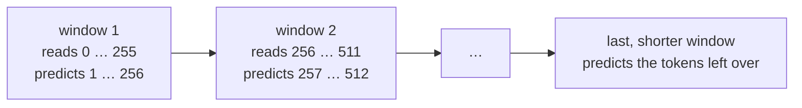

# 9. Measuring it: perplexity

[Chapter 7](07-the-real-training-run.md) watched the held-out loss fall during training, measured on
the same 50 random batches every 500 steps. That number was a sample, chosen to be cheap enough to
take often. A finished model deserves one exact figure: every token of the held-out file scored once,
none skipped and none counted twice, in full 32-bit precision. This chapter builds that measurement
and the `eval` command that runs it, and explains the number it reports, **perplexity**, which turns
an average loss into something easier to picture: how many tokens the model is, in effect, choosing
between. The result for v1 is the figure the rest of the project is measured against.

**Code:** [`hello_tokens/evaluation/perplexity.py`](../../hello_tokens/evaluation/perplexity.py) ·
[`hello_tokens/__main__.py`](../../hello_tokens/__main__.py)
**Tests:** [`tests/evaluation/test_perplexity.py`](../../tests/evaluation/test_perplexity.py)

## Words

- **Held-out data**: see [chapter 1](01-setup-and-the-data.md#words). **Loss**, **cross-entropy**,
  **ln**: see [chapter 6](06-the-learning-loop.md#words). **Evaluation**, **perplexity**: see
  [chapter 7](07-the-real-training-run.md#words); this chapter explains perplexity in full.
  **Context**: see [chapter 4](04-embeddings-and-attention.md#words).
- **Nat**: the unit of a loss computed with the natural logarithm ln. A loss of 1 nat is the surprise
  of seeing an outcome that had probability 1/*e*, about 0.37.
- **exp**: raising *e* to a power, the inverse of ln. In Python, `math.exp`.
- **Geometric mean**: the average of numbers taken by multiplying them and taking the *n*-th root,
  rather than adding them and dividing by *n*. The geometric mean of 2 and 8 is √(2 × 8) = 4.
- **Window**: a stretch of consecutive tokens read in one pass of the model, as in chapter 6.

## The idea

### From loss to perplexity

The loss of chapter 6 is the average, over many predictions, of −ln(*p*), where *p* is the probability
the model gave to the token that actually came next. It is measured in nats, and its values are hard
to picture: is 1.29 good?

**Perplexity** is *e* raised to that average loss. It undoes the logarithm, and in doing so turns the
loss back into a count. Consider a model that, at every position, spreads its probability evenly over
exactly *N* tokens, one of which is always the right one. Each prediction gives the truth probability
1/*N*, the loss is −ln(1/*N*) = ln(*N*), and the perplexity is *e*<sup>ln(*N*)</sup> = *N*. So a
perplexity of *N* reads as: **the model is, on average, as unsure as if it were choosing uniformly
among *N* tokens.**

Two ends of the scale anchor it:

- A model that knows nothing gives all 4,096 tokens equal probability. Its loss is ln(4,096) ≈ 8.32
  (chapter 6), and its perplexity is 4,096: the whole vocabulary.
- A model that is always certain and always right has a loss of 0 and a perplexity of 1: one choice.

Real models sit between. Averaging the loss and then raising *e* to it is the same as taking the
geometric mean of 1/*p* over all predictions. If one token is predicted with probability 0.5 and the
next with 0.25, the perplexity is √(2 × 4) ≈ 2.83: one choice "between two", one "between four",
combined.

This number describes an average, not a typical position. Much of a story is close to certain: after
"Once upon a", the next token is nearly always "time". A few positions, such as a new character's
name, are genuinely open. A perplexity of 3.6 combines both kinds.

### Why measure again

Chapter 7's training run already reported a held-out loss of 1.286. It had two limitations, both
reasonable for a number taken every 500 steps but not for the final figure:

- **It was a sample.** Fifty random batches of 64 windows of 256 tokens: 819,200 predictions. Random
  windows overlap, so some held-out tokens were scored twice and most not at all; the 50 batches are
  the same every time, because of chapter 7's fixed seed.
- **It ran in bf16.** The model's arithmetic was rounded to 16 bits, as in training.

The final measurement fixes both. It scores every token of the held-out file exactly once, and it
runs the model in 32-bit arithmetic, so the reported figure carries no rounding from lower precision.
If it agrees with the sample, the sample was representative, and that is then known rather than
assumed.

### Covering the file exactly once

To score every token once, the file is cut into back-to-back windows. Each window reads 256 tokens and
predicts the 256 tokens one place later, so it needs 257. The next window starts where the previous
one's inputs ended: the last token of one window is the first input of the next. Every token from
position 1 to the end is then a target exactly once. Token 0 is never a target, because nothing comes
before it.



The file's length is rarely a whole number of windows, so a few predictions are left at the end, and
they are scored as one shorter window.

## The shapes

With the default batch of 64 windows and a context of 256:

| Tensor | Shape | What it is |
|---|---|---|
| a batch of windows | 64 × 257 | 64 back-to-back stretches of 257 tokens |
| `inputs`, `targets` | 64 × 256 each | the windows without their last and without their first token |
| `logits` | 64 × 256 × 4,096 | a score for every token at every position |
| summed loss | a single number | the total of −ln(*p*) over all 16,384 predictions |
| the last window | 1 × (*r* + 1) | the *r* predictions left over, as a batch of one |

## The code

### The result

<!-- from: hello_tokens/evaluation/perplexity.py -->
```python
@dataclass(frozen=True)
class Score:
    loss: float  # average cross-entropy per token, in nats
    perplexity: float
    tokens: int  # how many next-token predictions were scored
```

A score holds three numbers: the average loss, the perplexity computed from it, and the number of
predictions behind them. The count is part of the result on purpose: it is how a test, or a reader,
can confirm that every token was scored.

### Scoring one batch of windows

<!-- from: hello_tokens/evaluation/perplexity.py -->
```python
@torch.no_grad()
def perplexity(
    model: GPT, tokens: np.ndarray, batch_size: int = 64, device: str = "cpu", precision=None,
    calibration: CalibrationBins | None = None,
) -> Score:
    """Score every next-token prediction in `tokens` once. Returns the average loss and perplexity.

    If `calibration` is given, every prediction is also added to it, in the same pass.
    """
    model.eval()
    context = model.config.context
    total_loss = 0.0
    total_tokens = 0

    def score(windows: np.ndarray) -> None:
        nonlocal total_loss, total_tokens
        windows = torch.from_numpy(windows.astype(np.int64)).to(device)
        inputs, targets = windows[:, :-1], windows[:, 1:]
        with torch.autocast(device, dtype=precision or torch.float32, enabled=precision is not None):
            logits = model(inputs)
        # Add up the losses rather than averaging per batch, in float32, so the short last window
        # carries exactly its share and rounding doesn't build up over thousands of batches.
        total_loss += F.cross_entropy(
            logits.float().reshape(-1, logits.shape[-1]), targets.reshape(-1), reduction="sum"
        ).item()
        total_tokens += targets.numel()
```

`@torch.no_grad()` and `model.eval()` play the same roles as in chapter 7's `evaluate`: nothing is
learned, so no record for backpropagation is kept. `tokens` is the memory-mapped held-out file of
chapter 3, and the function keeps two running totals: the sum of all losses, and the number of
predictions.

`score` is a function defined inside `perplexity`, so it can update the two totals; `nonlocal` tells
Python that the names refer to the enclosing function's variables rather than new local ones. Its
first three lines are chapter 6's `get_batch` without the randomness: widen the ids to 64-bit
integers, move them to the device, and split each window into inputs and the targets one place later.

The `torch.autocast` block is the same switch as in chapter 6's `train_step`. With the default
`precision=None` it is disabled, and the model runs in 32-bit arithmetic.

The important choice is in the loss. `F.cross_entropy(..., reduction="sum")` returns the **sum** of
−ln(*p*) over every prediction in the batch, not their average, and `targets.numel()` adds the number
of predictions to the count. Averaging happens once, at the very end. `logits.float()` makes sure the
loss itself is computed in 32 bits, and `.item()` adds it to a Python float, which has double
precision, so millions of additions lose nothing that matters.

> **Later:** the `calibration` parameter, and the two lines of `score` not shown here that pass each
> batch's logits to it, belong to Part II, which measures how well the model's confidence matches its
> accuracy in the same pass.

### Cutting the file into windows

<!-- from: hello_tokens/evaluation/perplexity.py -->
```python
    # Window i reads tokens[i*context : (i+1)*context] and predicts the tokens one place later.
    full_windows = (len(tokens) - 1) // context
    for first in range(0, full_windows, batch_size):
        starts = range(first * context, min(first + batch_size, full_windows) * context, context)
        score(np.stack([tokens[s : s + context + 1] for s in starts]))
    if (len(tokens) - 1) % context:  # the few predictions left at the end, as one shorter window
        score(np.asarray(tokens[full_windows * context :])[None])

    loss = total_loss / total_tokens
    return Score(loss=loss, perplexity=math.exp(loss), tokens=total_tokens)
```

A file of *n* tokens holds *n* − 1 predictions, since the first token has nothing before it.
`(len(tokens) - 1) // context` is how many full windows of 256 predictions fit.

The loop takes the full windows in groups of `batch_size`: `first` is the number of the first window in
the group, and `starts` lists the starting positions of the group's windows, 256 apart. `min(...)`
stops the last group at the final full window. Each window is the slice `tokens[s : s + context + 1]`,
257 tokens starting at `s`, so it ends exactly where the next window begins, and `np.stack` piles the
group into one batch.

If any predictions are left over, the remaining tokens, from the start of the last window position to
the end of the file, are scored as one shorter window. `[None]` adds a batch dimension of size one,
since the model expects a batch.

On a toy file of the numbers 0 to 9 with a context of 4, the same indexing gives:

<!-- illustration -->
```python
tokens = np.arange(10)
context = 4
full_windows = (len(tokens) - 1) // context     # 2
for s in range(0, full_windows * context, context):
    window = tokens[s : s + context + 1]
    print(window[:-1], "->", window[1:])
rest = tokens[full_windows * context :]
print(rest[:-1], "->", rest[1:])
# [0 1 2 3] -> [1 2 3 4]
# [4 5 6 7] -> [5 6 7 8]
# [8] -> [9]
```

The targets are 1 to 9, each exactly once: nine predictions from ten tokens. Token 4 is the last target
of the first window and the first input of the second, which is what lets the windows meet without a
gap.

Finally the total loss is divided by the total count, once, and `math.exp` turns it into the
perplexity.

### The `eval` command

<!-- from: hello_tokens/__main__.py -->
```python
    if args.command == "eval":
        device = "cuda" if torch.cuda.is_available() else "cpu"
        model = load_model(Path("checkpoints") / f"{args.name}.pt", device)
...
        started = time.perf_counter()
        # Scored in float32, not bf16, so the reported number carries no rounding from lower precision.
        bins = CalibrationBins()
        score = perplexity(model, load_tokens(args.data_dir / "tokens" / "valid.bin"), device=device,
                           calibration=bins)
...
        print(f"loss        {score.loss:.4f}")
        print(f"perplexity  {score.perplexity:.3f}")
```

The command loads the checkpoint of chapter 7, opens the held-out token file, and calls `perplexity`
without a `precision`, so the model runs in 32 bits. In lines not shown here it prints the number of
tokens scored and the time taken; the two lines shown print the loss to four decimal places and the
perplexity to three.

> **Later:** `bins = CalibrationBins()` and `calibration=bins` belong to Part II: the same pass also
> collects every prediction for the calibration measurements (top-1 accuracy, the expected
> calibration error and a reliability diagram) that `eval` prints after the perplexity. The lines cut
> from this excerpt add another Part II option, `--quantize`, which stores the model's weights in 8 or
> 4 bits before scoring.

## What would go wrong the other way

**Averaging each batch, then averaging the averages.** The final, shorter window would count as much as
a whole batch of 16,384 predictions, and its few tokens would move the result far more than their
share. Summing every prediction's loss and dividing once gives each token equal weight. The batch-size
test below is what catches this mistake.

**Windows that overlap more, or not at all.** Starting each window one token later than the last would
score most tokens 256 times; starting each window 257 tokens later would never score the tokens at the
seams. Only back-to-back windows sharing one token score each target exactly once.

**Random windows, as in training.** Drawing windows at random scores some tokens twice and others not
at all. That is acceptable for a quick check every 500 steps and not for the final figure.

**Scoring in bf16.** The reported figure would include rounding error from 16-bit arithmetic, and a
comparison with a model that was later made smaller or faster could not separate the change from the
rounding.

**Comparing perplexity across tokenizers.** Perplexity is per token, and what a token is depends on
the tokenizer, as chapter 7 noted for the loss. A perplexity of 3.62 here and 12 in a project with a
different vocabulary say nothing about which model is better.

## Proving it works

<!-- from: tests/evaluation/test_perplexity.py -->
```python
def test_every_token_after_the_first_is_scored_exactly_once(model):
    # 1,000 tokens: 62 full windows of 16 predictions, then a short window of 7.
    assert perplexity(model, random_tokens(1000)).tokens == 999
```

The tests use a tiny model with a context of 16. A file of 1,000 random tokens holds 999 predictions:
62 full windows of 16 make 992, and a short window holds the last 7. Any off-by-one error in the
window arithmetic would change the count.

<!-- from: tests/evaluation/test_perplexity.py -->
```python
def test_a_model_that_knows_nothing_scores_the_vocabulary_size(model):
    # All weights zero: every logit is 0, so every token gets probability 1/64.
    for p in model.parameters():
        p.data.zero_()
    score = perplexity(model, random_tokens(500))
    assert score.loss == pytest.approx(math.log(TINY.vocab_size))
    assert score.perplexity == pytest.approx(TINY.vocab_size)
```

This is the know-nothing end of the scale, made exact. With every weight zero, every logit is zero
whatever the input, softmax gives each of the 64 tokens probability 1/64, and the perplexity must be
exactly 64. `p.data.zero_()` overwrites a parameter in place without recording it for backpropagation.
The expected answer follows from the definition alone, with no other implementation to trust.

<!-- from: tests/evaluation/test_perplexity.py -->
```python
def test_the_batch_size_does_not_change_the_answer(model):
    tokens = random_tokens(1000)
    one = perplexity(model, tokens, batch_size=1)
    many = perplexity(model, tokens, batch_size=7)
    assert one.tokens == many.tokens
    assert one.loss == pytest.approx(many.loss, rel=1e-5)
```

How the windows are grouped into batches must not matter. With batches of 1 and of 7, the groups and
the final batch differ in size, so averaging per batch would give two different answers; summing gives
the same answer up to rounding.

The fourth test scores a 40-token file by hand: it runs the model on the three windows starting at 0,
16 and 32 separately, collects every prediction's loss, and takes their plain mean. `perplexity` must
match it. Together the four tests fix the count, the arithmetic of the average, the independence from
batching, and agreement with the most direct computation possible.

## Run it

```
uv run python -m hello_tokens eval
```

The command needs the trained checkpoint of chapter 7 and the held-out token file of chapter 3. It
also prints Part II's calibration measurements, which later chapters explain. The tests run on the
CPU:

```
uv run pytest tests/evaluation/test_perplexity.py
```

The function can be tried in a Python session started with `uv run python`, with the test file's tiny
model, before and after the know-nothing treatment:

<!-- illustration -->
```python
import numpy as np
import torch

from hello_tokens.evaluation.perplexity import perplexity
from hello_tokens.model.config import ModelConfig
from hello_tokens.model.gpt import GPT

TINY = ModelConfig(vocab_size=64, context=16, width=32, layers=2, heads=4)
torch.manual_seed(0)
model = GPT(TINY)
tokens = np.random.default_rng(0).integers(0, TINY.vocab_size, 1000).astype(np.uint16)
print(perplexity(model, tokens))
for p in model.parameters():
    p.data.zero_()
print(perplexity(model, tokens))
# Score(loss=4.167393945000909, perplexity=64.54701964737342, tokens=999)
# Score(loss=4.158882389316807, perplexity=63.99995558127209, tokens=999)
```

The untrained model is, as chapter 5 showed, almost exactly a uniform guess, here slightly worse
than one; with its weights zeroed it is a uniform guess, and scores the vocabulary size.

## What we got

- **Every held-out token, scored once.** The held-out file holds 5,683,948 tokens, so 5,683,947
  predictions: 22,202 full windows of 256, then a last window of 235.
- **The v1 result, in 32-bit arithmetic:** a loss of **1.2866** nats per token and a perplexity of
  **3.62**. Out of 4,096 possible next tokens, the model is on average as unsure as if it were
  choosing among three or four.
- **The sample was representative.** Training's estimate from 50 fixed batches in bf16 was 1.286; the
  exact figure over the whole file agrees with it.
- **Tests that pin the method:** an exact count of predictions, a know-nothing model scoring exactly the
  vocabulary size, independence from the batch size, and agreement with scoring each window by hand.
- **The baseline for Part II.** The benchmark record for the plain v1 model in 32 bits stores the same
  figure, a perplexity of 3.620. Every change in Part II, a new architecture, lower precision or
  smaller weights, is judged against it.

## Check yourself

1. A model reports a perplexity of 64 on a vocabulary of 64 tokens. What does that say about it?
2. Why does `perplexity` add up the losses and divide once at the end, instead of averaging the loss
   of each batch?
3. Another project reports a perplexity of 12 on a similar set of stories. Can we conclude that this
   project's model, at 3.62, is better? What would need to be the same first?

<details>
<summary>Answers</summary>

1. That it has learned nothing useful: it is as unsure as a uniform guess over the whole vocabulary,
   which is exactly what the all-zero model in the tests is. An untrained model scores about there too.
2. So that every prediction counts equally. Batches differ in size (the last window is shorter, and the
   last group of windows may be smaller), and an average of batch averages would give the predictions
   in small batches more weight. The batch-size test checks this: batches of 1 and of 7 must give the
   same answer.
3. No. Perplexity is per token, and a token depends on the tokenizer. A tokenizer with a larger
   vocabulary packs more text into each token, so each prediction is harder and its perplexity is
   higher for the same quality of model. The comparison needs the same tokenizer, and the same held-out
   text, before the two numbers mean anything relative to each other.

</details>

Next: Part II, 10. Profiling one step
