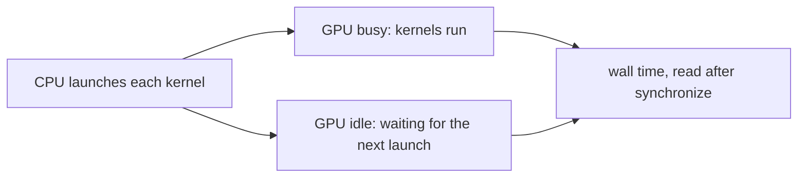

# 10. Profiling one step

[Chapter 9](09-measuring-it-perplexity.md) measured quality: how unsure the trained model is on text it
never trained on. Speed is a different question, and it has to be asked before anything is changed to
make generation faster. A change that removes arithmetic helps only if arithmetic is what the machine
is waiting on. This chapter times one generation step — a forward pass and the choice of the next
token — at several lengths, separates the time the GPU spends working from the time it spends waiting,
and records what that profile predicts. It also stops the operating system's power policy from being
measured in place of the code.

**Code:** [`hello_tokens/generation/profile_step.py`](../../hello_tokens/generation/profile_step.py) ·
[`hello_tokens/generation/power.py`](../../hello_tokens/generation/power.py) ·
[`hello_tokens/__main__.py`](../../hello_tokens/__main__.py)
**Tests:** [`tests/generation/test_profile_step.py`](../../tests/generation/test_profile_step.py) ·
[`tests/generation/test_power.py`](../../tests/generation/test_power.py)

## Words

- **Generation**, **temperature**, **top-p**: see [chapter 8](08-writing-sampling.md#words).
  **GPU**, **CUDA**, **bf16**: see [chapter 1](01-setup-and-the-data.md#words). **Context**: see
  [chapter 4](04-embeddings-and-attention.md#words). **Float32** is the 32-bit arithmetic
  [chapter 9](09-measuring-it-perplexity.md) scores in.
- **Kernel**: a small GPU program for one piece of work, such as a matrix product. PyTorch sends
  kernels; it does not do that arithmetic in Python. A **launch** is the CPU preparing a kernel and
  handing it over. The GPU can run one kernel while the CPU prepares the next.
- **Wall time**: start to finish, what a caller waits. **Synchronize**: wait until the GPU has
  finished the kernels it was already given, so the clock is not read early.
- **GPU busy time**: how long kernels actually ran, added up by a **profiler** (a recorder that times
  each kernel). It overlaps wall time, because the CPU and the GPU work in the same interval.
- **Median**: the middle value of a sorted list. **Interquartile range**: the width of the middle
  half, which the profile prints as the spread. **Warm-up**: runs before the clock starts, so
  one-time setup is not counted.
- **KV cache**, **fused attention**, **CUDA graph**, **speculative decoding**: later changes to a
  step, named again where the profile's prediction uses them.

## The idea

### Two clocks that overlap

Python, on the CPU, sends a kernel and continues without waiting. **Wall time** is the wait a caller
sees. **GPU busy time** is how long kernels occupied the GPU. They overlap, so they do not add. The
gap is time the GPU sat idle, waiting for the next launch. If that idle share is most of the step,
faster arithmetic inside each kernel cannot make the step much faster.

Length makes the same point. A step that reads 256 tokens does more arithmetic than one that reads
16. If the two take the same wall time, the extra arithmetic is not what the wait is made of.

### One step, four lengths, a median

A step is what writing does per new token ([chapter 8](08-writing-sampling.md)): the model scores
every vocabulary entry at the last position, then one token is chosen. The profile uses temperature
0.8 and top-p 0.95, the defaults of the `write` command, so sampling is included. It times that step
at contexts 16, 64, 128 and 256, on random tokens. At a fixed length the work does not depend on
which ids they are.



The first rounds are slower for reasons that will not recur: memory is reserved, and the GPU picks
an implementation for each kernel. Twenty such **warm-up** rounds are discarded. The timed rounds
then interleave the four lengths — 16, 64, 128, 256, then 16 again — for 200 rounds. A slow patch
on the machine then hits every length, instead of landing on one of them. Each length is reported as
a **median**. One slow round pulls a mean up and barely moves the middle value. The interquartile
range sits beside the median, so a noisy run is visible.

GPU busy time comes from a separate run of 20 steps. The profiler slows the CPU, and the CPU is the
side that launches kernels, so timing while the profiler is attached would measure the profiler. The
two numbers are taken apart, and they are not expected to add.

### Three ways to run the step

**`full`**, the default, re-reads a window of `context` tokens. **`cache`** feeds one new token into
a KV cache, which keeps keys and values already computed, then rolls that cache back so every timed
step is at the same position. **`graphs`** replays that one-token step from a recorded CUDA graph,
which is the launches of a step saved once; on a CPU the same
fixed-shape step runs as ordinary code. This chapter's numbers are the full-window profile. The
other two modes are how the same command times those later techniques.

When a graph is replayed, the profiler may list the kernels one by one or not at all. In `graphs`
mode the wall time is the measurement, and the kernel count is only what that backend reported.

### The operating system can be what gets measured

The first timings were about three times slower than the generation baseline, and noisy. Generation
ran at 6 ms per token for about a second, then settled at 17–18 ms. Windows applies power throttling
(EcoQoS) to a process it judges to be background work: after about a second of steady running it
lowers that process's CPU speed. A step that waits on the CPU to launch kernels shows that policy as
if it were the model's speed.

A process may ask not to be throttled, through `SetProcessInformation`. The request covers this
process only, and only until it exits. Every command asks at startup. With the request accepted,
generation held a steady **6.0 ms per token (166 tokens/s)**. An earlier 152 tokens/s came from short
runs, partly caught before the throttle started. Those figures are what that investigation measured.
The published speeds, taken with the same opt-out and combined across runs, are the next chapter's.

## The shapes

For one context length `c`, on v1 (vocabulary 4,096):

| Tensor or list | Shape | What it is |
|---|---|---|
| `windows[c]` | 1 × `c` | one random sequence of `c` token ids |
| the scores that are sampled | 4,096 | the model's output at the last position |
| `times[c]` | 200 numbers | one wall time, in seconds, per timed round |
| the profiled run | 20 steps | used only for GPU busy time and the kernel count |

In `cache` and `graphs` mode the timed forward pass reads a tensor of shape 1 × 1, the last token.
The scores sampled are still one row of 4,096.

## The code

### What a profile records

<!-- from: hello_tokens/generation/profile_step.py -->
```python
@dataclass(frozen=True)
class StepProfile:
    context: int  # tokens read by the step
    wall_ms: float  # median wall time of one step
    spread_ms: float  # interquartile range of the wall time: how noisy the measurement was
    gpu_busy_ms: float  # kernel time per step (0 on the CPU)
    kernels: float  # GPU kernels launched per step (0 on the CPU)

    @property
    def gpu_idle_fraction(self) -> float:
        return max(0.0, 1 - self.gpu_busy_ms / self.wall_ms)
```

One result per length. Wall time and spread come from the timed rounds; on a CPU the GPU fields stay
zero. The idle fraction is one minus busy over wall. `max` with zero stops it going negative if the
profiler reports slightly more busy time than the wall clock saw. On a CPU, busy time is zero, so
the fraction would be 1 for that reason alone, and the CPU test checks the zeros instead.

### The windows, and the full step

<!-- from: hello_tokens/generation/profile_step.py -->
```python
    generator = torch.Generator(device=device).manual_seed(seed)
    windows = {c: torch.randint(0, model.config.vocab_size, (1, c), device=device, generator=generator)
               for c in contexts}

    def sample(logits: torch.Tensor) -> None:
        sample_next(logits, temperature=0.8, top_p=0.95, generator=generator)

    def prepare(c: int) -> None:
        """Untimed set-up before a step at context `c`; only "graphs" needs any."""

    if mode == "full":
        def step(c: int) -> None:
            sample(model(windows[c])[0, -1])
```

The windows are built once, before timing, from a generator seeded with `seed` (0 by default), and
every round reuses them. `sample` is chapter 8's `sample_next` at the `write` defaults. In `full`
mode, `step` runs the model on the whole window and samples the last row: batch index `0`, position
`-1`. `prepare` does nothing in this mode. Graph mode fills that hook, so one timing loop serves
every mode.

### The clock starts only when the GPU is idle

<!-- from: hello_tokens/generation/profile_step.py -->
```python
    def sync() -> None:
        if on_gpu:
            torch.cuda.synchronize()

    for _ in range(warmup):
        for c in windows:
            prepare(c)
            step(c)
    sync()

    # Interleave the contexts round by round, so a slow patch (a background task, the CPU changing
    # speed) hits all of them alike instead of skewing one.
    times: dict[int, list[float]] = {c: [] for c in contexts}
    for _ in range(rounds):
        for c in windows:
            prepare(c)
            sync()  # set-up work must finish before the clock starts
            started = time.perf_counter()
            step(c)
            sync()
            times[c].append(time.perf_counter() - started)
```

`sync` waits for queued kernels on a GPU and does nothing on a CPU. `time.perf_counter` is a clock in
seconds; the difference times 1,000 is milliseconds.

`prepare` is not timed. The synchronize after it drains that work, so the clock starts with the GPU
idle; the synchronize after `step` waits for the step itself. Reading the clock any earlier would
time the sending, not the wait. The warm-up calls the same pair and discards its times. `times` keeps
a list per context because each round appends one sample to every list.

### Busy time, from a separate pass

<!-- from: hello_tokens/generation/profile_step.py -->
```python
    results = []
    for c in windows:
        busy_ms, kernels = 0.0, 0.0
        if on_gpu:
            prepare(c)
            sync()
            with profile(activities=[ProfilerActivity.CPU, ProfilerActivity.CUDA]) as prof:
                for _ in range(profiled):
                    step(c)
                sync()
            gpu_events = [e for e in prof.events() if e.device_type == DeviceType.CUDA]
            busy_ms = sum(e.device_time for e in gpu_events) / profiled / 1000  # microseconds -> ms
            kernels = len(gpu_events) / profiled
        quartiles = statistics.quantiles(times[c], n=4)
        results.append(StepProfile(c, statistics.median(times[c]) * 1000,
                                   (quartiles[2] - quartiles[0]) * 1000, busy_ms, kernels))
```

On a GPU, each context is run for `profiled` steps (20 by default) inside a profiler recording CPU
and CUDA activity. Events with device type CUDA are the kernels. `device_time` is in microseconds,
so the sum divided by the step count and by 1,000 is milliseconds per step; the event count divided
the same way is kernels per step, because one recording holds every step.

`statistics.quantiles(times, n=4)` returns the three cuts between the quarters. The spread is
`quartiles[2] - quartiles[0]`, and the reported wall time is the median of the same list, in
milliseconds.

<!-- illustration -->
```python
import statistics

samples = [5.8, 6.0, 6.1, 6.2, 6.3, 6.4, 6.5, 9.0]
quartiles = statistics.quantiles(samples, n=4)
print(quartiles)
print(round(quartiles[2] - quartiles[0], 2))
# [6.025, 6.25, 6.475]
# 0.45
```

The slow sample, 9.0, sits in the top quarter and does not widen the middle half. A mean would have
let it in:

<!-- illustration -->
```python
import statistics

samples = [6.0, 6.1, 6.2, 6.0, 40.0]
print(statistics.mean(samples))
print(statistics.median(samples))
# 12.86
# 6.1
```

One round at 40 pulls the mean to 12.86 and leaves the median at 6.1. These lists illustrate the
arithmetic. They are not runs of the model.

### The same clock around a one-token step

> **Later:** the chapters on the KV cache and on CUDA graphs build the other two modes. The timing
> loop does not change. `step` does, and, for graphs, `prepare`.

<!-- from: hello_tokens/generation/profile_step.py -->
```python
        def step(c: int) -> None:
            logits = model(windows[c][:, -1:], caches[c])[0, -1]
            caches[c].rollback(c - 1)
            sample(logits)
```

The caches are filled once, before the warm-up, with every token but the last. The timed pass reads
only that last id. `rollback(c - 1)` restores the length, so the next round repeats the same position
instead of walking forward until the cache overflows. Sampling stays inside the timed region.

<!-- from: hello_tokens/generation/profile_step.py -->
```python
        def step(c: int) -> None:
            logits = recorded(last_tokens[c])
            recorded.cache.rollback(c - 1)
            sample(logits)
```

This calls a step recorded once, then rolls that recording's cache back the same way. `prepare`
refills the cache when the context changes, so one recording serves every length. Each window's last
token was saved as a plain integer before the clock started.

### Asking not to be throttled

<!-- from: hello_tokens/generation/power.py -->
```python
_PROCESS_POWER_THROTTLING = 4  # PROCESS_INFORMATION_CLASS: ProcessPowerThrottling
_EXECUTION_SPEED = 1  # PROCESS_POWER_THROTTLING_EXECUTION_SPEED
```

The first number selects Windows's power-throttling setting, and the second names execution speed.
The request goes to `kernel32` through `ctypes`, Python's way of calling a system library:

<!-- from: hello_tokens/generation/power.py -->
```python
def opt_out_of_power_throttling() -> bool:
    """Ask Windows not to slow this process down. Returns True if the request was accepted."""
    if sys.platform != "win32":
        return False  # other systems don't have this policy
...
    # Control the execution-speed setting (control_mask) and set it to off (state_mask 0).
    state = _ThrottlingState(1, _EXECUTION_SPEED, 0)
    return bool(kernel32.SetProcessInformation(
        kernel32.GetCurrentProcess(), _PROCESS_POWER_THROTTLING, ctypes.byref(state), ctypes.sizeof(state)))
```

Anywhere but Windows it returns `False` without calling a library that is not there. On Windows the
structure carries version 1, the execution-speed bit, and a state of 0 (throttling off).
`GetCurrentProcess` names this process only, and the call's success is the returned Boolean.

<!-- from: hello_tokens/__main__.py -->
```python
    args = parser.parse_args(argv)
    # Without this, Windows slows a long-running process about 3x after a second (see power.py).
    opt_out_of_power_throttling()
```

It runs before any command. The return value is ignored: a refusal leaves nothing further to do.

### The `profile` command

<!-- from: hello_tokens/__main__.py -->
```python
    if args.command == "profile":
        device = "cuda" if torch.cuda.is_available() else "cpu"
        model = load_model(Path("checkpoints") / f"{args.name}.pt", device).to(getattr(torch, args.dtype))
        print(f"{args.name}, {args.dtype}, {device}, mode {args.mode}: one generation step (forward pass + sampling)")
        print(" context   wall ms  (spread)   GPU busy ms   kernels   GPU idle")
        for r in profile_steps(model, contexts=[16, 64, 128, 256], mode=args.mode):
            print(f"{r.context:>8}  {r.wall_ms:8.2f}  ({r.spread_ms:5.2f})  {r.gpu_busy_ms:12.2f}"
                  f"  {r.kernels:8.0f}  {r.gpu_idle_fraction:8.0%}")
        return 0
```

It loads a checkpoint (`v1` by default), uses the GPU when there is one, and casts to float32 or
bf16. Lengths are fixed at 16, 64, 128 and 256, and the rounds stay at 20 of warm-up, 200 timed and
20 profiled. `--mode` selects `full`, `cache` or `graphs`. Each printed line is one `StepProfile`.

## What would go wrong the other way

**Reading the clock without synchronizing.** The read would stop when the kernels were sent, not when
they finished. A faster kernel and a slower one would look the same.

**Timing each length in one block.** A busy stretch during the 256-token rounds would make that
length look slower. Interleaving shares the disturbance. The median then limits how far one bad
round can move the result: the illustration above goes from a mean of 12.86 to a median of 6.1.

**Leaving the profiler on during the timed rounds.** Wall time would include the profiler's cost, on
the CPU, which is the side this step waits for.

**Trusting the kernel count in `graphs` mode.** A replayed graph may show its kernels individually or
not at all. A count of zero would not mean the GPU did nothing.

**Skipping the opt-out.** The number would time Windows slowing a long-running process. The
investigation found about 6 ms per token, then 17–18 ms, with no change in the model. Later
comparisons would have mixed the code with that policy.

**Adding busy time to wall time.** The two overlap. The idle fraction is the gap between them, not a
third piece to append.

## Proving it works

<!-- from: tests/generation/test_profile_step.py -->
```python
def test_every_context_gets_a_sane_profile_on_the_cpu():
    results = profile_steps(GPT(TINY), contexts=[4, 16], rounds=10, warmup=2)
    assert [r.context for r in results] == [4, 16]
    for r in results:
        assert r.wall_ms > 0 and r.spread_ms >= 0
        assert r.gpu_busy_ms == 0 and r.kernels == 0  # no GPU, nothing to count
```

`TINY` is the same design at vocabulary 64, context 16, width 32, 2 layers and 4 heads. Both lengths
come back in order, with a positive wall time, a non-negative spread, and GPU fields of exactly zero.

<!-- from: tests/generation/test_profile_step.py -->
```python
def test_the_gpu_is_profiled_when_there_is_one():
    if not torch.cuda.is_available():
        pytest.skip("no CUDA GPU on this machine")
    (r,) = profile_steps(GPT(TINY).to("cuda"), contexts=[16], rounds=10, warmup=2, profiled=5)
    assert r.kernels > 0
    assert 0 < r.gpu_busy_ms < r.wall_ms * 1.5  # profiling adds a little; it can't be wildly more
    assert 0 <= r.gpu_idle_fraction < 1
```

With a GPU the kernel count is positive, and busy time is positive but under 1.5 times the wall time:
the profiler adds cost, so busy time may slightly exceed the wall time, not by a wild factor. The
idle fraction is then in `[0, 1)`. Without CUDA the test is skipped, not failed.

The same sanity checks cover `full`, `cache` and `graphs` on the CPU. A context of 1 is refused in
the one-token modes, because the cache would have nothing in it, and an unknown mode name is refused
too.

<!-- from: tests/generation/test_profile_step.py -->
```python
@pytest.mark.parametrize("mode", ["cache", "graphs"])
@pytest.mark.parametrize("contexts", [[9], [3, 16]])
def test_every_step_runs_at_the_same_position(monkeypatch, mode, contexts):
    # Without the rollback after each step the position would move on, so the logits would change (and
    # the cache would soon overflow). Two interleaved contexts also exercise the refill between them.
    torch.manual_seed(0)
    seen = recorded_logits(monkeypatch, mode, contexts)
    n = len(contexts)
    assert len(seen) == n * (2 + 5)  # warm-up and timed rounds, one step per context in each
```

Sampling is replaced by a recorder. Two warm-up rounds and five timed rounds fix the count at
`n * (2 + 5)`, and every later step at a context must match the first within `1e-6`. Without the
rollback the logits would move. A further test, under one seed, requires `full` and a one-token mode
to agree within `1e-5` at contexts 3 and 16: the one-token step computes the same scores.

<!-- from: tests/generation/test_power.py -->
```python
def test_the_opt_out_is_accepted_on_windows_and_skipped_elsewhere():
    assert opt_out_of_power_throttling() is (sys.platform == "win32")
```

On Windows the request must be accepted; elsewhere the function returns `False`. The tests pin
lengths, the CPU zeros, bad modes, and the one-token modes matching the full step. The millisecond
figures below are a measurement of a trained checkpoint, not a unit test.

## Run it

With the checkpoint of [chapter 7](07-the-real-training-run.md):

```
uv run python -m hello_tokens profile
uv run python -m hello_tokens profile --dtype bfloat16
```

The first line names the checkpoint, the dtype, the device and the mode. One line per context then
prints wall time, spread, GPU busy time, kernel count and idle fraction. `--mode cache` and
`--mode graphs` time the other two ways. The tests need neither the checkpoint nor a GPU:

```
uv run pytest tests/generation/test_profile_step.py tests/generation/test_power.py
```

On the tiny CPU model the GPU fields are zero:

<!-- illustration -->
```python
import torch

from hello_tokens.generation.profile_step import profile_steps
from hello_tokens.model.config import ModelConfig
from hello_tokens.model.gpt import GPT

TINY = ModelConfig(vocab_size=64, context=16, width=32, layers=2, heads=4)
torch.manual_seed(0)
results = profile_steps(GPT(TINY), contexts=[4, 16], rounds=10, warmup=2)
print([(r.context, r.gpu_busy_ms, r.kernels) for r in results])
# [(4, 0.0, 0.0), (16, 0.0, 0.0)]
```

## What we got

The profile of the full step, with power throttling off, is the reading this chapter exists to
produce. Wall time is the same in float32 and in bf16.

| context | wall (ms) | GPU busy, float32 (ms) | GPU busy, bf16 (ms) | kernels |
|---|---|---|---|---|
| 16 | 6.3 | 0.83 | 0.51 | ~200 |
| 64 | 6.3 | 1.11 | 0.58 | ~200 |
| 128 | 6.4 | 1.58 | 0.72 | ~200 |
| 256 | 6.3 | 2.52 | 1.15 | ~200 |

- **Wall time stays put while the length grows.** 6.3 ms at contexts 16, 64 and 256, and 6.4 ms at
  128, in both float32 and bf16. Sixteen times as many tokens do not take sixteen times as long.
- **The GPU is idle for 60–92% of that wait.** Float32 busy time runs from 0.83 ms to 2.52 ms, and
  bf16 from 0.51 ms to 1.15 ms. Those idle ends are one minus 2.52 / 6.3 and one minus 0.51 / 6.3.
  Busy time itself grows about threefold (2.52 / 0.83), not sixteenfold.
- **The launches account for the wall time.** About 200 kernels at roughly 30 µs each is
  200 × 30 µs = 6 ms. bf16 cuts busy time (0.51 ms against 0.83 ms at context 16) and leaves the
  6.3 ms wait: cheaper arithmetic, on a device that was already waiting.
- **What throttling measured, before this table.** Generation ran at 6 ms per token for about a
  second, then at 17–18 ms. With the opt-out it held 6.0 ms per token, 166 tokens/s. The earlier
  152 tokens/s came from short runs, partly before the throttle started.
- **The expectation, not a result.** A KV cache keeps keys and values already computed, and lower
  precision makes each kernel cheaper. Both remove work the GPU is mostly not doing, so at this size
  they should change speed little. Fused attention (the attention step in one kernel) and a CUDA
  graph (record the launches once, replay them) cut launches. Speculative decoding (a smaller model
  proposes tokens the main model checks) cuts sequential steps. Removing the launch overhead
  entirely would leave about the GPU time, roughly 6–10 times faster. The published speeds are the
  next chapter's.

## Check yourself

1. Why are the 200 timed rounds and the profiler's 20 steps separate passes?
2. Wall time was 6.3 ms at context 16 and at context 256, while float32 busy time rose from 0.83 ms
   to 2.52 ms. What limits the step?
3. What was being timed when generation settled at 17–18 ms per token, and what does the opt-out
   change?

<details>
<summary>Answers</summary>

1. The profiler slows the CPU, which launches each kernel. Timing the step while it is attached would
   put that cost into the wall time. Busy time is taken from its own pass. The two overlap, so they
   are not expected to add.
2. Launch overhead, not arithmetic. Sixteen times as many tokens add 1.69 ms of GPU work (2.52 −
   0.83) on a 6.3 ms wait, and the GPU is idle for most of the step. Faster arithmetic shrinks the
   busy slice and leaves the launches, which are most of the wall time. The bf16 column already
   shows it: less busy time, the same wall time.
3. Windows power throttling. After about a second it lowered this process's CPU speed, and the step
   slowed from about 6 ms to 17–18 ms. The opt-out asks Windows not to throttle this process only,
   until the process exits. With it accepted, generation held 6.0 ms per token.

</details>

Next: [11. The benchmark harness](11-the-benchmark-harness.md)
