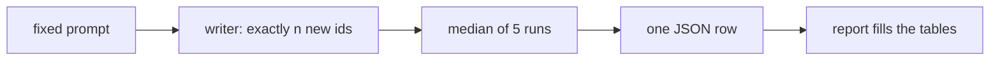

# 11. The benchmark harness

[Chapter 10](10-profiling-one-step.md) timed one step and said where the wait goes. Comparing two ways
of generating needs something stricter: both measured by the same ruler, or a difference in the
number might be a difference in the measurement. This chapter builds that ruler. A variant is handed
over as a **writer**, something that turns a prompt into a fixed number of new tokens, and the
harness does not look inside it. Every variant is timed on the same three lengths, the median of the
same five runs, and saved as one row. A report then fills the tables from those files, so a speed
figure in the book is a measurement on disk rather than a number typed into the page.

**Code:** [`hello_tokens/benchmark/harness.py`](../../hello_tokens/benchmark/harness.py) ·
[`hello_tokens/benchmark/report.py`](../../hello_tokens/benchmark/report.py) ·
[`hello_tokens/__main__.py`](../../hello_tokens/__main__.py)
**Tests:** [`tests/benchmark/test_harness.py`](../../tests/benchmark/test_harness.py) ·
[`tests/benchmark/test_report.py`](../../tests/benchmark/test_report.py)

## Words

- **Wall time**, **median**, **interquartile range**, **warm-up**, **synchronize**: see
  [chapter 10](10-profiling-one-step.md#words). **Greedy decoding**, **temperature**, **generation**:
  see [chapter 8](08-writing-sampling.md#words). **Perplexity**: see
  [chapter 9](09-measuring-it-perplexity.md#words). **bf16**: see
  [chapter 1](01-setup-and-the-data.md#words). The end-of-story token is
  [chapter 3](03-real-text-and-token-files.md)'s.
- **Writer**: a function that takes a prompt, as a list of token ids, and a count, and returns exactly
  that many new ids. The harness times writers. It does not care how a writer produces the ids.
- **First-token time**: how long until the first new token is ready. That includes reading the prompt.
- **Tokens per second**: the number of new tokens divided by the total time of the run, first token
  included.
- **Expected calibration error (ECE)**: how far the model's stated confidence is from how often it is
  right, averaged over the held-out predictions. Zero would mean the two match. The calibration
  chapter defines the bins; a row only stores the number.

## The idea

### One workload, or the rows cannot be compared

A speed measured with random sampling cannot sit beside a speed measured greedy: the two runs did
different work, and a story that stops early did less of it than one that ran to the length requested.
The harness therefore fixes the workload, and every later variant is only a new writer.

- **Greedy.** Temperature 0. There is no draw, so every run on a fixed prompt does the same work and,
  if the writer is working, writes the same tokens.
- **No stop token.** `stop_id` is `None`, so the end-of-story token does not end the run. Two variants
  that would have finished their stories at different lengths are asked for the same number of tokens.
- **Three points**, as (prompt tokens, new tokens): 16 + 64, 16 + 224 and 128 + 128. A short prompt
  with a short answer, a short prompt with a long answer, and a long prompt. The sums are 80, 240 and
  256, so all three stay within the context of 256. The prompts are fixed random ids. With no stop
  token, the time depends on how many tokens there are, not on which.



### What is timed, and what is stored

The process opts out of power throttling first, as chapter 10 arranged, or the run would measure the
operating system. One warm-up is discarded, the GPU is synchronized before each clock reading, and
each figure is the median of five runs, with those runs' interquartile range beside it.

**First-token time** asks for a single new token, so it includes reading the prompt. The full run
asks for every new token. Per-token time is the rest of that run, shared by the remaining tokens.
Tokens per second divides the new tokens by the whole run, first token included.

A writer that returns fewer tokens than it was asked for is refused: it would look faster by doing
less. Each point also records whether every run wrote the same ids. Greedy decoding of a fixed prompt
must. A row names the whole setup — checkpoint, dtype, cache, fused attention, CUDA graph,
quantization, decoding — and stores model size, peak GPU memory (0 on a CPU), perplexity and ECE
when they were measured, the machine, and the time.

### The tables are generated, not typed

`bench` writes one JSON file per row under `benchmarks/results/`. `report` reads those files, and the
judge results, and writes [`docs/benchmarks.md`](../../docs/benchmarks.md). The same text replaces
whatever sits between `<!-- benchmarks:start -->` and `<!-- benchmarks:end -->` in the README.
`report --check` exits with status 1 when a file is stale, and writes nothing.

Rows are grouped v1, then v2, then anything else, and within a model a name with fewer words comes
first. Each switch adds a word (`v2 bf16`, then `v2 bf16 cache`), so the plain row is above the
switches. Ties break on `measured_at`, which is stored in the row: a fresh copy of the repository
gives every file the same timestamp, so the file's own time cannot be the order.

Speed-up divides a row's tokens per second by the same model's plain bf16 row, at 16 + 224. A missing
value is an en dash, never 0. The published files go one step further: each number there is the
median across 8 runs of the whole table, and **batch IQR** is the interquartile range of tokens per
second at 16 + 224 across those runs, as a share of the median. Which runs were kept is the results
chapter. The ruler in this chapter is the single run of five; the numbers quoted below are the
median of runs.

## The shapes

The harness barely builds tensors. A prompt is a one-dimensional tensor of `prompt_tokens` random
ids, then a Python list. The writer returns a list of `new_tokens` ids. For the three points:

| Point | Prompt | New tokens | Prompt + new |
|---|---|---|---|
| short answer | 16 | 64 | 80 |
| long answer | 16 | 224 | 240 |
| long prompt | 128 | 128 | 256 |

256 is the model's context, so the long prompt fills it and does not go past it. The per-token time
divides by `new_tokens − 1`, because one of the new tokens is the first token, timed separately.

## The code

### The workload, and a writer

<!-- from: hello_tokens/benchmark/harness.py -->
```python
POINTS = ((16, 64), (16, 224), (128, 128))

# A writer takes prompt ids and a number of new tokens, and returns exactly that many new ids.
Writer = Callable[[list[int], int], list[int]]
```

`POINTS` is the fixed workload. `Writer` names the shape, not a class: any function of that shape
qualifies, and a later chapter can pass a different one without this file changing.

<!-- from: hello_tokens/__main__.py -->
```python
        write = lambda prompt, n: generate(model, prompt, n, temperature=0, stop_id=None, cache=args.cache,
                                           graphs=args.graphs)
```

Temperature 0 is chapter 8's greedy rule, and `stop_id=None` keeps the end-of-story token from ending
the run. `cache` and `graphs` stay off unless the command asked for them. The row name gains one word
per switch that is on:

<!-- from: hello_tokens/__main__.py -->
```python
        row = " ".join([args.name, "fp32" if args.dtype == "float32" else "bf16"]
                       + ["cache"] * (args.cache or args.graphs) + ["fused"] * args.fused + ["graphs"] * args.graphs
                       + ([f"spec-k{args.k}"] if args.speculative else [])
                       + ([f"int{args.quantize}"] if args.quantize else []))
```

A plain float32 run of v1 is `"v1 fp32"`. Each `["cache"] * flag` adds the word only when the flag is
on; a flag that is off adds nothing. More switches, more words, which is what the report sorts on.
The file is that name with spaces turned into hyphens: `v1 fp32` is saved as `v1-fp32.json`.

### One point

<!-- from: hello_tokens/benchmark/harness.py -->
```python
def _median_and_spread(seconds: list[float]) -> tuple[float, float]:
    quartiles = statistics.quantiles(seconds, n=4) if len(seconds) > 1 else [seconds[0]] * 3
    return statistics.median(seconds), quartiles[2] - quartiles[0]
```

This is chapter 10's median and interquartile range. A single sample cannot be divided into quarters,
so the spread is zero.

<!-- from: hello_tokens/benchmark/harness.py -->
```python
    def timed(count: int) -> tuple[float, list[int]]:
        if device == "cuda":
            torch.cuda.synchronize()
        started = time.perf_counter()
        out = write(prompt, count)
        if device == "cuda":
            torch.cuda.synchronize()
        return time.perf_counter() - started, out

    for _ in range(warmup):
        timed(new_tokens)
    first = [timed(1)[0] for _ in range(repeats)]
    runs = [timed(new_tokens) for _ in range(repeats)]
```

`timed` synchronizes, reads the clock, calls the writer, and synchronizes again. The warm-up (one full
run, by default) is discarded. Five runs then ask for one token, and five ask for the full count.

<!-- from: hello_tokens/benchmark/harness.py -->
```python
    if any(len(out) != new_tokens for out in outputs):
        raise ValueError("the writer must return exactly the requested number of tokens")

    first_s, _ = _median_and_spread(first)
    total_s, spread_s = _median_and_spread([s for s, _ in runs])
    return Point(
        prompt_tokens=len(prompt),
        new_tokens=new_tokens,
        first_token_ms=first_s * 1000,
        # The total covers the first token too; the rest of the time is shared by the others.
        per_token_ms=(total_s - first_s) / (new_tokens - 1) * 1000,
        tokens_per_s=new_tokens / total_s,
        spread_ms=spread_s * 1000,
        identical_runs=all(out == outputs[0] for out in outputs),
    )
```

A short return is an error, not a fast result. `first_s` and `total_s` are medians. Per-token time
subtracts the first token and divides by the ones left; tokens per second divides the count by the
full time, so it is the rate of the whole answer. `spread_ms` is the interquartile range of the five
full runs, in milliseconds. `identical_runs` is true only when every list matches.

Five tokens in 1.0 s, with the first token at 0.2 s, leaves the other four sharing 0.8 s:

<!-- illustration -->
```python
total_s, first_s, new_tokens = 1.0, 0.2, 5
print((total_s - first_s) / (new_tokens - 1) * 1000)
print(new_tokens / total_s)
# 200.0
# 5.0
```

200 ms per later token, and 5 tokens per second overall. Here the two agree; they come apart when
reading the prompt costs more than the later tokens. These figures are the arithmetic, not a
measurement.

### The row around the points

<!-- from: hello_tokens/benchmark/harness.py -->
```python
def model_megabytes(model: torch.nn.Module) -> float:
    """Bytes of every weight and buffer, in MB (10^6 bytes)."""
    tensors = list(model.parameters()) + list(model.buffers())
    return sum(t.numel() * t.element_size() for t in tensors) / 1e6
```

Size is bytes of every parameter and buffer, divided by 10<sup>6</sup>. `element_size` is 4 in
float32 and 2 in bf16, so bf16 is half the size. The output layer shares the token embedding
([chapter 5](05-the-block-and-the-full-model.md)), and `parameters()` lists that table once.

<!-- from: hello_tokens/benchmark/harness.py -->
```python
    opt_out_of_power_throttling()
    generator = torch.Generator().manual_seed(seed)
...
        prompt = torch.randint(0, model.config.vocab_size, (prompt_tokens,), generator=generator).tolist()
        measured.append(measure_point(write, prompt, new_tokens, device, repeats))
```

The opt-out comes first. One generator seeded with `seed` (0 by default) draws every prompt, so the
same seed repeats the same ids. Peak GPU memory is read after the points, and is 0 on a CPU.
`measured_at` is the time the row was taken.

<!-- from: hello_tokens/benchmark/harness.py -->
```python
def load_results(directory: Path) -> list[dict]:
    """Every saved row, in the order it was measured (re-measuring a row moves it to the end)."""
    results = [json.loads(p.read_text(encoding="utf-8")) for p in directory.glob("*.json")]
    return sorted(results, key=lambda r: r["measured_at"])
```

Saving a row again refreshes `measured_at` and moves it to the end of this list. The report sorts
again, so the displayed order is not this one.

### From files to a table

<!-- from: hello_tokens/benchmark/report.py -->
```python
def _order(result: dict) -> tuple:
    model = result["setup"]["model"]
    rank = MODEL_ORDER.index(model) if model in MODEL_ORDER else len(MODEL_ORDER)
    return rank, len(result["row"].split()), result["measured_at"]
```

`MODEL_ORDER` is `("v1", "v2")`; any other model sorts after them. The second key is the word count
of the row name, and the third is the measurement time.

<!-- from: hello_tokens/benchmark/report.py -->
```python
def _number(value: float | None, digits: int) -> str:
    return "–" if value is None else f"{value:,.{digits}f}"
```

A missing number becomes an en dash. A present one is printed with a thousands separator and a fixed
number of digits. The speed-up is a ratio at the long answer:

<!-- from: hello_tokens/benchmark/report.py -->
```python
        base = plain.get(f"{r['setup']['model']} bf16")
        base_long = _point(base, LONG) if base else None
        speedup = (long["tokens_per_s"] / base_long["tokens_per_s"]) if long and base_long else None
```

`LONG` is 16 + 224. The baseline is `"v1 bf16"` or `"v2 bf16"`, looked up by name. If it is missing,
the speed-up is missing too, and prints as a dash rather than a division by nothing. A row with no
`batch_spread_pct` — a single run — prints a dash in that column for the same reason.

<!-- from: hello_tokens/benchmark/report.py -->
```python
def replace_between_markers(text: str, content: str) -> str:
    """Put `content` between the README's start and end markers, replacing what was there."""
    pattern = re.compile(re.escape(START) + r".*?" + re.escape(END), re.DOTALL)
    if not pattern.search(text):
        raise ValueError(f"the markers {START} and {END} were not found")
    return pattern.sub(lambda _: f"{START}\n{content}{END}", text, count=1)
```

The replacement is a function, not a string. A string replacement would read backslashes in the table
as escape codes. The function's return value is inserted unchanged, and replacing the same content a
second time changes nothing. `report --check` compares that text with the files and returns status 1
when they differ, without writing.

Unless `--skip-quality` was given, `bench` scores the held-out file with the model in the dtype being
benchmarked and stores perplexity and ECE. Chapter 9's `eval` scores in float32 either way. A row
that skips the pass shows dashes: absent, not zero.

## What would go wrong the other way

**A different workload per variant.** Greedy against sampled, or a stop token left on, makes two rows
incomparable. A model that happens to emit the end-of-story token early would look faster by writing
less. The fixed points and `stop_id=None` remove that.

**Trusting a short return.** The refusal is the whole defence. A writer that stops at 200 tokens when
asked for 224 finishes sooner, and without the length check that sooner would be published as speed.

**One run, or a mean.** Chapter 10's reason applies unchanged: one pause moves a mean and barely
moves a median. Five runs and the interquartile range make a noisy point visible. They do not make a
whole batch that ran slow visible, which is why the published table is a median across batches
rather than one batch's median of five.

**Comparing every row with v1.** Plain v2 is a different model, slower before any technique is added.
A speed-up of a v2 switch against v1 would credit or blame the model change. The column uses the
same model's plain bf16 row.

**Typing the table, or writing 0 for "not measured".** A hand-copied number drifts the first time a
row is re-measured. A 0 in the ECE column would say the model is perfectly calibrated. The dash says
the value is absent. Sorting by file time has the same kind of hole: a fresh copy of the repository
gives every file one timestamp, and the order would collapse. `measured_at` is inside the row.

**Timing without synchronizing.** As in chapter 10, the clock would stop when the work was sent. The
harness synchronizes before the clock starts and after the writer returns, on a GPU only. On a CPU
there is nothing to wait for.

## Proving it works

<!-- from: tests/benchmark/test_harness.py -->
```python
def test_a_writer_that_stops_early_is_rejected():
    with pytest.raises(ValueError):
        measure_point(lambda prompt, n: [0] * (n - 1), [1, 2], 5, "cpu", repeats=1)
```

Asked for 5 tokens, the writer returns 4. The point must raise, rather than report a time. The same
call with a writer that returns a different list each time records `identical_runs` as false, so a
varying writer is visible and not rejected: varying is a fact about the output, not a broken length.

<!-- from: tests/benchmark/test_harness.py -->
```python
def test_the_model_size_counts_every_weight_once(model):
    # float32: 4 bytes per parameter; the tied table is shared, so it is counted once.
    assert model_megabytes(model) == pytest.approx(model.parameter_count() * 4 / 1e6)
```

The tiny test model is float32, so the size is the parameter count times 4, divided by 10<sup>6</sup>.
Equality with `parameter_count` is what proves the shared table was not counted twice. A benchmark
of that model also checks that greedy runs set `identical_runs`, that the times are positive, and
that peak memory is 0 on the CPU.

<!-- from: tests/benchmark/test_harness.py -->
```python
def test_rows_are_listed_in_the_order_they_were_measured(model, tmp_path):
    for row, when in (("a later", "2026-01-02T00:00:00"), ("b earlier", "2026-01-01T00:00:00")):
        result = run_benchmark(row, Setup("tiny", "float32"), model, greedy_writer(model), "cpu",
                               points=SMALL_POINTS[:1], repeats=2)
        result.measured_at = when
        save_result(result, tmp_path)
    assert [r["row"] for r in load_results(tmp_path)] == ["b earlier", "a later"]
```

The row saved second carries the earlier timestamp, and `load_results` returns it first. A companion
test saves `"tiny fp32"` and checks the file name `tiny-fp32.json`, and that a text table prints a
hyphen for a point that was not measured.

<!-- from: tests/benchmark/test_report.py -->
```python
def test_speed_up_is_against_the_same_model_in_plain_bf16():
    table = speed_table([row("v2 bf16", "v2", 75, "1"), row("v2 bf16 cache graphs", "v2", 300, "2"),
                         row("v1 fp32", "v1", 140, "0")])
    lines = {r: line for r, line in zip(table_rows(table), table.splitlines()[2:])}
    assert "| 1.00× |" in lines["v2 bf16"]
    assert "| 4.00× |" in lines["v2 bf16 cache graphs"]
    assert "| – |" in lines["v1 fp32"]  # no "v1 bf16" row to compare with
```

The speeds 75, 300 and 140 are the test's, not measurements. 300 / 75 is 4, so the switched v2 row
must show `4.00×` against `v2 bf16`, and `v2 bf16` must show `1.00×` against itself. `v1 fp32` has
no `v1 bf16` beside it, so its speed-up is the en dash. Another test omits a point, leaves ECE
empty and sets peak memory to 0, and requires dashes in those cells and the measured perplexity
printed as itself, not replaced. A row that carries `batches: 8` makes the report say it is a median
across 8 batches.

<!-- from: tests/benchmark/test_report.py -->
```python
def test_markers_are_replaced_and_the_rest_of_the_text_is_kept():
    text = f"# Title\n\nintro\n{START}\nold table\n{END}\n\noutro\n"
    once = replace_between_markers(text, "new table\n")
    assert once == f"# Title\n\nintro\n{START}\nnew table\n{END}\n\noutro\n"
    assert replace_between_markers(once, "new table\n") == once  # running it again changes nothing
```

The text before and after the markers survives, and a second replacement of the same content is a
no-op. A document with no markers raises.

Together the tests pin the ruler: the length check, identical greedy runs, the size arithmetic, the
order inside the file, the grouping, the speed-up baseline, the dash, and marker replacement. They
do not pin the published milliseconds. Those come from the saved rows.

## Run it

With the checkpoint of [chapter 7](07-the-real-training-run.md) and the held-out tokens of
[chapter 3](03-real-text-and-token-files.md):

```
uv run python -m hello_tokens bench --name v1 --dtype bfloat16
uv run python -m hello_tokens bench --table
uv run python -m hello_tokens report
uv run python -m hello_tokens report --check
```

`bench` prints `benchmarking <row> on <device>`, saves the JSON, and prints every saved row as text.
`--table` only prints. `report` rewrites `docs/benchmarks.md` and, when the markers are present, the
README's table, and says `already up to date` when there is nothing to do. `--check` prints
`out of date:` and exits with status 1 instead of writing. The tests need none of that:

```
uv run pytest tests/benchmark/test_harness.py tests/benchmark/test_report.py
```

A writer that returns one token too few is refused, on the CPU, with no model loaded:

<!-- illustration -->
```python
from hello_tokens.benchmark.harness import measure_point

try:
    measure_point(lambda prompt, n: [0] * (n - 1), [1, 2], 5, "cpu", repeats=1)
except ValueError as error:
    print(error)
# the writer must return exactly the requested number of tokens
```

## What we got

The published rows for the model Part I built are medians across 8 batches, at the three points.
Speed-up, first token, milliseconds per token and batch IQR are at 16 + 224. The machine is an
NVIDIA GeForce RTX 4060 Laptop GPU, PyTorch 2.14.0+cu130, Python 3.14.3.

| Row | tok/s 16+64 | tok/s 16+224 | tok/s 128+128 | Speed-up | Batch IQR | First token ms | ms / token | Size MB | Peak MB | Perplexity | ECE |
|---|---:|---:|---:|---:|---:|---:|---:|---:|---:|---:|---:|
| `v1 fp32` | 169 | 167 | 162 | 1.01× | 7% | 6.10 | 5.99 | 63.5 | 83 | 3.620 | 0.0084 |
| `v1 bf16` | 168 | 166 | 166 | 1.00× | 8% | 6.13 | 6.03 | 31.7 | 46 | 3.622 | 0.0083 |

- **bf16 does not change the speed.** At the long answer the published rates are 167 and 166 tokens
  per second, 5.99 ms and 6.03 ms per token, a speed-up of 1.01× for float32 against bf16. That is
  the profile's prediction, now a result: chapter 10's profile found the same wall time in both
  dtypes, because the GPU was idle.
- **bf16 halves the model.** The published sizes are 63.5 MB and 31.7 MB. The stored byte counts are
  in the ratio 2, since each weight is 4 bytes or 2. Peak GPU memory falls from 83 MB to 46 MB.
- **Quality is unchanged at the reported precision.** Perplexity is 3.620 and 3.622, and ECE is
  0.0084 and 0.0083. The float32 perplexity matches chapter 9's 3.620, scored with the weights in
  float32. The bf16 row is the same model with bf16 weights.
- **The spread across batches is part of the number.** Batch IQR is 7% for float32 and 8% for bf16:
  the interquartile range of the eight batches' tokens per second, divided by the median. The first
  harness runs, before the batches were combined, were recorded as 168 and 169 tokens/s at this
  point, 5.95 ms and 5.91 ms per token, agreeing within about 2% from run to run. Those are that
  early reading. The table above is the one later chapters use.
- **Why the baseline is per model.** In the same published table, plain v2 bf16 is 83 tokens/s where
  plain v1 bf16 is 166. v2 is built in the following chapters. Dividing a v2 technique by 166 would
  mix that gap with the technique. The column divides by the row's own plain bf16, which is why
  `v1 bf16` shows 1.00× and a v1 technique is read against 166 tokens/s, not against a different
  model.

## Check yourself

1. A full run writes 5 tokens in 1.0 s, and the one-token run took 0.2 s. What does the harness
   report as the per-token time, and why is that not 1.0 / 5?
2. A writer returns 200 tokens when asked for 224, and finishes sooner. What does `measure_point`
   do with it?
3. Why is a v2 row's speed-up computed against `v2 bf16` rather than against `v1 bf16`?

<details>
<summary>Answers</summary>

1. 200 ms. The full second includes the first token, so the other four share 0.8 s, and 0.8 / 4 is
   0.2 s, which is 200 ms. Tokens per second is a different number, 5 / 1.0 = 5, and it keeps the
   first token in the total. In this example the two happen to describe the same 0.2 s per token.
   They come apart when reading the prompt costs more than generating the next token.
2. It raises `ValueError` and does not return a point. A short completion would otherwise be a
   smaller time for less work, and the row would look faster than the variant is.
3. Because the speed-up is meant to be the technique, not the model. The published plain v2 row is
   83 tokens/s against plain v1 bf16 at 166. Dividing a v2 switch by 166 would fold that gap into
   the ratio. `v2 bf16` against itself is 1.00×, and each v2 switch is read against that. A v1 row
   with no `v1 bf16` beside it shows a dash rather than a ratio against some other model.

</details>

Next: 12. RMSNorm
