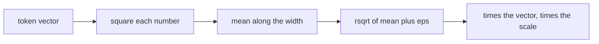

# 12. RMSNorm

[Chapter 5](05-the-block-and-the-full-model.md) keeps each token's vector at a steady size with
LayerNorm: subtract the mean, divide by the standard deviation, then apply a learned scale and a
learned shift. This chapter puts a shorter normalization behind a switch. RMSNorm divides by the
root mean square and keeps the scale, and it drops the mean and the shift. The v1 model is the
default, so a v1 checkpoint still builds and still runs. The measured question is what the two
dropped pieces were worth. On the short runs that isolate the switch, the loss does not move by
more than the gap between two v1 seeds. The parameter count falls by 6,528. The training run gets
slower, because the new layer is several small operations where LayerNorm was one.

**Code:** [`hello_tokens/model/norm.py`](../../hello_tokens/model/norm.py) ·
[`hello_tokens/model/config.py`](../../hello_tokens/model/config.py) ·
[`hello_tokens/model/block.py`](../../hello_tokens/model/block.py) ·
[`hello_tokens/model/gpt.py`](../../hello_tokens/model/gpt.py)
**Tests:** [`tests/model/test_modern.py`](../../tests/model/test_modern.py)

## Words

- **LayerNorm**, **normalization**, **mean**, **standard deviation**, **residual connection**,
  **block**: see [chapter 5](05-the-block-and-the-full-model.md#words). **Width**, **vector**,
  **parameters**, **head**: see [chapter 4](04-embeddings-and-attention.md#words). **Loss**: see
  [chapter 6](06-the-learning-loop.md#words). **Perplexity**: see
  [chapter 9](09-measuring-it-perplexity.md#words). **Checkpoint**: see
  [chapter 7](07-the-real-training-run.md#words).
- **Root mean square**: the square root of the average of the squares. For the numbers 3 and 4 the
  squares are 9 and 16, the average is 12.5, and the root is 3.5355.
- **RMSNorm**: divide each number in a token's vector by that vector's root mean square, then
  multiply by a learned scale. Nothing is subtracted, and there is no learned shift.
- **rsqrt**: one divided by a square root, as a single operation.
- **eps**: a tiny constant added before that division. Here it is `1e-5`, so a vector of all zeros
  still has a defined result.
- **Ablation**: a training run that changes one setting, so a difference in the loss can be read
  against that setting. The named presets in the config are built for that comparison.

## The idea

### What the shift was doing

LayerNorm, as chapter 5 uses it, does four things to a vector of 384 numbers. It subtracts their
mean. It divides by their standard deviation, so the result has mean 0 and standard deviation 1.
It multiplies by a learned scale, one number per dimension. It adds a learned shift, again one
number per dimension. The scale and the shift are the layer's only parameters. Chapter 5's table
counts them as 2 × 384 per LayerNorm: 1,536 in the two norms of one block, and 768 in the final
norm. Across eight blocks that is 17 norms and 13,056 parameters, and half of them, 6,528, are
shifts.

The scale is a real degree of freedom: training can decide that one dimension of the vector should
be larger than another. The shift is a different kind of freedom. It moves the whole vector up or
down after the mean was forced to zero. RMSNorm's claim is that the rescaling is the part the
residual stream needs, and that recentering can go.



The root mean square is a size, not a spread around a center. Dividing by it makes a vector of
length-independent magnitude without ever computing a mean. A learned scale of 384 ones then
restores the per-dimension freedom the shift is not asked to provide. Zhang and Sennrich, 2019,
is the paper the module cites for this shorter layer. Whether the shortening is free on *this*
model is not a citation. It is the ablation at the end of the chapter.

### A switch, with v1 as the default

The block does not grow a second implementation beside the first. `ModelConfig` gains a `norm`
field, and the default is `"layernorm"`. A checkpoint stores the config it was trained with
([chapter 7](07-the-real-training-run.md)). A v1 checkpoint was written before the field existed,
so the missing field comes back as the default, and the rebuilt model is the v1 model. Asking for
a string that is neither `"layernorm"` nor `"rmsnorm"` is refused at construction. A typo cannot
silently build the other layer.

The modules keep the names chapter 5 gave them: `norm1`, `norm2`, and `final_norm`. A checkpoint
finds parameters by those names. Replacing the class behind the name is safe for a v1 file, because
the v1 file never asks for RMSNorm. It is not safe in the other direction. LayerNorm saves a bias
and RMSNorm has none, so a v1 state dictionary does not load into an RMSNorm model. That is the
point of a strict load. The two layers are not the same parameter list with a different formula.

## The shapes

RMSNorm reads the last dimension and writes a tensor of the same shape. For a batch of windows
that is `(batch, time, 384)` in and `(batch, time, 384)` out. The mean of squares is taken with
`keepdim=True`, so the divisor has shape `(batch, time, 1)` and is broadcast across the width: one
scale factor per token, shared by that token's 384 numbers, then a further multiplication by the
learned weight of shape `(384,)`.

No token is mixed with another. The batch axis and the time axis are untouched, which is the same
contract LayerNorm had, and the reason the block around the call does not change. There are still
two norms in each of the eight blocks and one after the last block.

## The code

### The layer

<!-- from: hello_tokens/model/norm.py -->
```python
class RMSNorm(nn.Module):
    def __init__(self, width: int, eps: float = 1e-5):
        super().__init__()
        self.eps = eps  # keeps the division safe when a vector is all zeros
        self.weight = nn.Parameter(torch.ones(width))  # the learned scale, one per dimension

    def forward(self, x: torch.Tensor) -> torch.Tensor:
        # Root mean square over the last dimension; rsqrt = 1 / sqrt.
        return x * torch.rsqrt(x.pow(2).mean(dim=-1, keepdim=True) + self.eps) * self.weight
```

`width` is 384 in the real model and whatever the caller passes in a test. `eps` defaults to
`1e-5`. `self.weight` is a parameter, so it is saved in checkpoints and training moves it. It
starts as ones, which means a freshly built layer only rescales.

The return is the whole formula. `x.pow(2)` squares every entry. `.mean(dim=-1, keepdim=True)`
averages those squares along the width and keeps a trailing dimension of length 1, so the result
lines up with `x` under broadcasting. Adding `eps` happens inside the square root, to the mean of
squares, which is the same place LayerNorm adds its own `eps` (to the variance). `torch.rsqrt` is
the reciprocal square root. Multiplying by `x` is the division. Multiplying by `self.weight`
applies the learned scale, one factor per dimension, broadcast over the batch and the time.

The test's vector makes the arithmetic visible. With `eps` set to 0 so it does not disturb a
hand calculation, `[3, 4]` has mean of squares `(9 + 16) / 2 = 12.5` and root `3.5355`. Dividing
gives `[0.8485, 1.1314]`. Both numbers are positive. LayerNorm of the same vector would have been
centered on zero. That is the whole difference between the two formulas, before any training.

### Choosing it

<!-- from: hello_tokens/model/norm.py -->
```python
def make_norm(config: ModelConfig) -> nn.Module:
    if config.norm == "layernorm":
        return nn.LayerNorm(config.width)
    return RMSNorm(config.width)
```

Chapter 5 showed the first branch and left the second for this chapter. `"layernorm"` returns
PyTorch's layer, scale and shift included. Anything else that the config allowed through returns
RMSNorm. The config is what does the allowing:

<!-- from: hello_tokens/model/config.py -->
```python
@dataclass(frozen=True)
class ModelConfig:
    vocab_size: int = 4096  # token ids, from the tokenizer
    context: int = 256  # the most tokens the model looks at at once
    width: int = 384  # numbers used to represent each token
    layers: int = 8  # transformer blocks stacked on top of each other
    heads: int = 6  # attention heads per block, each width // heads = 64 wide
    # v2 switches. The defaults are v1's design, so a v1 checkpoint (which stores only the fields
    # above) rebuilds exactly the v1 model.
    norm: str = "layernorm"  # or "rmsnorm"
...
        if self.norm not in ("layernorm", "rmsnorm"):
            raise ValueError(f"unknown norm {self.norm!r}")
```

The class is frozen, as chapter 4 built it, so a model cannot drift from the settings it was
constructed with. The comment on the switches is the loading rule: fields a v1 file does not store
take these defaults. The check runs in `__post_init__`, after the generated constructor, and names
the bad string in the error.

> **Later:** the lines cut from this excerpt are the other switches, `position`, `feed_forward`
> and `kv_heads`, and their checks. The next chapter uses `position`. The feed-forward switch and
> the key/value-head switch come after that.

The presets are the ablation ladder. Each name is one `ModelConfig`, and each adds a single change
to the name before it:

<!-- from: hello_tokens/model/config.py -->
```python
# Named shapes for `train --model`. Each adds one change to the one before it, so training them in
# order shows what each change does on its own (an ablation); "v2" has all four.
PRESETS = {
    "v1": ModelConfig(),
    "rmsnorm": ModelConfig(norm="rmsnorm"),
```

`"v1"` is every default. `"rmsnorm"` changes `norm` and leaves the learned position table, the GELU
feed-forward network, and one key/value head per query head exactly as chapter 5 built them. The
row in the results below is that one change, trained, not a mixture.

> **Later:** the dict continues with `"rope"`, `"swiglu"` and `"v2"`. Each of those chapters reads
> its own row. The last line of the file builds a small draft model that deliberately keeps
> LayerNorm; the reason is in the measurements below.

### Where the block calls it

<!-- from: hello_tokens/model/block.py -->
```python
        self.norm1 = make_norm(config)
        self.attention = CausalSelfAttention(config)
        self.norm2 = make_norm(config)
...
    def forward(self, x: torch.Tensor, cache: KVCache | None = None, layer: int = 0) -> torch.Tensor:
        x = x + self.attention(self.norm1(x), cache, layer)
        x = x + self.feed_forward(self.norm2(x))
        return x
```

The two norms are still applied to a copy of the residual stream, and their outputs are still
added back. Chapter 5's reason for that addition is unchanged: the block refines the running vector
instead of replacing it. Only the class behind `norm1` and `norm2` depends on the config.

> **Later:** the cut line chooses a SwiGLU feed-forward network when the config asks for one.
> `cache` and `layer` are the KV cache's arguments. With no cache they do not change this chapter's
> arithmetic.

The stack's last norm is the same function, and the output layer still sits on top of it:

<!-- from: hello_tokens/model/gpt.py -->
```python
        self.blocks = nn.ModuleList(Block(config) for _ in range(config.layers))
        self.final_norm = make_norm(config)
...
        if cache is not None:
            cache.advance(ids.shape[1])
        return self.output(self.final_norm(x))
```

Eight blocks, then one more norm over the width, then the tied output layer of chapter 5. The
tensor into `final_norm` is still `(batch, time, 384)`.

> **Later:** the two lines that advance a cache are the KV cache's bookkeeping. They run only when
> a cache was passed in.

## What would go wrong the other way

**Staying with LayerNorm.** Nothing about v1 becomes false. The ablation says the loss is the same
for practical purposes, and the v1 run is the faster of the two to train. The reason to switch is
the smaller parameter list and the shorter definition, not a speed-up on this machine. Keeping
LayerNorm because it was faster to train is a coherent choice. The switch is still the one the
rest of v2 is built on, and the cost of it is reported below rather than assumed away.

**Normalizing over the batch or over time.** `dim=-1` is the width. A mean over the batch would
make one example's vector depend on the other examples in the batch, so the same story would
normalize differently in a batch of 64 than in a batch of 1. A mean over time would mix positions.
Either one breaks the contract the residual block relies on: each token is rescaled from its own
numbers.

**Leaving `eps` at zero.** The test does that for `[3, 4]`, which is safe because the root is
3.5355. A vector of zeros has mean of squares 0. Without `eps`, `rsqrt` is asked for the reciprocal
of zero. The default `1e-5` makes that root `sqrt(1e-5)` instead, and the zeros stay zeros because
they are multiplied by a finite factor.

**Dropping the learned scale as well.** The formula would still divide by the root mean square, so
every dimension would be treated alike, forever. The scale is what lets one coordinate grow. It
starts at ones, so at step 0 it changes nothing, and training is free to move it. Removing it
would not match the layer the paper, the module, or the ablation describe.

**Renaming the modules.** A v1 checkpoint looks up `norm1.weight` and `norm1.bias` by name. The
golden test loads strictly, so a renamed module fails that test even if the formula is untouched.
The names stayed, and the class behind them is the only thing the switch changes.

## Proving it works

Four tests in [`tests/model/test_modern.py`](../../tests/model/test_modern.py) cover this switch.
The file also holds the rotary-position tests; those belong to the next chapter.

The hand calculation is pinned, not just described:

<!-- from: tests/model/test_modern.py -->
```python
def test_rmsnorm_by_hand():
    # [3, 4]: mean of squares = (9 + 16) / 2 = 12.5, root = 3.5355, so [3, 4] / 3.5355 = [0.8485, 1.1314].
    out = RMSNorm(2, eps=0.0)(torch.tensor([3.0, 4.0]))
    assert torch.allclose(out, torch.tensor([0.8485, 1.1314]), atol=1e-4)
```

`atol=1e-4` is the tolerance on that rounded pair. The weight is left at its initial ones, so the
scale does not enter.

A bad string is refused, and so is a bad position string, which the next chapter relies on:

<!-- from: tests/model/test_modern.py -->
```python
def test_unknown_switch_values_are_rejected():
    with pytest.raises(ValueError):
        ModelConfig(norm="batchnorm")
    with pytest.raises(ValueError):
        ModelConfig(position="sinusoidal")
```

v1 is checked by replaying a recording made before the switches existed.
[`make_v1_golden.py`](../../tests/model/fixtures/make_v1_golden.py) builds a small model, vocabulary
50, context 16, width 24, two layers and four heads, and saves its weights, a batch of ids, and the
logits those ids produced. The test loads that file into today's code:

<!-- from: tests/model/test_modern.py -->
```python
def test_a_v1_model_still_loads_and_gives_identical_outputs():
    # Weights and outputs recorded with the v1 code (tests/model/fixtures/make_v1_golden.py).
    golden = torch.load(GOLDEN)
    model = GPT(ModelConfig(**golden["model_config"])).eval()
    model.load_state_dict(golden["model"])  # strict: any renamed or extra saved tensor fails here
    with torch.no_grad():
        assert torch.allclose(model(golden["ids"]), golden["logits"], atol=1e-6, rtol=0)
```

The saved config has the five original fields. `norm` therefore defaults to `"layernorm"`, the
state dictionary loads, and every logit must match within `1e-6` with no relative tolerance on top.
`eval()` turns off dropout, but this model has none; the call is there so the comparison is the
plain forward pass. A change that silently altered LayerNorm, the residual block, or the tied
output would fail here even if every new test passed.

The parameter arithmetic is one assertion for two removals. RMSNorm removes the shifts. Rotary
positions, next chapter, remove the position table. The test turns both on, because that is the
pair the file checks, and requires the sum:

<!-- from: tests/model/test_modern.py -->
```python
def test_rmsnorm_and_rope_remove_exactly_the_position_table_and_the_norm_biases():
    v1 = GPT(ModelConfig()).parameter_count()
    modern = GPT(ModelConfig(norm="rmsnorm", position="rope")).parameter_count()
    position_table = 256 * 384
    norm_biases = (2 * 8 + 1) * 384  # two norms per block plus the final one
    assert v1 - modern == position_table + norm_biases == 104_832
```

`256 * 384` is 98,304, the position table from chapter 5. `(2 * 8 + 1) * 384` is 6,528, the shifts.
The scales are still there: RMSNorm's weight replaces LayerNorm's weight, one for one, and only the
bias side disappears. A model with `norm="rmsnorm"` and the learned position table kept is v1 minus
those 6,528 parameters, which is 15,861,120. The illustration below prints both counts. The
assertion prints neither; it checks the sum, 104,832, so a mistaken formula on either piece fails
the same line.

## Run it

The preset is a real training command, and the short run it names has already been recorded. This
chapter does not retrain it:

```
uv run python -m hello_tokens train --model rmsnorm
```

The proof that the layer matches its formula needs no data and no GPU:

```
uv run pytest tests/model/test_modern.py
```

The hand vector, the same vector shifted by 10, and the two parameter counts, on the CPU:

<!-- illustration -->
```python
import torch
from torch import nn
from hello_tokens.model.norm import RMSNorm
from hello_tokens.model.config import ModelConfig, PRESETS
from hello_tokens.model.gpt import GPT

hand = RMSNorm(2, eps=0.0)
print(hand(torch.tensor([3.0, 4.0])).tolist())
print(hand(torch.tensor([13.0, 14.0])).tolist())
layer = nn.LayerNorm(2)
print(layer(torch.tensor([3.0, 4.0])).tolist())
print(layer(torch.tensor([13.0, 14.0])).tolist())
print(GPT(ModelConfig()).parameter_count())
print(GPT(PRESETS["rmsnorm"]).parameter_count())
```

```
[0.8485281467437744, 1.1313709020614624]
[0.9623031616210938, 1.03632652759552]
[-0.9999799728393555, 0.9999799728393555]
[-0.9999799728393555, 0.9999799728393555]
15867648
15861120
```

`[3, 4]` and `[13, 14]` have the same LayerNorm output: subtracting the mean removes the shift of
10, and both vectors sit one half-step either side of their mean. RMSNorm has no mean to subtract,
so the two outputs differ, and neither is centered on zero. The printed counts are 15,867,648 and
15,861,120.

Loading the golden v1 weights into a model whose only change is `norm="rmsnorm"` is refused. The
fixture has two layers, so five bias tensors have nowhere to go:

<!-- illustration -->
```python
import torch
from hello_tokens.model.config import ModelConfig
from hello_tokens.model.gpt import GPT

golden = torch.load("tests/model/fixtures/v1_golden.torch")
cfg = dict(golden["model_config"])
cfg["norm"] = "rmsnorm"
try:
    GPT(ModelConfig(**cfg)).load_state_dict(golden["model"])
except RuntimeError as error:
    print(error)
```

```
Error(s) in loading state_dict for GPT:
	Unexpected key(s) in state_dict: "blocks.0.norm1.bias", "blocks.0.norm2.bias", "blocks.1.norm1.bias", "blocks.1.norm2.bias", "final_norm.bias".
```

On the full model the same mismatch is one bias per norm, 17 of them. The golden test passes
because it never sets `norm`.

## What we got

The comparison is six short runs, and this chapter owns one of them. Each run is 4,000 steps
(65.5M tokens, 200 of them warm-up) and is scored on all 5,683,947 held-out tokens. v1 was trained
twice, with two seeds, to put a size on run-to-run noise. The `"rmsnorm"` preset is cumulative in
the ladder and first in the changes, so its row is v1 plus this switch and nothing else. The losses
and the perplexities are the build log's table of those runs; the minutes are the same runs as
stored under `abl-v1-s0`, `abl-v1-s1` and `abl-rmsnorm` in
[`benchmarks/ablations.json`](../../benchmarks/ablations.json).

| Run | Held-out loss | Against v1 seed 0 | Perplexity | Parameters | Minutes |
|---|---:|---:|---:|---:|---:|
| v1, seed 0 | 1.5126 | | 4.539 | 15,867,648 | 16.0 |
| v1, seed 1 | 1.5128 | +0.0002 | 4.539 | 15,867,648 | 15.4 |
| + RMSNorm | 1.5130 | +0.0004 | 4.540 | 15,861,120 | 18.0 |

- **The loss change is the size of the noise.** Seed 1 sits 0.0002 above seed 0. RMSNorm sits
  0.0004 above seed 0, and its perplexity is 4.540 against 4.539. The build log's reading of
  differences on that scale is that they are noise, and that RMSNorm has no measurable effect on
  quality. The next chapter's change is much larger than this gap. This one is not.
- **The parameter change is exact.** 15,861,120 is 15,867,648 minus 6,528 shifts. The position
  table is still in this row. Nothing else in the block was resized.
- **The run took longer.** 18.0 minutes, against 16.0 and 15.4 for the two v1 seeds, evaluation
  included. The code states the mechanism directly: a step's cost at this size is the number of
  GPU launches, and LayerNorm is one fused kernel where RMSNorm is several small ones.

<!-- from: hello_tokens/model/config.py -->
```python
# a step's cost here is the number of GPU launches, and LayerNorm (one fused kernel) and a learned
# position table launch fewer than RMSNorm and RoPE. Same vocabulary and context as the big models.
```

That comment is why a later, smaller model keeps LayerNorm on purpose. The build log says the same
thing about these runs: the extra minutes are a training-time cost, not an inference result.
[`docs/benchmarks.md`](../../docs/benchmarks.md) has no row that turns RMSNorm on by itself. The
published generation speeds compare whole models. This chapter does not assign any of those speeds
to the norm.

## Check yourself

1. With `eps` at 0 and a scale of all ones, what does RMSNorm return for `[3, 4]`, and why is that
   not what LayerNorm returns?
2. The two v1 seeds differ in held-out loss by 0.0002, and the RMSNorm run differs from seed 0 by
   0.0004. What does that support, and what does the minute column support instead?
3. A v1 checkpoint has no `norm` field in its saved config. Which class does `load_model` build,
   and why does loading that checkpoint's weights into `PRESETS["rmsnorm"]` fail?

<details>
<summary>Answers</summary>

1. `[0.8485, 1.1314]`, within the test's `1e-4`. The squares are 9 and 16, the mean is 12.5, the
   root is 3.5355, and the layer divides. LayerNorm would subtract the mean first, so the two
   outputs would sit on opposite sides of zero. The illustration's LayerNorm of `[3, 4]` is about
   −1 and +1. RMSNorm never recenters, so both of its outputs are positive.
2. The loss gap supports the build log's reading that the quality change is not measurable: 0.0004
   is the same order as the 0.0002 between two seeds of the unchanged model, and the perplexities
   are 4.540 and 4.539. The minutes support a different claim. The RMSNorm run took 18.0 minutes
   against 16.0 and 15.4, which fits a layer written as several small kernels in place of one fused
   LayerNorm. Quality held; training time did not improve.
3. `load_model` rebuilds `ModelConfig` from the saved fields, and a missing `norm` becomes the
   default `"layernorm"`, so the class is `nn.LayerNorm`. `PRESETS["rmsnorm"]` builds RMSNorm,
   which has a weight and no bias. The v1 state dictionary still holds `norm1.bias`, `norm2.bias`
   and `final_norm.bias`, and a strict load raises on those unexpected keys. The golden fixture
   fails the same way: its two blocks contribute four bias tensors, plus `final_norm.bias`.

</details>

Next: [13. Rotary position embedding](13-rotary-position-embedding.md)
