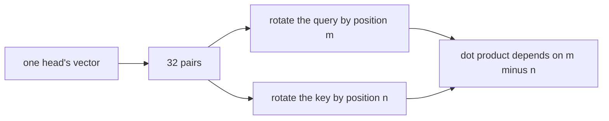

# 13. Rotary position embedding

[Chapter 4](04-embeddings-and-attention.md) tells positions apart by adding a learned vector. Each
position gets its own row, and nothing in the table says that one row is a single step from the
row before it. This chapter deletes
that table. Rotary position embedding, RoPE, writes the position as a rotation of the query and the
key, pair by pair, and the attention score then depends on the distance between the two tokens.
Nothing is learned. The short run that adds this switch, on top of [chapter 12](12-rmsnorm.md)'s
RMSNorm, drops the held-out loss by 0.0345, which the build log reads as about 170 times the gap
between two v1 seeds. The parameter count falls by the whole position table, 98,304.

**Code:** [`hello_tokens/model/rope.py`](../../hello_tokens/model/rope.py) ·
[`hello_tokens/model/attention.py`](../../hello_tokens/model/attention.py) ·
[`hello_tokens/model/embedding.py`](../../hello_tokens/model/embedding.py) ·
[`hello_tokens/model/config.py`](../../hello_tokens/model/config.py)
**Tests:** [`tests/model/test_modern.py`](../../tests/model/test_modern.py)

## Words

- **Position embedding**, **query**, **key**, **value**, **dot product**, **head**, **causal
  mask**: see [chapter 4](04-embeddings-and-attention.md#words). **Head width** is that chapter's
  64, the width of one head. **RMSNorm**, **ablation**: see [chapter 12](12-rmsnorm.md#words).
- **RoPE** (rotary position embedding): a way to mark position by rotating pairs of numbers inside
  the query and the key. Su et al., 2021, is the paper the module cites.
- **Frequency**: how far a pair turns, in radians, when the position increases by one. Each pair
  has its own.
- **Relative position**: the distance between two tokens. An absolute position is a token's index
  from the start of the window.
- **Buffer**: a tensor stored on the module, so it moves to the GPU with the parameters, but not
  itself a parameter. Training does not change it, and `parameter_count` does not include it.

## The idea

### Absolute rows, and what a score can see

Chapter 4's position table has 256 rows of 384, one learned vector per legal position, added to the
token vector before any block runs. Two copies of the same token at two positions start different,
which is enough for attention to *learn* that distance matters. The table does not *build* distance
in. Row 3 and row 10 are unrelated parameters. A score between a query and a key can come to depend
on where each sits, but only by memorizing combinations, and there is no row past position 255.

The score itself is a dot product ([chapter 4](04-embeddings-and-attention.md)). A dot product cares
about the angle between two vectors, not about where on the page they were written. RoPE uses that.
Take the 64 numbers of one head as 32 pairs. Rotate pair *i* of the token at position *p* by the
angle *p* times a frequency *fᵢ*. Do this to the query and to the key, and not to the value. The
angle between a query at position *m* and a key at position *n* is then the angle they already had,
plus *(m − n) fᵢ*. The positions drop out except as a difference. The score between those two tokens
depends on how far apart they are, wherever the pair sits in the window.



The value is left alone. It is the content that the weights will average, and the weights already
carry the position, because they came from the rotated queries and keys. Rotating the value as well
would twist that content by an absolute position on the way out.

### Fast pairs and slow pairs

The frequencies are fixed, not learned. With the base set to 10,000 and a head width *d*, pair *i*
(counting the pairs, so the dimensions are 2*i* and 2*i* + 1) gets

*fᵢ* = 10,000^(−2*i* / *d*).

The code writes the same thing as one divided by `base` raised to `(0, 2, 4, …) / d`. The first
frequency is 10,000^0 = 1. The last, at dimension 62 of a head of 64, is 10,000^(−62/64), a little
above 1/10,000. The module's comment calls that spread "from 1 down to almost 1/base".

A frequency of 1 turns the pair by one radian per position, so a full turn takes only a handful of
positions and, across a context of 256, that pair winds many times. The slowest pair needs tens of
thousands of positions for a full turn, far past the context, so inside a real window it barely
moves. The printed lengths are in the run below. Near neighbors are separated by the fast
pairs. Tokens far apart still differ on the slow pairs, whose angle grows
almost in proportion to the distance instead of wrapping. One frequency could not do both.

The base is the constructor's default. It is not a field of `ModelConfig`, so a checkpoint cannot
disagree with it. Every RoPE table this repository builds uses 10,000, because no call passes
another base.

### No new parameters, and the same context limit

The cosines and sines of every angle are computed once, for positions 0 through 255 and for all 32
pairs, and stored as buffers. They are not in the checkpoint: they are fixed by the head width, the
context, and the base, and leaving them out keeps a v1 checkpoint's set of tensors unchanged.
`parameter_count` sums parameters only, so RoPE adds zero to it. The position table's 98,304
entries are simply gone.

This does not make the context longer. The embedding still refuses a sequence whose positions would
run past 255, and the buffers themselves have 256 rows. The formula could be evaluated further out.
This model does not. The gain measured below is inside the same 256.

The rotation is applied inside each block, after that block has made its queries and keys. A linear
layer mixes all 64 numbers, so a rotation done earlier, on the residual stream, would not arrive at
the dot product as a clean rotation of pairs. Each layer has its own queries and keys, so each layer
rotates its own.

## The shapes

A head's query or key, after chapter 4's split, is `(batch, heads, time, 64)`. RoPE reads the last
axis as 32 pairs and writes the same shape back. The buffers are `(256, 32)`: one row per position,
one column per pair. A window of length *T* starting at `offset` uses rows `offset` through
`offset + T`. Those rows have shape `(T, 32)`, which lines up with the last two axes of the query,
`(time, 32)`, and broadcasts over the batch and the heads.

The value keeps shape `(batch, heads, time, 64)` and is not passed to the rotation. The embedding's
output is still `(batch, time, 384)`, but it is the token table alone.

## The code

### The angles

<!-- from: hello_tokens/model/rope.py -->
```python
class RotaryPositions(nn.Module):
    def __init__(self, head_width: int, context: int, base: float = 10_000.0):
        super().__init__()
        if head_width % 2:
            raise ValueError("RoPE needs an even head width: it rotates pairs of numbers")
        # One frequency per pair: base^(-0/hw), base^(-2/hw), ... from 1 down to almost 1/base.
        frequencies = 1.0 / base ** (torch.arange(0, head_width, 2).float() / head_width)
        angles = torch.outer(torch.arange(context).float(), frequencies)  # (context, head_width / 2)
        # Computed once. Not saved in checkpoints (persistent=False): they are fixed by the shape, and
        # leaving them out keeps the checkpoint format the same as v1's.
        self.register_buffer("cos", angles.cos(), persistent=False)
        self.register_buffer("sin", angles.sin(), persistent=False)
```

An odd head width cannot be split into pairs, so construction raises before any buffer exists. The
real model's head width is 64, which is even; the small models in the tests are even as well.
`torch.arange(0, head_width, 2)` is `0, 2, …, head_width - 2`, one entry per pair.
`torch.outer` multiplies every position by every frequency, which is the angle table. Cosine and
sine are taken once. `register_buffer` with `persistent=False` keeps them off the checkpoint and out
of `state_dict`. They still move with `.to(device)`, because they belong to the module.

### One pair, rotated

<!-- from: hello_tokens/model/rope.py -->
```python
    @staticmethod
    def _rotate(x: torch.Tensor, cos: torch.Tensor, sin: torch.Tensor) -> torch.Tensor:
        cos, sin = cos.to(x.dtype), sin.to(x.dtype)
        even, odd = x[..., 0::2], x[..., 1::2]  # the two numbers of each pair
        # The 2-D rotation of (even, odd) by the angle: (e cos - o sin, e sin + o cos).
        rotated = torch.stack((even * cos - odd * sin, even * sin + odd * cos), dim=-1)
        return rotated.flatten(-2)  # interleave the pairs back into place
```

`0::2` is dimensions 0, 2, 4, … and `1::2` is 1, 3, 5, …. Pair 0 is dimensions 0 and 1, not
dimension 0 and dimension 32. The cast to `x.dtype` lets a bf16 query use angles that were stored
in float32. The stack builds `(…, 32, 2)`, the two rotated numbers of each pair side by side, and
`flatten(-2)` interleaves them back to `(…, 64)`.

The formula is the ordinary rotation of a plane. Writing the pair as a column, the new pair is

`(even cos − odd sin, even sin + odd cos)`.

At position 0 every angle is 0, cosine is 1 and sine is 0, so the pair comes back unchanged. A
rotation does not change the length of a pair, and so it does not change the length of the vector.
The test below checks both.

`forward` slices the buffers. `at` gathers one row by a tensor index, which a later chapter needs
so the position can change without the Python number changing:

<!-- from: hello_tokens/model/rope.py -->
```python
    def forward(self, x: torch.Tensor, offset: int = 0) -> torch.Tensor:
        """Rotate (..., time, head_width) vectors whose first token sits at position `offset`."""
        length = x.shape[-2]
        return self._rotate(x, self.cos[offset : offset + length], self.sin[offset : offset + length])

    def at(self, x: torch.Tensor, position: torch.Tensor) -> torch.Tensor:
        """Rotate one token's (..., 1, head_width) vectors to `position`, a 1-element tensor.

        The same rotation with the position read from a tensor instead of a Python number, so a CUDA
        graph can replay it at a new position each time (see KVCache.store_at).
        """
        return self._rotate(x, self.cos.index_select(0, position), self.sin.index_select(0, position))
```

`offset` is an integer. The slice `cos[offset : offset + length]` is the angles for a contiguous
span, which is what a normal forward pass has. `index_select` reads the row whose index lives in
the tensor `position`. The arithmetic is the same rotation. Only the way the row is chosen differs.

> **Later:** `at` is the path the fixed-shape step uses, where a CUDA graph replays one token at a
> time and the position has to live in a tensor. The KV cache is what makes a new token sit at an
> offset other than 0. Both are later chapters. The offset behavior is already tested here.

### Queries and keys, inside the block

<!-- from: hello_tokens/model/attention.py -->
```python
        # RoPE rotates queries and keys by their position (it has no learned weights).
        self.rope = RotaryPositions(config.head_width, config.context) if config.position == "rope" else None
```

v1 leaves `self.rope` as `None`. The `"rope"` preset builds the buffers for this layer's head width
and the model's context. There is one `RotaryPositions` per block, and none of them has a parameter.

<!-- from: hello_tokens/model/attention.py -->
```python
        offset = cache.length if cache is not None else 0  # position of the first new token
        query, key, value = self._project(x)
        if self.rope is not None:
            # Values carry content, not position. With a cache, the new tokens sit after the stored ones.
            query, key = self.rope(query, offset), self.rope(key, offset)
```

`_project` is chapter 4's split into heads. The rotation runs on that result, so the pairs are the
head's own 64 numbers, not the full 384. `value` is not in the assignment. With no cache, `offset`
is 0 and the first token is position 0, matching the table v1 used to add. The scores that follow
are chapter 4's dot products, now of these rotated vectors.

> **Later:** the lines after this excerpt store keys that are already rotated, and they repeat
> key/value heads when grouped-query attention is on. Rotating before that repeat means the copies
> share one rotated key. Those switches are not this chapter's.

The one-token path calls `at` instead of `forward`:

<!-- from: hello_tokens/model/attention.py -->
```python
        if self.rope is not None:
            query, key = self.rope.at(query, position), self.rope.at(key, position)
```

Same rule: query and key only, value untouched.

### The position table is absent

<!-- from: hello_tokens/model/embedding.py -->
```python
        # With RoPE, position is applied inside attention instead, so there is no position table.
        self.position = nn.Embedding(config.context, config.width) if config.position == "learned" else None
```

Chapter 4's forward added `self.position(positions)` and left the `None` branch for here:

<!-- from: hello_tokens/model/embedding.py -->
```python
        length = ids.shape[1]
        if offset + length > self.context:
            raise ValueError(f"sequence of {offset + length} tokens is longer than the context of {self.context}")
        if self.position is None:
            return self.token(ids)
        positions = torch.arange(offset, offset + length, device=ids.device)
        return self.token(ids) + self.position(positions)
```

The refusal still runs when the table is missing. Any `offset + length` past the context of 256 is
illegal for RoPE in this code, just as it was illegal for the learned table. When
the table is `None`, the token vectors are returned on their own. Position enters only through the
rotation inside attention.

The preset that turns this on also keeps chapter 12's norm. The ladder adds one change at a time:

<!-- from: hello_tokens/model/config.py -->
```python
    "rmsnorm": ModelConfig(norm="rmsnorm"),
    "rope": ModelConfig(norm="rmsnorm", position="rope"),
```

`"rope"` is not "RoPE on an otherwise v1 model". It is RMSNorm plus RoPE. The loss row below is
that stack, and the parameter drop from the RMSNorm row to this one is the position table alone.
An unknown position string is refused next to the norm check chapter 12 already showed:

<!-- from: hello_tokens/model/config.py -->
```python
        if self.position not in ("learned", "rope"):
            raise ValueError(f"unknown position {self.position!r}")
        if self.feed_forward not in ("gelu", "swiglu"):
            raise ValueError(f"unknown feed_forward {self.feed_forward!r}")
```

> **Later:** the feed-forward check is the next chapter's switch. `"sinusoidal"` is not a third
> position scheme; it is the string the test uses to prove a typo raises.

## What would go wrong the other way

**Keeping the learned table.** That is v1, and it trains. It costs 98,304 parameters, its rows are
absolute, and on the short run it loses to this switch by 0.0345 of loss. Keeping it because the
rotation is extra GPU launches, the same reason chapter 12 gave for LayerNorm, is the trade the
draft model in `config.py` actually makes. It is not the better loss.

**One frequency for every pair.** Then every pair wraps at the same distance. Neighbors and tokens
at opposite ends of the window would have to share one rate of turning. The spread from 1 down to almost
1/10,000 is what gives the dot product both scales.

**Rotating the values, or rotating the residual stream instead of the query and the key.** The
score is the only place the position needs to enter. The value is what gets averaged. And a
rotation that happens before the query/key layer is mixed by that layer's matrix, so the dot
product is no longer a dot product of rotated pairs. The call sits after `_project` because that is
where the pairs are still pairs.

**An odd head width.** The constructor raises `ValueError: RoPE needs an even head width: it
rotates pairs of numbers`. The config already requires the width to divide between the heads.
RoPE adds that the slice each head receives must be even.

**Saving the cosine table in the checkpoint.** It would change the set of tensors a v1 file is
allowed to hold, and it would go stale if the context or the head width changed. `persistent=False`
drops it. A test checks that no saved name contains `"rope"`.

**Ignoring `offset`.** A token passed in by itself would be rotated as position 0, whichever
position it really occupies. The slice test pins the argument before the cache exists to use it.

## Proving it works

The file's tests share one seed, so the random tensors below are the same on every run:

<!-- from: tests/model/test_modern.py -->
```python
@pytest.fixture(autouse=True)
def fixed_seed():
    torch.manual_seed(0)
```

Position 0 is a no-op, and a rotation does not stretch:

<!-- from: tests/model/test_modern.py -->
```python
def test_rope_leaves_position_zero_unchanged_and_never_changes_a_vector_s_length():
    rope = RotaryPositions(head_width=8, context=16)
    x = torch.randn(16, 8)
    rotated = rope(x)
    assert torch.allclose(rotated[0], x[0])  # angle 0: no rotation
    assert torch.allclose(rotated.norm(dim=-1), x.norm(dim=-1), atol=1e-5)  # rotations keep length
```

Head width 8 is four pairs. The length check is on the whole vector, within `1e-5`.

The relative-position claim is two distances, not a picture:

<!-- from: tests/model/test_modern.py -->
```python
def test_rope_scores_depend_only_on_the_distance_between_positions():
    rope = RotaryPositions(head_width=8, context=16)
    q, k = torch.randn(8), torch.randn(8)
    rq, rk = rope(q.expand(16, 8)), rope(k.expand(16, 8))  # the same q and k at every position
    # Query at 3, key at 1 (distance 2) scores the same as query at 10, key at 8 (distance 2) ...
    assert torch.allclose(rq[3] @ rk[1], rq[10] @ rk[8], atol=1e-5)
    # ... but differently from distance 5.
    assert not torch.allclose(rq[3] @ rk[1], rq[6] @ rk[1], atol=1e-3)
```

The same query and the same key are laid down at every position, so the only thing that changes
along the 16 rows is the rotation. Query 3 against key 1, and query 10 against key 8, are both
distance 2, and the dots agree within `1e-5`. Query 3 against key 1 compared with query 6 against
key 1 is distance 2 against distance 5, and those dots must *not* agree even under the looser
`1e-3`. An implementation that rotated everyone by the same angle, or that added a position instead
of rotating, would fail one of the two lines.

A short span can be rotated as if it sat later in a longer one. Positions 5 through 8, asked for
with `offset=5`, match those rows of the full rotation:

<!-- from: tests/model/test_modern.py -->
```python
def test_rope_with_an_offset_matches_the_same_positions_in_a_longer_sequence():
    rope = RotaryPositions(head_width=8, context=16)
    x = torch.randn(16, 8)
    assert torch.allclose(rope(x[5:9], offset=5), rope(x)[5:9])  # what the KV cache will rely on
```

The model-level test uses a small config with both switches on. Width 24 and four heads gives a
head width of 6, which is even:

<!-- from: tests/model/test_modern.py -->
```python
GOLDEN = Path(__file__).parent / "fixtures" / "v1_golden.torch"
MODERN = ModelConfig(vocab_size=50, context=16, width=24, layers=2, heads=4, norm="rmsnorm", position="rope")
```

<!-- from: tests/model/test_modern.py -->
```python
def test_the_modern_model_is_causal_and_has_no_position_table():
    model = GPT(MODERN)
    ids = torch.randint(0, MODERN.vocab_size, (1, 12))
    changed = ids.clone()
    changed[0, 5] = (ids[0, 5] + 1) % MODERN.vocab_size
    assert torch.allclose(model(ids)[0, :5], model(changed)[0, :5])
    assert model.embedding.position is None
    assert not any("rope" in name for name in model.state_dict())  # rotation tables aren't saved
```

Changing token 5 must not change the logits at positions 0 through 4. That is chapter 4's causal
check, through RMSNorm and through the rotation. The position table is `None`. No saved tensor has
`"rope"` in its name, which is the `persistent=False` buffers staying out of the checkpoint.

Chapter 12 quoted the assertion that both removals together are 104,832, of which 98,304 is this
table and 6,528 is the norm shifts. The `"rope"` preset is the model that assertion builds, minus
nothing else: RMSNorm is already in the preset, and the feed-forward network and the head counts
are still v1's.

## Run it

The preset command, already trained as the short run below:

```
uv run python -m hello_tokens train --model rope
```

The tests need no checkpoint:

```
uv run pytest tests/model/test_modern.py
```

A head of width 2 has a single pair and a frequency of 1, so the score of two `[1, 0]` vectors is
the cosine of the distance. The same script prints the real model's three ends of the frequency
list, the shape of the buffer, the odd-width error, and the preset's parameter count:

<!-- illustration -->
```python
import math
import torch
from hello_tokens.model.rope import RotaryPositions
from hello_tokens.model.config import ModelConfig, PRESETS
from hello_tokens.model.gpt import GPT

rope = RotaryPositions(2, 8)
eye = torch.tensor([1.0, 0.0]).expand(8, 2).contiguous()
print("rot", rope(eye)[:4].tolist())
q = torch.tensor([1.0, 0.0])
k = torch.tensor([1.0, 0.0])
rq, rk = rope(q.expand(8, 2)), rope(k.expand(8, 2))
print("d2a", (rq[3] @ rk[1]).item())
print("d2b", (rq[6] @ rk[4]).item())
print("cos2", math.cos(2))
print("d5", (rq[7] @ rk[2]).item())
print("cos5", math.cos(5))
print("len", rope(eye).norm(dim=-1)[:4].tolist())
big = RotaryPositions(64, 256)
f = 1.0 / 10000 ** (torch.arange(0, 64, 2).float() / 64)
print("f", f[0].item(), f[1].item(), f[-1].item())
print("wave", (2 * math.pi / f[0]).item(), (2 * math.pi / f[1]).item(), (2 * math.pi / f[-1]).item())
print("cosshape", tuple(big.cos.shape))
try:
    RotaryPositions(3, 8)
except ValueError as error:
    print("odd", error)
model = GPT(PRESETS["rope"])
print("count", model.parameter_count())
print("pos", model.embedding.position)
print("names", [n for n in model.state_dict() if "rope" in n or "position" in n])
g = torch.load("tests/model/fixtures/v1_golden.torch")
cfg = dict(g["model_config"])
cfg["position"] = "rope"
try:
    GPT(ModelConfig(**cfg)).load_state_dict(g["model"])
except RuntimeError as error:
    print(error)
```

```
rot [[1.0, 0.0], [0.5403023362159729, 0.8414709568023682], [-0.416146844625473, 0.9092974066734314], [-0.9899924993515015, 0.14112000167369843]]
d2a -0.4161468744277954
d2b -0.41614681482315063
cos2 -0.4161468365471424
d5 0.2836621403694153
cos5 0.28366218546322625
len [1.0, 1.0, 0.9999999403953552, 1.0]
f 1.0 0.7498942017555237 0.0001333521504420787
wave 6.2831854820251465 8.378763198852539 47117.2421875
cosshape (256, 32)
odd RoPE needs an even head width: it rotates pairs of numbers
count 15762816
pos None
names []
Error(s) in loading state_dict for GPT:
	Unexpected key(s) in state_dict: "embedding.position.weight".
```

Position 0 stays `[1, 0]`. Position 1 is `(cos 1, sin 1)`. The two distance-2 dots agree with
`cos(2)`, and the distance-5 dot agrees with `cos(5)`. One printed length is `0.9999999403953552`
rather than 1: float32, not a stretch, and inside the test's `1e-5`. The frequencies are the first,
the second, and the last of a head of 64. The full-turn lengths are `2π` divided by those
frequencies. The buffer is `(256, 32)`.

The count 15,762,816 is the `"rope"` preset. `embedding.position` is `None`, and neither `"rope"`
nor `"position"` appears in a saved name. The golden v1 weights, loaded into a model whose *only*
change is `position="rope"` (LayerNorm left on, so chapter 12's bias keys are still present), fail
on the single unexpected tensor `embedding.position.weight`.

## What we got

The run is the next row of chapter 12's ladder. Same recipe: 4,000 steps, 65.5M tokens, 200 of
them warm-up, scored on all 5,683,947 held-out tokens. The two v1 seeds differ by 0.0002. The
RMSNorm row, which this preset stacks on, was 1.5130. Losses, the change, perplexities and
parameter counts are the build log's table; the minutes are
[`benchmarks/ablations.json`](../../benchmarks/ablations.json) under `abl-rmsnorm` and `abl-rope`.

| Run | Held-out loss | Against the row above | Perplexity | Parameters | Minutes |
|---|---:|---:|---:|---:|---:|
| + RMSNorm | 1.5130 | +0.0004 vs v1 seed 0 | 4.540 | 15,861,120 | 18.0 |
| + RoPE | 1.4785 | **−0.0345** | 4.386 | 15,762,816 | 19.1 |

- **This is the quality change.** −0.0345 against a seed gap of 0.0002 is the build log's "about
  170 times the noise". Perplexity moves from 4.540 to 4.386. The build log's reading is that
  relative positions suit this language better than a learned table of absolute ones. One seed, and
  a short run: chapter 12's limit still applies, and the full training run that also includes the
  later switches is theirs to measure.
- **The parameters are the position table.** 15,762,816 is 15,861,120 minus 98,304. RoPE itself
  adds none. The buffers are not in the count, and the illustration's `names` list is empty.
- **The minutes move the other way, by a smaller step.** 19.1 against the RMSNorm row's 18.0, and
  against v1 seed 0 at 16.0. Chapter 12's account covers both layers: several small operations in
  place of one fused LayerNorm, and now a rotation of every query and every key in every block.
  [`docs/benchmarks.md`](../../docs/benchmarks.md) has no row for RoPE alone. The published
  generation speeds are whole models. This chapter does not read them as a RoPE speed-up, or as a
  RoPE slowdown.

## Check yourself

1. A head of width 2 uses the default base. `[1, 0]` is placed at position 3. What is that pair
   after `forward`, and what is the dot product of the same vector rotated to positions 3 and 1?
2. The test rotates one random query and one random key to every position. Why is query 3 against
   key 1 allowed to differ from query 6 against key 1, and why is the value not in either call?
3. Which parameters does the `"rope"` preset remove relative to `"rmsnorm"`, and why is a cosine
   buffer of shape `(256, 32)` absent from the checkpoint?

<details>
<summary>Answers</summary>

1. Position 3 is the fourth printed row,
   `[-0.9899924993515015, 0.14112000167369843]`, which is `(cos 3, sin 3)`, because the only
   frequency is 1. The dot product of positions 3 and 1 is the printed `d2a`,
   `-0.4161468744277954`, matching the printed `cos2`. Positions 6 and 4 print `d2b`, the same
   distance. Distance 5 prints `0.2836621403694153`, matching `cos5`.
2. Those two pairs of positions are different distances, 2 and 5, so the relative angles differ
   and the dots must not be equal within `1e-3`. Query 3 against key 1 *does* match query 10
   against key 8, the other distance-2 pair, within `1e-5`. The value is the content being mixed.
   The position has already done its work once it has changed the query and the key, which is what
   the score is made of. Rotating the value would make the averaged content depend on an absolute
   position.
3. The position table, 256 × 384 = 98,304 parameters. The preset's count goes from 15,861,120 to
   15,762,816, and `embedding.position` is `None`. The cosine buffer is recomputed from the head
   width, the context, and the base 10,000, so `persistent=False` leaves it out of `state_dict`.
   The illustration finds no saved name containing `"rope"` or `"position"`. A v1 checkpoint, which
   still holds `embedding.position.weight`, does not load into this model.

</details>

Next: 14. SwiGLU
