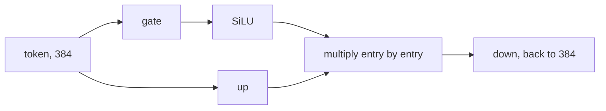

# 14. SwiGLU

[Chapter 5](05-the-block-and-the-full-model.md) widens each token from 384 numbers to 1,536, bends
every number with GELU, and narrows back to 384. The bend is a fixed function of the number it
bends. This chapter puts a second wide copy beside the first. One copy holds values. The other is a
gate: it passes through SiLU, multiplies the values one number at a time, and a third layer narrows
back. The wide size is 1,024, so the three matrices hold the same 1,179,648 weights as the two they
replace. The short run that adds this switch, on top of [chapter 13](13-rotary-position-embedding.md),
lowers the held-out loss by 0.0099. The build log reads that drop as about 50 times the gap between
two v1 seeds. The matrices stay the same size. Eight blocks do add 4,096 bias parameters.

**Code:** [`hello_tokens/model/block.py`](../../hello_tokens/model/block.py) ·
[`hello_tokens/model/config.py`](../../hello_tokens/model/config.py) ·
[`hello_tokens/model/gpt.py`](../../hello_tokens/model/gpt.py)
**Tests:** [`tests/model/test_swiglu_gqa.py`](../../tests/model/test_swiglu_gqa.py)

## Words

- **Feed-forward network**, **GELU**, **non-linearity**, **residual connection**, **block**,
  **linear layer**, **bias**: see [chapter 5](05-the-block-and-the-full-model.md#words). **Width**,
  **parameters**: see [chapter 4](04-embeddings-and-attention.md#words). **Loss**, **ln**: see
  [chapter 6](06-the-learning-loop.md#words). **Perplexity**: see
  [chapter 9](09-measuring-it-perplexity.md#words). **Ablation**: see
  [chapter 12](12-rmsnorm.md#words).
- **Sigmoid**: a function that squashes one number into the open interval between 0 and 1,
  `1 / (1 + e^(−x))`. Here `e` is the base of the natural logarithm from chapter 6. A large positive
  input gives a result near 1. A large negative input gives a result near 0. Zero gives 1/2.
- **SiLU**: the input multiplied by its own sigmoid, `x * sigmoid(x)`. A large negative input is
  driven near 0. A large positive input is left near itself. The module uses this as a smooth valve.
- **Gate**: a second vector, the same length as the values, that decides how much of each value
  passes. The decision is a learned linear image of the token, then SiLU, then an element-by-element
  product. It is a different vector from the values.
- **SwiGLU**: the feed-forward network built that way. Shazeer, 2020, is the paper the class
  docstring cites.
- **Hidden width**: how many numbers the wide part holds. For the GELU network it is 4 × 384 =
  1,536. For SwiGLU at this model's width it is 1,024.

## The idea

### A valve with its own weights

GELU, as chapter 5 measured it, lets a large positive number through and pushes a large negative
number toward zero. The amount that passes is computed from that same number. There is no second
opinion. If the network wants coordinate 7 to be large and still wants to suppress it, GELU cannot
do both: the size and the valve are the same quantity.

SwiGLU splits them. From the token's 384 numbers it makes two vectors of hidden width. `up` is the
value, what could be passed on. `gate` is the valve setting. SiLU is applied to the gate only, and
the two vectors are multiplied entry by entry. Coordinate 7 of the value can be large while
coordinate 7 of the gate is largely negative, and the product is then near zero. The next token's
gate is a different linear image, so the valve can change from token to token. A third layer,
`down`, returns the product to 384 numbers. The block adds that result onto the residual stream,
exactly as chapter 5 added the GELU network's result.



The printed SiLU of `−4, −1, 0, 1, 4` sits close to the GELU of the same five numbers. Both are near
0 at a large negative input and near the input itself at a large positive one. The gap between the
two functions on a single number is small next to what a second vector can do. In the run below, a
value of 10 is multiplied by the SiLU of a gate of `−8`, of `0`, and of `8`. The products are about
`−0.027`, exactly `0`, and about `80`. One stream of values, bent by GELU, has no place to put that
choice.

### The same number of weights

Three matrices would be a larger network if each were the old size. v1's two matrices are 384 by
1,536 and 1,536 by 384, and `2 × 384 × 1,536 = 1,179,648` weights. Three matrices of a hidden width
`h` hold `3 × 384 × h` weights. Setting those equal gives `h = 8 × 384 / 3 = 1,024`. That is two
thirds of 1,536, and it is already a multiple of 64. The function that picks the hidden width still
rounds up to a multiple of 64, because that is what its comment asks for. At width 384 the rounding
has nothing to do.

The comparison in the ablation is then a comparison of designs. Both networks hold 1,179,648
weights. Leaving the hidden width at 1,536 and adding a third matrix would hold `3 × 384 × 1,536 =
1,769,472` weights, one and a half times as many. A loss change on that larger network could be the
extra weights. This chapter's loss change cannot.

Biases are separate. Each linear layer has one bias entry per output. The GELU network's biases are
1,536 on the way up and 384 on the way down, 1,920 in all. SwiGLU's are 1,024, 1,024, and 384,
which is 2,432. The difference is 512 per block. Eight blocks add 4,096 parameters, and no other
part of the model changes size on this switch. The test that says the networks are the same size
counts names ending in `weight`. It does not count biases. The preset's parameter count does.

## The shapes

Nothing in this network mixes one position with another. A linear layer acts on the last dimension,
as chapter 5 used it, so the batch and the time axes pass through.

| Tensor | Shape | What it is |
|---|---|---|
| input, and the output of `down` | B × time × 384 | the residual width, unchanged |
| `gate` and `up`, and their product | B × time × 1,024 | one valve and one value per position |
| `gate.weight`, `up.weight` | 1,024 × 384 | one row per hidden coordinate |
| `down.weight` | 384 × 1,024 | back to the residual width |

The product is legal because the gate and the value have the same shape, including the hidden
width. A hidden width that differed between them would not multiply. The small shape test uses a
width of 24, where the same rule gives a hidden width of 64, and checks only that the output shape
equals the input shape `(2, 10, 24)`.

## The code

### Choosing the hidden width

<!-- from: hello_tokens/model/block.py -->
```python
def swiglu_hidden(width: int) -> int:
    """2/3 of the GELU network's 4x, so three matrices hold as many weights as its two; rounded up
    to a multiple of 64, which GPUs handle efficiently. For width 384: exactly 1,024."""
    return -(-(8 * width // 3) // 64) * 64
```

`4 * width` is the GELU network's hidden size, 1,536 at the real width. Two thirds of that is
`8 * width / 3`. The code uses integer division, `8 * width // 3`, which at width 384 is 1,024
exactly. The rest of the line rounds that integer up to a multiple of 64. Python's `//` rounds
toward negative infinity, so for a positive `n` the quantity `-(-n // 64)` is the ceiling of
`n / 64`. Multiplying by 64 is the next multiple, or `n` itself when `n` is already a multiple.

At width 384, `1,024 / 64 = 16` exactly, and the ceiling leaves 1,024. The docstring's example is
this case. At width 64, which this model does not use, `8 * 64 // 3` is 170, and the ceiling step
returns 192. The run prints both. The real model's call never takes that second path.

### The three layers

<!-- from: hello_tokens/model/block.py -->
```python
class SwiGLU(nn.Module):
    """The gated feed-forward network of modern models (Shazeer, 2020).

    Two layers widen the token: one gives values (`up`), the other a gate (`gate`). The gate passes
    through SiLU (x * sigmoid(x)), a smooth switch, and multiplies the values, so the network learns
    per number how much to let through. Then `down` narrows back.
    """

    def __init__(self, config: ModelConfig):
        super().__init__()
        hidden = swiglu_hidden(config.width)
        self.gate = nn.Linear(config.width, hidden)
        self.up = nn.Linear(config.width, hidden)
        self.down = nn.Linear(hidden, config.width)

    def forward(self, x: torch.Tensor) -> torch.Tensor:
        return self.down(F.silu(self.gate(x)) * self.up(x))
```

`hidden` is computed once, at construction. `gate` and `up` both map `config.width` to that hidden
size, so their matrices are the same shape and their outputs can multiply. `down` maps the other
way. PyTorch's `nn.Linear` includes a bias unless told otherwise, which is where the extra 512
parameters per block come from. The weight shapes printed below are `(1,024, 384)` for `gate` and
`up`, and `(384, 1,024)` for `down`: one row per output, the layout chapter 5 already used.

`F.silu` is the SiLU above. It is applied to `self.gate(x)` only. `self.up(x)` is not bent before
the product. The parentheses matter: the product happens at hidden width, and `down` sees the
product. There is no activation after `down`. Chapter 5's GELU network has the same habit. The
non-linearity sits in the wide part, and the residual stream receives a linear image of that wide
result.

### The switch, and the line that calls it

<!-- from: hello_tokens/model/block.py -->
```python
        self.norm2 = make_norm(config)
        self.feed_forward = SwiGLU(config) if config.feed_forward == "swiglu" else FeedForward(config)

    def forward(self, x: torch.Tensor, cache: KVCache | None = None, layer: int = 0) -> torch.Tensor:
        x = x + self.attention(self.norm1(x), cache, layer)
        x = x + self.feed_forward(self.norm2(x))
        return x
```

Chapter 5 built a `FeedForward` and left this choice for here. The default string is `"gelu"`, so a
v1 config still constructs the two-layer network. `"swiglu"` constructs the class above. The second
line of `forward` does not mention which class it holds. It normalizes a copy of the stream, runs
whatever module was stored, and adds the result back. The residual around the feed-forward network
is unchanged.

> **Later:** `cache` and `layer` belong to the KV cache. The block's `decode` method, the
> fixed-shape one-token step, calls `self.feed_forward` in the same way. Neither path changes the
> arithmetic of this chapter.

The config is what makes the string legal:

<!-- from: hello_tokens/model/config.py -->
```python
    position: str = "learned"  # learned position table, or "rope" (rotary)
    feed_forward: str = "gelu"  # or "swiglu"
    kv_heads: int | None = None  # key/value heads; None = one per query head (v1). Fewer = GQA
```

<!-- from: hello_tokens/model/config.py -->
```python
        if self.position not in ("learned", "rope"):
            raise ValueError(f"unknown position {self.position!r}")
        if self.feed_forward not in ("gelu", "swiglu"):
            raise ValueError(f"unknown feed_forward {self.feed_forward!r}")
```

Chapter 13 showed both checks and left the second one for here. `"gelu"` and `"swiglu"` pass.
Anything else raises, and the message names the string. A checkpoint written before the field
existed still loads as `"gelu"`, by the same default rule chapter 12 gave for the norm.

> **Later:** `kv_heads` is the next chapter's switch. The check under this one refuses a count of
> key/value heads that does not divide the query heads.

The preset ladder adds one field at this step:

<!-- from: hello_tokens/model/config.py -->
```python
    "rope": ModelConfig(norm="rmsnorm", position="rope"),
    "swiglu": ModelConfig(norm="rmsnorm", position="rope", feed_forward="swiglu"),
```

`"swiglu"` is RMSNorm, rotary positions, and this network. It does not set `kv_heads`, so the
attention module stays at one key/value head per query head. The loss row below is that one added
field, on top of chapter 13's row.

> **Later:** the next line of the dict is `"v2"`, which sets `kv_heads=2` as well. Its parameter
> count and its loss are the next chapter's.

## What would go wrong the other way

**Keeping GELU.** That is v1's network, and it trains. It is also the `"rope"` preset. On the short
run it sits 0.0099 of loss above this switch, with the same 1,179,648 weights in the matrices. The
case for keeping it is familiarity, not a better loss on this ladder.

**A third matrix at hidden width 1,536.** The weight count becomes 1,769,472. The ablation would
then mix a design change with a size change, and the build log's statement that the three matrices
hold as many weights as the two would be false.

**Skipping the multiple-of-64 rounding.** At width 384 the hidden width is already 1,024, so the
trained model is unaffected. At a width where `8 * width // 3` is not a multiple of 64, the
function's comment is the reason for the ceiling: multiples of 64 are the sizes it says the GPU
handles efficiently. This book has no separate timing of that rounding.

**SiLU on the value, or on the product, instead of on the gate.** Then the valve is no longer a
second learned vector squashed into a smooth switch. The class applies `F.silu` to `self.gate(x)`
and multiplies the unbent `self.up(x)`. Swapping them is a different function, and a product taken
before SiLU lets two negative numbers become a positive one before the valve exists.

**A string other than the two allowed.** `ModelConfig(feed_forward="relu")` raises
`ValueError: unknown feed_forward 'relu'`. There is no third activation hiding behind an unknown
name.

**Loading a v1 checkpoint into the switched model.** The parameter names and the hidden width both
differ. The run below loads the small v1 fixture, width 24 and two blocks, into the same config
with only `feed_forward` set to `"swiglu"`. The gate tensors are missing, and `up` and `down` have
the wrong shapes. `down.bias` is the same length on both sides, because `down` still outputs the
width, so it is absent from the error. The load fails anyway.

## Proving it works

The file fixes the torch seed, so any random tensor it builds is the same on every run:

<!-- from: tests/model/test_swiglu_gqa.py -->
```python
V2 = ModelConfig(norm="rmsnorm", position="rope", feed_forward="swiglu", kv_heads=2)


@pytest.fixture(autouse=True)
def fixed_seed():
    torch.manual_seed(0)
```

> **Later:** `V2` turns on the next chapter's head sharing as well. The fixture's seed is 0.

The size claim counts weights only, on the default config, which is width 384:

<!-- from: tests/model/test_swiglu_gqa.py -->
```python
def weights(module):
    return sum(p.numel() for name, p in module.named_parameters() if name.endswith("weight"))


def test_swiglu_holds_exactly_as_many_weights_as_the_gelu_network():
    config = ModelConfig()
    assert swiglu_hidden(384) == 1024
    assert weights(SwiGLU(config)) == weights(FeedForward(config)) == 1_179_648
```

`1_179_648` is one million, one hundred seventy-nine thousand, six hundred forty-eight. Both
modules must match it, and each other. A hidden width of 1,536 on the SwiGLU side would fail the
second line. An off-by-one in `swiglu_hidden` would fail the first.

The output shape is the input shape, on a model small enough to build in the test:

<!-- from: tests/model/test_swiglu_gqa.py -->
```python
def test_swiglu_keeps_the_shape():
    config = ModelConfig(vocab_size=50, context=16, width=24, layers=1, heads=4, feed_forward="swiglu")
    x = torch.randn(2, 10, 24)
    assert SwiGLU(config)(x).shape == x.shape
```

Vocabulary 50, context 16, width 24, one layer, four heads. The tensor is batch 2, time 10, width
24. The assertion is the shape, not the values. `swiglu_hidden(24)` is 64, from the same function,
and the test does not assert that 64. It would still pass if the hidden width were wrong, as long
as `down` returned width 24. The weight test is what pins the hidden width, at 384.

The ladder's names, and the rule that neighbors differ by one field:

<!-- from: tests/model/test_swiglu_gqa.py -->
```python
    names = list(PRESETS)
    assert names == ["v1", "rmsnorm", "rope", "swiglu", "v2"]
    assert PRESETS["v1"] == ModelConfig() and PRESETS["v2"] == V2
    for before, after in zip(names, names[1:]):
        a, b = asdict(PRESETS[before]), asdict(PRESETS[after])
        assert sum(a[k] != b[k] for k in a) == 1  # exactly one field differs
```

From `"rope"` to `"swiglu"` the field that changes is `feed_forward`. From `"swiglu"` to `"v2"` the
field is `kv_heads`. The loss row of this chapter is the first of those two steps.

A bad string is refused at construction:

<!-- from: tests/model/test_swiglu_gqa.py -->
```python
def test_bad_switch_values_are_rejected():
    with pytest.raises(ValueError):
        ModelConfig(feed_forward="relu")
```

The test requires `ValueError`. It does not pin the message. The illustration prints the message
the config actually raises.

> **Later:** the next raise in that test is `ModelConfig(heads=6, kv_heads=4)`, the next chapter's
> rejected split.

## Run it

The preset command, already trained as the short run below:

```
uv run python -m hello_tokens train --model swiglu
```

The tests need no checkpoint:

```
uv run pytest tests/model/test_swiglu_gqa.py
```

SiLU against the sigmoid, the gate products, the hidden-width rounding, the weight and bias counts,
the preset's parameter count, the rejected string, and the v1 fixture loaded into this switch:

<!-- illustration -->
```python
import torch
import torch.nn.functional as F
from hello_tokens.model.block import FeedForward, SwiGLU, swiglu_hidden
from hello_tokens.model.config import ModelConfig, PRESETS
from hello_tokens.model.gpt import GPT

x = torch.tensor([-4.0, -1.0, 0.0, 1.0, 4.0])
print("sigmoid", torch.sigmoid(x).tolist())
print("silu", F.silu(x).tolist())
print("gelu", F.gelu(x).tolist())
value = torch.tensor([10.0, 10.0, 10.0])
gate = torch.tensor([-8.0, 0.0, 8.0])
print("silu_gate", F.silu(gate).tolist())
print("gated", (F.silu(gate) * value).tolist())
print("hidden384", swiglu_hidden(384))
print("raw64", 8 * 64 // 3)
print("hidden64", swiglu_hidden(64))
print("hidden24", swiglu_hidden(24))

def count(module, suffix):
    return sum(p.numel() for name, p in module.named_parameters() if name.endswith(suffix))

s, g = SwiGLU(ModelConfig()), FeedForward(ModelConfig())
print("weights", count(s, "weight"), count(g, "weight"))
print("bias", count(s, "bias"), count(g, "bias"))
print("bias_gap_eight", 8 * (count(s, "bias") - count(g, "bias")))
print("matrices", 3 * 384 * 1024, 2 * 384 * 1536, 3 * 384 * 1536)
print("gate", tuple(s.gate.weight.shape), tuple(s.gate.bias.shape))
print("up", tuple(s.up.weight.shape), tuple(s.up.bias.shape))
print("down", tuple(s.down.weight.shape), tuple(s.down.bias.shape))
print("gelu_up", tuple(g.up.weight.shape), tuple(g.up.bias.shape))
print("gelu_down", tuple(g.down.weight.shape), tuple(g.down.bias.shape))
small = ModelConfig(vocab_size=50, context=16, width=24, layers=1, heads=4, feed_forward="swiglu")
print("shape", tuple(SwiGLU(small)(torch.zeros(2, 10, 24)).shape))
print("rope", GPT(PRESETS["rope"]).parameter_count())
print("swiglu", GPT(PRESETS["swiglu"]).parameter_count())
try:
    ModelConfig(feed_forward="relu")
except ValueError as error:
    print("bad", error)
golden = torch.load("tests/model/fixtures/v1_golden.torch")
cfg = dict(golden["model_config"])
cfg["feed_forward"] = "swiglu"
try:
    GPT(ModelConfig(**cfg)).load_state_dict(golden["model"])
except RuntimeError as error:
    print(error)
```

```
sigmoid [0.01798621006309986, 0.2689414322376251, 0.5, 0.7310585975646973, 0.9820137619972229]
silu [-0.07194484025239944, -0.2689414322376251, 0.0, 0.7310585975646973, 3.9280550479888916]
gelu [-0.00012671947479248047, -0.1586552858352661, 0.0, 0.8413447141647339, 3.999873161315918]
silu_gate [-0.00268280110321939, 0.0, 7.997317314147949]
gated [-0.026828011497855186, 0.0, 79.97317504882812]
hidden384 1024
raw64 170
hidden64 192
hidden24 64
weights 1179648 1179648
bias 2432 1920
bias_gap_eight 4096
matrices 1179648 1179648 1769472
gate (1024, 384) (1024,)
up (1024, 384) (1024,)
down (384, 1024) (384,)
gelu_up (1536, 384) (1536,)
gelu_down (384, 1536) (384,)
shape (2, 10, 24)
rope 15762816
swiglu 15766912
bad unknown feed_forward 'relu'
Error(s) in loading state_dict for GPT:
	Missing key(s) in state_dict: "blocks.0.feed_forward.gate.weight", "blocks.0.feed_forward.gate.bias", "blocks.1.feed_forward.gate.weight", "blocks.1.feed_forward.gate.bias". 
	size mismatch for blocks.0.feed_forward.up.weight: copying a param with shape torch.Size([96, 24]) from checkpoint, the shape in current model is torch.Size([64, 24]).
	size mismatch for blocks.0.feed_forward.up.bias: copying a param with shape torch.Size([96]) from checkpoint, the shape in current model is torch.Size([64]).
	size mismatch for blocks.0.feed_forward.down.weight: copying a param with shape torch.Size([24, 96]) from checkpoint, the shape in current model is torch.Size([24, 64]).
	size mismatch for blocks.1.feed_forward.up.weight: copying a param with shape torch.Size([96, 24]) from checkpoint, the shape in current model is torch.Size([64, 24]).
	size mismatch for blocks.1.feed_forward.up.bias: copying a param with shape torch.Size([96]) from checkpoint, the shape in current model is torch.Size([64]).
	size mismatch for blocks.1.feed_forward.down.weight: copying a param with shape torch.Size([24, 96]) from checkpoint, the shape in current model is torch.Size([24, 64]).
```

The sigmoid of `−4` is about `0.018`, and SiLU multiplies that by `−4`, giving about `−0.072`. The
sigmoid of `4` is about `0.982`, and SiLU is about `3.928`. GELU of the same two inputs is about
`−0.00013` and about `4.000`. Close on a lone number. The gate products are the other claim: SiLU
of `−8` is about `−0.0027`, times 10 is about `−0.027`; SiLU of `0` is `0`, and the product is `0`;
SiLU of `8` is about `7.997`, times 10 is about `79.97`.

`matrices` prints three products: three matrices at hidden 1,024, two matrices at hidden 1,536, and
three matrices at hidden 1,536. The first two agree at 1,179,648. The third is 1,769,472. Biases
are 2,432 against 1,920, and eight blocks widen the model by 4,096. The preset count goes from
15,762,816 to 15,766,912, which is that same 4,096.

The fixture is the one
[`tests/model/fixtures/make_v1_golden.py`](../../tests/model/fixtures/make_v1_golden.py) records:
vocabulary 50, context 16, width 24, two layers, four heads, v1's feed-forward network. Four times
24 is 96, which is the checkpoint side of `up.weight`. `hidden24` is 64, the SwiGLU side. Both
blocks report the same mismatch. `down.bias` would be length 24 either way, and it is not in the
error.

## What we got

This is the next row of chapter 13's ladder, under the same short recipe that chapter states. The
`"swiglu"` preset stacks this switch on RMSNorm and rotary positions. Losses, the change,
perplexities, and parameter counts are the build log's table. The minutes are
[`benchmarks/ablations.json`](../../benchmarks/ablations.json) under `abl-rope` and `abl-swiglu`.

| Run | Held-out loss | Against the row above | Perplexity | Parameters | Minutes |
|---|---:|---:|---:|---:|---:|
| + RoPE | 1.4785 | −0.0345 | 4.386 | 15,762,816 | 19.1 |
| + SwiGLU | 1.4686 | **−0.0099** | 4.343 | 15,766,912 | 20.4 |

- **The loss drop is the design, at equal matrix size.** −0.0099 against chapter 13's seed gap of
  0.0002 is the build log's "about 50 times the noise". Perplexity moves from 4.386 to 4.343. The
  build log's reading is that the gate adds a further gain, with the same number of weights. One
  seed, and a short run: chapter 12's limit still applies. The full training run that also changes
  the key/value heads is the later chapter's to measure.
- **The parameters that moved are biases.** 15,766,912 is 15,762,816 plus 4,096. The weight test's
  1,179,648 is unchanged. The build log's account of the finished model includes this `+4,096` as
  SwiGLU's extra bias. The finished count itself waits until the next chapter removes the shared
  key/value parameters.
- **The minutes are a training-time reading of one run.** 20.4 against the rotary row's 19.1.
  [`docs/benchmarks.md`](../../docs/benchmarks.md) has no row for SwiGLU alone. The published
  generation speeds are whole models. This chapter does not read them as a SwiGLU speed-up, or as a
  SwiGLU slowdown.

## Check yourself

1. The weight test asserts `swiglu_hidden(384) == 1024` and that both networks hold 1,179,648
   weights. Why is the `"swiglu"` preset's parameter count still 4,096 above the `"rope"` preset?
2. The illustration multiplies a value of 10 by the SiLU of gates `−8`, `0`, and `8`. What are the
   three products, and why is that pattern outside what GELU can do to one stream of values?
3. In the fixture's load error, `up.weight` is `[96, 24]` in the file and `[64, 24]` in the model.
   Where do 96 and 64 come from, and why does the error never mention `down.bias`?

<details>
<summary>Answers</summary>

1. The test's helper keeps parameters whose names end in `weight`. Biases are excluded. The
   illustration's bias counts are 2,432 for one SwiGLU and 1,920 for one GELU network, a gap of
   512, and `bias_gap_eight` is 4,096 across the eight blocks. The preset counts print as
   15,762,816 and 15,766,912. The matrices print as 1,179,648 on both sides (`matrices`' first two
   numbers). A hidden width of 1,536 with three matrices would have printed 1,769,472 instead.
2. The printed `gated` list is `−0.026828011497855186`, `0.0`, and `79.97317504882812`. They are
   10 times the printed `silu_gate` values, about `−0.00268`, `0`, and `7.997`. GELU's bend is a
   fixed function of the value itself, so a value of 10 has only one image under GELU. The gate is
   a second vector. The same value can be nearly closed, exactly closed, or nearly passed, because
   the valve does not have to equal the value.
3. The fixture's width is 24 (`make_v1_golden.py`). v1's feed-forward network widens 4×, and
   `4 × 24 = 96`, the checkpoint shape. `hidden24` prints 64, which is `swiglu_hidden(24)`, the
   model shape. `down` outputs the width on both networks, so `down.bias` has length 24 either way
   and a strict load does not list it. The error does list the missing `gate.weight` and
   `gate.bias` of `blocks.0` and `blocks.1`, and the size mismatches of `up` and of `down.weight`.
   The load fails. The shape test's tensor is also width 24, but it only checks that `(2, 10, 24)`
   comes back out.

</details>

Next: [15. Grouped-query attention](15-grouped-query-attention.md)
