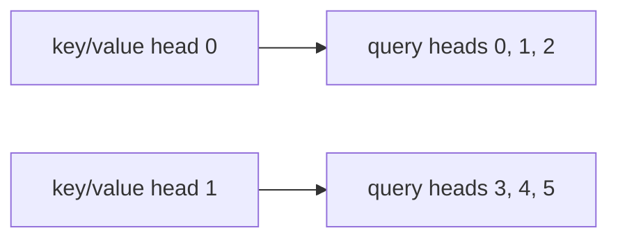

# 15. Grouped-query attention

[Chapter 4](04-embeddings-and-attention.md) gives each of the six query heads its own key and its own
value. The `qkv` layer therefore writes 1,152 numbers per token: 384 for the queries, 384 for the
keys, 384 for the values. This chapter keeps the six query heads and cuts the key/value heads to
two. Three queries share one key and one value. The same layer then writes 640 numbers, and across
eight blocks that removes 1,576,960 parameters. The short run that adds the cut, on top of
[chapter 14](14-swiglu.md), moves the held-out loss by −0.0002, the same size as the gap between
two v1 seeds. The build log's reading is that the quality change is not measurable. What does
change, and is tested, is the store of keys and values: 4,096 bytes per position in bf16 instead of
12,288. The model with all four switches has 14,189,952 parameters, which the build log calls 10.6%
fewer than v1.

**Code:** [`hello_tokens/model/attention.py`](../../hello_tokens/model/attention.py) ·
[`hello_tokens/model/config.py`](../../hello_tokens/model/config.py) ·
[`hello_tokens/model/cache.py`](../../hello_tokens/model/cache.py)
**Tests:** [`tests/model/test_swiglu_gqa.py`](../../tests/model/test_swiglu_gqa.py) ·
[`tests/model/test_cache.py`](../../tests/model/test_cache.py)

## Words

- **Query**, **key**, **value**, **head**, **head width**, **dot product**: see
  [chapter 4](04-embeddings-and-attention.md#words). **Block**: see
  [chapter 5](05-the-block-and-the-full-model.md#words). **Ablation**: see
  [chapter 12](12-rmsnorm.md#words). **SwiGLU**: see [chapter 14](14-swiglu.md#words).
- **Grouped-query attention**: several query heads share one key head and one value head. Ainslie
  et al., 2023, is the paper the build log names. The module's own comment calls it GQA.
- **Group**: the query heads that share one key/value head. The count is query heads divided by
  key/value heads. In the real model that is 6 / 2 = 3.
- **`kv_heads`**: how many key/value heads a block has. `None` means one per query head, which is
  v1. The property `kv_head_count` is the number the layer actually builds.
- **`kv_width`**: `kv_heads` times the head width. The keys, and separately the values, occupy this
  many numbers per token before they are split into heads.

## The idea

### Six questions, two answers

A head is a slice of the token, 64 numbers wide, free to look for something different from the
other slices. Chapter 4's reason for having six of them is six different mixtures of the past. The
query is "what am I looking for?", the key is "what do I offer?", and the value is "what do I pass
on?". Grouped-query attention keeps six ways of asking and two ways of answering. Query heads 0, 1,
and 2 read key/value head 0. Query heads 3, 4, and 5 read key/value head 1. The scores are still
chapter 4's dot products. Only the menu of keys and values is shorter.



The sharing is exact, not approximate. Copying key/value head 0 onto three query slots, and head 1
onto the other three, and then running ordinary attention, is the same computation. A test builds
that ordinary layer from a grouped layer's weights and requires the outputs to match. The grouped
layer is not a new score formula. It is the old formula with repeated keys and values.

### Where the parameters go

The savings sit in `qkv`, and only in the key and the value parts. The queries are still six heads
of 64, which is the full width, 384. The keys shrink from six heads to two, 128 numbers, and the
values shrink the same way. The layer's output width is `384 + 128 + 128 = 640`, against v1's
1,152. The projection that mixes the heads back together, `out`, still maps 384 to 384, because
six query heads are still concatenated. Nothing is saved there.

One `qkv` at width 384 holds 443,520 parameters with six key/value heads and 246,400 with two. The
difference, 197,120, times eight blocks, is 1,576,960. That is the whole of this switch. From the
SwiGLU preset's 15,766,912 parameters, 1,576,960 is the fraction the build log calls 10%. The run
prints the unrounded quotient, 0.100017048360516.

The loss row is allowed to be read as a design comparison at a smaller size, which is the opposite
of chapter 14's care to keep the weight count equal. Here the size change is the point. The
measured quality change on this short run is inside the noise, which is the result the build log
states.

### What the store will hold

Without a store, every new token re-reads the whole window, and chapter 10's profile says the wait
in that step is the launches, not the arithmetic inside them. A narrower matrix removes arithmetic.
It does not remove a launch. This chapter does not claim a faster uncached step, and the published
table has no row that turns this switch on by itself.

The store is the reason the cut exists. Keys and values are what a later chapter keeps so a new
token need not recompute them. The buffer's head axis is `kv_head_count`, not the query-head count.
Two heads instead of six is a factor of three, in every layer, for both the keys and the values. A
test on the real presets, in bf16, pins 12,288 bytes per position against 4,096. The build log
calls those 12 KB and 4 KB per token. The test's cache is batch 1, so per position and per token
are the same number.

## The shapes

Chapter 4's v1 row was batch × time × 1,152 going into the split, then batch × 6 × time × 64 for
each of query, key, and value. With two key/value heads the middle of that changes.

| Tensor | Shape | What changed |
|---|---|---|
| `qkv` output | B × time × 640 | was B × time × 1,152 |
| query | B × 6 × time × 64 | still one slice per query head |
| key and value, from `_project` | B × 2 × time × 64 | two heads, not six |
| key and value, after the repeat | B × 6 × time × 64 | each key/value head written three times |
| `out` input | B × time × 384 | six heads of 64, side by side, as in v1 |

The repeat is along the head axis, dimension 1. A plain tile of the two heads would lay them down
as head 0, head 1, head 0, head 1, head 0, head 1. The queries would then be paired with the wrong
neighbor. `repeat_interleave` writes head 0 three times, then head 1 three times, which is the
picture above. The run prints both orders for the numbers 10 and 20.

The test that proves the sharing uses a different group, on purpose. Width 32, four query heads,
two key/value heads: the head width is 8 and the group is 2, so each key/value head is copied twice,
not three times. The real model's "0–2 and 3–5" and the test's "twice, then twice" are the same
rule at two sizes.

## The code

### How many key/value heads

<!-- from: hello_tokens/model/config.py -->
```python
    @property
    def kv_head_count(self) -> int:
        return self.kv_heads or self.heads
```

`kv_heads` defaults to `None`. `None` is false in the `or`, so the property returns `heads`, which
is 6. Setting `kv_heads=2` returns 2. Setting `kv_heads=3` also returns 3: three divides six, so
the groups are equal. The illustration prints those three results as `6 2 3`.

The constructor refuses a count that does not divide:

<!-- from: hello_tokens/model/config.py -->
```python
        if self.heads % self.kv_head_count:
            raise ValueError("the query heads must divide evenly between the key/value heads")
```

Six query heads and four key/value heads leave a remainder of 2. The message is
`the query heads must divide evenly between the key/value heads`. There is no leftover head and no
silent uneven group.

### One layer, a narrower cut

Chapter 4 showed the fields and hid the comment that states the widths. This is that comment:

<!-- from: hello_tokens/model/attention.py -->
```python
        self.heads = config.heads
        self.kv_heads = config.kv_head_count
        self.head_width = config.head_width
        # One layer makes queries, keys and values for every head at once. With grouped-query
        # attention (GQA) there are fewer key/value heads than query heads, so the layer is narrower:
        # width for the queries, then kv_heads * head_width each for keys and values. With
        # kv_heads == heads this is v1's 3 * width, so v1 checkpoints still load.
        self.kv_width = self.kv_heads * config.head_width
        self.qkv = nn.Linear(config.width, config.width + 2 * self.kv_width)
        # Mixes what the heads found back into one vector per token.
        self.out = nn.Linear(config.width, config.width)
```

`kv_width` is `2 × 64 = 128` when `kv_heads` is 2, and `6 × 64 = 384` when it equals `heads`. The
linear layer's output count is the width plus two copies of `kv_width`: 640, or 1,152. One layer
still produces all three kinds of vector. A saved v1 `qkv` weight loads into this layer when the
counts match, because a v1 file's `qkv` weight has shape `(1,152, 384)`, and that is the shape
this line builds when `kv_heads` is 6. The run prints `(1152, 384)` and `(640, 384)`.

`out` does not take `kv_width`. Its weight stays `(384, 384)`.

The split uses those widths, and the key and the value are divided into `kv_heads` slices rather
than into `heads` slices:

<!-- from: hello_tokens/model/attention.py -->
```python
        query, key, value = self.qkv(x).split([width, self.kv_width, self.kv_width], dim=-1)

        # (batch, time, heads * head_width) -> (batch, heads, time, head_width): one slice per head.
        def split_heads(t: torch.Tensor, heads: int) -> torch.Tensor:
            return t.view(batch, length, heads, self.head_width).transpose(1, 2)

        return split_heads(query, self.heads), split_heads(key, self.kv_heads), split_heads(value, self.kv_heads)
```

`width` here is the last dimension of `x`, 384 in the real model. The three pieces are 384, 128,
and 128 when two key/value heads are in use. `split_heads` only relabels. Query becomes
`(batch, 6, time, 64)`. Key and value become `(batch, 2, time, 64)`. Chapter 4's
`causal_attention` then wants the head axes to match, so the forward path repeats first.

### Repeating a head across its group

<!-- from: hello_tokens/model/attention.py -->
```python
            if self.kv_heads != self.heads:
                # GQA: each key/value head serves a group of query heads. Repeating it once per query
                # head in its group lines them up: query heads 0-2 use kv head 0, heads 3-5 kv head 1.
                group = self.heads // self.kv_heads
                key, value = key.repeat_interleave(group, dim=1), value.repeat_interleave(group, dim=1)
            output, _ = causal_attention(query, key, value)
        return self._combine(output)
```

The comment is the real model: group `6 // 2 = 3`, queries 0–2 on key/value head 0, queries 3–5 on
head 1. `dim=1` is the head axis of `(batch, heads, time, head_width)`. When `kv_heads` already
equals `heads`, the branch does not run, and the tensors from `_project` are already aligned. That
is why v1's forward is unchanged.

> **Later:** the other branch of this `if` calls PyTorch's fused attention and passes
> `enable_gqa` instead of copying. The block's `decode` path copies with the same
> `repeat_interleave` when the fused flag is off. Both are later chapters. The copy in this excerpt
> is the path the tests run, because a new attention module leaves `fused` false.

The preset that turns the switch on is the last step of the ladder:

<!-- from: hello_tokens/model/config.py -->
```python
    "swiglu": ModelConfig(norm="rmsnorm", position="rope", feed_forward="swiglu"),
    "v2": ModelConfig(norm="rmsnorm", position="rope", feed_forward="swiglu", kv_heads=2),
```

`"v2"` differs from `"swiglu"` in `kv_heads` only. Chapter 14's test already requires that
neighbors in this dict differ by one field. The loss row below is that field.

### The bytes the store will use

The cache chapter owns how a new token is written and how the pointer moves. The shape it allocates
is this chapter's fact, because the head axis is the key/value count:

<!-- from: hello_tokens/model/cache.py -->
```python
        # (layers, batch, key/value heads, positions, head width). With GQA only the key/value heads
        # are stored, which is why GQA makes the cache smaller.
        shape = (config.layers, batch, config.kv_head_count, config.context, config.head_width)
```

<!-- from: hello_tokens/model/cache.py -->
```python
    def bytes(self) -> int:
        return 2 * self.keys.numel() * self.keys.element_size()
```

The leading 2 is keys plus values. `numel` is every entry of the key buffer: layers, batch,
key/value heads, context, head width. `element_size` is the bytes in one number. Dividing the total
by the context is the per-position cost, at whatever batch the cache was built with.

## What would go wrong the other way

**Leaving every query head its own key and value.** That is v1's attention, and with
`kv_heads` unset it is still what `"swiglu"` trains. It costs the 1,576,960 parameters this switch
removes, and on the short run the loss does not pay that cost back: the change is −0.0002. The
store stays at 12,288 bytes per position.

**`tensor.repeat` instead of `repeat_interleave`.** Repeating `[10, 20]` three times by tiling
produces `[10, 20, 10, 20, 10, 20]`. The interleave produces `[10, 10, 10, 20, 20, 20]`. The second
is the grouping the comment describes. The first pairs query 1 with key/value head 1, query 2 with
head 0, and so on. The sharing test copies with `repeat_interleave` along the stacked heads. A tile
would fail it.

**A key/value count that does not divide the query count.** `ModelConfig(heads=6, kv_heads=4)`
raises. The test's comment is the reason: six query heads cannot be split into four equal groups.
`kv_heads=2` and `kv_heads=3` both divide six, and both construct.

**Forgetting the repeat and calling `causal_attention` anyway.** The query head axis is 6 and the
key head axis is 2. Chapter 4's score is a dot product that lines those axes up. They do not line
up until the repeat. The branch exists so the score function can stay the one chapter 4 wrote.

**Copying on the fused path as well.** The fused kernel is called with `enable_gqa` set and shares
heads itself. The copy is only in the non-fused branch. Doing both would expand heads that the kernel was
about to share.

## Proving it works

The sharing test is an ordinary multi-head layer whose key and value weights are copies of the
grouped layer's. Width 32, four query heads, two key/value heads, head width 8, group 2:

<!-- from: tests/model/test_swiglu_gqa.py -->
```python
def test_gqa_is_ordinary_attention_with_each_key_value_head_shared_by_its_group():
    # Build a GQA layer (4 query heads, 2 key/value heads), then an ordinary multi-head layer whose
    # key/value weights are the GQA ones copied once per query head in the group. Same outputs.
    gqa_config = ModelConfig(vocab_size=50, context=16, width=32, layers=1, heads=4, kv_heads=2)
    mha_config = ModelConfig(vocab_size=50, context=16, width=32, layers=1, heads=4)
    gqa, mha = CausalSelfAttention(gqa_config), CausalSelfAttention(mha_config)

    width, head_width, group = 32, 8, 2
    q_w, k_w, v_w = gqa.qkv.weight.split([width, 2 * head_width, 2 * head_width])
    q_b, k_b, v_b = gqa.qkv.bias.split([width, 2 * head_width, 2 * head_width])

    def per_query_head(t):  # (2 heads * 8, ...) -> (4 heads * 8, ...), kv head 0 twice, then kv head 1 twice
        return t.reshape(2, head_width, *t.shape[1:]).repeat_interleave(group, dim=0).reshape(-1, *t.shape[1:])

    with torch.no_grad():
        mha.qkv.weight.copy_(torch.cat([q_w, per_query_head(k_w), per_query_head(v_w)]))
        mha.qkv.bias.copy_(torch.cat([q_b, per_query_head(k_b), per_query_head(v_b)]))
        mha.out.load_state_dict(gqa.out.state_dict())
    x = torch.randn(2, 10, width)
    assert torch.allclose(gqa(x), mha(x), atol=1e-6)
```

The split widths are `[32, 16, 16]`, because `2 * head_width` is 16. That is two heads of 8 on the
output axis of the weight, which is the weight's layout, not the activation's head axis. The copy
therefore uses `dim=0`. The comment says key/value head 0 twice, then head 1 twice. The input `x`
has shape `(2, 10, 32)`. The tolerance is absolute, `1e-6`, not bit-for-bit. The two modules start
from different random weights; the `copy_` is what makes the ordinary layer a mirror.

When the counts are equal, the state dict loads and the outputs are identical values:

<!-- from: tests/model/test_swiglu_gqa.py -->
```python
def test_kv_heads_equal_to_heads_is_exactly_v1_attention():
    config = ModelConfig(vocab_size=50, context=16, width=24, layers=1, heads=4)
    explicit = ModelConfig(vocab_size=50, context=16, width=24, layers=1, heads=4, kv_heads=4)
    v1, same = CausalSelfAttention(config), CausalSelfAttention(explicit)
    same.load_state_dict(v1.state_dict())  # identical shapes: the layer is still width * 3 wide
    x = torch.randn(1, 8, 24)
    assert torch.equal(v1(x), same(x))
```

Width 24 and four heads, so the head width is 6, and `kv_heads=4` is the same as leaving it unset.
`width * 3` is 72, which is this small layer's `qkv` output, not the real model's 1,152. The input
is `(1, 8, 24)`. `torch.equal` requires the same bits. A tolerance would hide a real disagreement.

The finished small model is still causal. This config is not the width-32 sharing test and not the
width-24 equal-heads test. It has width 24, two layers, six heads, and every v2 switch, including
`kv_heads=2`, so the head width is 4 and the group is 3:

<!-- from: tests/model/test_swiglu_gqa.py -->
```python
def test_the_v2_model_is_causal():
    config = ModelConfig(vocab_size=50, context=16, width=24, layers=2, heads=6, norm="rmsnorm",
                         position="rope", feed_forward="swiglu", kv_heads=2)
    model = GPT(config)
    ids = torch.randint(0, 50, (1, 12))
    changed = ids.clone()
    changed[0, 5] = (ids[0, 5] + 1) % 50
    assert torch.allclose(model(ids)[0, :5], model(changed)[0, :5])
```

Twelve tokens. The token at index 5 is replaced. Positions 0 through 4, the slice `:5`, must agree.
The file's seed fixture, quoted in chapter 14, is what makes `randint` repeatable. The assertion
uses `allclose` with no explicit tolerance of its own.

The parameter identity names every term:

<!-- from: tests/model/test_swiglu_gqa.py -->
```python
def test_the_full_v2_shape_has_the_planned_parameter_count():
    # v1's 15,867,648, minus GQA's narrower key/value layers (1,576,960), RoPE's position table
    # (98,304) and RMSNorm's biases (6,528), plus SwiGLU's extra bias (4,096).
    assert GPT(V2).parameter_count() == 15_867_648 - 1_576_960 - 98_304 - 6_528 + 4_096 == 14_189_952
```

`V2` is the config chapter 14 quoted: RMSNorm, rotary positions, SwiGLU, `kv_heads=2`. 15,867,648
is v1, from chapter 5. 98,304 is the position table, from chapter 13. 6,528 is the norm shifts,
from chapter 12. 4,096 is SwiGLU's extra bias, from chapter 14. 1,576,960 is this chapter.
14,189,952 is the total the build log gives for the v2 model.

The byte test uses those same full presets, not the small `SHAPE` dict at the top of its file
(that dict is context 32 and two layers, and this test does not build it):

<!-- from: tests/model/test_cache.py -->
```python
def test_gqa_makes_the_cache_three_times_smaller():
    v1 = KVCache(PRESETS["v1"], dtype=torch.bfloat16)
    v2 = KVCache(PRESETS["v2"], dtype=torch.bfloat16)
    # keys + values, 8 layers, (6 or 2) heads x 64 numbers, 2 bytes each, per position
    assert v1.bytes() // 256 == 2 * 8 * 6 * 64 * 2 == 12_288
    assert v2.bytes() // 256 == 2 * 8 * 2 * 64 * 2 == 4_096
```

The divisor 256 is the preset context. Eight layers, head width 64, two bytes per bf16 number, and
the leading 2 for keys plus values, are the comment's factors. Six heads against two is the factor
of three in the test's name. Batch is the constructor's default, 1.

The rejected split, beside the rejected feed-forward string chapter 14 already covered:

<!-- from: tests/model/test_swiglu_gqa.py -->
```python
def test_bad_switch_values_are_rejected():
    with pytest.raises(ValueError):
        ModelConfig(feed_forward="relu")
    with pytest.raises(ValueError):
        ModelConfig(heads=6, kv_heads=4)  # 6 query heads can't be split into 4 equal groups
```

## Run it

The preset command, already trained as the short run below:

```
uv run python -m hello_tokens train --model v2
```

The tests need no checkpoint:

```
uv run pytest tests/model/test_swiglu_gqa.py
```

Widths, the two repeat orders, a seed-0 replay of the sharing and equality and causal checks, the
three preset counts, the per-position bytes, and the rejected count:

<!-- illustration -->
```python
import torch
from hello_tokens.model.attention import CausalSelfAttention
from hello_tokens.model.cache import KVCache
from hello_tokens.model.config import ModelConfig, PRESETS
from hello_tokens.model.gpt import GPT

def nparams(module):
    return sum(p.numel() for p in module.parameters())

v1 = CausalSelfAttention(ModelConfig())
gqa = CausalSelfAttention(ModelConfig(kv_heads=2))
print("kv", v1.kv_heads, v1.kv_width, v1.qkv.out_features, gqa.kv_heads, gqa.kv_width, gqa.qkv.out_features)
print("qkv_shape", tuple(v1.qkv.weight.shape), tuple(gqa.qkv.weight.shape))
print("qkv_params", nparams(v1.qkv), nparams(gqa.qkv))
print("out_params", nparams(v1.out), nparams(gqa.out))
print("diff_eight", 8 * (nparams(v1) - nparams(gqa)))
print("group", gqa.heads // gqa.kv_heads)
pair = torch.tensor([10.0, 20.0])
print("interleave", pair.repeat_interleave(3).tolist())
print("tile", pair.repeat(3).tolist())

torch.manual_seed(0)
gqa_config = ModelConfig(vocab_size=50, context=16, width=32, layers=1, heads=4, kv_heads=2)
mha_config = ModelConfig(vocab_size=50, context=16, width=32, layers=1, heads=4)
layer_g, layer_m = CausalSelfAttention(gqa_config), CausalSelfAttention(mha_config)
width, head_width, group = 32, 8, 2
q_w, k_w, v_w = layer_g.qkv.weight.split([width, 2 * head_width, 2 * head_width])
q_b, k_b, v_b = layer_g.qkv.bias.split([width, 2 * head_width, 2 * head_width])

def per_query_head(t):
    return t.reshape(2, head_width, *t.shape[1:]).repeat_interleave(group, dim=0).reshape(-1, *t.shape[1:])

with torch.no_grad():
    layer_m.qkv.weight.copy_(torch.cat([q_w, per_query_head(k_w), per_query_head(v_w)]))
    layer_m.qkv.bias.copy_(torch.cat([q_b, per_query_head(k_b), per_query_head(v_b)]))
    layer_m.out.load_state_dict(layer_g.out.state_dict())
x = torch.randn(2, 10, width)
print("share_max", (layer_g(x) - layer_m(x)).abs().max().item())
print("share_ok", bool(torch.allclose(layer_g(x), layer_m(x), atol=1e-6)))

torch.manual_seed(0)
config = ModelConfig(vocab_size=50, context=16, width=24, layers=1, heads=4)
explicit = ModelConfig(vocab_size=50, context=16, width=24, layers=1, heads=4, kv_heads=4)
a, b = CausalSelfAttention(config), CausalSelfAttention(explicit)
b.load_state_dict(a.state_dict())
y = torch.randn(1, 8, 24)
print("equal", bool(torch.equal(a(y), b(y))))
print("small_qkv", a.qkv.out_features)

torch.manual_seed(0)
causal_cfg = ModelConfig(vocab_size=50, context=16, width=24, layers=2, heads=6, norm="rmsnorm",
                         position="rope", feed_forward="swiglu", kv_heads=2)
model = GPT(causal_cfg)
ids = torch.randint(0, 50, (1, 12))
changed = ids.clone()
changed[0, 5] = (ids[0, 5] + 1) % 50
print("causal", bool(torch.allclose(model(ids)[0, :5], model(changed)[0, :5])))
print("small_head", causal_cfg.head_width, causal_cfg.heads // causal_cfg.kv_head_count)

v1m = GPT(PRESETS["v1"]).parameter_count()
sw = GPT(PRESETS["swiglu"]).parameter_count()
v2m = GPT(PRESETS["v2"]).parameter_count()
print("counts", v1m, sw, v2m)
print("removed", sw - v2m)
print("pct_step", (sw - v2m) / sw)
print("pct_v1", (v1m - v2m) / v1m)
c1 = KVCache(PRESETS["v1"], dtype=torch.bfloat16)
c2 = KVCache(PRESETS["v2"], dtype=torch.bfloat16)
print("per_token", c1.bytes() // 256, c2.bytes() // 256, c1.keys.element_size())
try:
    ModelConfig(heads=6, kv_heads=4)
except ValueError as error:
    print("bad", error)
print("ok", ModelConfig().kv_head_count, ModelConfig(kv_heads=2).kv_head_count, ModelConfig(kv_heads=3).kv_head_count)
```

```
kv 6 384 1152 2 128 640
qkv_shape (1152, 384) (640, 384)
qkv_params 443520 246400
out_params 147840 147840
diff_eight 1576960
group 3
interleave [10.0, 10.0, 10.0, 20.0, 20.0, 20.0]
tile [10.0, 20.0, 10.0, 20.0, 10.0, 20.0]
share_max 5.960464477539063e-08
share_ok True
equal True
small_qkv 72
causal True
small_head 4 3
counts 15867648 15766912 14189952
removed 1576960
pct_step 0.100017048360516
pct_v1 0.105730603552587
per_token 12288 4096 2
bad the query heads must divide evenly between the key/value heads
ok 6 2 3
```

`kv` is heads, `kv_width`, and `qkv` outputs, first for v1 and then for two key/value heads:
6, 384, 1,152 against 2, 128, 640. The weight shapes match those output counts by 384 columns.
`qkv_params` includes each layer's bias: 443,520 against 246,400. `out_params` does not move, at
147,840. `diff_eight` is 1,576,960, and `removed` is the same number taken from the two full
presets. `group` is 3.

`share_max` is the largest absolute gap on a seed-0 replay of the sharing test's copy. It is
5.960464477539063e-08, under the test's `1e-6`, and `share_ok` is True. `equal` is True and
`small_qkv` is 72, which is `3 × 24`. `causal` is True. `small_head` is head width 4 and group 3
on that small v2 config, not on the real model.

`counts` is v1, the SwiGLU preset, and v2: 15,867,648, 15,766,912, and 14,189,952. `pct_step` is
1,576,960 / 15,766,912. `pct_v1` is the drop from v1's count to v2's, and it is not "GQA alone":
the position table, the norm shifts, and SwiGLU's extra biases are in that quotient too. The build
log rounds `pct_v1` to 10.6% fewer, and rounds the step's own fraction to 10%.

`per_token` is 12,288 and 4,096, and the element size is 2, matching the byte test. The rejected
constructor prints the divisibility message. `ok` is the property for unset, for 2, and for 3.

## What we got

This is the last row of the ladder chapter 12 started. Same short recipe. Losses, the change,
perplexities, and parameter counts are the build log's table. The minutes are
[`benchmarks/ablations.json`](../../benchmarks/ablations.json) under `abl-swiglu` and `abl-v2`.

| Run | Held-out loss | Against the row above | Perplexity | Parameters | Minutes |
|---|---:|---:|---:|---:|---:|
| + SwiGLU | 1.4686 | −0.0099 | 4.343 | 15,766,912 | 20.4 |
| + GQA (= v2) | 1.4684 | −0.0002 | 4.342 | 14,189,952 | 19.5 |

- **The loss change is the noise.** −0.0002 is the gap chapter 12 measured between two v1 seeds.
  Perplexity moves from 4.343 to 4.342. The build log's reading is that grouped-query attention
  costs nothing measurable, while removing 10% of the parameters, and that the store of keys and
  values becomes three times smaller. One seed, and a short run: the same limit as the rows above.
- **The parameters are the narrower `qkv` layers, and then the whole stack.** 14,189,952 is
  15,766,912 minus 1,576,960, and it is also the test's full expression,
  `15,867,648 − 1,576,960 − 98,304 − 6,528 + 4,096`. Against v1's 15,867,648 the build log calls
  the finished model 10.6% smaller. The printed `pct_v1` is that quotient before the rounding.
- **Nothing here is a generation speed.** 19.5 minutes against the SwiGLU row's 20.4 is one
  training run's wall time, evaluation included. The build log's summary of these runs, 16 minutes
  rising to 19.5, ends on this row. [`docs/benchmarks.md`](../../docs/benchmarks.md) compares whole
  models. It has no row for key/value heads alone. Chapter 10's account still holds for an uncached
  step: the wait is launches, and a narrower matrix is arithmetic. The byte counts are the measured
  effect this chapter claims.

## Check yourself

1. The sharing test sets `width, head_width, group = 32, 8, 2` and comments that key/value head 0
   is copied twice, then head 1 twice. What shape is `x`, what absolute tolerance is required, and
   why is the copy count two rather than the real model's three?
2. `test_kv_heads_equal_to_heads_is_exactly_v1_attention` uses width 24, four heads, and
   `kv_heads=4`, with an input of shape `(1, 8, 24)`. Why does `load_state_dict` succeed, and what
   does `torch.equal` demand beyond `allclose`?
3. The parameter test equates `parameter_count()` with
   `15,867,648 - 1,576,960 - 98,304 - 6,528 + 4,096`. Which term is this chapter's, and what two
   per-position byte counts does the cache test assert for the same presets in bf16?

<details>
<summary>Answers</summary>

1. `x` is `torch.randn(2, 10, width)`, so its shape is `(2, 10, 32)`. The assertion is
   `torch.allclose(..., atol=1e-6)`. Head width 8 is 32 / 4, and the group is 4 / 2 = 2, so each
   of the two key/value heads is copied twice: the comment's "kv head 0 twice, then kv head 1
   twice", along `dim=0` of the reshaped weight. The real model has six query heads and two
   key/value heads, group 3, which the forward comment describes as queries 0–2 and 3–5. The
   illustration's `share_max` on a seed-0 replay of this copy is 5.960464477539063e-08, and
   `share_ok` is True.
2. Both modules build `qkv` as `width * 3` outputs. The illustration prints `small_qkv` 72, which
   is `3 × 24`. The shapes match, so a v1 state dict loads into `kv_heads=4`. The input the test
   scores is `(1, 8, 24)`. `torch.equal` requires identical values, not values inside a tolerance.
   The illustration prints `equal` True. This test is not the causal test: that one uses six heads,
   `kv_heads=2`, a sequence of length 12, changes index 5, and compares the slice `:5`.
3. 1,576,960 is the narrower key/value layers. The illustration's `diff_eight` and `removed` both
   print 1576960. 98,304 is the position table, 6,528 the norm biases, and 4,096 SwiGLU's extra
   bias. The total is 14,189,952. The cache test asserts `12_288` and `4_096`, from
   `bytes() // 256` on `PRESETS["v1"]` and `PRESETS["v2"]` in bf16, equal to
   `2 * 8 * 6 * 64 * 2` and `2 * 8 * 2 * 64 * 2`. The divisor is the preset context, 256. The
   small `SHAPE` in that file, context 32 and two layers, is not the cache this test builds.

</details>

Next: 16. Ablations, and training v2
