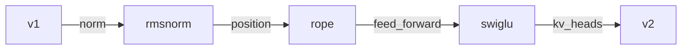

# 16. Ablations, and training v2

[Chapter 12](12-rmsnorm.md), [chapter 13](13-rotary-position-embedding.md),
[chapter 14](14-swiglu.md) and [chapter 15](15-grouped-query-attention.md) each add one switch and
read the short training run that isolates it. This chapter sets the six runs side by side and states
the method: how long the runs are, why two seeds exist, why each row sits on top of the row above,
and what a short run cannot settle. It then shows `train --model`, the refusal to resume a
checkpoint of a different shape, and the full training of the shape that has every switch. Quality
on that full run is a held-out perplexity. Generation speed is a published median. The build log
also records an earlier speed table; that table is not the result.

**Code:** [`hello_tokens/model/config.py`](../../hello_tokens/model/config.py) ·
[`hello_tokens/training/run.py`](../../hello_tokens/training/run.py) ·
[`hello_tokens/__main__.py`](../../hello_tokens/__main__.py) ·
[`benchmarks/ablations.json`](../../benchmarks/ablations.json)
**Tests:** [`tests/training/test_run.py`](../../tests/training/test_run.py) ·
[`tests/model/test_swiglu_gqa.py`](../../tests/model/test_swiglu_gqa.py)

## Words

- **Ablation**, **preset**: see [chapter 12](12-rmsnorm.md#words). **Loss**, **evaluation**,
  **checkpoint**: see [chapter 7](07-the-real-training-run.md#words). **Perplexity**: see
  [chapter 9](09-measuring-it-perplexity.md#words). **Seed**, for a generator: see
  [chapter 8](08-writing-sampling.md#words). Here the same idea fixes the starting parameters and
  the stream of training batches.
- **Cumulative**: each preset keeps every change already made and adds one. The row measures that
  new change on top of the rows above it, not against bare v1, except the first change, which has
  nothing under it but v1.
- **`train --model`**: the command's choice of a named `ModelConfig`. The ladder names are `v1`,
  `rmsnorm`, `rope`, `swiglu` and `v2`. The command also accepts `draft`, which is not a rung.

## The idea

### One change, then the next

A single run of the finished shape would move four switches at once. The loss could fall, and the
run still would not say which switch did it. The presets are built so that training them in order
answers that. `"v1"` is every default from [chapter 5](05-the-block-and-the-full-model.md). Each
later name changes one field. `"v2"` is the last name, not a fifth idea: it is the four switches
together.



The order is the experiment. RoPE is measured on a model that already uses RMSNorm. SwiGLU is
measured on a model that already uses both. A different order would be a different experiment, and
this book reports the order the presets are written in.

### Two seeds, as a yardstick

Training draws a starting model and a stream of windows. Two runs of the same shape need not land
on the same loss. The method trains v1 twice, at seed 0 and seed 1, and treats the gap between
those two losses as the noise. A later row that moves the loss by about that much has not shown a
quality change. A row that moves it by many times that much has. Only v1 is repeated. Every other
rung is one seed.

### Short on purpose

Each rung runs for 4,000 steps, a fifth of chapter 7's full run, scored on every held-out
prediction, the 5,683,947 from [chapter 9](09-measuring-it-perplexity.md). The step size is chapter
7's: 64 windows of 256 tokens, 16,384 tokens a step. The build log writes that budget as 65.5M
tokens. Warm-up is 200 steps. The full recipe warms up for 1,000, and a thousand steps would be a
quarter of this short run, so the short runs shorten the warm-up and otherwise keep the recipe.

These runs are for comparing with each other. They are not a second measurement of the full-file
perplexity in chapter 9.

### What the short runs leave open

The build log states the limits. One seed per variant is a thin estimate of noise, which is why the
yardstick is only a bar for gaps of that size, not a claim that the noise is known to many places.
A gap at this length can shrink or grow over a full run. The full v2 run, later in this chapter, is
the measurement that speaks to that. The minutes also rise from the first row to the last. The
build log says that extra time is a training cost: RMSNorm and RoPE are several small operations
where LayerNorm is one fused kernel. Chapter 12 reads that cost on its own row. It is not a
generation speed.

## The shapes

No new tensor layout appears. A training step is still a batch of token ids of shape batch by
context, the size the short-run method just stated, which is chapter 7's. The neighbour test uses
the real presets. The resume tests use a tiny config: vocabulary 64, context 16, width 32, two
layers, four heads.

The shape the new check compares is not a tensor. Chapter 7's checkpoint already stores
`model_config`, the fields of the `ModelConfig` the run was built with. On resume, `train` builds
a `ModelConfig` from those fields and compares it with the config it was just asked to train. A
frozen dataclass compares field by field. `kv_heads` left unset is the field `None`, which is not
the field `2`, even before any layer is built.

## The code

### The ladder

Chapter 12's excerpt of this dict stops after the `"rmsnorm"` entry. The rest of the ladder is the
same dict:

<!-- from: hello_tokens/model/config.py -->
```python
# Named shapes for `train --model`. Each adds one change to the one before it, so training them in
# order shows what each change does on its own (an ablation); "v2" has all four.
PRESETS = {
    "v1": ModelConfig(),
    "rmsnorm": ModelConfig(norm="rmsnorm"),
    "rope": ModelConfig(norm="rmsnorm", position="rope"),
    "swiglu": ModelConfig(norm="rmsnorm", position="rope", feed_forward="swiglu"),
    "v2": ModelConfig(norm="rmsnorm", position="rope", feed_forward="swiglu", kv_heads=2),
}
```

`"v1"` calls `ModelConfig` with no arguments, so every default stands: LayerNorm, a learned
position table, GELU, and `kv_heads` left as `None`. `"rmsnorm"` sets `norm` and nothing else.
`"rope"` keeps that norm and sets `position`. `"swiglu"` keeps both and sets `feed_forward`.
`"v2"` keeps those three and sets `kv_heads=2`. The comment's claim, one change at a time, is the
test below, not a reading of the comment alone.

What `train --model` will accept is one assignment further down, after the smaller config named
`DRAFT`. Chapter 12 quotes the comment that says why that config keeps LayerNorm. A later chapter
trains it. It is not one of the five rungs.

<!-- from: hello_tokens/model/config.py -->
```python
# Every shape `train --model` accepts.
MODELS = {**PRESETS, "draft": DRAFT}
```

`choices` on the command is `list(MODELS)`, so the menu is the five presets and then `draft`.

### The option chapter 7 left out

Chapter 7 shows the `train` command and the dispatch that already calls
`train(..., MODELS[args.model])`. The option that excerpt cuts is the line between `--name` and
`--steps`:

<!-- from: hello_tokens/__main__.py -->
```python
    train_cmd.add_argument("--name", default="v1", help="run name: checkpoints/<name>.pt, runs/<name>/")
    train_cmd.add_argument("--model", default="v1", choices=list(MODELS), help="model shape preset")
    train_cmd.add_argument("--steps", type=int, default=TrainConfig.steps)
```

`--name` chooses the checkpoint file and the log folder. `--model` chooses the shape, and it
defaults to `v1`, so a command that never passes `--model` still trains chapter 7's model.
`--steps` defaults to `TrainConfig.steps`, the full recipe. The short rungs pass `--steps`,
`--warmup` and `--seed` because those defaults are the full recipe, not the short method.

### Refusing a different shape

Chapter 7's resume excerpt loads a checkpoint of the same name and skips the comparison that sits
between the load and `load_state_dict`. These are the skipped lines:

<!-- from: hello_tokens/training/run.py -->
```python
    if checkpoint_path.exists():
        checkpoint = torch.load(checkpoint_path, map_location=device)
        if ModelConfig(**checkpoint["model_config"]) != model_config:
            raise ValueError(f"checkpoint {checkpoint_path} holds a different model shape; "
                             "resume with the same --model, or choose a new --name")
        model.load_state_dict(checkpoint["model"])
```

The file is read, and the saved fields are turned back into a `ModelConfig`. If that value is not
equal to the config `train` was given, the function raises and does not reach `load_state_dict`.
The message names the two ways forward: pass the same `--model` as the checkpoint, or pass a new
`--name` so the run is a different file. A second shape under the name `v1` is the case this
exists for. The parameters of a LayerNorm model are not the parameters of an RMSNorm model, and
the optimizer state saved beside them would not match either.

## What would go wrong the other way

**Resuming across shapes.** Without the comparison, `load_state_dict` would be the thing that
failed, deep in a mismatch of tensor names, or a hand-written loader might copy the tensors that
happen to share a name and leave the rest. The check refuses while both sides are still configs.
The test matches the refusal, not a PyTorch error string.

**One before-and-after for all four switches.** The full run later in this chapter is that
comparison, on purpose, after the ladder has already separated the switches. Taken alone, it would
say that the package moved the loss. It would not say that RoPE and SwiGLU are the rows that move
it, which is what chapters 13 and 14 read.

**Treating a seed-sized gap as a result.** The seed row exists so that a change on that scale can
be called noise. Reading it as a small win would invent a quality change the method was built to
withhold.

**Letting the short budget stand for the full one.** The build log says a gap on the short runs
can shrink or grow. Quoting the ladder's perplexity drop as the trained model's improvement would
answer a question the short runs were not asked.

**Quoting the first speed table as the result.** Section 18 of the build log records a first
generation measurement. [Chapter 11](11-the-benchmark-harness.md) already treats that kind of
figure as an earlier reading. The rates this chapter reports are the published medians.

## Proving it works

The neighbour test walks the presets in dict order and counts changed fields. `V2` at the top of
that file is the full-size config with all four switches, and the test requires
`PRESETS["v2"] == V2`.

<!-- from: tests/model/test_swiglu_gqa.py -->
```python
def test_each_preset_adds_one_change_to_the_one_before():
    from dataclasses import asdict

    from hello_tokens.model.config import PRESETS

    names = list(PRESETS)
    assert names == ["v1", "rmsnorm", "rope", "swiglu", "v2"]
    assert PRESETS["v1"] == ModelConfig() and PRESETS["v2"] == V2
    for before, after in zip(names, names[1:]):
        a, b = asdict(PRESETS[before]), asdict(PRESETS[after])
        assert sum(a[k] != b[k] for k in a) == 1  # exactly one field differs
```

`asdict` turns each config into a plain dictionary of its fields. The sum is how many fields
differ. The assertion is `== 1` on every neighbouring pair, so a preset that quietly changed two
fields would fail. The order is part of the test: `list(PRESETS)` must be those five names, in
that order.

The refusal test trains the tiny shape for 10 steps under the name `test`, then calls `train`
again with the same name and `norm="rmsnorm"`.

<!-- from: tests/training/test_run.py -->
```python
def test_resuming_with_a_different_model_shape_is_refused(data_dir, tmp_path):
    out = tmp_path / "out"
    run(data_dir, out, steps=10)
    config = TrainConfig(name="test", batch_size=4, steps=20, warmup=5, eval_every=10, eval_batches=2)
    modern = ModelConfig(vocab_size=64, context=16, width=32, layers=2, heads=4, norm="rmsnorm")
    with pytest.raises(ValueError, match="different model shape"):
        train(data_dir, out, config, modern, device="cpu", precision=None)
```

`run` writes the checkpoint that the second call finds, because both use the name `test`. `match`
is a substring of the `ValueError`, not the whole sentence. `device="cpu"` and `precision=None`
are how every test in this file calls `train`. The second `TrainConfig` does not pass
`checkpoint_every`; the default would matter only if training continued, and the raise happens
before any step.

A third test checks that a small model with all four switches can train and reload. Its `v2` is a
local variable, the tiny width with the four switches set, not `PRESETS["v2"]`.

<!-- from: tests/training/test_run.py -->
```python
def test_the_v2_shape_trains_and_reloads(data_dir, tmp_path):
    v2 = ModelConfig(vocab_size=64, context=16, width=32, layers=2, heads=4, norm="rmsnorm",
                     position="rope", feed_forward="swiglu", kv_heads=2)
    config = TrainConfig(name="v2test", batch_size=4, steps=10, warmup=2, eval_every=10, eval_batches=2,
                         checkpoint_every=10)
    model = train(data_dir, tmp_path, config, v2, device="cpu", precision=None)
    loaded = load_model(tmp_path / "checkpoints" / "v2test.pt")
    assert loaded.config == v2  # the checkpoint remembers its shape
    ids = torch.randint(0, 64, (1, 8))
    model.eval()
    assert torch.allclose(model(ids), loaded(ids))
```

`loaded.config == v2` is the same field-by-field equality the refusal uses. The checkpoint's
`model_config` was enough to rebuild that shape. `ids` has shape `(1, 8)`, inside the tiny context
of 16. `torch.allclose` requires the reloaded model to match the one just trained, on that batch,
with the model in `eval` mode.

## Run it

The full run is the v2 preset on chapter 7's defaults for steps, warm-up and seed. Later commands
load `checkpoints/v2.pt`, and a benchmark row is named from that same `--name`, so the run that
matches the published `v2` rows is:

```
uv run python -m hello_tokens train --name v2 --model v2
```

A short rung is the same command with its own `--name`, `--steps 4000`, `--warmup 200`, and
`--model` set to that preset. The second v1 rung passes `--seed 1`. Reusing a name either resumes
that checkpoint or, if the shape differs, raises the error above. The scores that were kept are
the objects in [`benchmarks/ablations.json`](../../benchmarks/ablations.json), not a saved
transcript of those commands.

The tests need no real corpus. The neighbour check lives in the file chapter 15 already runs; the
resume checks live with the training run:

```
uv run pytest tests/training/test_run.py
```

The illustration prints the one field each rung changes, the command's menu, and the comparison
the refusal test sets up. `tiny` is that test's saved shape. `modern` is the shape it refuses.

<!-- illustration -->
```python
from dataclasses import asdict

from hello_tokens.model.config import MODELS, ModelConfig, PRESETS

names = list(PRESETS)
print("names", names)
print("choices", list(MODELS))
for before, after in zip(names, names[1:]):
    a, b = asdict(PRESETS[before]), asdict(PRESETS[after])
    changed = [k for k in a if a[k] != b[k]]
    key = changed[0]
    print(before, after, key, repr(a[key]), repr(b[key]), len(changed))

tiny = ModelConfig(vocab_size=64, context=16, width=32, layers=2, heads=4)
modern = ModelConfig(vocab_size=64, context=16, width=32, layers=2, heads=4, norm="rmsnorm")
print("same", tiny == modern)
print("diff", [k for k in asdict(tiny) if asdict(tiny)[k] != asdict(modern)[k]])
```

```
names ['v1', 'rmsnorm', 'rope', 'swiglu', 'v2']
choices ['v1', 'rmsnorm', 'rope', 'swiglu', 'v2', 'draft']
v1 rmsnorm norm 'layernorm' 'rmsnorm' 1
rmsnorm rope position 'learned' 'rope' 1
rope swiglu feed_forward 'gelu' 'swiglu' 1
swiglu v2 kv_heads None 2 1
same False
diff ['norm']
```

`names` is the five rungs, in the order the test asserts. `choices` adds `draft`. Each following
line is the previous name, the next name, the one field that changed, its old value, its new
value, and how many fields changed. The last of those is 1 on every line. `same` is False.
`diff` is the single field `norm`.

## What we got

### The ladder, once

Losses, the change the build log prints, perplexities and parameter counts are the build log's
table of the six runs. Minutes are the same runs in `benchmarks/ablations.json`, under
`abl-v1-s0`, `abl-v1-s1`, `abl-rmsnorm`, `abl-rope`, `abl-swiglu` and `abl-v2`. The JSON writes
the RMSNorm loss and perplexity with shorter decimals (`1.513` and `4.54`); the table follows the
build log. The reading of each changed row is the chapter linked beside it.

| Run | Held-out loss | Change | Perplexity | Parameters | Minutes | Where the row is read |
|---|---:|---:|---:|---:|---:|---|
| v1, seed 0 | 1.5126 | | 4.539 | 15,867,648 | 16.0 | the yardstick |
| v1, seed 1 | 1.5128 | +0.0002 | 4.539 | 15,867,648 | 15.4 | the yardstick |
| + RMSNorm | 1.5130 | +0.0004 | 4.540 | 15,861,120 | 18.0 | [chapter 12](12-rmsnorm.md) |
| + RoPE | 1.4785 | −0.0345 | 4.386 | 15,762,816 | 19.1 | [chapter 13](13-rotary-position-embedding.md) |
| + SwiGLU | 1.4686 | −0.0099 | 4.343 | 15,766,912 | 20.4 | [chapter 14](14-swiglu.md) |
| + GQA (= v2) | 1.4684 | −0.0002 | 4.342 | 14,189,952 | 19.5 | [chapter 15](15-grouped-query-attention.md) |

Seed 1 and RMSNorm are both changed against seed 0. Against seed 1, the RMSNorm loss would move
by less than the figure in the table; chapter 12 states the comparison it actually uses. From RoPE
downward, the change is against the design row above.

The build log marks the seed gap as noise and reads the ladder from it: RoPE is the large gain,
SwiGLU a further gain at the same kind of weight count, and RMSNorm and grouped-query attention
are not measurable. From the first perplexity to the last, it says perplexity falls 4.3% at this
budget. That percentage is the ladder's summary. It is not the full run.

The limits stay in force under the table. One seed per variant. Gaps at this length can shrink or
grow. The minutes, from 16.0 on the first row to 19.5 on the last, are training time with
evaluation included, not a generation result. [`docs/benchmarks.md`](../../docs/benchmarks.md)
has no row for a single switch.

### The full budget

The v2 shape then trained on v1's recipe: 20,000 steps, 327,680,000 tokens, the same data, seed
and schedule. The build log records 92 minutes, against v1's 78.5. On the same full held-out file
the loss is 1.2719 and the perplexity is 3.568, against chapter 9's 1.2866 and 3.620. The build
log calls that 1.4% lower perplexity, with 10.6% fewer parameters. It also says v2 led at every
evaluation, by 0.33 at step 500, narrowing to 0.015 at the end: the modern parts mostly make
learning faster, and v1 closes part of the gap. The two full-file losses differ by 0.0147, which
rounds to that closing 0.015. Step 500 is the first report chapter 7's loop writes, because
`eval_every` is 500.

The ladder's perplexity drop does not survive as the full-run gap. The full-run figure is the one
just given.

### Generation speed, published and earlier

The result is the published median across 8 batches, at a 16-token prompt and 224 new tokens.
Speed-up is against the same model in plain bf16, so the speed-up cells on these two plain rows
are a self-comparison. Chapter 11 states that rule. Reading across models uses the rate column,
not the speed-up column.

| Row | tok/s at 16+224 | ms / token | Speed-up | Size MB |
|---|---:|---:|---:|---:|
| `v1 bf16` | 166 | 6.03 | 1.00× | 31.7 |
| `v2 bf16` | 83 | 12.08 | 1.00× | 28.6 |

Section 18's speed table is an earlier reading. It records v1 bf16 at 169 tokens/s and
5.91 ms, the same early v1 figures chapter 11 names from before the batches were combined, and v2
bf16 at 75 tokens/s and 13.27 ms. It calls v2 2.25× more slowly. Those rates are not the result.
The published rates are the table above.

The same section of the build log records a profile from that session: a v2 step launches 431
kernels against v1's 189, which it calls 2.3×, while the GPU is busy for about 1.0–1.7 ms of a
14 ms step, and v1 for 0.6–1.2 ms of 7.8 ms. It puts the extra launch at about 26 µs. That profile
is the session's account of why the plain v2 step was slower. It is not the published rate.
Chapter 10's v1 profile is a different session: about 200 kernels, and a wall of 6.3 ms.

## Check yourself

1. In the illustration, the line from `rope` to `swiglu` prints one field. Which field, from what
   to what, and which assertion requires that count to be 1 for every neighbouring pair? Is `V2`
   in that test the local `v2` inside `test_the_v2_shape_trains_and_reloads`?
2. The refusal test builds `modern` with `norm="rmsnorm"` and the other arguments of the tiny
   shape unchanged. What do `same` and `diff` print, and what substring does `pytest.raises`
   match? Does the raise happen before or after `load_state_dict`?
3. Both published plain rows show a speed-up of 1.00×. Against what is that column divided, what
   are the two published rates at 16+224, and what did section 18's speed table record
   instead?

<details>
<summary>Answers</summary>

1. The field is `feed_forward`, from `'gelu'` to `'swiglu'`. The illustration prints `1` after
   those two values. The assertion is `sum(a[k] != b[k] for k in a) == 1` in
   `test_each_preset_adds_one_change_to_the_one_before`. That test also asserts the names
   `["v1", "rmsnorm", "rope", "swiglu", "v2"]` and `PRESETS["v2"] == V2`. `V2` is the module-level
   config `ModelConfig(norm="rmsnorm", position="rope", feed_forward="swiglu", kv_heads=2)`, the
   full-size defaults. The local `v2` in `test_the_v2_shape_trains_and_reloads` is a different
   object: vocabulary 64, context 16, width 32, two layers, four heads, with those same four
   switches. `loaded.config == v2` there refers to the local one.
2. `same` prints False and `diff` prints `['norm']`. The match string is `different model shape`,
   a substring of the `ValueError`, not the whole message. The comparison
   `ModelConfig(**checkpoint["model_config"]) != model_config` raises before
   `load_state_dict`. The saved run is `run(..., steps=10)` under the name `test`, which uses the
   tiny config with `norm` left at its default `"layernorm"`.
3. The speed-up divides by the same model in plain bf16, so each of these two rows divided by
   itself is 1.00×. Chapter 11 states that rule. At 16+224 the published rates are 166 and 83
   tokens/s, 6.03 ms and 12.08 ms per token. Section 18's table recorded v1 bf16 at 169 tokens/s and
   5.91 ms, and v2 bf16 at 75 tokens/s and 13.27 ms, and called v2 2.25× more slowly. That is an
   earlier reading. The published pair is the result. The build log's section 14 table has the
   same early v1 bf16 pair and no v2 row.

</details>

Next: [17. The KV cache](17-the-kv-cache.md)
