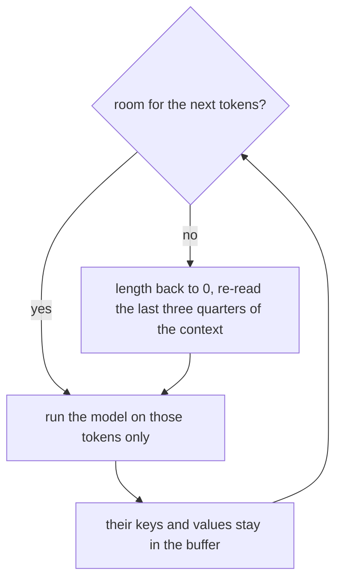

# 17. The KV cache

[Chapter 8](08-writing-sampling.md) writes one token by reading the whole window again. The earlier
tokens' keys and values do not change when a later token arrives, because a token cannot see the
future ([chapter 4](04-embeddings-and-attention.md)). This chapter stores those keys and values and
runs each later step on the new token alone. Inside the context, greedy writing with the store
matches writing without it. Past the context the store cannot slide, so generation starts again
from the last three quarters of the context. The published speed-up of the store alone is the
subject of the last section.

**Code:** [`hello_tokens/model/cache.py`](../../hello_tokens/model/cache.py) ·
[`hello_tokens/model/attention.py`](../../hello_tokens/model/attention.py) ·
[`hello_tokens/model/gpt.py`](../../hello_tokens/model/gpt.py) ·
[`hello_tokens/generation/sampling.py`](../../hello_tokens/generation/sampling.py)
**Tests:** [`tests/model/test_cache.py`](../../tests/model/test_cache.py)

## Words

- **Key**, **value**, **query**, **causal mask**: see [chapter 4](04-embeddings-and-attention.md#words).
  **RoPE**, **offset**: see [chapter 13](13-rotary-position-embedding.md#words). **Grouped-query
  attention**, **`kv_heads`**: see [chapter 15](15-grouped-query-attention.md#words).
- **KV cache**: one key buffer and one value buffer, allocated for every layer at the full context,
  plus a length that says how much of each buffer is filled.
- **Rollback**: set that length backward. The bytes beyond it stay until a later write covers them.
- **`cache`**: the argument on `generate`, `generate_stream` and `write`. Off by default, which is
  chapter 8's path.

## The idea

### Each new token, once

A step without a cache builds a window of up to 256 tokens and runs every layer on all of them, to
score one new token. The next step builds a window that is the same tokens plus one, and does the
work again. The new work is the new token. The old keys and values are a pure function of that
token and the tokens it was allowed to see, and a later token is not among them. Storing the keys
and values, and passing only the new token next time, computes each token once.

The buffers are allocated once, at the full context, and a length says how far they are filled.
Appending is a write into the next slots and then a longer length. Going backward, which a later
chapter needs when it drops drafted tokens, is a shorter length. The slots beyond the length are
not erased. The next write covers them.

### The mask is already general

Chapter 4 writes the causal mask as `diagonal = keys - queries + 1`, and says that with as many
queries as keys this is the triangle in which position *i* sees positions `0` through *i*. The same
line is what a cache needs. The queries are only the new tokens. The keys are everything stored,
including those new tokens, which have just been written into the buffer. Query *i* in that short
list sits at position `keys - queries + i`, and it may see keys up to there.

One new query against four stored keys uses diagonal `4 - 1 + 1 = 4`. Nothing in that row is
masked: the new token may see every stored key, itself included. Two new queries against five keys
use the same diagonal, 4, and the first of the two may not see the last key. Chapter 4's square
case is diagonal 1. The uncached path is that case, unchanged.

### Positions

The new token is not at position 0. [Chapter 13](13-rotary-position-embedding.md) already rotates
queries and keys from an offset, and already reads the learned position table from that same
offset. With a cache the offset is the length before the new tokens are stored. When the model uses
RoPE, keys are rotated before they are stored, so a stored key is not rotated again on the next
step.

### Why a full buffer cannot slide

Dropping the oldest token and shifting the rest would be the obvious way past 256. It is wrong in
every layer but the first. The first layer's key is a function of that token alone. From the second
layer on, the key was computed from a vector that had already mixed in the tokens then visible,
including the one about to be dropped. Those keys would still carry it. The generator does not
shift. When the next token would pass the context, it sets the length to 0 and reads the last
three quarters of the context in one pass, then continues one token at a time.

Three quarters of 256, in integer division, is 192. The test model's context is 32, and three
quarters of that is 24. Past the context, cached text can differ from uncached text. The uncached
loop always reads exactly the last `context` tokens. The cache reads the windows the restart
chooses. A test compares the cache with an uncached model that reads those same windows, not with
the ordinary uncached loop.

### What speed was expected

[Chapter 10](10-profiling-one-step.md) found that a step at this size waits on launches more than
on arithmetic, and said a cache should change speed little: it removes work the GPU is mostly not
doing. That was an expectation. The measured rows are at the end of this chapter.

## The shapes

The buffer is one tensor for keys and one for values:

`(layers, batch, key/value heads, positions, head width)`

On the real model that is 8 layers, a default batch of 1, 6 key/value heads or 2, 256 positions,
and a head width of 64. Grouped-query attention is why the third axis can be 2. Chapter 15's byte
test is this shape in bf16: 12,288 bytes per position, or 4,096. `bytes` counts both buffers.

The match tests do not use that shape. They build a context of 32, two layers, width 24 and four
heads. The v2 variant of that small config sets the four switches, including `kv_heads=2`. Its
head width is 24 / 4 = 6. The byte test is the one that uses `PRESETS`.

## The code

### Allocate once

<!-- from: hello_tokens/model/cache.py -->
```python
        # (layers, batch, key/value heads, positions, head width). With GQA only the key/value heads
        # are stored, which is why GQA makes the cache smaller.
        shape = (config.layers, batch, config.kv_head_count, config.context, config.head_width)
        self.keys = torch.zeros(shape, device=device, dtype=dtype)
        self.values = torch.zeros(shape, device=device, dtype=dtype)
        self.capacity = config.context
        self.length = 0  # positions filled, in every layer
```

`kv_head_count` is `kv_heads` when it is set, and otherwise the query-head count, which is v1.
Zeros are the empty slots. `capacity` is the context, and `length` starts at 0. The constructor's
default batch is 1 and its default dtype is float32. `GPT.new_cache` passes the model's device and
the model's weight dtype instead, so a bf16 model gets a bf16 cache.

### Write, then move the length once

<!-- from: hello_tokens/model/cache.py -->
```python
    def store(self, layer: int, key: torch.Tensor, value: torch.Tensor) -> tuple[torch.Tensor, torch.Tensor]:
        """Write a layer's new keys and values after the stored ones; return everything so far.

        The pointer itself only moves once all layers are done (`advance`), because every layer writes
        the same positions.
        """
        start, end = self.length, self.length + key.shape[-2]
        if end > self.capacity:
            raise ValueError(f"the cache holds {self.capacity} positions; {end} were needed")
        self.keys[layer, :, :, start:end] = key
        self.values[layer, :, :, start:end] = value
        return self.keys[layer, :, :, :end], self.values[layer, :, :, :end]
```

`key.shape[-2]` is the time axis: `(batch, heads, time, head width)`. The write starts at the
current length and does not change it. Every layer therefore writes the same slots. The return
value is the filled prefix, not the whole allocation, so attention scores only positions that have
been written. Past `capacity` the method raises rather than growing the tensor.

`advance` is called from the model, after the last layer:

<!-- from: hello_tokens/model/gpt.py -->
```python
        x = self.embedding(ids, cache.length if cache is not None else 0)
        for layer, block in enumerate(self.blocks):
            x = block(x, cache, layer)
        if cache is not None:
            cache.advance(ids.shape[1])
```

The embedding call is the offset chapter 13's position table already accepts. It is the length
before `advance`, so the new tokens sit just after the stored ones. `ids.shape[1]` is how many new
tokens this call carried. One step of generation passes one. A prompt passes the whole prompt.

> **Later:** `store_at` writes one token at an index held in a tensor and returns the whole
> buffer, filled or not. A later chapter uses it so a recorded step never changes shape. This
> chapter uses `store`.

### Already rotated

Chapter 13's excerpt of `forward` stops at the rotation. The next lines are the store. When RoPE
is on, that rotation has already run, so the key written here is the rotated one.

<!-- from: hello_tokens/model/attention.py -->
```python
        if cache is not None:
            # Keys are stored already rotated, so stored ones never need rotating again.
            key, value = cache.store(layer, key, value)
```

`value` is not rotated. Chapter 13's reason still holds: a value carries content, not position.
The block passes the cache and the layer number through. Attention is the only module that writes
the buffers.

### Forgetting by moving the pointer

<!-- from: hello_tokens/model/cache.py -->
```python
    def rollback(self, length: int) -> None:
        """Forget everything after the first `length` positions."""
        if not 0 <= length <= self.length:
            raise ValueError(f"can't roll back to {length}: the cache holds {self.length}")
        self.length = length
```

The new length has to sit between 0 and the current length, inclusive. A longer length would be a
roll forward, into slots the pointer does not claim are filled, and it raises. Nothing is copied
and nothing is zeroed.

### The branch chapter 8 cut

Chapter 8 shows the `if kv is None` path and the line `pending = [next_id]`. It says that line
serves this chapter. The cut branch is what consumes `pending`:

<!-- from: hello_tokens/generation/sampling.py -->
```python
    kv = step.cache if step is not None else model.new_cache() if cache else None
    pending = tokens[-context:]  # with a cache: the tokens it hasn't read yet
...
            if kv.length + len(pending) > context:  # full: start again from the last 3/4
                kv.rollback(0)
                pending = tokens[-(context * 3 // 4) :]
            if step is not None and len(pending) == 1:
                logits = step(pending[0])
            else:
                logits = model(torch.tensor([pending], device=device), kv)[0, -1]
```

`cache` false leaves `kv` as `None` when graphs are also off, and chapter 8's path runs. `cache`
true builds an empty cache on the model. `pending` starts as the prompt, cropped to the context,
the same crop as `tokens[-context:]` in the uncached path. Each call then runs the model on
`pending` only. After the token is chosen, chapter 8's line sets `pending` to that one id, so the
next call is one token.

The restart condition is `length + len(pending) > context`. A prompt that merely fills the context
is not restarted: the length is 0 and the cropped prompt has length `context`, and `context` is not
greater than `context`. One more token, once the buffer is full, is greater, so the length goes
back to 0 and `pending` becomes the last three quarters of the context, taken from the end of
the text written so far. That slice is read in one call. The following steps are one token again.

`step` is the recorded one-token path. It is `None` unless graphs are on. A later chapter owns
that branch. This chapter's call is the `else`.



### The option chapter 8 left out

Chapter 8's excerpt of the `write` command stops at `--seed`. The next option is the switch:

<!-- from: hello_tokens/__main__.py -->
```python
    write.add_argument("--seed", type=int, default=None)
    write.add_argument("--cache", action="store_true", help="use the KV cache")
```

`store_true` means the flag is off unless it is passed. The dispatch chapter 8 already shows
passes `cache=args.cache` into `generate`. `bench` has the same flag, and chapter 11's harness is
what turns a run of it into a row.

## What would go wrong the other way

**Shifting when the buffer is full.** Deeper layers' keys would still depend on the dropped token.
The failure would not show up inside the context, where the test against a full re-read passes.
It would show up only after the shift, and an ordinary uncached comparison would not be the right
oracle, because that path reads a different window.

**Moving the length inside `store`.** The first layer would advance it, and the next layer would
write at the next slots. `advance` is one call, after every layer, for that reason.

**Growing the buffer with each token.** Appending a new allocation each step would copy, and the
address would change. The module is written as one allocation because a later chapter records a
step that must see the same addresses every time. Rollback would also stop being an assignment.

**Reporting the cached story as the uncached one past 256 tokens.** They can differ. The guarantee
the tests actually make is narrower: the same tokens inside the context, and, past it, the same
tokens as a loop that restarts on the same three-quarter windows.

**Reading the removed arithmetic as a speed-up.** The work removed is the recomputation of old
tokens. Chapter 10's profile says that work is mostly not what the step is waiting on.

## Proving it works

The match tests share a small config, in the file's default float32 on the CPU, and they are
parametrized over both names. `SHAPE` is the common part. `"v2"` adds the four switches.

<!-- from: tests/model/test_cache.py -->
```python
SHAPE = dict(vocab_size=50, context=32, width=24, layers=2, heads=4)
SHAPES = {
    "v1": ModelConfig(**SHAPE),
    "v2": ModelConfig(**SHAPE, norm="rmsnorm", position="rope", feed_forward="swiglu", kv_heads=2),
}
```

One token at a time, after a prompt of five, must match a fresh read of the prefix. The loop
variable runs from 5 up to but not including 30.

<!-- from: tests/model/test_cache.py -->
```python
@pytest.mark.parametrize("name", SHAPES)
def test_one_token_at_a_time_with_a_cache_matches_reading_everything_again(name):
    model = model_for(name)
    ids = torch.randint(0, 50, (1, 30))
    cache = model.new_cache()
    with torch.no_grad():
        model(ids[:, :5], cache)  # read the prompt once
        for n in range(5, 30):
            cached = model(ids[:, n : n + 1], cache)[0, -1]  # feed one token
            full = model(ids[:, : n + 1])[0, -1]  # read all n + 1 tokens from scratch
            assert torch.allclose(cached, full, atol=1e-5), f"position {n}"
    assert cache.length == 30
```

`ids` has shape `(1, 30)`. The prompt is the slice `:5`. At `n` the cache sees a single column,
and `full` sees columns `0` through `n` with no cache. `atol=1e-5`. The failure message is
`position {n}`. After the loop the length is 30, the whole tensor, not 29.

A prompt can also be stored in one call. This one uses batch 2, so the cache is built with
`batch=2`. The default batch of 1 would not match `ids`.

<!-- from: tests/model/test_cache.py -->
```python
@pytest.mark.parametrize("name", SHAPES)
def test_reading_a_whole_prompt_into_the_cache_gives_the_usual_outputs(name):
    model = model_for(name)
    ids = torch.randint(0, 50, (2, 20))
    with torch.no_grad():
        assert torch.allclose(model(ids, model.new_cache(batch=2)), model(ids), atol=1e-5)
```

`ids` is `(2, 20)`. The tolerance is again `1e-5`. Both calls are the whole tensor. The cached
call is not one token at a time. That is the previous test.

Rollback keeps the first six positions of a ten-token write, then checks that three further tokens
match a cache that only ever saw those six. The tolerance here is `1e-6`.

<!-- from: tests/model/test_cache.py -->
```python
@pytest.mark.parametrize("name", SHAPES)
def test_rolling_back_forgets_exactly_the_dropped_tokens(name):
    model = model_for(name)
    ids, other = torch.randint(0, 50, (1, 10)), torch.randint(0, 50, (1, 3))
    with torch.no_grad():
        cache = model.new_cache()
        model(ids, cache)
        cache.rollback(6)  # as if tokens 6-9 were drafted and rejected
        after_rollback = model(other, cache)
        fresh = model.new_cache()
        model(ids[:, :6], fresh)
        assert torch.allclose(after_rollback, model(other, fresh), atol=1e-6)
```

The comment's "6-9" is the four positions dropped from a length of 10. `rollback(6)` keeps
positions 0 through 5. `other` has shape `(1, 3)`. The comparison is the two ways of scoring
`other`, not a comparison of `ids` with itself.

Greedy writing, `temperature=0`, is token-for-token. Inside the context it matches `generate`
without a cache. Past the context it matches the helper that restarts on the same three-quarter
windows. The prompt has 5 tokens. The context is 32.

<!-- from: tests/model/test_cache.py -->
```python
@pytest.mark.parametrize("name", SHAPES)
def test_greedy_writing_with_a_cache(name):
    model = model_for(name)
    prompt = torch.randint(0, 50, (5,)).tolist()
    with torch.no_grad():
        # Within the context: exactly the same tokens as writing without a cache.
        assert generate(model, prompt, 20, temperature=0, cache=True) == generate(model, prompt, 20, temperature=0)
        # Past the context (5 + 70 > 32): the cache restarts from the last 3/4, and the tokens match
        # an uncached reference that reads the same windows.
        assert generate(model, prompt, 70, temperature=0, cache=True) == reference_with_the_cache_s_window(
            model, prompt, 70)
```

`5 + 20 = 25`, which is still inside 32, so the first assert never restarts. `5 + 70 = 75`, which
is past 32, so the second assert does. `temperature=0` is greedy decoding, chapter 8. The
comparison is `==` on the lists of new ids, not `allclose`.

A prompt longer than the context is cropped before either path runs. This test is the small v2
only, 40 tokens into a context of 32, and five new tokens.

<!-- from: tests/model/test_cache.py -->
```python
def test_a_prompt_longer_than_the_context_still_works():
    model = model_for("v2")
    prompt = torch.randint(0, 50, (40,)).tolist()  # 40 > 32: only the last 32 are read
    with torch.no_grad():
        assert generate(model, prompt, 5, temperature=0, cache=True) == generate(model, prompt, 5, temperature=0)
```

The overflow test is the small v1 only. It fills 30 positions of a context of 32, refuses a
further 3, and refuses `rollback(31)` while the length is 30. Both raises are `ValueError`. The
test does not match a substring of the message.

<!-- from: tests/model/test_cache.py -->
```python
def test_the_cache_refuses_to_overflow_or_roll_forward():
    model = model_for("v1")
    cache = model.new_cache()
    with torch.no_grad():
        model(torch.randint(0, 50, (1, 30)), cache)
        with pytest.raises(ValueError):
            model(torch.randint(0, 50, (1, 3)), cache)  # 30 + 3 > 32
    with pytest.raises(ValueError):
        cache.rollback(31)
```

Chapter 15 already shows `test_gqa_makes_the_cache_three_times_smaller` and the counts 12,288 and
4,096. That test builds `PRESETS` in bf16. It does not use `SHAPE`.

## Run it

```
uv run python -m hello_tokens write --cache
```

```
uv run pytest tests/model/test_cache.py
```

The row in the published table is what `bench --cache` records, after the median across batches
from chapter 11. One invocation is:

```
uv run python -m hello_tokens bench --name v2 --dtype bfloat16 --cache
```

The mask illustration is the unequal case. Chapter 4 already printed the square triangle, diagonal
1, which is `diag_equal` here.

<!-- illustration -->
```python
import torch

print("diag_equal", 4 - 4 + 1)
print("diag_one", 4 - 1 + 1)
print(torch.triu(torch.ones(1, 4, dtype=torch.bool), diagonal=4))
print("diag_two", 5 - 2 + 1)
print(torch.triu(torch.ones(2, 5, dtype=torch.bool), diagonal=4))
print("keep", 256 * 3 // 4, 32 * 3 // 4)
```

```
diag_equal 1
diag_one 4
tensor([[False, False, False, False]])
diag_two 4
tensor([[False, False, False, False,  True],
        [False, False, False, False, False]])
keep 192 24
```

`diag_one` is one query and four keys. `torch.triu` marks the blocked pairs, and that row is all
`False`, so the query is blocked from nothing. `diag_two` is two queries and five keys. The first
query is blocked from the last key only. The second query is blocked from nothing. `keep` is three
quarters of the real context and of the test context, 192 and 24.

## What we got

Inside a context of 32, the tests above require the cached scores to match a full re-read, and
greedy tokens to match. Past it, they require the tokens of the shared windows. The bytes per
position are chapter 15's. None of that is a generation speed.

The speed is the published median across 8 batches. Speed-up, first token and milliseconds per
token are at a 16-token prompt and 224 new tokens, and the speed-up divides by the same model in
plain bf16. Chapter 11 states that rule. Perplexity and ECE are an en dash on these rows: a cache
does not change the distribution, so those columns are not measured again.

| Row | tok/s 16+64 | tok/s 16+224 | tok/s 128+128 | Speed-up | Batch IQR | First token ms | ms / token | Size MB | Peak MB |
|---|---:|---:|---:|---:|---:|---:|---:|---:|---:|
| `v1 bf16` | 168 | 166 | 166 | 1.00× | 8% | 6.13 | 6.03 | 31.7 | 46 |
| `v1 bf16 cache` | 166 | 166 | 164 | 1.00× | 12% | 7.24 | 6.01 | 31.7 | 46 |
| `v2 bf16` | 81 | 83 | 85 | 1.00× | 6% | 12.14 | 12.08 | 28.6 | 42 |
| `v2 bf16 cache` | 83 | 83 | 83 | 1.00× | 5% | 13.20 | 12.02 | 28.6 | 39 |

The cache alone measured 1.00×. At 16+224 the rate does not move: 166 stays 166, and 83 stays 83.
The other two lengths move by a couple of tokens per second. The first token is slower on both
models, 7.24 ms against 6.13, and 13.20 ms against 12.14. v2's published peak on the cache row is
39 MB, against 42 MB on the plain row. The table records that cell and does not explain it.

Chapter 10's expectation was this outcome. Removing the recomputation removes arithmetic. The step
was mostly not waiting on arithmetic. The cache is still the buffer a later chapter's recorded step
replays. The speed-up in this table is not that recording. It is the cache alone.

## Check yourself

1. In the illustration, what is `diag_one`, and what does the 1-by-4 mask contain? Which query, in
   the 2-by-5 mask, is blocked from a key? What is chapter 4's diagonal when queries and keys are
   equal?
2. In `test_one_token_at_a_time_with_a_cache_matches_reading_everything_again`, what is the shape
   of `ids`, which slice is the prompt, which values does `n` take, and what absolute tolerance is
   required? What is the length asserted afterward?
3. What speed-up do the two cache rows publish at 16+224, against which baseline? What do the
   first-token cells do instead?

<details>
<summary>Answers</summary>

1. `diag_one` is 4, from `4 - 1 + 1`. The mask is one row of four `False` values, so that query
   may see every key. In the 2-by-5 mask the first query is blocked from the last key, the only
   `True`, and the second query is all `False`. Chapter 4's equal case uses diagonal 1, which is
   `diag_equal`. Chapter 4 prints the 4-by-4 triangle for that diagonal. This illustration does
   not reprint it.
2. `ids` is `torch.randint(0, 50, (1, 30))`, so its shape is `(1, 30)`. The prompt is
   `ids[:, :5]`. `n` runs through `range(5, 30)`, that is 5 through 29. The tolerance is
   `atol=1e-5`. The length asserted afterward is 30. The test is parametrized over `"v1"` and
   `"v2"` of `SHAPES`, context 32, not over `PRESETS`. The whole-prompt test is a different
   function: `ids` of shape `(2, 20)`, `batch=2`, and the same `1e-5`. The rollback test's
   tolerance is `1e-6`, and it calls `rollback(6)` after a write of length 10.
3. Both cache rows publish 1.00× at 16+224, against the same model in plain bf16. The rates in
   that column are 166 and 83, the same as the plain rows. The first-token cells are slower:
   7.24 ms against 6.13 for v1, and 13.20 ms against 12.14 for v2. Perplexity and ECE are an en
   dash on the cache rows, not a measured 0.

</details>

Next: 18. Fused attention
