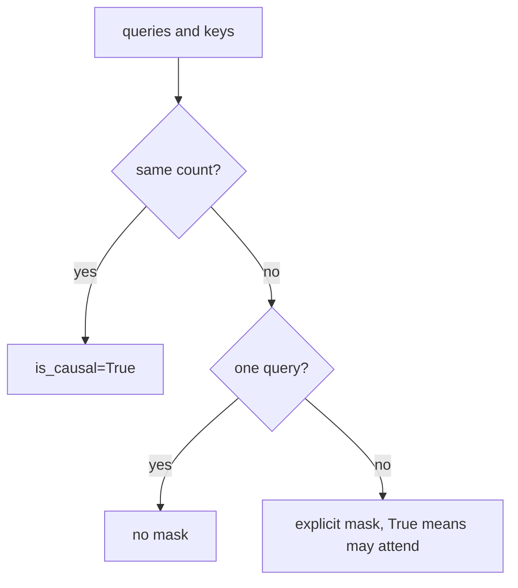

# 18. Fused attention

[Chapter 4](04-embeddings-and-attention.md) computes attention as four steps we can read: a table of
scores, a causal mask, softmax, and a weighted sum of the values. Each of those steps is its own
GPU kernel, and [chapter 10](10-profiling-one-step.md) found that a generation step at this size
waits on launches more than on arithmetic. This chapter leaves the hand-written steps in place and
adds a switch that asks PyTorch to do the same arithmetic in one kernel. The weights are unchanged.
The kernel's built-in causal mask is not the right mask once a cache makes the queries and the keys
different lengths, so the switch passes its own. The measured rows are at the end.

**Code:** [`hello_tokens/model/attention.py`](../../hello_tokens/model/attention.py) ·
[`hello_tokens/model/gpt.py`](../../hello_tokens/model/gpt.py) ·
[`hello_tokens/__main__.py`](../../hello_tokens/__main__.py)
**Tests:** [`tests/model/test_fused_attention.py`](../../tests/model/test_fused_attention.py)

## Words

- **Query**, **key**, **value**, **causal mask**, **head**, **softmax**: see
  [chapter 4](04-embeddings-and-attention.md#words). **Kernel**, **launch**: see
  [chapter 10](10-profiling-one-step.md#words). **Grouped-query attention**, **`kv_heads`**: see
  [chapter 15](15-grouped-query-attention.md#words). **KV cache**: see
  [chapter 17](17-the-kv-cache.md#words).
- **Fused attention**: the same scores, mask, softmax and weighted sum, run as one kernel that does
  not write the score table out to memory.
- **`scaled_dot_product_attention`**: PyTorch's fused attention. The hand-written function already
  divides by the square root of the head width; this kernel is asked to do that scaling itself.
- **`is_causal`**: that kernel's built-in mask. It lines the triangle up with the first key.
- **`attn_mask`**: a mask passed in by the caller. In the function below, `True` means the query
  may attend to that key.
- **`enable_gqa`**: the kernel's own switch for sharing one key/value head across a group of query
  heads. The argument of `fused_attention` is `gqa`; the kernel call passes it on under this name.
- **`fused`**: a flag on each attention module. It starts false. It is not a parameter and not part
  of `ModelConfig`.

## The idea

### The same weights, one kernel

Chapter 4's score table has a row for every query and a column for every key. Writing that table,
masking it, normalizing it and multiplying by the values is four kernels per layer, and with
grouped-query attention the hand-written path copies key and value heads before any of that runs.
A fused kernel does the arithmetic inside one launch and does not store the table. The hand-written
function stays, because it is the one the tests compare against and the one the earlier chapters
explain.

The choice is how a model is run, not what it is. Nothing in the checkpoint shape changes.
`CausalSelfAttention` starts with `fused` false, an ordinary attribute rather than a parameter, so
the weights that [chapter 5](05-the-block-and-the-full-model.md) counts and saves do not record it.
`GPT.use_fused_attention` sets the flag on every layer, or sets it back.

### The built-in triangle lines up with the first key

Chapter 4's mask uses diagonal `keys - queries + 1`. Query *i* sits at position
`keys - queries + i` and may see keys up to there. When the two counts are equal, query 0 is
position 0, and the diagonal is 1: the square triangle chapter 4 prints.
`scaled_dot_product_attention` can build that triangle itself, with `is_causal=True`, but it always
lines the triangle up with the **first** key. That agrees with chapter 4 only when query 0 really
is the first key.

A cache breaks the assumption. Chapter 17 already ran the unequal diagonal. One new query against
four stored keys uses diagonal 4, and that row blocks nothing: the new token may see every stored
key, itself included. The built-in shortcut on that same shape does the other thing. It treats the
single query as position 0, so the query may see only the first key. A block of new queries is the
same mistake one row at a time. Four new queries against fourteen keys are the last four positions,
not the first four. Query 0 of that block sits at position 10, not at position 0.

So the function takes three branches:

- As many queries as keys: `is_causal=True`.
- One new query: no mask at all.
- Several new queries against a longer list of keys: an explicit mask, the chapter 4 triangle
  inverted so that `True` means "may attend".



### Sharing a head without copying it

[Chapter 15](15-grouped-query-attention.md) repeats each key/value head along the hand-written path,
and its Later note says the other branch passes `enable_gqa` instead of copying. The call in
`forward` uses the name `gqa`. The value is `self.kv_heads != self.heads`: false on v1, where the
two counts match, and true on v2, where 6 query heads share 2 key/value heads. Inside the fused
function that flag is handed to the kernel as `enable_gqa=gqa`. The `repeat_interleave` chapter 15
shows does not run on this branch.

## The shapes

The hand-written scores of a full window are the table chapter 4 gives, batch by heads by 256 by
256. This path does not build that table. What it does build, in the unequal case, is the mask:
shape `(queries, keys)`, with no batch and no heads. One new token against a cache of length *L*
builds no mask. The output is still one vector per query per head, and `_combine` returns the same
shape `forward` returned before.

On the real model a query head is 64 wide and there are 6 of them. v2 stores 2 key/value heads.
The tests use a smaller config with the same head counts, so the group is the real one:

| | test config | real model |
|---|---|---|
| vocabulary, context, width, layers | 50, 32, 24, 2 | 4,096, 256, 384, 8 |
| query heads | 6 | 6 |
| head width | 24 / 6 = 4 | 384 / 6 = 64 |
| v2 key/value heads, group | 2, and 6 / 2 = 3 | 2, and 6 / 2 = 3 |

Chapter 17's cache tests are a different small config: `heads=4` and head width 6. The numbers
above are this chapter's file, `test_fused_attention.py`.

The illustration's block is the test's block. Four queries against fourteen keys, head width 8 in
the plain call and 4 in the grouped call. Fourteen is not the context. It is 10 stored tokens plus
the 4 new ones.

## The code

### The flag is not a weight

<!-- from: hello_tokens/model/attention.py -->
```python
        # Which implementation computes attention: ours (False) or PyTorch's fused kernel (True). Same
        # weights, same results; a runtime choice, not part of the model's shape.
        self.fused = False
```

A new module takes the hand-written path. The comment's "same results" is what the match tests
check, in float32, at `atol=1e-5`. The causality test calls `allclose` with no `atol`. Neither is a
claim about the published bf16 perplexity, which is measured separately below.

<!-- from: hello_tokens/model/gpt.py -->
```python
    def use_fused_attention(self, on: bool = True) -> "GPT":
        """Switch every layer to PyTorch's fused attention kernel (or back to ours)."""
        for block in self.blocks:
            block.attention.fused = on
        return self
```

The default of `on` is `True`, so a call with no argument turns the kernel on. Passing `False`
turns it off. Returning `self` is what lets a caller chain the call. Every block is set in the
loop, which on the real model is eight layers and in the tests is two.

### Three ways to mask

<!-- from: hello_tokens/model/attention.py -->
```python
def fused_attention(query: torch.Tensor, key: torch.Tensor, value: torch.Tensor, gqa: bool) -> torch.Tensor:
    """The same attention, done by PyTorch's fused kernel (scaled_dot_product_attention).

    One kernel instead of several (scores, mask, softmax, weighted sum), and it never stores the full
    score table. Its built-in causal mask lines up with the *first* key, which is only right when there
    are as many queries as keys, so the other cases pass their own mask:
    - one new query (decoding with a cache): it may see every key, so no mask at all;
    - a few new queries against a longer cache (checking drafted tokens): the usual bottom-right mask.
    With GQA the kernel shares each key/value head across its group itself (enable_gqa), with no copies.
    """
    queries, keys = query.shape[-2], key.shape[-2]
    if queries == keys:
        return F.scaled_dot_product_attention(query, key, value, is_causal=True, enable_gqa=gqa)
    mask = None
    if queries > 1:  # True = may attend
        mask = ~torch.triu(torch.ones(queries, keys, dtype=torch.bool, device=query.device),
                           diagonal=keys - queries + 1)
    return F.scaled_dot_product_attention(query, key, value, attn_mask=mask, enable_gqa=gqa)
```

`queries` and `keys` are the time axes, the same `-2` chapter 4 uses. The equal branch passes
`is_causal=True` and does not pass `attn_mask`. The parameter name on this function is `gqa`; both
kernel calls pass `enable_gqa=gqa`.

If the counts differ, `mask` starts as `None`. A single query leaves it there, and the second call
is a kernel with no mask: every key is visible. More than one query builds the chapter 4 triangle
with `torch.triu` and then inverts it. Chapter 4 and chapter 17 treat `True` as blocked, because
`masked_fill` writes minus infinity there. This mask treats `True` as allowed, which is what the
comment on `queries > 1` says, so the `~` is the whole difference. The diagonal expression is the
one chapter 4 wrote: `keys - queries + 1`.

The function does not divide by the square root of the head width. The hand-written function does.
The illustration checks that the outputs still agree.

### After the cache write, choose a path

Chapter 17 shows the store. The lines immediately after it are the switch. Chapter 15 shows the
`else` body and leaves this branch.

<!-- from: hello_tokens/model/attention.py -->
```python
        if self.fused:
            output = fused_attention(query, key, value, gqa=self.kv_heads != self.heads)
        else:
            if self.kv_heads != self.heads:
```

`self.kv_heads` here is the module's key/value count, which is `kv_head_count`: the configured
`kv_heads` when it is set, and the query-head count otherwise. The comparison is that count against
`self.heads`. The keyword at this call is `gqa`, not `enable_gqa`.

> **Later:** `decode` does not call `fused_attention`. With the flag on it calls the kernel itself,
> over the whole context buffer:

<!-- from: hello_tokens/model/attention.py -->
```python
        if self.fused:
            output = F.scaled_dot_product_attention(query, key, value, attn_mask=visible,
                                                    enable_gqa=self.kv_heads != self.heads)
```

`attn_mask` is `visible`, and `enable_gqa` is the same comparison, written out at the call. The
next chapter owns that step. This chapter's tests go through `forward`.

### The benchmark flag

[Chapter 11](11-the-benchmark-harness.md) already appends the word `fused` to a row name when the
flag is on. The flag itself is:

<!-- from: hello_tokens/__main__.py -->
```python
    bench.add_argument("--cache", action="store_true", help="use the KV cache")
    bench.add_argument("--fused", action="store_true", help="use PyTorch's fused attention kernel")
```

`store_true` means off unless the command passes `--fused`. The bench command then turns the flag
into the call above:

<!-- from: hello_tokens/__main__.py -->
```python
        model.to(getattr(torch, args.dtype)).use_fused_attention(args.fused)
        if args.graphs and args.speculative:
```

`args.fused` is passed in, so a run without `--fused` calls `use_fused_attention(False)` and leaves
the hand-written path. The `write` command has no `--fused` flag. The following lines refuse to run
graphs and speculative decoding together; that pair is a later chapter.

## What would go wrong the other way

**`is_causal=True` whenever a cache is in use.** One new token would be allowed to see only the
first stored key. A block of new tokens would be masked as if those queries were the start of the
sequence. The function's comment states the rule, and the illustration measures both failures. The
tests do not: they check that `fused_attention` matches the hand-written function, which is the
evidence that the branch taken is the right one, not a direct comparison against `is_causal=True`.

**Passing chapter 4's mask through as `attn_mask`.** That mask is `True` where the pair is blocked.
The kernel mask built here is `True` where the pair is allowed. They are inverses. The `~` is what
makes the illustration's `matches_hand` true.

**Copying heads and then setting `enable_gqa`.** Chapter 15 already keeps the copy on the
hand-written branch only. This branch passes `gqa` and does not repeat. Doing both would expand
heads the kernel was about to share.

**Saving the flag in the checkpoint, or treating it as a shape.** Chapter 16 refuses to load weights
into a different `ModelConfig`. This flag is not a field of that config. Two runs of one checkpoint
can disagree about `fused` and still be the same model. Forgetting that, and baking the kernel into
a saved shape, would make a runtime choice look like an architecture change.

**Reading the published gain as the removal of every launch.** Chapter 10's expectation was narrower
than that. Fusing the attention step cuts the launches of that step. Recording every launch in the
step is the next chapter. The measured rows are faster than the same model in plain bf16, and they
are the modest gain, not that larger one.

## Proving it works

The file builds two copies from one draw of weights. A fixture sets the seed to 0 before each test.
The small config has 6 query heads, not the 4 in chapter 17's cache tests.

<!-- from: tests/model/test_fused_attention.py -->
```python
SHAPE = dict(vocab_size=50, context=32, width=24, layers=2, heads=6)
SHAPES = {
    "v1": ModelConfig(**SHAPE),
    "v2": ModelConfig(**SHAPE, norm="rmsnorm", position="rope", feed_forward="swiglu", kv_heads=2),
}
```

<!-- from: tests/model/test_fused_attention.py -->
```python
def pair(name):
    """Two copies of one model: ours, and the same weights with PyTorch's fused attention."""
    ours = GPT(SHAPES[name]).eval()
    return ours, copy.deepcopy(ours).use_fused_attention()
```

`use_fused_attention()` is called with no argument, so `on` takes its default, `True`. `deepcopy`
is what makes the weights the same rather than a second random initialization. Both copies are in
eval mode. `"v2"` sets the four fields of the preset chapter 15 shows: `norm="rmsnorm"`,
`position="rope"`, `feed_forward="swiglu"`, and `kv_heads=2`. It is not the trained checkpoint.

A whole prompt has as many queries as keys, which is the `is_causal=True` branch. The batch is 2
and the length is 20, inside the context of 32. Both names run. There is no cache.

<!-- from: tests/model/test_fused_attention.py -->
```python
@pytest.mark.parametrize("name", SHAPES)
def test_fused_attention_matches_ours_on_a_whole_prompt(name):
    ours, fused = pair(name)
    ids = torch.randint(0, 50, (2, 20))
    with torch.no_grad():
        assert torch.allclose(fused(ids), ours(ids), atol=1e-5)
```

One token at a time is the empty-mask branch. The prompt of five is stored and not asserted. `n`
then runs through `range(5, 20)`, that is 5 through 19, and each call feeds one column.

<!-- from: tests/model/test_fused_attention.py -->
```python
@pytest.mark.parametrize("name", SHAPES)
def test_fused_attention_matches_ours_one_token_at_a_time_with_a_cache(name):
    ours, fused = pair(name)
    ids = torch.randint(0, 50, (1, 20))
    a, b = ours.new_cache(), fused.new_cache()
    with torch.no_grad():
        ours(ids[:, :5], a), fused(ids[:, :5], b)
        for n in range(5, 20):  # one query against all stored keys: no mask
            assert torch.allclose(fused(ids[:, n : n + 1], b), ours(ids[:, n : n + 1], a), atol=1e-5)
```

`ids` has shape `(1, 20)`. The comment is the branch: one query, every stored key, no mask. The
tolerance is `atol=1e-5`. The test does not assert `cache.length` afterward.

The block is the case the built-in triangle gets wrong. Ten tokens are stored, then the remaining
four are scored in one call. That is four queries against fourteen keys.

<!-- from: tests/model/test_fused_attention.py -->
```python
@pytest.mark.parametrize("name", SHAPES)
def test_fused_attention_matches_ours_on_a_block_of_new_tokens(name):
    # The verify step of speculative decoding: 4 new tokens on top of 10 stored ones. This is where
    # PyTorch's built-in causal mask would be wrong (it lines up with the first key).
    ours, fused = pair(name)
    ids = torch.randint(0, 50, (1, 14))
    a, b = ours.new_cache(), fused.new_cache()
    with torch.no_grad():
        ours(ids[:, :10], a), fused(ids[:, :10], b)
        block_ours, block_fused = ours(ids[:, 10:], a), fused(ids[:, 10:], b)
        assert torch.allclose(block_fused, block_ours, atol=1e-5)
        # And both equal reading all 14 tokens from scratch.
        assert torch.allclose(block_ours, ours(ids)[:, 10:], atol=1e-5)
```

The first assert is fused against hand-written, on the block only. The second assert is the
hand-written block against a scratch read of all 14 tokens, at positions 10 onward. It does not
name `block_fused`. The comment says both equal that scratch read; the assert that is written names
`block_ours` only. The tolerance is again `1e-5`. The comment about the built-in mask is not itself
an assert.

Causality is checked on the fused v2 model only, with no cache. The sequence has 12 positions. Index
5 is replaced, and the outputs at indices 0 through 4 must agree. `allclose` is called with no
`atol`.

<!-- from: tests/model/test_fused_attention.py -->
```python
def test_fused_attention_is_causal():
    _, fused = pair("v2")
    ids = torch.randint(0, 50, (1, 12))
    changed = ids.clone()
    changed[0, 5] = (ids[0, 5] + 1) % 50
    with torch.no_grad():
        assert torch.allclose(fused(ids)[0, :5], fused(changed)[0, :5])
```

`pair("v2")` is not the parametrized fixture. The hand-written copy is discarded. Positions 5
through 11 are not compared. The replacement `(ids[0, 5] + 1) % 50` stays inside the vocabulary of
50.

The switch test is v1 only, and it checks the flag, not the tensors.

<!-- from: tests/model/test_fused_attention.py -->
```python
def test_the_switch_goes_both_ways():
    ours, fused = pair("v1")
    assert all(b.attention.fused for b in fused.blocks)
    assert not any(b.attention.fused for b in fused.use_fused_attention(False).blocks)
```

`pair` has already turned the copy on. `use_fused_attention(False)` passes `False` to `on`. Both
asserts walk every block. With `layers=2` that is two blocks. `ours` is unused after it is built.

## Run it

```
uv run pytest tests/model/test_fused_attention.py
```

The published fused row is what `bench --fused` records, after the median across batches from
chapter 11:

```
uv run python -m hello_tokens bench --name v2 --dtype bfloat16 --fused
```

The mask below is the test's block, four queries against fourteen keys, built the way
`fused_attention` builds it. `builtin` is the call the function does **not** make on that shape:
`is_causal=True`. The one-query half is chapter 17's shape, one query against four keys, and
`shortcut` is again the built-in mask. The grouped call uses 6 query heads, 2 key/value heads and
`repeat_interleave(3, dim=1)`, the group of `6 / 2`.

<!-- illustration -->
```python
import torch
import torch.nn.functional as F
from hello_tokens.model.attention import causal_attention, fused_attention

torch.manual_seed(0)
query = torch.randn(1, 1, 4, 8)
key = torch.randn(1, 1, 14, 8)
value = torch.randn(1, 1, 14, 8)
hand, _ = causal_attention(query, key, value)
fused = fused_attention(query, key, value, gqa=False)
builtin = F.scaled_dot_product_attention(query, key, value, is_causal=True)
diagonal = 14 - 4 + 1
allowed = ~torch.triu(torch.ones(4, 14, dtype=torch.bool), diagonal=diagonal)
print("diagonal", diagonal)
print(allowed.int())
print("matches_hand", bool(torch.allclose(hand, fused, atol=1e-5)))
print("builtin_differs", bool(not torch.allclose(builtin, fused, atol=1e-5)))

query1 = torch.randn(1, 1, 1, 8)
key1 = torch.randn(1, 1, 4, 8)
value1 = torch.randn(1, 1, 4, 8)
one = fused_attention(query1, key1, value1, gqa=False)
hand1, weights1 = causal_attention(query1, key1, value1)
shortcut = F.scaled_dot_product_attention(query1, key1, value1, is_causal=True)
first_key, _ = causal_attention(query1, key1[:, :, :1], value1[:, :, :1])
print("one_matches_hand", bool(torch.allclose(one, hand1, atol=1e-5)))
print("one_blocked", int((weights1 == 0).sum()))
print("shortcut_is_first_key", bool(torch.allclose(shortcut, first_key, atol=1e-5)))

query_g = torch.randn(1, 6, 4, 4)
key_g = torch.randn(1, 2, 14, 4)
value_g = torch.randn(1, 2, 14, 4)
shared = fused_attention(query_g, key_g, value_g, gqa=True)
copied, _ = causal_attention(
    query_g, key_g.repeat_interleave(3, dim=1), value_g.repeat_interleave(3, dim=1)
)
print("gqa_matches_copy", bool(torch.allclose(shared, copied, atol=1e-5)))
```

```
diagonal 11
tensor([[1, 1, 1, 1, 1, 1, 1, 1, 1, 1, 1, 0, 0, 0],
        [1, 1, 1, 1, 1, 1, 1, 1, 1, 1, 1, 1, 0, 0],
        [1, 1, 1, 1, 1, 1, 1, 1, 1, 1, 1, 1, 1, 0],
        [1, 1, 1, 1, 1, 1, 1, 1, 1, 1, 1, 1, 1, 1]], dtype=torch.int32)
matches_hand True
builtin_differs True
one_matches_hand True
one_blocked 0
shortcut_is_first_key True
gqa_matches_copy True
```

`diagonal` is 11, from `14 - 4 + 1`. A 1 in the printed mask means may attend. The first row has
eleven 1s, columns 0 through 10, and the last row is all 1s: the newest of the four queries may see
every key. `matches_hand` says the fused function agrees with `causal_attention` on that block.
`builtin_differs` says `is_causal=True` does not. `one_blocked` is 0, so the single query's
hand-written weights hide nothing. `shortcut_is_first_key` says the built-in mask on that one query
matches attention over the first key only. `gqa_matches_copy` says `gqa=True` matches the
`repeat_interleave` path, with group 3.

## What we got

The tests pin the float32 outputs to the hand-written function. They do not pin a speed. The speed
is the published median across 8 batches in
[`docs/benchmarks.md`](../../docs/benchmarks.md). Speed-up, first token and milliseconds per token
are at a 16-token prompt and 224 new tokens, against the same model in plain bf16. Chapter 11
states that rule, and chapter 17 prints the plain rows: 166 tokens/s for v1 and 83 for v2 at that
point. Perplexity and ECE are measured on the fused rows because a different kernel can change the
computed numbers. The rows that also turn the cache on publish an en dash in those columns, chapter
11's mark for a pass that was not run. Rows that also record a CUDA graph are in the same file and
belong to the next chapter.

| Row | tok/s 16+64 | tok/s 16+224 | tok/s 128+128 | Speed-up | Batch IQR | First token ms | ms / token | Size MB | Peak MB | Perplexity | ECE |
|---|---:|---:|---:|---:|---:|---:|---:|---:|---:|---:|---:|
| `v1 bf16 fused` | 232 | 242 | 244 | 1.46× | 3% | 4.34 | 4.13 | 31.7 | 46 | 3.622 | 0.0084 |
| `v1 bf16 cache fused` | 212 | 215 | 219 | 1.29× | 7% | 5.12 | 4.66 | 31.7 | 46 | – | – |
| `v2 bf16 fused` | 105 | 105 | 105 | 1.27× | 10% | 9.54 | 9.54 | 28.6 | 42 | 3.568 | 0.0077 |
| `v2 bf16 cache fused` | 98 | 97 | 100 | 1.17× | 11% | 10.73 | 10.29 | 28.6 | 39 | – | – |

Fused attention alone is faster than plain bf16: 1.46× on v1 and 1.27× on v2, at 242 and 105
tokens/s. The README's reading of that pair is fewer operations per step. It is not the removal of
every launch chapter 10 described.

Adding the cache on top of the kernel is slower than the kernel alone, at every published length.
At 16+224 the rates fall from 242 to 215 and from 105 to 97, and the speed-ups fall from 1.46× to
1.29× and from 1.27× to 1.17×. Both cache-and-fused speed-ups are still above 1 against plain bf16.
The table records the drop and does not explain it. The first token moves the same way: 4.34 ms and
9.54 ms without the cache, against the plain cells 6.13 ms and 12.14 ms, and 5.12 ms and 10.73 ms
once the cache is added.

The score table the kernel does not store does not show up as a smaller peak. The fused peaks are
46 MB and 42 MB, the plain peaks. The cache-and-fused peaks are 46 MB and 39 MB, the cache peaks
chapter 17 already prints, including the 39 MB cell that chapter does not explain. The sizes stay
31.7 MB and 28.6 MB.

Perplexity on the two fused rows is 3.622 and 3.568, the same printed values as the plain rows.
v2's ECE is 0.0077, the same cell as plain v2. v1's ECE is 0.0084 against 0.0083 on `v1 bf16`.

## Check yourself

1. In the illustration, what is `diagonal`, how many leading 1s does the first row have, and what
   does a 1 mean? What do `builtin_differs` and `shortcut_is_first_key` report?
2. In `test_fused_attention_matches_ours_on_a_block_of_new_tokens`, what is the shape of `ids`, how
   many tokens are stored first, and what does the second assert compare? Which test in the file is
   v2 only, which is v1 only, and what `atol` do the match tests pass? What is `heads` in `SHAPE`?
3. What speed-up do the two fused rows without a cache publish at 16+224, and what do the two
   cache-and-fused rows publish? What happens to the 16+224 rate when the cache is added? What
   perplexity do the fused rows publish, and what is v1's ECE against the plain v1 bf16 row?

<details>
<summary>Answers</summary>

1. `diagonal` is 11, from `14 - 4 + 1`. The first row has eleven 1s, columns 0 through 10, then
   three 0s. A 1 means the query may attend; the function's comment says `True = may attend`, and
   the print is that mask cast to integers. The last row is fourteen 1s. `builtin_differs` is
   `True`: `is_causal=True` on 4 queries and 14 keys does not match `fused_attention`.
   `shortcut_is_first_key` is `True`: on 1 query and 4 keys, `is_causal=True` matches
   `causal_attention` over the first key only. `one_blocked` is 0. `matches_hand` and
   `gqa_matches_copy` are `True`. The grouped tensors are 6 query heads, 2 key/value heads, group
   `repeat_interleave(3, dim=1)`, 4 queries and 14 keys, head width 4.
2. `ids` is `torch.randint(0, 50, (1, 14))`, shape `(1, 14)`. The stored prompt is `ids[:, :10]`,
   ten tokens. The block is `ids[:, 10:]`, four tokens, so the attention sees 4 queries and 14
   keys. The first assert is `block_fused` against `block_ours` at `atol=1e-5`. The second assert
   is `block_ours` against `ours(ids)[:, 10:]` at the same tolerance. It does not name
   `block_fused`. The causality test is v2 only: `pair("v2")`, `ids` of shape `(1, 12)`, index 5
   replaced with `(ids[0, 5] + 1) % 50`, and `allclose` with no `atol` on the slice `[0, :5]`. The
   switch test is v1 only: `pair("v1")`, then `use_fused_attention(False)`, and it checks the flag
   on every block, not the outputs. `SHAPE` sets `heads=6`, `width=24`, `context=32`, `layers=2`,
   `vocab_size=50`. The one-token test uses `ids` of shape `(1, 20)`, a prompt `[:, :5]`, and `n`
   in `range(5, 20)`, that is 5 through 19. The whole-prompt test uses shape `(2, 20)` and no
   cache. Both are parametrized over `SHAPES` and use `atol=1e-5`. Chapter 17's cache file uses
   `heads=4`. This file does not.
3. `v1 bf16 fused` publishes 1.46× and `v2 bf16 fused` publishes 1.27×, at 242 and 105 tokens/s,
   against the same model in plain bf16. The cache-and-fused rows publish 1.29× and 1.17×, at 215
   and 97 tokens/s. Adding the cache lowers the 16+224 rate, from 242 to 215 and from 105 to 97,
   and it lowers the other two lengths as well. The fused perplexities are 3.622 and 3.568. v1's
   ECE is 0.0084 against 0.0083 on `v1 bf16`. v2's ECE is 0.0077 on both the fused row and the
   plain row. The cache-and-fused perplexity and ECE cells are an en dash. The graph rows are not
   this table.

</details>

Next: [19. CUDA graphs](19-cuda-graphs.md)
