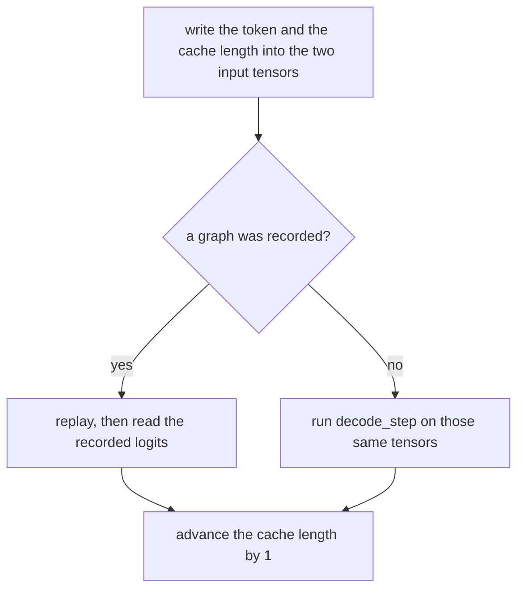

# 19. CUDA graphs

[Chapter 10](10-profiling-one-step.md) found that a generation step at this size waits on launches.
About 200 kernels go out from Python, and the wait is the launches. [Chapter 17](17-the-kv-cache.md)
keeps keys and values in one buffer of fixed shape, and its writing loop already calls a recorded
step when there is one. [Chapter 18](18-fused-attention.md) can put the attention arithmetic in one
kernel. This chapter records the whole one-token step and replays that recording for every later
token. The weights do not change. A prompt of more than one token, and the re-read when the cache
is full, still run as ordinary forward passes. A one-token prompt starts on the recorded step. The measured
rows are at the end.

**Code:** [`hello_tokens/generation/graphs.py`](../../hello_tokens/generation/graphs.py) ·
[`hello_tokens/model/gpt.py`](../../hello_tokens/model/gpt.py) ·
[`hello_tokens/model/cache.py`](../../hello_tokens/model/cache.py) ·
[`hello_tokens/model/attention.py`](../../hello_tokens/model/attention.py) ·
[`hello_tokens/generation/sampling.py`](../../hello_tokens/generation/sampling.py) ·
[`hello_tokens/__main__.py`](../../hello_tokens/__main__.py)
**Tests:** [`tests/generation/test_graphs.py`](../../tests/generation/test_graphs.py)

## Words

- **Kernel**, **launch**, **wall time**: see [chapter 10](10-profiling-one-step.md#words).
  **KV cache**, **length**, **`advance`**, **`rollback`**: see
  [chapter 17](17-the-kv-cache.md#words). **Fused attention**, **`fused`**: see
  [chapter 18](18-fused-attention.md#words). **Query**, **key**, **value**, **causal mask**: see
  [chapter 4](04-embeddings-and-attention.md#words).
- **CUDA graph**: a recording of the GPU work in one step. A **replay** sends that recorded
  sequence to the GPU in one call. Python does not run between the recorded operations.
- **Fixed-shape step**: `GPT.decode_step`. The token and the position live in tensors. Attention
  always covers the whole context, and a mask hides the slots that are not filled yet.
- **`visible`**: one row of Booleans, shape `(1, context)`. `True` means that slot is filled and
  may be attended.
- **`OneTokenStep`**: the fixed-shape step plus the cache it writes. On a GPU it holds a graph.
  On a CPU `graph` stays `None`, and the same function runs as ordinary code.
- **`index_select`**, **`index_copy_`**: read or write at an index held in a tensor, so the index
  can change on the next replay.

## The idea

### Record the launches once

Chapter 10's profile re-reads a full window and treats a graph as the way to drop the launches.
The rows at the end measure a whole generation. Each new token in that run is a replay.

<!-- from: hello_tokens/generation/graphs.py -->
```python
`torch.compile(mode="reduce-overhead")` would do the same automatically, but it needs Triton, which
this Windows setup doesn't have; recording by hand needs nothing extra and shows how it works.
```

The hand recording is `torch.cuda.CUDAGraph`. It keeps the operations, the shapes and the addresses
it saw, so the token and the position have to live in tensors, the weights have to stay put, and
the caller moves the cache length, because a replay cannot run Python.

### One query, the whole buffer

`decode_step` builds the mask from the position tensor:

<!-- from: hello_tokens/model/gpt.py -->
```python
        # Which cache slots are filled, as one row (1 query, context keys): the shape attention expects.
        visible = (torch.arange(self.config.context, device=ids.device) <= position).unsqueeze(0)
```

A slot at or before `position` is `True`. [Chapter 18](18-fused-attention.md) already shows the
fused decode call, which passes this row as `attn_mask`. The hand-written path fills `~visible`
with negative infinity before the softmax, so a `True` in `visible` is a slot that is kept. That
is the same polarity as chapter 18: `True` means may attend.

`store_at` writes at the position tensor and returns the whole buffer, so attention always sees
`context` keys. Chapter 17's `store` returns only the filled prefix. The extra arithmetic is the
price of a fixed shape. The last section shows higher peaks and does not explain them.



The recorded step runs only when `pending` has length 1. Chapter 17 shows the loop around it.

### One recording, then the pointer goes back to 0

The recording is stored per model, under the fused flag. A different flag, or a different set of
weight addresses, builds another one. The next story starts by rolling that cache back to length
0, chapter 17's `rollback`, rather than allocating again.

## The shapes

The real model's context is 256, the setting [chapter 4](04-embeddings-and-attention.md) states.
In the recorded step that is one query against 256 keys, with the mask hiding the unfilled slots.
The real vocabulary is chapter 4's 4,096.

The tests use a smaller config. `SHAPE` is vocabulary 50, context 32, width 24, layers 2, heads 4.
The head width is `24 / 4 = 6`. That is the shape in chapter 17's cache tests. Chapter 18's fused
tests set `heads` to 6, so their head width is 4. The v2 case here adds RMSNorm, RoPE, SwiGLU and
`kv_heads=2`. The group is `4 / 2 = 2`. The trained v2 model groups 6 query heads onto 2 key/value
heads, the group of 3 from [chapter 15](15-grouped-query-attention.md), and chapter 18's tests use
that 3. The quantized-weight test is not `SHAPE`: width 64 and heads 4, so the head width is 16.

The recorded inputs are a token of shape `(1, 1)` and a position of shape `(1,)`, both long
integers. The logits handed back are one row of the vocabulary: 50 numbers on this test config.

## The code

### The step a graph can replay

<!-- from: hello_tokens/model/gpt.py -->
```python
    def decode_step(self, ids: torch.Tensor, position: torch.Tensor, cache: KVCache) -> torch.Tensor:
        """One new token per row, (batch, 1) ids, at `position` (a 1-element tensor): its logits, (batch, vocab).

        The same numbers as `forward(ids, cache)` for one token, written so that nothing changes shape
        and nothing depends on a Python number between steps. That is what lets a CUDA graph record
        this step once and replay it for every token (generation/graphs.py). Two differences follow:
        - the position comes in as a tensor, so the caller must keep it equal to `cache.length`;
        - the cache's pointer is not moved here (a recorded graph can't run Python): the caller calls
          `cache.advance(1)` after each step.
        """
        # Which cache slots are filled, as one row (1 query, context keys): the shape attention expects.
        visible = (torch.arange(self.config.context, device=ids.device) <= position).unsqueeze(0)
        x = self.embedding.at(ids, position)
        for layer, block in enumerate(self.blocks):
            x = block.decode(x, cache, layer, position, visible)
        return self.output(self.final_norm(x))[:, -1]
```

The caller has to keep `position` equal to `cache.length`. The method does not call `advance`.
The returned tensor drops the time axis, leaving `(batch, vocab)`.

The position table from chapter 4, and the rotation from
[chapter 13](13-rotary-position-embedding.md), are looked up with that same tensor.

<!-- from: hello_tokens/model/embedding.py -->
```python
    def at(self, ids: torch.Tensor, position: torch.Tensor) -> torch.Tensor:
        """(batch, 1) ids of one new token at `position`, a 1-element tensor (see KVCache.store_at)."""
        if self.position is None:
            return self.token(ids)
        return self.token(ids) + self.position(position)
```

With RoPE, `self.position` is `None` and only the token row is returned. The rotation is separate:

<!-- from: hello_tokens/model/rope.py -->
```python
    def at(self, x: torch.Tensor, position: torch.Tensor) -> torch.Tensor:
        """Rotate one token's (..., 1, head_width) vectors to `position`, a 1-element tensor.

        The same rotation with the position read from a tensor instead of a Python number, so a CUDA
        graph can replay it at a new position each time (see KVCache.store_at).
        """
        return self._rotate(x, self.cos.index_select(0, position), self.sin.index_select(0, position))
```

Chapter 13 already shows this `index_select`.

The cache write is the fixed-shape twin of chapter 17's `store`. A position kept as a Python number
would stay at the value seen while recording. The excerpt keeps the docstring lines that say the
tensor is read again on every replay, then the body.

<!-- from: hello_tokens/model/cache.py -->
```python
    def store_at(self, layer: int, key: torch.Tensor, value: torch.Tensor,
                 position: torch.Tensor) -> tuple[torch.Tensor, torch.Tensor]:
        """Write one new token's key and value at `position` (a 1-element tensor); return the whole
        buffers, filled or not.
...
        Held in a tensor, it is read on the GPU at every replay. The returned buffers always have the
        full context length, so their shape never changes either; the caller hides the unfilled part.
        """
        self.keys[layer].index_copy_(2, position, key)
        self.values[layer].index_copy_(2, position, value)
        return self.keys[layer], self.values[layer]
```

Chapter 17 gives the buffer shape as layers, batch, key/value heads, positions, head width.
`keys[layer]` drops the layer axis, so dimension 2 is the positions.
`index_copy_(2, position, key)` writes the new key there. The return value is the whole buffer,
filled or not.

The hand-written scores use that mask.

<!-- from: hello_tokens/model/attention.py -->
```python
def masked_attention(
    query: torch.Tensor, key: torch.Tensor, value: torch.Tensor, visible: torch.Tensor
) -> torch.Tensor:
    """Attention of one new query over a whole fixed-size cache; `visible` (1, keys) marks the filled
    positions. The rest of the buffer holds zeros or stale tokens, and its scores become -inf, so its
...
    scores = query @ key.transpose(-2, -1) / math.sqrt(query.shape[-1])
    scores = scores.masked_fill(~visible, float("-inf"))
    return torch.softmax(scores, dim=-1) @ value
```

The scale is the square root of the head width, the same divisor as chapter 4.
`masked_fill(~visible, -inf)` is what drops the hidden slots. The fused branch does not call this
function. Chapter 18 prints that call. The lines skipped in the next excerpt are that branch.

<!-- from: hello_tokens/model/attention.py -->
```python
        query, key, value = self._project(x)
        if self.rope is not None:
            query, key = self.rope.at(query, position), self.rope.at(key, position)
        key, value = cache.store_at(layer, key, value, position)
...
            if self.kv_heads != self.heads:
                group = self.heads // self.kv_heads
                key, value = key.repeat_interleave(group, dim=1), value.repeat_interleave(group, dim=1)
            output = masked_attention(query, key, value, visible)
        return self._combine(output)
```

The copy of key and value heads is chapter 15's, and it runs only when the counts differ. The
block around this is the same two residual adds as `forward`, calling `attention.decode` and then
the feed-forward:

<!-- from: hello_tokens/model/block.py -->
```python
    def decode(self, x: torch.Tensor, cache: KVCache, layer: int, position: torch.Tensor,
               visible: torch.Tensor) -> torch.Tensor:
        """The fixed-shape one-token step (see CausalSelfAttention.decode)."""
        x = x + self.attention.decode(self.norm1(x), cache, layer, position, visible)
        x = x + self.feed_forward(self.norm2(x))
        return x
```

### Recording, and the CPU path

<!-- from: hello_tokens/generation/graphs.py -->
```python
    def __init__(self, model: GPT, warmup: int = 3):
        # A weak reference: the step is stored per model (below), and a strong one would keep the model,
        # and with it the recording and its cache, alive for as long as the program runs.
        self.model = weakref.ref(model)
        self.cache = model.new_cache()
        device = self.cache.keys.device
        # The recorded inputs: copy the next token and its position in here before each replay.
        self.ids = torch.zeros((1, 1), dtype=torch.long, device=device)
        self.position = torch.zeros(1, dtype=torch.long, device=device)
        self.graph = None
        if device.type != "cuda":
            return
```

`warmup` defaults to 3. On a CPU the method returns here, with `graph` still `None`. The
illustration later in the chapter prints that. On a GPU the next lines warm the kernels up, then
record:

<!-- from: hello_tokens/generation/graphs.py -->
```python
        with torch.no_grad():
            # Run a few steps first, on a side stream, as PyTorch requires before recording: start-up
            # work (choosing kernels, allocating memory) must happen outside the recording. These
            # steps write junk at position 0, which is overwritten when the next prompt is read.
            side = torch.cuda.Stream()
            side.wait_stream(torch.cuda.current_stream())
            with torch.cuda.stream(side):
                for _ in range(warmup):
                    model.decode_step(self.ids, self.position, self.cache)
            torch.cuda.current_stream().wait_stream(side)
            self.graph = torch.cuda.CUDAGraph()
            with torch.cuda.graph(self.graph):
                # Recorded, not run. `self.logits` is the recorded output tensor: each replay
                # overwrites it.
                self.logits = model.decode_step(self.ids, self.position, self.cache)
```

The comment says the warmup writes position 0 and the next prompt overwrites it. That is not a
separate assert. The comment on the recorded call says each replay overwrites `self.logits`.

<!-- from: hello_tokens/generation/graphs.py -->
```python
    def __call__(self, token: int) -> torch.Tensor:
        """Feed one token at the cache's current length; return the logits for the next one, (vocab,).

        The returned tensor is overwritten by the next call, so use it (or copy it) before then.
        """
        self.ids.fill_(token)
        self.position.fill_(self.cache.length)
        if self.graph is not None:
            self.graph.replay()
            logits = self.logits
        else:
            logits = self.model().decode_step(self.ids, self.position, self.cache)
        self.cache.advance(1)
        return logits[0]
```

The tensor receives `cache.length`, which is the equality `decode_step` requires, and `advance(1)`
runs after the replay or the CPU call. The GPU test clones the returned row before the next token.
This chapter did not run that test.

### Kept until the kernel or the addresses change

<!-- from: hello_tokens/generation/graphs.py -->
```python
def _weight_addresses(model: GPT) -> tuple[int, ...]:
    """Where every weight and buffer lives in memory. A recording reads the weights from these exact
    addresses, so a change of precision, a move to another device, or quantization (anything that puts
    the weights somewhere else) makes it stale: replaying it would read memory that may have been freed."""
    return tuple(t.data_ptr() for t in (*model.parameters(), *model.buffers()))


def one_token_step(model: GPT) -> OneTokenStep:
    """The recorded step for this model in its current state, made on first use and then reused."""
    per_model = _steps.setdefault(model, {})
    fused, addresses = model.blocks[0].attention.fused, _weight_addresses(model)
    if fused not in per_model or per_model[fused][0] != addresses:
        per_model[fused] = (addresses, OneTokenStep(model))  # replaces (and frees) a stale recording
    step = per_model[fused][1]
    step.cache.rollback(0)  # a new story: forget the last one
    return step
```

Every call rolls the cache back to 0, whether or not a new recording was built.

Chapter 17 already shows the loop, including `logits = step(pending[0])` when `pending` has length
1. The assignment this chapter adds is the line above that loop's cache:

<!-- from: hello_tokens/generation/sampling.py -->
```python
    step = one_token_step(model) if graphs else None
    kv = step.cache if step is not None else model.new_cache() if cache else None
```

`graphs` true builds the step and uses its cache, whether or not the cache flag was also passed.
A prompt of more than one token, and the three-quarter re-read chapter 17 explains, take ordinary
`forward`, which advances the length itself.

### The flag

Chapter 17's excerpt of `write` stops at `--cache`. The next line is this chapter's flag:

<!-- from: hello_tokens/__main__.py -->
```python
    write.add_argument("--cache", action="store_true", help="use the KV cache")
    write.add_argument("--graphs", action="store_true", help="replay each one-token step as a CUDA graph (implies --cache)")
```

`store_true` means off unless the command passes `--graphs`. The help text says the flag implies
`--cache`. `bench` has the same flag, on the line after the `--fused` flag chapter 18 shows:

<!-- from: hello_tokens/__main__.py -->
```python
    bench.add_argument("--fused", action="store_true", help="use PyTorch's fused attention kernel")
    bench.add_argument("--graphs", action="store_true", help="replay each one-token step as a CUDA graph (implies --cache)")
```

Chapter 11 already builds the row name. The word `cache` is added when `args.cache or args.graphs`,
and the word `graphs` when the flag is on, so a graphs row carries both words. There is no
published row whose name says graphs and not cache. Chapter 11 also shows the generate call that
passes `cache=args.cache` and `graphs=args.graphs` as two arguments. The stream, above, treats
`graphs` as enough.

Chapter 18's excerpt stops at `if args.graphs and args.speculative`. The body is:

<!-- from: hello_tokens/__main__.py -->
```python
        if args.graphs and args.speculative:
            print("--graphs applies to normal decoding only")
            return 2
```

The command returns 2. Speculative decoding is a later chapter. Chapter 10 already says that in
`graphs` mode the wall time is the measurement. The playground page,
[`hello_tokens/serving/static/index.html`](../../hello_tokens/serving/static/index.html), has a
checkbox labelled CUDA graphs. The serving chapter owns that page.

## What would go wrong the other way

**A position kept in Python.** The replay would keep the position from recording time. `__call__`
fills the position tensor from `cache.length`.

**Moving the pointer inside `decode_step`.** A replay cannot run that Python. The pointer test
leaves the length at 0, and `__call__` advances after the step returns.

**No mask on the unfilled slots.** `rollback` does not clear the keys past the length. `visible`
hides them, which is what the stale-entry test checks.

**Replaying after the weights have moved.** The recording would read the old addresses. The test
holds that storage so a new allocation cannot reuse it, and expects a new step.

**A strong reference from the step back to the model.** The step is stored on the model, so the
model would never be freed. It holds a weak reference. The test deletes the model and does not
call the step afterwards.

**Reading another chapter's figure as this result.** Chapter 10's range is the full-window
expectation. Chapter 11's sample table uses a graphs row only to test the printer. The measured
rows are the table below.

## Proving it works

The tests are float32, on the CPU, for both model names and both attention kernels, except where a
test says otherwise. The shapes are the ones above. The fixture seeds 0 before each test.
`model_for` builds the model, calls `eval`, and passes `fused` into `use_fused_attention`.

<!-- from: tests/generation/test_graphs.py -->
```python
SHAPE = dict(vocab_size=50, context=32, width=24, layers=2, heads=4)
SHAPES = {
    "v1": ModelConfig(**SHAPE),
    "v2": ModelConfig(**SHAPE, norm="rmsnorm", position="rope", feed_forward="swiglu", kv_heads=2),
}
CASES = [(name, fused) for name in SHAPES for fused in (False, True)]


@pytest.fixture(autouse=True)
def fixed_seed():
    torch.manual_seed(0)


def model_for(name, fused=False):
    return GPT(SHAPES[name]).eval().use_fused_attention(fused)
```

`use_fused_attention(fused)` binds that Boolean to `on`. The fixed-shape step matches an ordinary
cached step from the first new token through the last slot:

<!-- from: tests/generation/test_graphs.py -->
```python
@pytest.mark.parametrize("name,fused", CASES)
def test_the_fixed_shape_step_equals_the_cached_step_at_every_position(name, fused):
    model = model_for(name, fused)
    ids = torch.randint(0, 50, (1, 32))
    normal, fixed = model.new_cache(), model.new_cache()
    with torch.no_grad():
        model(ids[:, :4], normal)
        model(ids[:, :4], fixed)
        for n in range(4, 32):  # up to the last slot of the context
            expected = model(ids[:, n : n + 1], normal)[0, -1]
            got = model.decode_step(ids[:, n : n + 1], torch.tensor([n]), fixed)[0]
            fixed.advance(1)
            assert torch.allclose(got, expected, atol=1e-5), f"position {n}"
    # Both caches now hold the same keys and values.
    assert torch.allclose(normal.keys, fixed.keys, atol=1e-6)
    assert torch.allclose(normal.values, fixed.values, atol=1e-6)
```

`n` runs from 4 through 31. The test advances `fixed` itself, because `decode_step` does not.
Logits match at `atol=1e-5`. Keys and values match at `atol=1e-6`.

The pointer stays with the caller. This test is v2 only, and it is not parametrized.

<!-- from: tests/generation/test_graphs.py -->
```python
def test_the_fixed_shape_step_leaves_the_pointer_to_the_caller():
    model = model_for("v2")
    cache = model.new_cache()
    with torch.no_grad():
        model.decode_step(torch.tensor([[3]]), torch.tensor([0]), cache)
    assert cache.length == 0
```

Old keys past a rollback have to be ignored. This test is v2 only as well.

<!-- from: tests/generation/test_graphs.py -->
```python
def test_stale_entries_after_a_rollback_are_ignored():
    # Speculative decoding and the 256 restart leave old keys beyond the pointer; the mask must hide them.
    model = model_for("v2")
    ids, other = torch.randint(0, 50, (1, 12)), torch.randint(0, 50, (1, 1))
    with torch.no_grad():
        used = model.new_cache()
        model(ids, used)
        used.rollback(5)
        got = model.decode_step(other, torch.tensor([5]), used)[0]
        fresh = model.new_cache()
        model(ids[:, :5], fresh)
        assert torch.allclose(got, model(other, fresh)[0, -1], atol=1e-5)
```

The comment names speculative decoding and a restart at 256, the real context. The model under
test is this file's v2, context 32. The assert is the logits at `atol=1e-5`, after a rollback to
5 and one new token at that position, against a fresh cache that saw only `ids[:, :5]`.

Writing through the step matches writing through the cache, greedy and sampled.

<!-- from: tests/generation/test_graphs.py -->
```python
@pytest.mark.parametrize("name,fused", CASES)
def test_writing_with_the_recorded_step_gives_the_same_text(name, fused):
    model = model_for(name, fused)
    prompt = torch.randint(0, 50, (5,)).tolist()
    # 80 tokens with a context of 32: the cache fills and restarts from the last 3/4 twice.
    cached = generate(model, prompt, 80, temperature=0, cache=True)
    graphed = generate(model, prompt, 80, temperature=0, graphs=True)
    assert graphed == cached
    sampled = generate(model, prompt, 40, temperature=1.0, top_p=0.9, seed=7, cache=True)
    assert generate(model, prompt, 40, temperature=1.0, top_p=0.9, seed=7, graphs=True) == sampled
```

Both asserts compare the lists of new ids. The comment says the cache restarts twice. That count
is not an assert, and this chapter does not use it. Chapter 17 owns the restart rule.

A one-token prompt is v1 only. Length 1 is why the recorded step runs first, and the assert compares
the ten new ids.

<!-- from: tests/generation/test_graphs.py -->
```python
def test_a_one_token_prompt_starts_with_the_recorded_step():
    model = model_for("v1")
    assert generate(model, [7], 10, temperature=0, graphs=True) == generate(model, [7], 10, temperature=0, cache=True)
```

Quantized weights are a wider v1-style config, not `SHAPE`. The packing itself belongs to the
chapter on int8 and int4 quantization.

<!-- from: tests/generation/test_graphs.py -->
```python
def test_quantized_weights_work_in_the_fixed_shape_step():
    model = GPT(ModelConfig(vocab_size=50, context=32, width=64, layers=2, heads=4)).eval()
    quantize_model(model, 8)
    prompt = torch.randint(0, 50, (5,)).tolist()
    assert generate(model, prompt, 30, temperature=0, graphs=True) == generate(model, prompt, 30, temperature=0, cache=True)
```

The assert is graphs against cache. The recording is reused until the attention kernel changes.

<!-- from: tests/generation/test_graphs.py -->
```python
def test_the_step_is_made_once_and_reused_until_the_attention_kernel_changes():
    model = model_for("v1")
    first = one_token_step(model)
    first(3)
    again = one_token_step(model)
    assert again is first and again.cache.length == 0  # reused, and emptied for the new story
    model.use_fused_attention(True)
    assert one_token_step(model) is not first
```

The second call is the same object at length 0, because `one_token_step` rolls the cache back.
`use_fused_attention(True)` passes `True` for `on`, and the step after that is a different object.
The weak-reference test is v1 only. The call's return value is discarded, and the test does not
call the step after `del model`.

<!-- from: tests/generation/test_graphs.py -->
```python
def test_a_recorded_step_does_not_keep_its_model_alive():
    model = model_for("v1")
    one_token_step(model)
    alive = weakref.ref(model)
    del model
    gc.collect()
    assert alive() is None
```

A new address for the weights means a new step. `old` is held so those addresses cannot be reused.
The assert does not read `old`.

<!-- from: tests/generation/test_graphs.py -->
```python
@pytest.mark.parametrize("change", ["quantize", "precision round trip"])
def test_moving_the_weights_makes_a_new_step(change):
    # A graph replays reads from the weights' old addresses; after a change it must not be reused.
    model = model_for("v1")
    first = one_token_step(model)
    old = [p.data for p in model.parameters()]  # held, so the new weights can't reuse their addresses
    if change == "quantize":
        quantize_model(model, 8)
    else:
        model.to(torch.bfloat16).to(torch.float32)
    assert one_token_step(model) is not first
```

The replay test needs a GPU. It is skipped when CUDA is absent, and this chapter did not run it.
The line skipped below sets `torch.backends.cuda.matmul.allow_tf32` to false. The comment on that
line says the comparisons are exact fp32.

<!-- from: tests/generation/test_graphs.py -->
```python
@pytest.mark.skipif(not torch.cuda.is_available(), reason="CUDA graphs need a GPU")
@pytest.mark.parametrize("name,fused", CASES)
def test_a_replayed_graph_equals_running_the_step_normally(name, fused):
...
    model = model_for(name, fused).cuda()
    step = OneTokenStep(model)
    assert step.graph is not None
    ids = torch.randint(0, 50, (20,)).tolist()
    plain = model.new_cache()
    with torch.no_grad():
        model(torch.tensor([ids[:4]], device="cuda"), step.cache)
        model(torch.tensor([ids[:4]], device="cuda"), plain)
        for token in ids[4:]:
            got = step(token).clone()
            expected = model(torch.tensor([[token]], device="cuda"), plain)[0, -1]
            assert torch.allclose(got, expected, atol=1e-5)
    prompt = ids[:5]
    assert generate(model, prompt, 80, temperature=0, graphs=True) == generate(model, prompt, 80, temperature=0, cache=True)
```

`OneTokenStep` is built directly on the GPU, so `step.graph` has to be present. `ids` has 20
values. Both caches read the first 4, the loop is the other 16, and each result is cloned, at
`atol=1e-5`. The write of 80 tokens compares graphs with cache.

## Run it

```
uv run pytest tests/generation/test_graphs.py
```

Without a GPU the replay test is skipped and the rest of the file is the CPU path: `graph` is
`None`, and `decode_step` runs as ordinary code. The published row is what `bench --graphs`
records. Chapter 11 takes the median across batches:

```
uv run python -m hello_tokens bench --name v2 --dtype bfloat16 --graphs
```

Writing with the same flag is:

```
uv run python -m hello_tokens write --graphs
```

The mask below is the formula in `decode_step`, on the test context of 32 and on the real context
of 256. The step is the test's v1 shape, on the CPU, so no graph is recorded. Token 3 is the call
the reuse test makes. The last print is the pointer test's assert, run here as a print.

<!-- illustration -->
```python
import torch
from hello_tokens.generation.graphs import OneTokenStep
from hello_tokens.model.config import ModelConfig
from hello_tokens.model.gpt import GPT

torch.manual_seed(0)
context = 32
position = torch.tensor([4])
visible = (torch.arange(context) <= position).unsqueeze(0)
print("shape", tuple(visible.shape))
print("true_at_4", int(visible.sum()))
last = torch.tensor([context - 1])
print("true_at_last", int((torch.arange(context) <= last).sum()))
real = ModelConfig().context
print("real_context", real)
print("real_first", int((torch.arange(real) <= torch.tensor([0])).sum()))
print("real_last", int((torch.arange(real) <= torch.tensor([real - 1])).sum()))

model = GPT(ModelConfig(vocab_size=50, context=32, width=24, layers=2, heads=4)).eval()
step = OneTokenStep(model)
print("graph", step.graph)
print("ids", tuple(step.ids.shape), "position", tuple(step.position.shape))
print("before", step.cache.length)
logits = step(3)
print("after", step.cache.length, "logits", tuple(logits.shape))

cache = model.new_cache()
with torch.no_grad():
    model.decode_step(torch.tensor([[3]]), torch.tensor([0]), cache)
print("pointer", cache.length)
```

```
shape (1, 32)
true_at_4 5
true_at_last 32
real_context 256
real_first 1
real_last 256
graph None
ids (1, 1) position (1,)
before 0
after 1 logits (50,)
pointer 0
```

`true_at_4` is 5, positions 0 through 4, and `true_at_last` is 32. `graph` is `None`. Token 3
moves the length from 0 to 1 and returns 50 logits. `pointer` is 0.

## What we got

The CPU tests do not pin a speed, and the GPU replay test was not run for this chapter. The speed
is the median across 8 batches in [`docs/benchmarks.md`](../../docs/benchmarks.md), at a 16-token
prompt and 224 new tokens against plain bf16, the rule chapter 11 states. Chapter 17 prints the
plain rows: 166 tokens/s and 6.03 ms
per token for v1, 83 tokens/s and 12.08 ms per token for v2. There is no graphs row without the
cache. Chapter 17's cache-only rows are 1.00×. Perplexity and ECE are an en dash: the benchmarks
header says rows that only add the cache, graphs, or speculative decoding are not measured again,
and the graph steps in `scripts/gpu_benchmarks.py` pass `--skip-quality`. The int8 and int4 graph
rows are in the same file and belong to the chapter on int8 and int4 quantization.

| Row | tok/s 16+64 | tok/s 16+224 | tok/s 128+128 | Speed-up | Batch IQR | First token ms | ms / token | Size MB | Peak MB | Perplexity | ECE |
|---|---:|---:|---:|---:|---:|---:|---:|---:|---:|---:|---:|
| `v1 bf16 cache graphs` | 1,448 | 1,880 | 1,800 | 11.34× | 10% | 7.11 | 0.50 | 31.7 | 63 | – | – |
| `v1 bf16 cache fused graphs` | 1,357 | 1,734 | 1,684 | 10.45× | 6% | 5.37 | 0.55 | 31.7 | 63 | – | – |
| `v2 bf16 cache graphs` | 944 | 1,215 | 1,121 | 14.68× | 3% | 13.06 | 0.77 | 28.6 | 57 | – | – |
| `v2 bf16 cache fused graphs` | 962 | 1,181 | 1,132 | 14.27× | 5% | 11.07 | 0.80 | 28.6 | 57 | – | – |

At 16+224, `v1 bf16 cache graphs` publishes 1,880 tokens/s and 11.34×, and `v2 bf16 cache graphs`
publishes 1,215 tokens/s and 14.68×. The plain rates chapter 17 prints at that point are 166 and
83. The README calls graphs the large gain, a range of 10–15×, and names the move from 83 to
1,215. The build log summarizes the four speed-up cells as 10.5–14.7×. Chapter 10's expectation,
from the full-window profile, was roughly 6–10× if the launches went away. These four cells sit
above that range. Each new token is a replay, not chapter 10's full-window re-read.

The README writes 12.1 ms for the plain v2 milliseconds-per-token cell. That cell is the 12.08 ms
chapter 17 prints, and the v2 graph cell in the same column is 0.77 ms. v1's graph cell is 0.50 ms,
against chapter 17's 6.03 ms. The speed-up column is a separate cell. It is not that division.

Fused attention on top of the graph is slower at that 16+224 point on both models: 1,734 against
1,880, and 1,181 against 1,215. On v1
the fused-graph row is slower at all three lengths: 1,357 against 1,448, 1,734 against 1,880, and
1,684 against 1,800. On v2 the other two lengths go the other way: 962 against 944 at 16+64, and
1,132 against 1,121 at 128+128. The table records that and does not explain it.

The first token is not the win on the graphs rows without the fused kernel. Those cells are 7.11 ms
and 13.06 ms, against the plain 6.13 ms and 12.14 ms chapter 17 prints. The fused-graph first
tokens, 5.37 ms and 11.07 ms, do beat those plain cells.

Peaks rise, to 63 MB from the plain 46 MB on v1 and to 57 MB from the plain 42 MB on v2. The table
does not split that rise. The sizes stay 31.7 MB and 28.6 MB. Read across models by the rate: v2 at 1,215 tokens/s is still below v1 at 1,880. The 14.68× is
the speed-up cell against v2's own plain row.

## Check yourself

1. In the illustration, what are `shape`, `true_at_4`, `true_at_last`, `real_context`,
   `real_first` and `real_last`? What is `graph`, what are the two input shapes, and what does
   calling the step with token 3 do to the length and to the logits? What does `pointer` print,
   and which test asserts that?
2. In the equality test, what is the shape of `ids`, which slice is read first, what values does
   `n` take, and what tolerances do the logits and the cache tensors use? Which test shows that
   `decode_step` leaves the pointer alone, and what does it assert? What do the writing test's
   asserts compare, and what does its comment say that those asserts do not check? What is `heads`
   in `SHAPE`, and how does the v2 group here differ from the trained model's group?
3. At 16+224, what tok/s and speed-up do `v2 bf16 cache graphs` and `v2 bf16 cache fused graphs`
   publish? Where is fused-plus-graphs slower than graphs alone, and where do v2's other two
   lengths go? What are the first-token cells of the two graphs rows without the fused kernel,
   against the plain cells? Why are perplexity and ECE an en dash?

<details>
<summary>Answers</summary>

1. `shape` is `(1, 32)`. `true_at_4` is 5, positions 0 through 4. `true_at_last` is 32, the whole
   test context, at position 31. `real_context` is 256. `real_first` is 1 at position 0.
   `real_last` is 256 at position 255. A `True` is a slot at or before the position, the formula
   in `decode_step`. `graph` is `None`, because the step is on the CPU and `__init__` returns
   before recording. `ids` is `(1, 1)` and `position` is `(1,)`. Token 3 moves the length from 0
   to 1, and the logits have length 50, the test vocabulary. `pointer` is 0. That is
   `test_the_fixed_shape_step_leaves_the_pointer_to_the_caller`: `decode_step` on `[[3]]` at
   position 0, then `cache.length == 0`.
2. `ids` is `torch.randint(0, 50, (1, 32))`, shape `(1, 32)`. Both caches read `ids[:, :4]`.
   `n` runs through `range(4, 32)`, positions 4 through 31. The test calls `fixed.advance(1)`
   after each `decode_step`. Logits use `atol=1e-5`. Keys and values use `atol=1e-6`. The pointer
   test is v2 only, not parametrized, and the assert is `cache.length == 0` after token 3 at
   position 0. The writing test's asserts compare the lists of new ids: 80 tokens at temperature
   0, then 40 tokens at temperature 1.0 with `top_p=0.9` and seed 7, graphs against cache, from a
   prompt of length 5. The comment says the cache restarts twice. The asserts do not count
   restarts. `SHAPE` sets `heads=4` and `width=24`, so the head width is 6. The v2 case sets
   `kv_heads=2`, so the group is 2. The trained v2 model groups 6 query heads onto 2 key/value
   heads, a group of 3. Chapter 18's fused tests use `heads=6` and that group of 3.
3. `v2 bf16 cache graphs` publishes 1,215 tokens/s and 14.68×. `v2 bf16 cache fused graphs`
   publishes 1,181 tokens/s and 14.27×. Fused-plus-graphs is slower at 16+224 on both models, and
   on v1 it is slower at all three lengths (1,357 against 1,448, 1,734 against 1,880, 1,684
   against 1,800). On v2, 16+64 is 962 against 944 and 128+128 is 1,132 against 1,121, so those
   two lengths are faster with the fused kernel. The graphs rows without that kernel have
   first-token cells 7.11 ms and 13.06 ms, against the plain 6.13 ms and 12.14 ms. Perplexity and
   ECE are an en dash because those rows skip quality. The benchmarks header says so, and the
   graph steps pass `--skip-quality`. The table does not explain the fused-graph gaps or the
   higher peaks, 63 MB and 57 MB.

</details>

Next: [20. int8 and int4 quantization](20-quantization.md)
