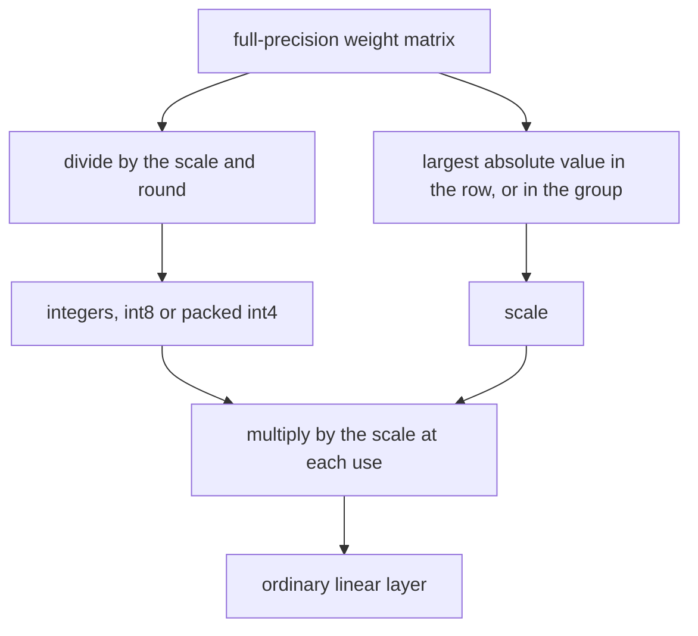

# 20. int8 and int4 quantization

A weight in this model is an ordinary floating-point number. [Chapter 1](01-setup-and-the-data.md)
introduces bf16, two bytes instead of four, and the measured rows since
[chapter 17](17-the-kv-cache.md) are bf16 models. This chapter stores the linear weights inside
the blocks as small integers plus a scale, and multiplies the integers by that scale at every
use. The tied word table stays in full precision. On the machine in
the benchmark table the smaller model is slower, and the sizes fall.

**Code:** [`hello_tokens/quantization/weights.py`](../../hello_tokens/quantization/weights.py) ·
[`hello_tokens/__main__.py`](../../hello_tokens/__main__.py) ·
[`hello_tokens/benchmark/harness.py`](../../hello_tokens/benchmark/harness.py) ·
[`hello_tokens/model/gpt.py`](../../hello_tokens/model/gpt.py)
**Tests:** [`tests/quantization/test_weights.py`](../../tests/quantization/test_weights.py) ·
[`tests/generation/test_graphs.py`](../../tests/generation/test_graphs.py)

## Words

- **Linear layer**, **weight tying**, **logits**: see
  [chapter 5](05-the-block-and-the-full-model.md#words). **bf16**: see
  [chapter 1](01-setup-and-the-data.md#words). **Perplexity**: see
  [chapter 9](09-measuring-it-perplexity.md#words). **Expected calibration error (ECE)**: see
  [chapter 11](11-the-benchmark-harness.md#words). **SwiGLU**, **`gate`**, **`up`**, **`down`**:
  see [chapter 14](14-swiglu.md#words). **`qkv`**, **`out`**: see
  [chapter 15](15-grouped-query-attention.md#words). **CUDA graph**: see
  [chapter 19](19-cuda-graphs.md#words).
- **Quantization**: storing a weight as an integer, together with a scale that turns the integer
  back into a real number. **Weight-only** means the activations, the values computed between
  layers, stay in their usual dtype. Only stored weights are integers.
- **Scale**: one positive number shared by many weights. The stored form is
  weight ≈ integer × scale.
- **Symmetric**: the scale is the largest absolute value divided by the top integer, so zero is
  an integer with nothing added. No offset is stored.
- **int8**: integers from −127 to 127, one byte each, one scale per output row.
- **int4**: integers from −7 to 7, one scale per group of 64 weights along a row. Two integers
  share a byte.
- **Group**: those 64 consecutive weights. The code's argument is `group`, and the constant is
  `GROUP`.
- **Buffer**: a tensor stored and moved with the model that is not a parameter, so training does
  not update it. The integers and the scales are buffers.

## The idea

### One scale, and a grid around zero

A row of weights has a largest absolute value. Dividing that value by 127 gives a step size. Each
weight, divided by the step and rounded to the nearest integer, lands between −127 and 127.
Multiplying the integer by the step brings back a nearby real number. The error on each weight
is at most half a step, because rounding moves a number by at most half a unit, and the unit is
the scale.

Zero divided by the scale is zero, so it rounds to zero. An all-zero row's largest absolute
value is 0, so the scale is held at a tiny floor instead of 0. No offset is stored.

Fifteen levels, −7 through 7, are too coarse for a whole row. A few large weights would set a
scale that makes the small ones share one integer. int4 therefore takes the largest absolute
value inside each group of 64, not inside the whole row. The step follows the local size of the
weights. The integers still have to be packed: four bits are not a byte, and the file stores
bytes.



### What is restored, and what is left alone

Each use unpacks the integers, multiplies by the scales, and calls the usual linear function.
That is more work in a step [chapter 10](10-profiling-one-step.md) found waiting on launches.
A smaller matrix removes bytes. It does not remove a launch, and the restore adds some. The
published rows are slower.

The walk replaces linear layers that are direct children of `attention` and of `feed_forward`.
On v2 those are `qkv`, `out`, `gate`, `up`, and `down`. The tied output layer is not among them.
[Chapter 5](05-the-block-and-the-full-model.md) ties that layer to the token table, 4,096 × 384,
and the module docstring calls the output layer the most sensitive. The table stays bf16, still shared.
Biases, RMSNorm's scales, and RoPE's tables stay as they are.

Quantization here is applied to a model that has already been trained. `eval`, `bench`, and
`judge` take `--quantize`. `write` does not. Nothing in this chapter trains the integers.

## The shapes

v2 is the shape [chapter 15](15-grouped-query-attention.md) counts at 14,189,952 parameters:
width 384, eight blocks, six query heads, two key/value heads. Chapter 15's `qkv` writes 640
numbers, so its weight is `(640, 384)`, one row per output, the layout chapter 14 states.
`out` is `(384, 384)`. Chapter 14's hidden width is 1,024, so `gate` and `up` are
`(1,024, 384)` and `down` is `(384, 1,024)`. Each of those input widths divides by 64:
384 / 64 = 6, and chapter 14's 1,024 / 64 = 16. The int4 check accepts them.

The size test counts 12,582,912 weights in those matrices, not the biases and not the tied
table. Chapter 5's token table is 1,572,864 parameters and is outside that count. In bf16 the
matrices are two bytes each. The test comment calls that 25.17 MB, calls the whole bf16 model
28.64 MB, and includes RoPE's tables at 0.26 MB: eight layers, cosine and sine, 256 positions,
32 pairs, two bytes. `model_megabytes` adds every parameter and every buffer, and divides by
10<sup>6</sup>, not by 2<sup>20</sup>. An int8 scale is one bf16 number per output row, shape
`(out, 1)`. An int4 scale is one per group, shape `(out, in / 64, 1)`, and the packed bytes
are `(out, in / 2)`.

The closeness test does not use this shape. `V2_SMALL` is vocabulary 50, context 32, width 64,
two layers, four heads, and the four v2 switches, including `kv_heads=2`. Head width is
64 / 4 = 16. [Chapter 19](19-cuda-graphs.md) already shows a different config in the graph
file: the same vocabulary, context, width, layers, and heads, with the v1 defaults, quantized
to int8 only.

## The code

The constants are the top integers and the group length.

<!-- from: hello_tokens/quantization/weights.py -->
```python
INT8_MAX = 127
INT4_MAX = 7
GROUP = 64
```

int8 takes the maximum absolute value along each row, refuses a zero scale, divides by 127, and
rounds. The cast to `torch.int8` is the stored form. Restoring is a cast back to the scale's
dtype and a multiply.

<!-- from: hello_tokens/quantization/weights.py -->
```python
def quantize_int8(weight: torch.Tensor) -> tuple[torch.Tensor, torch.Tensor]:
    """(out, in) weights -> (int8 values, one scale per row)."""
    scale = weight.abs().amax(dim=1, keepdim=True).clamp(min=1e-12) / INT8_MAX
    values = torch.round(weight / scale).clamp(-INT8_MAX, INT8_MAX).to(torch.int8)
    return values, scale


def dequantize_int8(values: torch.Tensor, scale: torch.Tensor) -> torch.Tensor:
    return values.to(scale.dtype) * scale
```

`amax(dim=1, keepdim=True)` leaves a column of scales, so the divide broadcasts along the row.
The clamp stays inside ±127. A stored `int8` could also hold −128; this code never uses that
level, so the two ends match. The largest absolute weight in a row lands on ±127, because the
scale was defined from it.

int4 reshapes the row into groups before the same rule, with 7 in place of 127. The input width
must divide by `group`. The default is `GROUP`, 64. The rounded integers are packed, and the
scale keeps the group axis.

<!-- from: hello_tokens/quantization/weights.py -->
```python
def quantize_int4(weight: torch.Tensor, group: int = GROUP) -> tuple[torch.Tensor, torch.Tensor]:
    """(out, in) weights -> (packed bytes (out, in/2), one scale per group of `group` along each row)."""
    out_features, in_features = weight.shape
    if in_features % group:
        raise ValueError(f"the input width {in_features} is not a multiple of the group size {group}")
    groups = weight.reshape(out_features, in_features // group, group)
    scale = groups.abs().amax(dim=2, keepdim=True).clamp(min=1e-12) / INT4_MAX
    values = torch.round(groups / scale).clamp(-INT4_MAX, INT4_MAX).to(torch.int8)
    return pack_int4(values.reshape(out_features, in_features)), scale
```

The message names `in_features` and `group`. The test checks the exception type, not the text.
The integers exist as `int8` only until `pack_int4`. What is stored is the packed byte tensor.

−7…7 does not fit in four unsigned bits, which run from 0 to 15. Adding 8 shifts the range to
1…15. Even positions go in the low four bits. Odd positions are shifted left by 4, into the high
four bits, and the two halves are combined with `|`. Unpacking masks the low half with `0x0F`,
shifts the high half back, and subtracts 8. `flatten(-2)` puts the pair back in order.

<!-- from: hello_tokens/quantization/weights.py -->
```python
def pack_int4(values: torch.Tensor) -> torch.Tensor:
    """Integers in -7..7 -> bytes holding two each (shifted to 1..15 so they fit in 4 unsigned bits).

    The even positions go in the low 4 bits, the odd positions in the high 4 bits.
    """
    shifted = (values + 8).to(torch.uint8)
    return shifted[..., 0::2] | (shifted[..., 1::2] << 4)


def unpack_int4(packed: torch.Tensor) -> torch.Tensor:
    low = (packed & 0x0F).to(torch.int8) - 8
    high = (packed >> 4).to(torch.int8) - 8
    return torch.stack((low, high), dim=-1).flatten(-2)  # interleave back: 0, 1, 2, 3, ...
```

The test's hand pair is 3 and −2. Shifted, those are 11 and 6, and the byte is 6 × 16 + 11.
The run below prints it.

Restoring int4 unpacks, multiplies by the group scale, and flattens back to `(out, in)`.

<!-- from: hello_tokens/quantization/weights.py -->
```python
def dequantize_int4(packed: torch.Tensor, scale: torch.Tensor) -> torch.Tensor:
    out_features, groups = scale.shape[0], scale.shape[1]
    values = unpack_int4(packed).reshape(out_features, groups, -1)
    return (values.to(scale.dtype) * scale).reshape(out_features, -1)
```

`groups` here is a count, `scale.shape[1]`, not the argument name `group`. The last dimension
of the unpacked group is however many weights the group held.

`QuantizedLinear` quantizes once, in `__init__`, from the layer it replaces. The integers and
the scale are buffers. The bias object is kept. `weight` is a method, not an attribute: it
returns the restored matrix. `forward` casts that matrix to the activation's dtype and calls
`F.linear`.

<!-- from: hello_tokens/quantization/weights.py -->
```python
    def __init__(self, linear: nn.Linear, bits: int):
        super().__init__()
        self.bits = bits
        weight = linear.weight.detach()
        values, scale = quantize_int8(weight) if bits == 8 else quantize_int4(weight)
        # Buffers, not parameters: stored and moved with the model, never trained.
        self.register_buffer("values", values)
        self.register_buffer("scale", scale.to(weight.dtype))
        self.bias = linear.bias

    def weight(self) -> torch.Tensor:
        if self.bits == 8:
            return dequantize_int8(self.values, self.scale)
        return dequantize_int4(self.values, self.scale)

    def forward(self, x: torch.Tensor) -> torch.Tensor:
        return F.linear(x, self.weight().to(x.dtype), self.bias)
```

`bits == 8` selects int8. Any other `bits` that reached this class takes the int4 path.
`quantize_model` refuses those other widths before the class is built. `detach` leaves the
autograd graph, and the caller replaces the original layer rather than editing it.

<!-- from: hello_tokens/quantization/weights.py -->
```python
def quantize_model(model: nn.Module, bits: int) -> nn.Module:
    """Replace every linear layer inside the blocks with a quantized one, in place. Returns the model."""
    if bits not in (8, 4):
        raise ValueError("bits must be 8 or 4")
    for block in model.blocks:
        for parent in (block.attention, block.feed_forward):
            for name, child in list(parent.named_children()):
                if isinstance(child, nn.Linear):
                    setattr(parent, name, QuantizedLinear(child, bits))
    return model
```

`list(parent.named_children())` snapshots the names before the loop replaces modules.
`named_children` is one level, not a walk of every nested module. In this model the linear
layers are that one level. The function returns the same model it changed.

`eval` and `bench` both call `quantize_model` when `--quantize` is set. On `bench` the call
happens before the dtype cast. The comment on that line says the full-precision weights are
rounded first, and the rest is cast afterwards. Scales, biases, and the word table then follow
`--dtype`. The integer buffers stay integers.

<!-- from: hello_tokens/__main__.py -->
```python
    eval_cmd.add_argument("--data-dir", type=Path, default=Path("data"))
    eval_cmd.add_argument("--quantize", type=int, choices=[8, 4], help="store the block weights in int8 or int4")
```

<!-- from: hello_tokens/__main__.py -->
```python
    bench.add_argument("--quantize", type=int, choices=[8, 4], help="store the block weights in int8 or int4")
    bench.add_argument("--skip-quality", action="store_true", help="don't compute held-out perplexity")
```

<!-- from: hello_tokens/__main__.py -->
```python
        if args.quantize:  # round the full-precision weights, then cast the rest
            quantize_model(model, args.quantize)
        model.to(getattr(torch, args.dtype)).use_fused_attention(args.fused)
```

The row name appends `int8` or `int4` when the flag is set. `judge` has the same choices. That
command is a later chapter. Chapter 9's `eval` excerpt stops before this flag; the note there
already says the cut lines add `--quantize`.

## What would go wrong the other way

**One scale for a whole int4 row.** Fifteen levels would be spent on the row's largest weight.
The groups exist so a quiet stretch of the row gets its own step. The constant is 64.

**An offset as well as a scale.** Zero would no longer be free, and every row or group would
carry a second stored number. The zero test would fail. The scale here is one divide by the
top integer.

**Quantizing the tied table.** The output layer would stop sharing `embedding.token.weight`, or
it would share an integer table. The replacement loop never visits `model.output`. The test
checks that the sharing is still there.

**A true integer matrix multiply.** This file restores the weights on every `forward` and every
`decode_step`, because both call the linear layers. The measured rows are the result of that
choice: slower, on this machine.

**A width that is not a multiple of 64, or a bit width other than 8 or 4.** int4 raises. So
does `quantize_model` for any other `bits`. There is no padded last group.

**Training the buffers.** `register_buffer` keeps them out of `parameters()`. A training step
would not update them. This repository quantizes a finished checkpoint. It does not train in
the integer format.

## Proving it works

The test file sets `torch.manual_seed(0)` before every test.

<!-- from: tests/quantization/test_weights.py -->
```python
def test_int8_is_off_by_at_most_half_a_step_per_weight():
    w = torch.randn(48, 128)
    values, scale = quantize_int8(w)
    assert values.dtype == torch.int8 and values.abs().max() == 127  # the largest weight uses the top level
    assert ((dequantize_int8(values, scale) - w).abs() <= scale / 2 + 1e-7).all()
```

The comment's "largest weight" is the extreme stored integer, which the scale was built to
hit. The assert is one maximum over the whole matrix, not a separate check that every row
prints 127. `torch.randint` treats its high bound as exclusive, so `(-7, 8)` is the closed
range −7…7.

<!-- from: tests/quantization/test_weights.py -->
```python
def test_int4_packs_two_values_per_byte_and_unpacks_exactly():
    values = torch.randint(-7, 8, (5, 128), dtype=torch.int8)
    packed = pack_int4(values)
    assert packed.dtype == torch.uint8 and packed.shape == (5, 64)
    assert torch.equal(unpack_int4(packed), values)
    # Worked by hand: 3 and -2 become 11 and 6, so the byte is 6 * 16 + 11 = 107.
    assert pack_int4(torch.tensor([3, -2], dtype=torch.int8)).item() == 107
```

The int4 bound is per group, which is why the error is reshaped before it is compared with
`scale`.

<!-- from: tests/quantization/test_weights.py -->
```python
def test_int4_is_off_by_at_most_half_a_step_within_each_group():
    w = torch.randn(16, 256)
    packed, scale = quantize_int4(w)
    assert scale.shape == (16, 4, 1)  # 256 / 64 groups per row
    error = (dequantize_int4(packed, scale) - w).reshape(16, 4, 64).abs()
    assert (error <= scale / 2 + 1e-7).all()
```

The zero test writes a 1 into an otherwise empty `(4, 64)` matrix and compares rows 1 onward.
Those three rows are entirely zero. Row 0, which holds the 1, is not part of the assert.

<!-- from: tests/quantization/test_weights.py -->
```python
def test_zero_stays_exactly_zero():
    w = torch.zeros(4, 64)
    w[0, 0] = 1.0
    assert torch.equal(dequantize_int8(*quantize_int8(w))[1:], w[1:])
    assert torch.equal(dequantize_int4(*quantize_int4(w))[1:], w[1:])
```

<!-- from: tests/quantization/test_weights.py -->
```python
@pytest.mark.parametrize("bits", [8, 4])
def test_a_quantized_layer_computes_with_its_restored_weights(bits):
    linear = nn.Linear(128, 32)
    q = QuantizedLinear(linear, bits)
    x = torch.randn(3, 128)
    assert torch.allclose(q(x), x @ q.weight().T + linear.bias, atol=1e-6)
```

`q.weight` is the method. The assert passes `atol=1e-6` and does not pass `rtol`. The right-hand
side transposes, which is the layout `F.linear` uses.

On `V2_SMALL`, cosine similarity is the cosine of the angle between the two flattened logit
vectors. 1 would mean the same direction. int8 must clear 0.999 and int4 must clear 0.95. The
original is deep-copied, and both forwards run under `torch.no_grad()`.

<!-- from: tests/quantization/test_weights.py -->
```python
V2_SMALL = ModelConfig(vocab_size=50, context=32, width=64, layers=2, heads=4, norm="rmsnorm", position="rope",
                       feed_forward="swiglu", kv_heads=2)
```

<!-- from: tests/quantization/test_weights.py -->
```python
@pytest.mark.parametrize("bits, closeness", [(8, 0.999), (4, 0.95)])
def test_a_quantized_model_still_gives_nearly_the_same_scores(bits, closeness):
    model = GPT(V2_SMALL).eval()
    quantized = quantize_model(copy.deepcopy(model), bits)
    ids = torch.randint(0, 50, (2, 20))
    with torch.no_grad():
        a, b = model(ids).flatten(), quantized(ids).flatten()
    assert torch.cosine_similarity(a, b, dim=0) > closeness
```

After `quantize_model(..., 4)`, `blocks.modules()` contains no `nn.Linear`. That search is
recursive, which is stronger than the one-level replacement. The output weight is still the
token table.

<!-- from: tests/quantization/test_weights.py -->
```python
def test_every_layer_inside_the_blocks_is_quantized_and_the_word_table_is_not():
    model = quantize_model(GPT(V2_SMALL), 4)
    linears = [m for m in model.blocks.modules() if isinstance(m, nn.Linear)]
    assert linears == []
    assert model.output.weight is model.embedding.token.weight  # still shared, still full precision
```

Each `quantize_model` in the size test deep-copies `full`, so the int4 call is not quantizing a
model that is already quantized. The build log states the int4 result of that formula as 10.16 MB.

<!-- from: tests/quantization/test_weights.py -->
```python
def test_the_v2_model_shrinks_as_planned():
    # bf16 v2: 14,189,952 parameters x 2 bytes = 28.38 MB, plus RoPE's rotation tables (8 layers x 2 x
    # 256 x 32 x 2 bytes = 0.26 MB) = 28.64 MB. The layers hold 12,582,912 weights (25.17 MB in bf16).
    full = GPT(PRESETS["v2"]).to(torch.bfloat16)
    layers = 12_582_912
    size = model_megabytes(full)
    assert size == pytest.approx(28.642, abs=0.001)
    # int8: one byte per weight, plus one bf16 scale per row: ~0.56x.
    assert model_megabytes(quantize_model(copy.deepcopy(full), 8)) / size == pytest.approx(0.56, abs=0.01)
    # int4: half a byte per weight, plus one bf16 scale per 64 weights: exactly this many bytes.
    int4 = size - layers * 2 / 1e6 + layers / 2 / 1e6 + layers / 64 * 2 / 1e6
    assert model_megabytes(quantize_model(copy.deepcopy(full), 4)) == pytest.approx(int4, abs=1e-6)
    assert int4 / size == pytest.approx(0.355, abs=0.005)
```

<!-- from: hello_tokens/benchmark/harness.py -->
```python
def model_megabytes(model: torch.nn.Module) -> float:
    """Bytes of every weight and buffer, in MB (10^6 bytes)."""
    tensors = list(model.parameters()) + list(model.buffers())
    return sum(t.numel() * t.element_size() for t in tensors) / 1e6
```

`parameters()` lists the tied table once, as chapter 5's `parameter_count` does. Buffers include
the RoPE tables and, after quantization, the integers and the scales.

Bits 2 are refused. So is an int4 matrix whose width is 100.

<!-- from: tests/quantization/test_weights.py -->
```python
def test_bad_inputs_are_refused():
    with pytest.raises(ValueError):
        quantize_model(GPT(V2_SMALL), 2)
    with pytest.raises(ValueError):
        quantize_int4(torch.randn(4, 100))  # 100 is not a multiple of 64
```

Chapter 19 already shows the two graph tests that call `quantize_model(model, 8)`. One compares
30 greedy tokens from a prompt of length 5, graphs against cache, on the v1-style config named
above. The other shows that quantizing makes a new step. The packing and the size
arithmetic are this chapter's.

## Run it

```text
uv run pytest tests/quantization/test_weights.py
uv run python -m hello_tokens bench --name v2 --dtype bfloat16 --quantize 8
uv run python -m hello_tokens bench --name v2 --dtype bfloat16 --quantize 4
uv run python -m hello_tokens eval --name v2 --quantize 8
```

`bench` is the command that saves a row. `--graphs` on the same command is what records the
one-token step of chapter 19 with these weights; the script's graph steps also pass
`--skip-quality`. `eval` scores in float32. Chapter 11 distinguishes that from the bench pass.
This chapter did not run those commands. The tests above are the CPU checks. The illustration
is the hand byte and one invented row, through the real functions.

<!-- illustration -->
```python
import torch
from hello_tokens.quantization.weights import pack_int4, unpack_int4, quantize_int8, dequantize_int8

packed = pack_int4(torch.tensor([3, -2], dtype=torch.int8))
print('byte', packed.item())
print('back', unpack_int4(packed).tolist())
weight = torch.tensor([[-1.0, 0.0, 0.5, 0.25]])
values, scale = quantize_int8(weight)
restored = dequantize_int8(values, scale)
print('scale', format(scale.item(), '.12f'))
print('quotients', [format(v, '.4f') for v in (weight / scale).view(-1).tolist()])
print('values', values.view(-1).tolist())
print('restored', [format(v, '.8f') for v in restored.view(-1).tolist()])
print('half', format((scale / 2).item(), '.12f'))
print('within', bool((restored - weight).abs().le(scale / 2 + 1e-7).all()))
```

```
byte 107
back [3, -2]
scale 0.007874015719
quotients ['-127.0000', '0.0000', '63.5000', '31.7500']
values [-127, 0, 64, 32]
restored ['-1.00000000', '0.00000000', '0.50393701', '0.25196850']
half 0.003937007859
within True
```

Unpacking the byte returns 3 and −2. The scale is 1 / 127, because 1 is the largest absolute
value in the row. 63.5 sits halfway between 63 and 64, and the stored integer is 64. 31.75 is
nearer 32. The restored −1 and 0 match the row. The third restored value is one printed
half-step above 0.5, and `within` uses the int8 test's slack.

## What we got

The CPU tests do not pin a speed. The speed below is the median across 8 batches in
[`docs/benchmarks.md`](../../docs/benchmarks.md), on the NVIDIA GeForce RTX 4060 Laptop GPU
named there. Speed-up, first token, and milliseconds per token are at a 16-token prompt and
224 new tokens, against plain bf16. Chapter 11 states that rule, and shows the speed-up as the
ratio of the unrounded long-answer rates. The token counts in the table are integers, so the
speed-up is not their quotient. Chapter 17's plain v2 rate at that point is 83 tokens/s, at
28.6 MB. Chapter 18 states perplexity 3.568 and ECE 0.0077. Chapter 19's graph row at that
point is 1,215 tokens/s.

Perplexity and ECE on the two graph rows are an en dash because those steps pass
`--skip-quality`. The plain int8 and int4 steps do not. Their cells are the median of a full
held-out pass in bf16. The build log's first reading is a different pass, after the table.

| Row | tok/s 16+64 | tok/s 16+224 | tok/s 128+128 | Speed-up | Batch IQR | First token ms | ms / token | Size MB | Peak MB | Perplexity | ECE |
|---|---:|---:|---:|---:|---:|---:|---:|---:|---:|---:|---:|
| `v2 bf16 int8` | 71 | 72 | 73 | 0.87× | 7% | 14.09 | 13.92 | 16.1 | 30 | 3.568 | 0.0078 |
| `v2 bf16 int4` | 45 | 45 | 46 | 0.55× | 14% | 22.16 | 22.15 | 10.2 | 24 | 3.633 | 0.0077 |
| `v2 bf16 cache graphs int8` | 744 | 902 | 860 | 10.90× | 7% | 15.22 | 1.05 | 16.1 | 45 | – | – |
| `v2 bf16 cache graphs int4` | 526 | 603 | 567 | 7.28× | 6% | 23.24 | 1.56 | 10.2 | 39 | – | – |

Quantization is slower on this machine, and it shrinks the model. At 16+224, int8 is 72
tokens/s and 0.87×, and int4 is 45 tokens/s and 0.55×, both under chapter 17's 83. The other
two lengths are lower as well. Dividing the printed 45 by the printed 83 gives 0.542, which is
not the 0.55× cell. Sizes are 16.1 MB and 10.2 MB, against 28.6. The report rounds `model_mb`
to one decimal, so the test's 28.642 MB is the published 28.6, and the build log's 10.16 MB is
the published 10.2. The README calls the move from 28.6 to 16.1 nearly half. The peak-memory cells are lower
at int4 than at int8, both plain and with graphs.

The graph rows stay well above plain bf16 and below chapter 19's 1,215, at 902 and 603
tokens/s. Their speed-up cells are against plain bf16, 10.90× and 7.28×, which the README
rounds to 11× and 7×. The other two lengths are lower than the unquantized graph row as well.
int8 perplexity stays 3.568. int4 is 3.633. (3.633 − 3.568) / 3.568 is 1.82%, the README's
+1.8%. ECE is 0.0078 and 0.0077. The README reads 0.0077–0.0078 as the smaller models not
being more overconfident. The int4 batch IQR, 14%, is the widest of these four cells.

The build log's first reading was a different pass: v2 in fp32 on the CPU, over the first
50,000 held-out tokens, perplexity 3.5983, 3.5985, and 3.6599. The log calls those moves
+0.01% and +1.7%. They are not the cells above.

## Check yourself

1. What does the illustration print for `byte`, `back`, `scale`, `quotients`, `values`,
   `restored`, `half`, and `within`? Which weight sets the scale? Which two restored numbers
   match the row, and what is 63.5 stored as?
2. In the int8 bound test, what is the shape of `w`, and what do the two asserts check? What
   shape is `packed` in the packing test, and what is the hand byte? Which rows does the zero
   test compare? What closeness do int8 and int4 require, and what is the shape of `ids`? What
   does the size test assert for the bf16 size, the int8 ratio, and the int4 ratio? Which two
   calls does the refusal test make?
3. At 16+224, what tokens per second and speed-up do `v2 bf16 int8` and `v2 bf16 int4`
   publish, and what are their sizes, perplexities, and ECE values? Are they faster or slower
   than plain v2 on this machine? What do the two graph rows publish at that point, against
   chapter 19's 1,215? Why are perplexity and ECE an en dash on the graph rows?

<details>
<summary>Answers</summary>

1. `byte` is 107. `back` is `[3, -2]`. `scale` is 0.007874015719. `quotients` are −127, 0,
   63.5, and 31.75. `values` are −127, 0, 64, and 32. `restored` is −1.00000000, 0.00000000,
   0.50393701, and 0.25196850. `half` is 0.003937007859. `within` is True. The scale is set by
   the absolute value 1, the first entry, divided by 127. The restored −1 and 0 match the row.
   63.5 is stored as 64.
2. `w` has shape `(48, 128)`. The asserts require dtype `int8` and a maximum absolute value of
   127, and every restored weight within `scale / 2 + 1e-7` of the original. `packed` has shape
   `(5, 64)` and dtype `uint8`. The hand byte is 107. The zero test compares rows 1 onward of a
   `(4, 64)` matrix, for both int8 and int4. int8 requires cosine similarity above 0.999, and
   int4 above 0.95. `ids` has shape `(2, 20)`. The bf16 size is 28.642 MB within 0.001. The
   int8 ratio is 0.56 within 0.01. The int4 ratio is 0.355 within 0.005, and the int4 byte
   count must match the formula within `1e-6`. The refusal test calls `quantize_model` with
   bits 2, and `quantize_int4` on a matrix of shape `(4, 100)`.
3. int8 publishes 72 tokens/s and 0.87×, size 16.1 MB, perplexity 3.568, ECE 0.0078. int4
   publishes 45 tokens/s and 0.55×, size 10.2 MB, perplexity 3.633, ECE 0.0077. Both are slower
   than plain v2's 83 tokens/s. The model is smaller. The graph rows publish 902 tokens/s and
   10.90×, and 603 tokens/s and 7.28×, both below chapter 19's 1,215. Perplexity and ECE are an
   en dash because those steps pass `--skip-quality`. The quality of the quantized weights is
   the two rows without graphs.

</details>

Next: [21. Speculative decoding](21-speculative-decoding.md)
