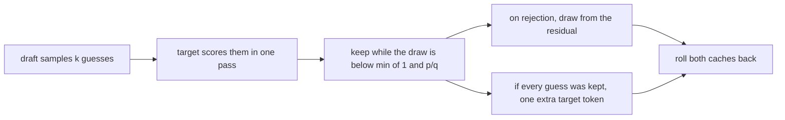

# 21. Speculative decoding

A small draft model proposes the next few tokens. The model whose text we want, the target, scores
that proposal in one forward pass, and a short rule keeps a prefix of it. Kept tokens follow the
target's own distribution. The draft changes the speed. On the machine in the benchmark table the
long answer gets faster, and the first token gets slower. CUDA graphs, measured in
[chapter 19](19-cuda-graphs.md), stay much faster. The rows are at the end.

**Code:** [`hello_tokens/generation/speculative.py`](../../hello_tokens/generation/speculative.py) ·
[`hello_tokens/generation/sampling.py`](../../hello_tokens/generation/sampling.py) ·
[`hello_tokens/model/config.py`](../../hello_tokens/model/config.py) ·
[`hello_tokens/__main__.py`](../../hello_tokens/__main__.py) ·
[`scripts/gpu_benchmarks.py`](../../scripts/gpu_benchmarks.py)
**Tests:** [`tests/generation/test_speculative.py`](../../tests/generation/test_speculative.py) ·
[`tests/generation/test_sampling.py`](../../tests/generation/test_sampling.py)

## Words

- **Temperature**, **top-k**, **top-p**, **greedy decoding**, and the distribution a token is drawn
  from: see [chapter 8](08-writing-sampling.md#words). **KV cache** and **rollback**: see
  [chapter 17](17-the-kv-cache.md#words). **Fused attention**: see
  [chapter 18](18-fused-attention.md#words). **CUDA graph**: see
  [chapter 19](19-cuda-graphs.md#words). **Perplexity**: see
  [chapter 9](09-measuring-it-perplexity.md#words). **Expected calibration error**, **speed-up**,
  and the three lengths in the table: see [chapter 11](11-the-benchmark-harness.md#words).
- **Target**: the model whose distribution the text must follow. **Draft**: a smaller model that
  only proposes tokens. The preset is `DRAFT`. The tests build a different, smaller `DRAFT`.
- **`k`**: how many tokens the draft proposes per round. The command's flag is `--k`, default 4.
- **`stats`**: an optional dict. The keys are `"rounds"`, `"drafted"` and `"accepted"`. The
  acceptance rate is `accepted / drafted`.
- **Residual**: after a rejection, `clamp(p - q, min=0)` renormalized. `p` is the target's
  filtered distribution and `q` is the draft's, both at the same dials.

## The idea

Chapter 8 draws one token from `filtered_probabilities`. Its docstring already says speculative
decoding needs that distribution, not a raw softmax. This chapter calls it `k` times on the draft
and `k + 1` times on the target, with the same `temperature`, `top_k` and `top_p`.

One round:

1. The draft reads whatever its cache has not yet read, then samples `k` tokens one at a time.
   Each sample is conditioned on the guesses so far. The draft loop always finishes all `k`
   samples before any of them is accepted or rejected.
2. The target reads its own pending tokens plus all `k` guesses in one pass. The last `k + 1`
   positions of that pass are distributions: one for each guess, and one more after the last
   guess. Chapter 18's fused kernel calls this shape "a few new queries against a longer cache."
3. Guess `i` is kept when a uniform draw falls below `min(1, p[guess] / q[guess])`. The first
   guess that fails is replaced by a draw from the residual, and the round stops. Guesses after
   that replacement are discarded even though the draft already sampled them.
4. If every guess is kept, the extra distribution from the target's pass supplies one more token.
   That bonus is the target's draw, not a draft guess.

The module states that each token follows the target and that the draft changes only the speed.
It cites Leviathan et al., 2023, and Chen et al., 2023. The tests below check that claim. The
build log calls the target's pass about one ordinary step. That phrase is not a speed-table cell.



At temperature 0, chapter 8's filter is one-hot on the top token. Then `p[guess] / q[guess]` is 1
when the draft's guess is the target's top token, and 0 otherwise. A uniform draw is below 1 and
not below 0, so the guess is kept exactly when the two tops agree. On a rejection the residual is
1 on the target's top token. The bonus, when every guess was kept, is also that one-hot draw. The
text is ordinary greedy writing. The bench path uses this case: it calls the stream with
`temperature=0`.

Both models keep a KV cache. Rejected guesses are dropped by rolling the length pointer back, the
operation chapter 17 defines. The last token of the round stays out of both caches and is read
next round. When the pending tokens plus `k` guesses would not fit, both caches restart from the
last three quarters of the context, the same fraction chapter 17 uses, with one shared base.

## The shapes

Chapter 12 quotes the two lines about GPU launches and says a later, smaller model keeps
LayerNorm on purpose. Chapter 13 says that model also keeps the learned position table, for the
same reason. Chapter 16 puts `"draft"` on the `train --model` menu, shows
`MODELS = {**PRESETS, "draft": DRAFT}`, and does not show the assignment. This is the assignment:

<!-- from: hello_tokens/model/config.py -->
```python
# The draft model for speculative decoding: tiny, so each guess is cheap. Classic parts on purpose:
# a step's cost here is the number of GPU launches, and LayerNorm (one fused kernel) and a learned
# position table launch fewer than RMSNorm and RoPE. Same vocabulary and context as the big models.
DRAFT = ModelConfig(width=192, layers=2, heads=3)
```

Unspecified fields keep `ModelConfig`'s defaults: vocabulary 4,096, context 256, `norm="layernorm"`,
`position="learned"`, `feed_forward="gelu"`, and `kv_heads=None`. `head_width` is `width // heads`,
so 192 / 3 = 64, the same head width as the default 384 / 6. The build log counts 1,725,696
parameters, about 12% of v2's 14,189,952. The illustration prints that count from
`parameter_count`. The README rounds it to 1.7M.

The tests do not build this preset. Their target and their draft are tiny, and their `DRAFT` is a
different config:

<!-- from: tests/generation/test_speculative.py -->
```python
TARGETS = {
    "v1": ModelConfig(vocab_size=50, context=32, width=24, layers=2, heads=4),
    "v2": ModelConfig(vocab_size=50, context=32, width=24, layers=2, heads=4, norm="rmsnorm", position="rope",
                      feed_forward="swiglu", kv_heads=2),
}
DRAFT = ModelConfig(vocab_size=50, context=32, width=16, layers=1, heads=2)
```

`models` seeds the target with 0 and the draft with 1. The comment calls that draft a different,
worse model. The widths, depths, and the four v2 switches are the literals in the excerpt.

The measurement script trains the preset, then benches it. It does not publish a perplexity for
the draft checkpoint. The speed rows name that checkpoint `draft`.

<!-- from: scripts/gpu_benchmarks.py -->
```python
        ("train draft", ["train", "--name", "draft", "--model", "draft", "--steps", "20000"]),
        ("eval draft", ["eval", "--name", "draft"]),
...
    for k in (2, 4, 6):
        plan.append((f"bench v2 speculative k{k}", v2 + ["--speculative", "draft", "--k", str(k), *SAME_QUALITY]))
    plan.append(("bench v2 speculative k4 fused", v2 + ["--speculative", "draft", "--k", "4", "--fused", *SAME_QUALITY]))
```

`SAME_QUALITY` is `["--skip-quality"]`. The trained draft is 20,000 steps, under the name
`draft`. The speed plan then runs `k` of 2, 4 and 6, plus fused attention at `k` 4.

## The code

<!-- from: hello_tokens/generation/speculative.py -->
```python
@torch.no_grad()
def speculative_stream(
    target: GPT,
    draft: GPT,
    ids: list[int],
    max_new_tokens: int,
    temperature: float = 0.8,
    top_k: int | None = None,
    top_p: float | None = None,
    stop_id: int | None = None,
    generator: torch.Generator | None = None,
    k: int = 4,
    stats: dict | None = None,
) -> Iterator[Step]:
    """Yield new tokens until stop_id (not yielded) or max_new_tokens, k drafted tokens per round.

    `stats`, if given, collects "rounds", "drafted" and "accepted" (acceptance rate = accepted / drafted).
    """
```

The decorator is the same one chapter 8 puts on generation: no gradients. Defaults are
temperature 0.8, `top_k` and `top_p` left off, `k` 4. `stop_id` is not yielded. Each yield is a
`Step` from chapter 8. Both models are set to `eval`.

<!-- from: hello_tokens/generation/speculative.py -->
```python
    context = min(target.config.context, draft.config.context)
    keep = context * 3 // 4
...
    target_cache, draft_cache = target.new_cache(), draft.new_cache()
    base = max(0, len(tokens) - context)  # both caches start at the same place
...
        if len(tokens) - base + k > context:
            target_cache.rollback(0), draft_cache.rollback(0)
            base = len(tokens) - keep
```

The working context is the shorter of the two. The presets share 256, and the test models share
32, so the minimum does not change those pairs. `keep` is three quarters of that context, integer
division. `base` is the index in `tokens` where cache position 0 sits, and both caches share it.
A round needs room for the unread suffix plus `k` guesses. If that would pass `context`, both
lengths go to 0 and `base` moves to the last `keep` tokens. Chapter 17's restart test does not
add `k`.

<!-- from: hello_tokens/generation/speculative.py -->
```python
    def dials(logits: torch.Tensor) -> torch.Tensor:
        return filtered_probabilities(logits, temperature, top_k, top_p)
...
        guesses, draft_dists = [], []
        feed = draft_pending
        for _ in range(k):
            q = dials(draft(torch.tensor([feed], device=device), draft_cache)[0, -1])
            guess = int(torch.multinomial(q, 1, generator=generator))
            guesses.append(guess)
            draft_dists.append(q)
            feed = [guess]

        # 2. The target reads its pending tokens and all k guesses in one pass. The last k + 1
        # positions give its distribution after each guess (and one more after the last guess).
        logits = target(torch.tensor([target_pending + guesses], device=device), target_cache)[0]
        target_dists = [dials(row) for row in logits[-(k + 1):]]
```

`dials` passes the three arguments through by name position: `temperature`, then `top_k`, then
`top_p`. The draft's first call reads `draft_pending`. Each later call reads only the guess just
chosen. After `k` calls the draft cache holds the pending tokens and the first `k - 1` guesses.
The last guess was sampled and not fed back. The target's single call reads pending and every
guess. `target_dists[i]` is the distribution for guess `i`, and `target_dists[k]` is the bonus
distribution.

<!-- from: hello_tokens/generation/speculative.py -->
```python
        new: list[int] = []
        for guess, p, q in zip(guesses, target_dists, draft_dists):
            if torch.rand(1, generator=generator, device=device) < torch.clamp(p[guess] / q[guess], max=1.0):
                new.append(guess)
                continue
            residual = torch.clamp(p - q, min=0)
            new.append(int(torch.multinomial(residual / residual.sum(), 1, generator=generator)))
            break
        else:  # every guess kept: the target's last distribution gives one more token
            new.append(int(torch.multinomial(target_dists[k], 1, generator=generator)))
        accepted = len(new) - 1 if len(new) <= k else k
```

`zip` stops at the shorter list, which here is `k` long on all three. The comparison uses one
shared `generator` for the draft's samples, the accept draw, and the residual or the bonus.
`clamp(..., max=1.0)` is the `min(1, p/q)` from the module's opening. The `else` on the `for`
runs only when `break` did not: every guess was kept, and `target_dists[k]` supplies the bonus.
`len(new)` is then `k + 1`, so `accepted` is `k`. On a rejection `len(new)` is the kept prefix
plus the replacement, which is at most `k`, and `accepted` is `len(new) - 1`. The replacement and
the bonus are not counted as accepted draft tokens.

<!-- from: hello_tokens/generation/speculative.py -->
```python
        counts["rounds"] += 1
        counts["drafted"] += k
        counts["accepted"] += accepted

        # 4. Forget what wasn't kept. The target read every guess, the draft all but the last one; of
        # those, only the kept guesses are now text. The last new token is read next round.
        target_cache.rollback(before + accepted - base)
        draft_cache.rollback(before + min(accepted, k - 1) - base)
        seconds = (time.perf_counter() - started) / len(new)
        for token in new:
            if token == stop_id:
                return
            tokens.append(token)
```

The three counters move before any token is yielded. A round that then hits `stop_id` or
`max_new_tokens` has already added `k` to `"drafted"`. The target is rolled back to the original
text plus the kept guesses: it had read all `k`. The draft is rolled back to the original text
plus at most `k - 1` kept guesses, because it never fed the last guess. `min(accepted, k - 1)` is
`k - 1` when every guess was kept, and `accepted` when one was rejected. Anything in `new` past
that prefix, including the replacement or the bonus, is still pending. `seconds` is the whole
round's time divided by `len(new)`, and every `Step` from that round carries the same value.
`stop_id` returns before `tokens.append`, so the stop token is neither yielded nor stored.

The bench command refuses to combine this with a CUDA graph, loads the draft checkpoint, and
forces greedy writing:

<!-- from: hello_tokens/__main__.py -->
```python
        if args.graphs and args.speculative:
            print("--graphs applies to normal decoding only")
            return 2
        setup = Setup(args.name, args.dtype, cache="kv" if args.cache or args.graphs or args.speculative else "none",
                      attention="fused" if args.fused else "ours",
...
        row = " ".join([args.name, "fp32" if args.dtype == "float32" else "bf16"]
                       + ["cache"] * (args.cache or args.graphs) + ["fused"] * args.fused + ["graphs"] * args.graphs
                       + ([f"spec-k{args.k}"] if args.speculative else [])
                       + ([f"int{args.quantize}"] if args.quantize else []))
...
        if args.speculative:
            draft = load_model(Path("checkpoints") / f"{args.speculative}.pt", device).to(getattr(torch, args.dtype))
            draft.use_fused_attention(args.fused)
            write = lambda prompt, n: [s.id for s in speculative_stream(
                model, draft, prompt, n, temperature=0, stop_id=None, k=args.k, stats=stats)]
...
        if stats:
            print(f"draft tokens accepted: {stats['accepted'] / stats['drafted']:.1%}")
```

`--graphs` together with `--speculative` prints that sentence and returns 2. There is no measured
row for the two together. The saved setup sets `cache` to `"kv"` whenever `--speculative` is on,
even though the row name adds the word `cache` only for `--cache` or `--graphs`. The published
names are therefore `v2 bf16 spec-k2` and its siblings, while the JSON setup says `"cache": "kv"`
and `"decoding": "speculative (draft, k=4)"` on the k=4 file. Both models get
`use_fused_attention(args.fused)`. The stream is called with `temperature=0`, `stop_id=None`, and
`k=args.k`. `top_k`, `top_p` and `generator` stay at their defaults. After the row is measured,
the command prints `accepted / drafted` as a percent. The speed table has no column for that
print. The size passed into the result is `model_megabytes` of the target, not of both models.

## What would go wrong the other way

**Always keeping the guess.** The text would follow the draft wherever the two models disagree.
The build log records that a rule which always kept the guesses failed the frequency check. The
test file as committed does not contain that variant. It checks the real rule.

**Comparing raw scores, or a softmax taken before temperature and top-p.** The token was drawn
from `filtered_probabilities`. A ratio against any other distribution would accept and reject a
different event from the one that was sampled. `dials` exists so both models pass through the
same three arguments.

**Rolling the draft back by the target's index.** The draft never consumed its last guess. The
target's length includes every guess. The same index would ask the draft to forget a position it
does not hold, or to keep a guess the round discarded. The code uses `min(accepted, k - 1)` on
the draft and `accepted` on the target.

**Counting the bonus as an accepted draft token.** `accepted` is `k` when the bonus was added,
not `k + 1`. The rate in the docstring is kept guesses over drafted guesses.

**Recording a CUDA graph around the round.** Chapter 19's graph replays one token of fixed shape.
This round is `k` draft calls plus one target call over the pending tokens and the `k` guesses.
The command refuses the combination rather than guessing a graph for it.

**A draft vocabulary the target does not index.** `p[guess]` and `q[guess]` use the same id. The
preset shares the default vocabulary of 4,096, and `models` forces both test models onto one
`vocab`. Nothing in the stream checks that the two configs agree.

## Proving it works

<!-- from: tests/generation/test_speculative.py -->
```python
def models(target_name, vocab=50):
    torch.manual_seed(0)
    target = GPT(ModelConfig(**{**TARGETS[target_name].__dict__, "vocab_size": vocab})).eval()
    torch.manual_seed(1)  # a different, worse model: it will guess wrong often
    draft = GPT(ModelConfig(**{**DRAFT.__dict__, "vocab_size": vocab})).eval()
    return target, draft
```

The helper rebuilds both networks. Passing `vocab` replaces 50, which the frequency test uses.

<!-- from: tests/generation/test_speculative.py -->
```python
@pytest.mark.parametrize("name", TARGETS)
@pytest.mark.parametrize("k", [1, 4])
def test_greedy_speculative_writing_is_exactly_greedy_writing(name, k):
    target, draft = models(name)
    prompt = [3, 1, 4, 1, 5]
    stats = {}
    with torch.no_grad():
        expected = generate(target, prompt, 25, temperature=0)  # 5 + 25 stays within the context
        assert speculative(target, draft, prompt, 25, temperature=0, k=k, stats=stats) == expected
    assert stats["drafted"] == k * stats["rounds"] and 0 <= stats["accepted"] <= stats["drafted"]
```

Four runs: the names `"v1"` and `"v2"`, and `k` of 1 and 4. The prompt has five ids, and 25 new
tokens keep 5 + 25 inside the test context of 32, which is why this test does not hit the
restart. `temperature=0` is the greedy case. The ids must match `generate` from chapter 8, token
for token. `"drafted"` must be `k` times `"rounds"`, and `"accepted"` must sit between 0 and
`"drafted"`. The test does not require a particular acceptance rate.

<!-- from: tests/generation/test_speculative.py -->
```python
def test_a_draft_identical_to_the_target_is_always_accepted():
    target, _ = models("v2")
    stats = {}
    out = speculative(target, copy.deepcopy(target), [1, 2], 20, temperature=1.0, k=4, stats=stats,
                      generator=torch.Generator().manual_seed(0))
    assert len(out) == 20 and stats["accepted"] == stats["drafted"]  # p/q = 1: nothing rejected
```

The draft is a copy of the v2 target, so `p` and `q` match and the ratio is 1. The comment says
nothing is rejected. This is temperature 1.0, with `generator` seeded 0, `k` 4, and 20 tokens from
the prompt `[1, 2]`. The test checks the length and the acceptance count. It does not compare the
ids with `generate`. At temperature 1 the two writers consume the generator differently, so
identical weights do not by themselves make the ids match. The greedy test is the one that
compares ids.

<!-- from: tests/generation/test_speculative.py -->
```python
def test_it_writes_past_the_context_and_respects_the_limits():
    target, draft = models("v2")
    assert len(speculative(target, draft, [1, 2], 80, temperature=0)) == 80  # 2 + 80 > 32
    first = speculative(target, draft, [1, 2], 1, temperature=0)[0]
    assert speculative(target, draft, [1, 2], 10, temperature=0, stop_id=first) == []
```

The comment records that 2 + 80 exceeds the context 32, so the restart runs, and the result is
still 80 tokens. The next line takes the first greedy token and passes it as `stop_id` with a
limit of 10. The stream returns `[]`, because a stop token is not yielded.

<!-- from: tests/generation/test_speculative.py -->
```python
def test_sampled_tokens_follow_the_target_s_distribution():
    # The guarantee: whatever the draft guesses, each token is distributed exactly as the target's.
    # Check the first two tokens' frequencies against the target's exact probabilities (vocab 6).
    vocab, samples = 6, 4000
    target, draft = models("v2", vocab)
    prompt = [1, 2]
    with torch.no_grad():
        first = torch.softmax(target(torch.tensor([prompt]))[0, -1], -1)
        second = sum(first[t] * torch.softmax(target(torch.tensor([prompt + [t]]))[0, -1], -1)
                     for t in range(vocab))
    g = torch.Generator().manual_seed(0)
    draws = torch.tensor([speculative(target, draft, prompt, 2, temperature=1.0, k=3, generator=g)
                          for _ in range(samples)])
    for position, expected in enumerate((first, second)):
        observed = torch.bincount(draws[:, position], minlength=vocab) / samples
        assert torch.allclose(observed, expected, atol=0.03), (position, observed, expected)
```

Vocabulary 6, prompt `[1, 2]`, temperature 1.0, `k` 3, 4,000 draws, generator seed 0. The
expected first-token frequencies are the target's own softmax. With `top_k` and `top_p` unset,
`filtered_probabilities` is that softmax. The expected second token is the
mixture over that first token, again from the target alone. `atol=0.03` is the same tolerance
chapter 8 uses for a different draw. This assert is frequencies, not an id-for-id match. The
sampling tests in `test_sampling.py` are chapter 8's. They pin down `filtered_probabilities`,
which `dials` calls, and `sample_next`, which this stream does not call.

The build log also records a check on real checkpoints: v2 with v1 as the draft writes, greedily,
exactly what v2 writes alone, and keeps 97% of v1's guesses. That draft is v1, not the `DRAFT`
preset, and 97% is not a cell in the speed table.

## Run it

```text
uv run pytest tests/generation/test_speculative.py
uv run pytest tests/generation/test_sampling.py
uv run python -m hello_tokens train --name draft --model draft --steps 20000
uv run python -m hello_tokens bench --name v2 --dtype bfloat16 --speculative draft --k 4
```

This chapter did not run those commands. Training and `bench` need the checkpoints and the GPU.
The tests above are the CPU checks. The illustration builds a v1-shaped target and the test's
one-layer draft, writes eight greedy tokens, and runs `clamp` on an invented pair of distributions.

<!-- illustration -->
```python
import torch
from hello_tokens.generation.sampling import generate
from hello_tokens.generation.speculative import speculative_stream
from hello_tokens.model.config import DRAFT, ModelConfig
from hello_tokens.model.gpt import GPT

print('parameters', GPT(DRAFT).parameter_count())
torch.manual_seed(0)
target = GPT(ModelConfig(vocab_size=50, context=32, width=24, layers=2, heads=4)).eval()
torch.manual_seed(1)
draft = GPT(ModelConfig(vocab_size=50, context=32, width=16, layers=1, heads=2)).eval()
prompt = [3, 1, 4, 1, 5]
stats = {}
with torch.no_grad():
    expected = generate(target, prompt, 8, temperature=0)
    got = [step.id for step in speculative_stream(
        target, draft, prompt, 8, temperature=0, k=4, stats=stats)]
print('match', got == expected)
print('ids', got)
print('rounds', stats['rounds'], 'drafted', stats['drafted'], 'accepted', stats['accepted'])
p = torch.tensor([0.50, 0.30, 0.20])
q = torch.tensor([0.10, 0.60, 0.30])
print('keep0', format(torch.clamp(p[0] / q[0], max=1.0).item(), '.4f'))
print('keep1', format(torch.clamp(p[1] / q[1], max=1.0).item(), '.4f'))
residual = torch.clamp(p - q, min=0)
print('residual', [format(v, '.4f') for v in (residual / residual.sum()).tolist()])
```

```
parameters 1725696
match True
ids [5, 5, 5, 5, 5, 5, 5, 5]
rounds 5 drafted 20 accepted 3
keep0 1.0000
keep1 0.5000
residual ['1.0000', '0.0000', '0.0000']
```

`parameters` is the preset's count. The eight ids match greedy writing, and 3 of 20 guesses are
accepted. That pair is freshly built. It is not the README's 40–62% for the trained draft.
`keep0` clamps 0.50 / 0.10 to 1. `keep1` is 0.30 / 0.60. The residual is 1 on token 0 only.

## What we got

The CPU tests do not pin a speed. The speeds below are the median across 8 batches in
[`docs/benchmarks.md`](../../docs/benchmarks.md), on the NVIDIA GeForce RTX 4060 Laptop GPU
named there, with PyTorch 2.14.0+cu130 and Python 3.14.3. Speed-up, first token, and
milliseconds per token are at a 16-token prompt and 224 new tokens, against plain bf16.
Chapter 11 defines that ratio as the unrounded long-answer rates. Dividing the printed 139 by
the printed 83 is not the 1.68× cell. Chapter 17's plain v2 row at that point is 83 tokens/s,
first token 12.14 ms, 12.08 ms per token, size 28.6 MB, peak 42 MB. Chapter 19's graph row
there is 1,215 tokens/s.

The table's introduction says rows that only add the KV cache, CUDA graphs, or speculative
decoding keep the model's distribution, so their quality is not measured again. The script's
speculative steps pass `--skip-quality`. Perplexity and ECE on these four rows are an en dash. The greedy test is an exact id match in fp32. The
frequency test is `atol=0.03`, not an exact match of each draw.

| Row | tok/s 16+64 | tok/s 16+224 | tok/s 128+128 | Speed-up | Batch IQR | First token ms | ms / token | Size MB | Peak MB | Perplexity | ECE |
|---|---:|---:|---:|---:|---:|---:|---:|---:|---:|---:|---:|
| `v2 bf16 spec-k2` | 132 | 139 | 106 | 1.68× | 6% | 18.26 | 7.15 | 28.6 | 45 | – | – |
| `v2 bf16 spec-k4` | 143 | 152 | 105 | 1.84× | 9% | 23.55 | 6.49 | 28.6 | 45 | – | – |
| `v2 bf16 spec-k6` | 127 | 162 | 93 | 1.95× | 13% | 27.00 | 6.09 | 28.6 | 45 | – | – |
| `v2 bf16 fused spec-k4` | 165 | 173 | 115 | 2.09× | 27% | 18.50 | 5.74 | 28.6 | 45 | – | – |

On the long answer the four rows are faster than plain v2's 83: 139, 152, 162 and 173 tokens/s,
at 1.68×, 1.84×, 1.95× and 2.09×. The README and the build log summarize that span as 1.7–2.1×.
The fastest cell is the fused row, 173. Chapter 19's 1,215 remains well above it. The README
states that comparison.

The first token is slower on every row than 12.14 ms. The column rises with `k` on the three
unfused rows, which is what the code suggests: the first yielded token waits until all `k`
draft calls have finished. The README reads the first-token cells as 18–27 ms against 12.
Milliseconds per token on the long answer are lower than 12.08 on every row. The size stays
28.6, the target's figure. The peak is 45, against the plain row's 42.

A larger `k` is not faster at every length. At 16+64 the k=6 row is 127, under k=2's 132. At
128+128 it is 93, the lowest of the four, against the plain row's 85. The README states
1.1–1.25× on the long prompt. Dividing the printed unfused rates 106, 105 and 93 by the printed
85 gives 1.25, 1.24 and 1.09. To one decimal, 1.09 is 1.1. The fused row's
115 / 85 is 1.35, above the README's 1.1–1.25×. Those quotients are not the Speed-up column.

The fused row's batch IQR is 27%. The build log calls 27% the noisiest share in the table. The
other three speculative shares are 6%, 9% and 13%.

The README's 40–62% is how often v2 accepts the trained draft's tokens. The table does not
split that range by `k`, and this chapter did not re-run the print. The build log's 97% is the
separate v1-as-draft check, not this range.

## Check yourself

1. What does the illustration print for `parameters`, `match`, `ids`, `rounds`, `drafted`,
   `accepted`, `keep0`, `keep1`, and `residual`? Why is `keep0` exactly 1, and which token does
   a rejection redraw?
2. The greedy test uses which prompt, how many new tokens, which `k`, and which model names?
   What does it require of the ids and of `"drafted"`? The identical-draft test uses which
   temperature, and which two things does it assert? What does the limit test assert for 80
   tokens and for `stop_id`? The frequency test uses which vocabulary, how many samples, which
   `k`, and which `atol`?
3. At 16+224, what do the four speculative rows publish for tokens per second and speed-up?
   Is the first token faster or slower than plain v2's 12.14 ms? Which row reaches 173, and
   how does that sit against chapter 19's 1,215? Why are perplexity and ECE an en dash?

<details>
<summary>Answers</summary>

1. `parameters` is 1725696. `match` is True. `ids` is eight 5s. `rounds` is 5, `drafted` is
   20, `accepted` is 3. `keep0` is 1.0000, `keep1` is 0.5000, and `residual` is 1 on the first
   token and 0 on the other two. `keep0` is 1 because 0.50 / 0.10 is above 1 and `clamp` stops
   at 1. A rejection redraws token 0.
2. The prompt is `[3, 1, 4, 1, 5]`, the length is 25, `k` is 1 and 4, and the names are `"v1"`
   and `"v2"`. The ids must equal `generate` at temperature 0, and `"drafted"` must equal `k`
   times `"rounds"`. The identical-draft test uses temperature 1.0 and asserts length 20 and
   `accepted == drafted`. The limit test asserts length 80, and `[]` when `stop_id` is the
   first greedy token. The frequency test uses vocabulary 6, 4,000 samples, `k` 3, and
   `atol=0.03`.
3. The four rows publish 139 at 1.68×, 152 at 1.84×, 162 at 1.95×, and 173 at 2.09×. The
   first token is slower than 12.14 ms on every row. 173 is `v2 bf16 fused spec-k4`, and
   chapter 19's graph row at the same point is 1,215. Perplexity and ECE are an en dash
   because those steps pass `--skip-quality`, and the table's introduction says that quality
   is not measured again.

</details>

Next: 22. Calibration
