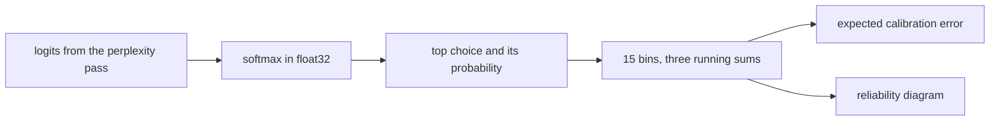

# 22. Calibration

[Chapter 9](09-measuring-it-perplexity.md) scores every held-out prediction once and turns the average
surprise into a perplexity. That number does not say whether a confident prediction is right more
often than an unsure one. This chapter records, for each prediction, the probability of the top
choice and whether that choice was the true next token. The predictions are sorted into bins, and
the bins become one number: the expected calibration error. The bins fill during the perplexity
pass, so the extra measurement does not run the model again. The published table already has a
column for the error. An earlier, smaller reading sits beside it at the end and is not that column.

**Code:** [`hello_tokens/evaluation/calibration.py`](../../hello_tokens/evaluation/calibration.py) ·
[`hello_tokens/evaluation/perplexity.py`](../../hello_tokens/evaluation/perplexity.py) ·
[`hello_tokens/__main__.py`](../../hello_tokens/__main__.py)
**Tests:** [`tests/evaluation/test_calibration.py`](../../tests/evaluation/test_calibration.py)

## Words

- **Perplexity**, **held-out** text, and the **window** that scores it: see
  [chapter 9](09-measuring-it-perplexity.md#words). **Logits** and **softmax**: see
  [chapter 6](06-the-learning-loop.md#words). **Expected calibration error**, as a column on a
  benchmark row: see [chapter 11](11-the-benchmark-harness.md#words). **int8** and **int4**: see
  [chapter 20](20-quantization.md#words).
- **Confidence**: after softmax, the probability of the top choice. It is not the probability the
  model gave to the true next token.
- **Top-1 accuracy**: the share of predictions on which that top choice was the true next token.
- **Calibration**: the hit rate inside a slice of confidence matches the confidence. The module
  states the case it wants: a model that is 70% confident is right 70% of the time.
- **Bin**: one slice of the range from 0 to 1. The default, `BINS`, is 15 slices of equal width.
- **Reliability diagram**: a bar of accuracy for each occupied bin, against the diagonal on which
  accuracy equals confidence, and a second panel for how many predictions fell in each bin.

## The idea

Perplexity can look strong while the probabilities are still poor reports of uncertainty. The
quantity this chapter trusts is the top choice's own probability. Group the predictions by that
probability. In a group whose probabilities average 70%, the top choices should be right 70% of
the time. The expected calibration error is the average gap between those two, and a large group
counts more than a small one:

```text
ECE = sum over bins of (count / total) * |accuracy - confidence|
```

Zero means every occupied bin's average confidence equals its accuracy. The module writes the same
formula. A single empty collection is refused, because the total in that formula would be zero.

The pass that already computes perplexity produces the logits. Softmax and the top choice are read
off those logits, and only three running sums are kept per bin. The pass does not store the
predictions, and it does not run the model again.



## The shapes

`add_logits` receives the same logits the loss uses, one row per position in the window.

| Tensor | Shape | What it is |
|---|---|---|
| `logits` | batch × time × vocabulary | scores, one row per position. The trained vocabulary has 4,096 entries |
| `targets` | batch × time | the true next-token id at each position |
| `confidence`, `choice` | batch × time | the top probability, and the id that had it |
| `count`, `confidence`, `correct` | 15 | running sums, `float64`, on the CPU |

`add` flattens whatever shape it is given, so a batch of windows becomes one prediction per
element. The three stored vectors stay on the CPU after `.cpu()`, however the model was run.

## The code

### What a bin records

<!-- from: hello_tokens/evaluation/calibration.py -->
```python
BINS = 15


@dataclass(frozen=True)
class Bin:
    lower: float
    upper: float
    count: int
    confidence: float  # average confidence of the predictions in the bin
    accuracy: float  # share of them whose top choice was right
```

`BINS` is the default count. A finished `Bin` holds the edges, how many predictions landed inside,
their average confidence, and the share of them that were right. Those two averages are not stored
while the pass runs. The collector stores sums, and `result` divides.

### Dropping each prediction into a bin

<!-- from: hello_tokens/evaluation/calibration.py -->
```python
    def __init__(self, bins: int = BINS):
        self.bins = bins
        self.count = torch.zeros(bins, dtype=torch.float64)
        self.confidence = torch.zeros(bins, dtype=torch.float64)
        self.correct = torch.zeros(bins, dtype=torch.float64)

    def add(self, confidence: torch.Tensor, correct: torch.Tensor) -> None:
        """confidence: probabilities in [0, 1]; correct: matching booleans (any shape)."""
        confidence = confidence.detach().flatten().double().cpu()
        correct = correct.detach().flatten().double().cpu()
        # Bin b covers [b/bins, (b+1)/bins); a confidence of exactly 1 goes in the last bin.
        index = (confidence * self.bins).long().clamp(max=self.bins - 1)
        self.count += torch.bincount(index, minlength=self.bins)
        self.confidence += torch.bincount(index, weights=confidence, minlength=self.bins)
        self.correct += torch.bincount(index, weights=correct, minlength=self.bins)
```

The three vectors are `float64` zeros. `detach` drops any link to a backward pass, `flatten`
accepts any shape, `double` widens the values, and `cpu` parks the sums off the device that
computed them.

The comment states the interval. Bin `b` covers `[b/15, (b+1)/15)`. Multiplying by 15 and
calling `.long()` truncates, so 0.25, which is 3.75 times the width, lands in bin 3.
A confidence of exactly 1 would be index 15. The clamp stops that at `bins - 1`, the last bin.
Without the clamp the counts would be one entry longer than the stored vectors. The illustration
below raises that error.

`bincount` adds one number per prediction into the chosen bin: a 1 for the count, the confidence
itself, or the correctness turned into 0 or 1. Predictions are not kept.

### From logits to the error

<!-- from: hello_tokens/evaluation/calibration.py -->
```python
    def add_logits(self, logits: torch.Tensor, targets: torch.Tensor) -> None:
        probabilities = torch.softmax(logits.float(), dim=-1)
        confidence, choice = probabilities.max(dim=-1)
        self.add(confidence, choice == targets)

    def result(self) -> Calibration:
        total = self.count.sum().item()
        if total == 0:
            raise ValueError("no predictions were added")
        bins, ece = [], 0.0
        for b in range(self.bins):
            n = self.count[b].item()
            confidence = self.confidence[b].item() / n if n else 0.0
            accuracy = self.correct[b].item() / n if n else 0.0
            ece += n / total * abs(accuracy - confidence)
            bins.append(Bin(b / self.bins, (b + 1) / self.bins, int(n), confidence, accuracy))
        return Calibration(ece, self.correct.sum().item() / total, int(total), bins)
```

`logits.float()` runs softmax in 32-bit floats even when the model ran in bf16. `max` on the last
dimension returns both the winning probability and the winning id. `choice == targets` is the
boolean `add` expects.

`result` refuses an empty collector: the message is `no predictions were added`. For a bin with
count `n`, confidence and accuracy are the stored sums divided by `n`. An empty bin stores 0 and
0. Its term in the sum is zero because `n` is zero, so the placeholder does not move the error.
The returned accuracy is not an average of the bins. It is every correct prediction divided by
every prediction. The returned count is that same total.

### The two lines chapter 9 left for this pass

Chapter 9's excerpt of `score` ends on the line that adds `targets.numel()` to the count. The
next two lines are not in that excerpt:

<!-- from: hello_tokens/evaluation/perplexity.py -->
```python
        total_tokens += targets.numel()
        if calibration is not None:
            calibration.add_logits(logits, targets)
```

Every prediction that enters the loss enters the bins, in that same call to `score`, and a pass
that does not pass a collector skips the call. The windows stay the back-to-back windows of
chapter 9. `perplexity` returns the loss and the perplexity. The caller reads the error from the
collector it passed in.

### What `eval` prints after the perplexity

Chapter 9 shows `bins = CalibrationBins()`, the call that passes `calibration=bins`, and the
prints of loss and perplexity. The `...` in that excerpt skips the lines between the call and
those prints. Those lines, and the prints after the perplexity, are:

<!-- from: hello_tokens/__main__.py -->
```python
        calibration = bins.result()
        label = args.name + (f" int{args.quantize}" if args.quantize else "")
        print(f"{label} on held-out text: {score.tokens:,} tokens scored in "
              f"{time.perf_counter() - started:.0f} s")
        print(f"loss        {score.loss:.4f}")
        print(f"perplexity  {score.perplexity:.3f}")
        print(f"accuracy    {calibration.accuracy:.1%} (top choice = the true next token)")
        print(f"ECE         {calibration.ece:.4f} (0 = perfectly calibrated)")
        diagram = Path("runs") / args.name / f"reliability{f'-int{args.quantize}' if args.quantize else ''}.png"
        save_reliability_diagram(calibration, diagram, label)
        print(f"diagram     {diagram}")
```

`calibration` here is the dataclass from `result`, not the collector. The label gains ` int8` or
` int4` when `--quantize` is set, which is [chapter 20](20-quantization.md)'s flag, and the
diagram's file name gains `-int8` or `-int4` in the same case. Accuracy is printed as a percentage
to one decimal place. The error is printed to four decimal places. The picture is written under
`runs/`, the same tree as chapter 7's chart. This chapter does not open that tree. The test writes
its picture to a temporary path and checks that the file is not empty.

### The diagram

<!-- from: hello_tokens/evaluation/calibration.py -->
```python
def save_reliability_diagram(result: Calibration, path: Path, title: str) -> None:
    """Accuracy against confidence per bin. A calibrated model's bars touch the diagonal."""
    import matplotlib

    matplotlib.use("Agg")
...
    used = [b for b in result.bins if b.count]
    width = 1 / len(result.bins)
    fig, (top, bottom) = plt.subplots(2, 1, figsize=(6, 7), gridspec_kw={"height_ratios": [3, 1]}, sharex=True)
    top.bar([b.lower for b in used], [b.accuracy for b in used], width=width, align="edge",
            edgecolor="white", label="accuracy")
    top.plot([0, 1], [0, 1], linestyle="--", color="grey", label="perfect calibration")
...
    fig.savefig(path, dpi=120)
    plt.close(fig)
```

Chapter 7's chart uses matplotlib in a mode that draws straight to a file. This function selects
that mode by name, `Agg`, before importing `pyplot`. Bins with a count of zero are left out of the
bars. The bar width is still `1/15`, from the full list of bins, so an empty stretch of confidence
stays a gap instead of being closed up by wider bars. The dashed line is accuracy equal to
confidence. A bar below that line is a bin whose hit rate is under its stated confidence. The
figure is 6 by 7 inches, the accuracy panel is three times the height of the share panel, and the
file is saved at 120 dots per inch. The lower panel, not shown in the excerpt, draws each occupied
bin's count divided by the total.

### What a benchmark row keeps

<!-- from: hello_tokens/__main__.py -->
```python
        if not args.skip_quality:
            tokens = load_tokens(args.data_dir / "tokens" / "valid.bin")
            bins = CalibrationBins()
            result.perplexity = perplexity(model, tokens, device=device, calibration=bins).perplexity
            result.ece = bins.result().ece
```

`bench` scores the whole held-out file. It stores the perplexity and the error, and it does not
store top-1 accuracy or the bins. That is why the published table has an ECE column and no
accuracy column. `--skip-quality` skips both assignments. The flag's help text names perplexity.
The name `result` in this excerpt is the benchmark row. `bins.result()` is the calibration
dataclass, and only its `.ece` is copied onto the row.

## What would go wrong the other way

**Keeping every prediction.** Chapter 9's held-out file is millions of predictions. A list of
confidences would copy that file. The pass keeps three vectors of length 15.

**Running the model a second time.** The logits already exist inside `score`. A later pass would
spend the same compute again.

**Averaging the bins without their counts.** A nearly empty bin would move the error as much as a
bin that held most of the file. The formula multiplies by `count / total`. The two-bin test is
that weight. An unweighted mean of its two gaps would fail the test.

**Calling the true token's probability the confidence.** That probability can be high when some
other id was the top choice. `probabilities.max` ties the confidence to the choice that top-1
accuracy then marks right or wrong.

**Leaving a confidence of 1 unclamped.** The index is 15, and `bincount` with `minlength` 15
returns 16 counts. Adding that vector to a stored vector of length 15 fails. The clamp places the
prediction in the last bin.

**Writing 0 where the error was not computed.** [Chapter 11](11-the-benchmark-harness.md) separates
the two: a dash means the pass was not run, and a 0 would mean the model is perfectly calibrated.

## Proving it works

Five tests in `test_calibration.py`. None of them loads a trained checkpoint.

A synthetic predictor draws 200,000 confidences from a generator seeded with 0, and marks each one
correct when a second draw falls below the confidence. That is the definition the module gives:
right with probability equal to the stated confidence. The test requires the error to be below
0.005.

<!-- from: tests/evaluation/test_calibration.py -->
```python
def test_an_overconfident_predictor_by_hand():
    # Always 90% sure, right 6 times in 10: one bin, gap 0.9 - 0.6 = 0.3.
    bins = CalibrationBins()
    bins.add(torch.full((10,), 0.9), torch.tensor([True] * 6 + [False] * 4))
    result = bins.result()
    assert result.ece == pytest.approx(0.3) and result.accuracy == pytest.approx(0.6)
    assert [b.count for b in result.bins if b.count] == [10]
```

Ten predictions, all at 0.9, six of them correct. One bin is occupied, its count is 10, the
accuracy is 0.6, and the comment's gap is 0.9 − 0.6 = 0.3. The assert uses `pytest.approx` on
both the error and the accuracy. The illustration shows why the exact float from this call is not
the comment's 0.3: `torch.full` without a dtype builds a `float32` tensor, and 0.9 is not exact
in that format.

<!-- from: tests/evaluation/test_calibration.py -->
```python
def test_two_bins_by_hand():
    # Bin [0.2, 0.267): 4 predictions at 0.25, 1 right -> gap 0. Bin [0.933, 1]: 6 at 1.0, 3 right -> gap 0.5.
    # ECE = 4/10 * 0 + 6/10 * 0.5 = 0.3. (A confidence of exactly 1 belongs in the last bin.)
    bins = CalibrationBins()
    bins.add(torch.tensor([0.25] * 4 + [1.0] * 6), torch.tensor([1, 0, 0, 0, 1, 1, 1, 0, 0, 0]).bool())
    assert bins.result().ece == pytest.approx(0.3)
```

Four predictions at 0.25, one of them correct, so that bin's accuracy equals its confidence and
the gap is 0. Six predictions at 1, three of them correct, so the accuracy is 0.5 and the gap is
0.5. The weights are 4/10 and 6/10. The comment's edges, 0.267 and 0.933, are the stored ratios
4/15 and 14/15 written to three digits. The comment also records the clamp: a confidence of
exactly 1 belongs in the last bin. The test does not assert the accuracy of the whole ten. The
illustration prints it.

The ride-along test builds a one-layer model and scores 300 random tokens through `perplexity`
with a collector.

<!-- from: tests/evaluation/test_calibration.py -->
```python
def test_it_rides_along_with_perplexity_and_counts_every_prediction(tmp_path):
    torch.manual_seed(0)
    model = GPT(ModelConfig(vocab_size=20, context=16, width=16, layers=1, heads=2)).eval()
    tokens = np.random.default_rng(0).integers(0, 20, 300).astype(np.uint16)
    bins = CalibrationBins()
    score = perplexity(model, tokens, calibration=bins)
    result = bins.result()
    assert result.predictions == score.tokens == 299
    assert sum(b.count for b in result.bins) == 299
```

The config is vocabulary 20, context 16, width 16, one layer, two heads. The token draw uses
`default_rng(0)`, length 300, values in `0 .. 19`, stored as `uint16`. Chapter 9's rule is that a
file of *n* tokens yields *n* − 1 predictions, so 300 tokens yield 299. The test requires three
quantities to equal 299: `result.predictions`, `score.tokens`, and the sum of the bin counts.
Every prediction is in some bin, and the perplexity count is the calibration count.

<!-- from: tests/evaluation/test_calibration.py -->
```python
    right = 0
    with torch.no_grad():
        for start in range(0, 299, 16):
            window = torch.from_numpy(tokens[start : start + 17].astype(np.int64))[None]
            right += (model(window[:, :-1]).argmax(-1) == window[:, 1:]).sum().item()
    assert result.accuracy == pytest.approx(right / 299)
    save_reliability_diagram(result, tmp_path / "reliability.png", "tiny model")
    assert (tmp_path / "reliability.png").stat().st_size > 0
```

The slow loop steps by the context, 16, from 0 up to but not including 299. Each window is the
slice `start : start + 17`, one token longer than the context, which is the shape `perplexity`
stacks. `argmax` on the logits is the top choice. The test requires the collector's accuracy to
match that count divided by 299. It then writes `reliability.png` under the temporary directory,
with the title `tiny model`, and requires the file's size to be greater than 0.

<!-- from: tests/evaluation/test_calibration.py -->
```python
def test_nothing_added_is_an_error():
    with pytest.raises(ValueError):
        CalibrationBins().result()
```

An unused collector has nothing to divide by. The test requires `ValueError`. It does not check
the message. The message in `result` is `no predictions were added`.

## Run it

```text
uv run pytest tests/evaluation/test_calibration.py
uv run python -m hello_tokens eval --name v1
uv run python -m hello_tokens eval --name v2
```

`eval` defaults `--name` to `v1`. It needs the checkpoint and the held-out token file. This
chapter did not run `eval`. The tests above are the CPU checks. The illustration is the two hand
tests, plus the unclamped index:

<!-- illustration -->
```python
import torch
from hello_tokens.evaluation.calibration import BINS, CalibrationBins

print("bins", BINS)
over = CalibrationBins()
over.add(torch.full((10,), 0.9), torch.tensor([True] * 6 + [False] * 4))
result = over.result()
used = next(b for b in result.bins if b.count)
print("over_ece", format(result.ece, ".16f"))
print("over_acc", format(result.accuracy, ".1f"))
print("over_n", result.predictions)
print("index_090", int((torch.tensor(0.9) * BINS).long()))
print("over_lower", format(used.lower, ".16f"))
print("over_upper", format(used.upper, ".16f"))
print("over_count", used.count)
print("over_conf", format(used.confidence, ".16f"))

two = CalibrationBins()
two.add(torch.tensor([0.25] * 4 + [1.0] * 6), torch.tensor([1, 0, 0, 0, 1, 1, 1, 0, 0, 0]).bool())
result = two.result()
print("two_ece", format(result.ece, ".1f"))
print("two_acc", format(result.accuracy, ".1f"))
print("index_025", int((torch.tensor(0.25) * BINS).long()))
print("index_100_raw", int((torch.tensor(1.0) * BINS).long()))
print("index_100", int((torch.tensor(1.0) * BINS).long().clamp(max=BINS - 1)))
for b in result.bins:
    if b.count:
        print(
            "two_bin",
            format(b.lower, ".16f"),
            format(b.upper, ".16f"),
            b.count,
            format(b.confidence, ".2f"),
            format(b.accuracy, ".2f"),
        )
raw = int((torch.tensor(1.0) * BINS).long())
counts = torch.bincount(torch.tensor([raw]), minlength=BINS)
print("bincount_len", int(counts.shape[0]))
try:
    CalibrationBins().count + counts
    print("added", True)
except RuntimeError as error:
    print("added", False)
    print("error", error)
```

```
bins 15
over_ece 0.2999999761581421
over_acc 0.6
over_n 10
index_090 13
over_lower 0.8666666666666667
over_upper 0.9333333333333333
over_count 10
over_conf 0.8999999761581421
two_ece 0.3
two_acc 0.4
index_025 3
index_100_raw 15
index_100 14
two_bin 0.2000000000000000 0.2666666666666667 4 0.25 0.25
two_bin 0.9333333333333333 1.0000000000000000 6 1.00 0.50
bincount_len 16
added False
error The size of tensor a (15) must match the size of tensor b (16) at non-singleton dimension 0
```

`over_conf` is the `float32` value of 0.9, and `over_ece` is the gap between that value and 0.6.
The overconfident test accepts it with `pytest.approx(0.3)`. `two_ece` is the comment's weighted
gaps. `two_acc` is four correct predictions out of ten, which is not that error. `index_100_raw`
is one past the last bin, `bincount_len` is 16, and adding that vector to the stored counts fails.

## What we got

The tests do not read the trained models. The published error is the median of each row's `ece`
across the 8 batches the benchmark file describes, printed to four decimal places. Perplexity on
the same row is the median of `perplexity`, printed to three decimal places. `bench` takes that
pass over the whole held-out file: 5,683,948 tokens, so 5,683,947 predictions. The model is in
the row's dtype. Softmax inside `add_logits` is still `float32`.

These are the rows that store an error. Every other row of the speed table publishes an en dash
here, because that step passed `--skip-quality`. The table caption says a row that only adds the
KV cache, CUDA graphs, or speculative decoding is not measured again: in fp32 those steps leave
the distribution unchanged. The fused rows in this table are measured because a different kernel
can change the numbers, as [chapter 18](18-fused-attention.md) records. A row that adds the cache,
a graph, or speculative decoding on top of that kernel is still a dash, and so are the quantized
graph rows. [Chapter 18](18-fused-attention.md) reads the cache-on-fused dash as [chapter 11](11-the-benchmark-harness.md)'s mark
for a pass that was not run. [Chapter 20](20-quantization.md) says the quantized graph rows pass
`--skip-quality`. Speed for the rows below is in the chapters that introduced them.

| Row | Perplexity | ECE |
|---|---:|---:|
| `v1 fp32` | 3.620 | 0.0084 |
| `v1 bf16` | 3.622 | 0.0083 |
| `v1 bf16 fused` | 3.622 | 0.0084 |
| `v2 bf16` | 3.568 | 0.0077 |
| `v2 bf16 fused` | 3.568 | 0.0077 |
| `v2 bf16 int8` | 3.568 | 0.0078 |
| `v2 bf16 int4` | 3.633 | 0.0077 |

The build log's first calibration reading is a different pass: the CPU, and the first 50,000
held-out tokens. That reading is where a trained model's top-1 accuracy is written down.
`bench` does not store that accuracy, so the published table cannot show it.

| model | perplexity | top-1 accuracy | ECE |
|---|---:|---:|---:|
| v1 | 3.657 | 65.15% | 0.0115 |
| v2 | 3.598 | 65.38% | 0.0104 |
| v2 int8 | 3.599 | 65.40% | 0.0109 |
| v2 int4 | 3.660 | 64.96% | 0.0115 |

The log reads every model in that prefix as well calibrated and slightly overconfident, with
confidence above accuracy by about one point on average. It points to the GPT-4 report, Figure 8,
for the same pattern in pre-trained models, and says the pattern holds at 14M parameters.
Chapter 16's v2 row is the exact count behind that round figure. On this prefix the log says
int4 loses 0.4 points of accuracy and adds 0.001 to the error. Chapter 20 already quotes section
24's perplexities for the same prefix. Those perplexities, and this table, are not the published
cells. The published `v2 bf16` error is the full-file median. The 0.0104 above is the prefix.

Chapter 20 quotes the README's reading of the published int8 and int4 errors: the smaller models
are not more overconfident. The published cells are the size of the gap. They do not, by
themselves, say whether confidence sat above accuracy or below it. The log's "slightly
overconfident" belongs to the prefix.

## Check yourself

1. What does the illustration print for `bins`, `over_ece`, `over_acc`, `over_n`, `index_090`,
   `over_lower`, `over_upper`, `over_count`, `over_conf`, `two_ece`, `two_acc`, `index_025`,
   `index_100_raw`, `index_100`, both `two_bin` lines, `bincount_len`, `added`, and `error`?
   Why is `over_ece` not 0.3 exactly, and why is `two_acc` 0.4 rather than 0.3?
2. The perfect-predictor test draws how many confidences, with which seed, and ECE must fall
   below which bound? The overconfident test asserts which error, which accuracy, and which
   counts? The two-bin test adds which values, and what product does its comment give for the
   error? The ride-along test uses which `ModelConfig`, how many tokens, and which three
   quantities must equal 299? Which range and which slice does the slow loop use, and what does
   it require of the picture file? What does the empty-collector test require?
3. Which seven published rows store an ECE, and what are the perplexity and ECE cells? What do
   the build log's CPU prefix of 50,000 held-out tokens report for v2's perplexity, top-1
   accuracy, and ECE? Why is that triple not the published `v2 bf16` cell? Why is ECE an en dash
   on the cache, graph, and speculative rows, while the fused rows have a number?

<details>
<summary>Answers</summary>

1. `bins` is 15. `over_ece` is 0.2999999761581421. `over_acc` is 0.6. `over_n` is 10.
   `index_090` is 13. `over_lower` is 0.8666666666666667. `over_upper` is
   0.9333333333333333. `over_count` is 10. `over_conf` is 0.8999999761581421. `two_ece` is
   0.3. `two_acc` is 0.4. `index_025` is 3. `index_100_raw` is 15. `index_100` is 14. The
   first `two_bin` is 0.2000000000000000, 0.2666666666666667, count 4, confidence 0.25,
   accuracy 0.25. The second is 0.9333333333333333, 1.0000000000000000, count 6, confidence
   1.00, accuracy 0.50. `bincount_len` is 16. `added` is False. The error says the size of
   tensor a (15) must match the size of tensor b (16) at non-singleton dimension 0.
   `over_ece` is the gap between the `float32` value of 0.9 and 0.6, and the test accepts it
   with `pytest.approx(0.3)`. `two_acc` is four correct predictions out of ten. The error
   weights the gaps, 0 on four predictions and 0.5 on six, which is 0.3.
2. The perfect-predictor test draws 200,000 confidences from `manual_seed(0)` and requires
   ECE below 0.005. The overconfident test requires `pytest.approx(0.3)`,
   `pytest.approx(0.6)`, and non-empty counts `[10]`. The two-bin test adds four 0.25s and
   six 1.0s, with booleans `[1, 0, 0, 0, 1, 1, 1, 0, 0, 0]`, and the comment's product is
   `4/10 * 0 + 6/10 * 0.5 = 0.3`. The ride-along config is vocabulary 20, context 16, width
   16, one layer, two heads. It draws 300 tokens. `result.predictions`, `score.tokens`, and
   the sum of the bin counts must equal 299. The loop is `range(0, 299, 16)` and the slice is
   `start : start + 17`. The picture's size must be greater than 0. The empty-collector test
   requires `ValueError`.
3. The seven rows are `v1 fp32` (3.620, 0.0084), `v1 bf16` (3.622, 0.0083), `v1 bf16 fused`
   (3.622, 0.0084), `v2 bf16` (3.568, 0.0077), `v2 bf16 fused` (3.568, 0.0077),
   `v2 bf16 int8` (3.568, 0.0078), and `v2 bf16 int4` (3.633, 0.0077). The prefix reports v2
   perplexity 3.598, top-1 accuracy 65.38%, and ECE 0.0104. That pass is the first 50,000
   held-out tokens on the CPU. The published cell is the median of full-file `bench` passes.
   The cache, graph, and speculative rows pass `--skip-quality`, and so do the rows that add one
   of those switches on top of the fused kernel or on top of quantization. The table caption
   says a row that only adds those three is not measured again, because in fp32 the distribution
   is unchanged. The fused rows without those switches are measured, because a different kernel
   can change the numbers.

</details>

Next: [23. Judge mode](23-judge-mode.md)
