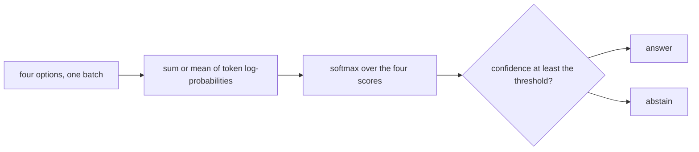

# 23. Judge mode

Writing, as [chapter 8](08-writing-sampling.md) does it, draws one token at a time. When the
candidates are already known, the model can score them instead. This chapter builds a
four-option question from a held-out story, scores every option in one forward pass, and
turns those scores into a confidence. Above a threshold the judge answers. Below it, the
judge abstains. The threshold, the scoring method, and one temperature are chosen on one
half of the questions and reported on the other half. [Chapter 22](22-calibration.md) measured
confidence in the next token. The confidence here is a softmax over four whole options, and
it is not that number.

**Code:** [`hello_tokens/judge/questions.py`](../../hello_tokens/judge/questions.py) ·
[`hello_tokens/judge/scoring.py`](../../hello_tokens/judge/scoring.py) ·
[`hello_tokens/judge/evaluate.py`](../../hello_tokens/judge/evaluate.py) ·
[`hello_tokens/__main__.py`](../../hello_tokens/__main__.py)
**Tests:** [`tests/judge/test_judge.py`](../../tests/judge/test_judge.py)

## Words

- **Softmax**, **log-probability**: see [chapter 6](06-the-learning-loop.md#words). The
  **temperature** in [chapter 8](08-writing-sampling.md#words) divides the next-token logits
  before sampling. The temperature in this chapter divides the four option scores, before
  their own softmax. **Perplexity** and the held-out file: see
  [chapter 9](09-measuring-it-perplexity.md#words). **Expected calibration error** and the
  15 next-token bins: see [chapter 22](22-calibration.md#words).
- **Option**: one candidate next sentence. **Context**: the sentences before it.
- **Summed** score: the total log-probability of an option's tokens. **Mean** score: that
  total divided by how many tokens the option has. The mean is the alternative that does not
  favour a short option.
- **Coverage**: the share of questions the judge answers. The rest are abstentions.
- **Honest split**: the first half of the questions chooses the method, the temperature, and
  the threshold. The second half, which did not choose them, is what gets reported.

## The idea

A question is the opening of a held-out story, plus four possible next sentences. One is the
true next sentence. The other three are later sentences from the same story, the three closest
to it in length. Same story means the names and the topic appear in the wrong answers too.
Matched length means the true sentence is not the odd one out by how long it is. The answer
is known, because the story was split by the program that built the question. Chance, with
four options, is one in four.

All four options are scored in one batch: the context, then the option. An option's score is
the sum of the log-probabilities of its tokens, or the mean of those log-probabilities. A
softmax over the four scores is the judge's confidence in its choice. If that confidence is
at least the threshold, the judge answers. If it is lower, the judge abstains. A caller can
then write a continuation instead. That fallback is the next chapter.

The settings are not tuned on the questions they are judged by. The first half picks the
method with the higher answer-all accuracy, then a temperature, then the lowest threshold
whose answered questions reach the target accuracy. The second half is the report.



## The shapes

Each row of the batch is the context's token ids followed by one option's ids. The batch has
one row per option, so four rows on a full question, and it is padded on the right to the
longest row. The model reads every row except the last token. The log-probabilities therefore
have shape `4 × (padded length − 1) × vocabulary`, where the padded length is the longest
row. Only the positions that predict the option's own tokens are gathered. The context's
positions are not part of the score.

The trained model's context is 256. A long context is cut from the left until the longest
option still fits. The test model uses a context of 48, so the cut is easy to hit.

## The code

### Sentences, then four options

<!-- from: hello_tokens/judge/questions.py -->
```python
OPTIONS = 4
MIN_WORDS = 3
# A sentence ends at . ! or ?, or one of those followed by a closing quote, and then whitespace. The
# split happens in the whitespace, so the punctuation and the quote stay with their sentence.
SENTENCE_END = re.compile(r'(?<=[.!?]["”])\s+|(?<=[.!?])\s+')
...
def sentences(story: str) -> list[str]:
    parts = [p.strip() for p in SENTENCE_END.split(story.strip())]
    return [p for p in parts if len(p.split()) >= MIN_WORDS]
```

Stories are split on the end-of-story marker from [chapter 3](03-real-text-and-token-files.md).
Inside a story, a sentence ends at `.`, `!`, or `?`, or at one of those followed by a closing
quote, and the split is the whitespace after that. The punctuation stays on the sentence. A
piece with fewer than three whitespace-separated words is dropped. The period stays attached
to the last word, so `Ok.` counts as one word.

<!-- from: hello_tokens/judge/questions.py -->
```python
        parts = sentences(story)
        # The true sentence needs at least `min_context` sentences before it and 3 after it.
        positions = range(min_context, len(parts) - (OPTIONS - 1))
        if not positions:
            continue
        i = rng.choice(positions)
        true = parts[i]
        later = parts[i + 1 :]
        length = len(tokenizer.encode(" " + true))
        # The three later sentences closest in length (ties keep story order), then shuffle all four.
        wrong = sorted(later, key=lambda s: abs(len(tokenizer.encode(" " + s)) - length))[: OPTIONS - 1]
        if true in wrong:  # a repeated sentence would make two right answers
            continue
        options = wrong + [true]
        rng.shuffle(options)
        questions.append(Question(" ".join(parts[:i]), options, options.index(true)))
```

`build_questions` shuffles the stories with `random.Random(seed)` and takes at most one
question from each, stopping at `count`. The default `min_context` is 2, so the true sentence
has at least two sentences before it and three after it. Length is a token count, not a word
count: `tokenizer.encode(" " + sentence)`, the same leading space the scorer puts on an
option. `sorted` is stable, so two sentences at the same distance keep their order in the
story. A repeated sentence that would appear both as the truth and as a distractor is skipped.
The context stored on the question is the earlier sentences joined by spaces. The answer is
the index of the true sentence after the shuffle.

### One batch for every option

<!-- from: hello_tokens/judge/scoring.py -->
```python
@torch.no_grad()
def score_options(model: GPT, tokenizer: Tokenizer, question: Question) -> Judgement:
    model.eval()
    device = next(model.parameters()).device
    options = [tokenizer.encode(" " + option) for option in question.options]
    # The model reads context + option, minus the last token, so the context may use what's left of
    # the window after the longest option. A long context loses its beginning, never its end.
    room = model.config.context + 1 - max(len(o) for o in options)
    if room < 1:
        raise ValueError("an option is longer than the model's context")
    context = (tokenizer.encode(question.context) or [tokenizer.end_of_text_id])[-room:]
    rows = [context + option for option in options]
    width = max(len(r) for r in rows)
    # Pad on the right: a token never sees what comes after it, so padding can't change any score.
    batch = torch.tensor([r + [0] * (width - len(r)) for r in rows], device=device)
    log_probs = F.log_softmax(model(batch[:, :-1]).float(), dim=-1)
```

`room` is how many context tokens fit in front of the longest option. The model reads one
token fewer than the full row, which is why the formula adds one before subtracting the
option. An option longer than the context raises `ValueError`. An empty context is replaced
by the end-of-text id. A longer context keeps its last `room` tokens. The rows are padded on
the right with zeros. The comment gives the reason: a token never attends to what follows it,
so those zeros cannot change a score that was already computed. `log_softmax` runs in
`float32`.

<!-- from: hello_tokens/judge/scoring.py -->
```python
    for i, option in enumerate(options):
        # The option's tokens sit at positions len(context) ... len(context) + len(option) - 1, and
        # each is predicted from the position just before it.
        positions = torch.arange(len(context) - 1, len(context) - 1 + len(option), device=device)
        scores = log_probs[i, positions, torch.tensor(option, device=device)]
        summed.append(scores.sum().item())
        mean.append(scores.mean().item())
    return Judgement(summed, mean)
```

Output index `len(context) - 1` predicts the first option token, which sits at index
`len(context)` in the full row. Each later option token is predicted from the index just
before it. The gathered values are that option's tokens only. `summed` adds them. `mean`
divides by the option's length. Both lists are stored. The method is chosen later.

### The confidence, the switch, and the temperature

<!-- from: hello_tokens/judge/scoring.py -->
```python
    def probabilities(self, method: str, temperature: float = 1.0) -> torch.Tensor:
        """How much the model favours each option: a softmax over the scores, divided by the temperature."""
        return torch.softmax(torch.tensor(getattr(self, method), dtype=torch.float64) / temperature, dim=0)
```

`method` is `"summed"` or `"mean"`. The scores are divided by the temperature, and then
softmax turns the four numbers into probabilities. The division is not applied after the
softmax. The choice is the index of the largest probability. The confidence is that
probability.

<!-- from: hello_tokens/judge/scoring.py -->
```python
    answered = confidence >= threshold
    count = int(answered.sum())
    accuracy = correct[answered].double().mean().item() if count else 1.0
    return Outcome(threshold, count / len(answers), accuracy)
```

Coverage is the share of questions whose confidence meets the threshold. Accuracy is the
share of those answered questions that were right. If none were answered, the code reports
accuracy 1.0. Nothing in the test file hits that branch.

<!-- from: hello_tokens/judge/scoring.py -->
```python
    order = torch.argsort(confidence, descending=True)
    # Answering the i most confident questions: their running accuracy.
    running = torch.cumsum(correct[order].double(), 0) / torch.arange(1, len(order) + 1)
    sorted_confidence = confidence[order]
    for i in range(len(order) - 1, -1, -1):  # from answering everything down to answering one
        # Ties share a threshold: only cut where the next confidence is strictly lower.
        if (i == len(order) - 1 or sorted_confidence[i + 1] < sorted_confidence[i]) and running[i] >= target:
            return float(sorted_confidence[i])
    return 1.0
```

`choose_threshold` wants the lowest threshold that still meets the target, which means the
largest set of most-confident questions whose accuracy is at least the target. The scan
starts at answering everything and stops at the first set that qualifies. A tie in confidence
is not cut in the middle: the cut has to land where the next confidence is strictly lower.
If no prefix of the ranking reaches the target, the function returns 1.0.

<!-- from: hello_tokens/judge/scoring.py -->
```python
def fit_temperature(judgements: list[Judgement], answers: list[int], method: str) -> float:
    """Temperature scaling (Guo et al., 2017): the one number T that makes the true answers most likely.
...
    scores = torch.tensor([getattr(j, method) for j in judgements], dtype=torch.float64)
    truth = torch.tensor(answers)
    grid = torch.logspace(-0.6, 2, 400, dtype=torch.float64)  # 0.25 ... 100
    losses = [torch.nn.functional.cross_entropy(scores / t, truth).item() for t in grid]
    return float(grid[int(torch.tensor(losses).argmin())])
```

The grid is 400 values. The comment says they run from 0.25 to 100. The illustration prints
the first and the last. Each candidate temperature divides the scores, and cross-entropy
measures how likely the true option is. The temperature with the smallest loss is kept. The
docstring states two consequences. Dividing by a number greater than 1 softens the softmax.
Dividing by any positive number does not change which option scores highest, so the answer-all
accuracy does not move. A temperature below 1 is still on the grid. It sharpens the softmax,
and it still does not change the winning option. The judge's own calibration uses
`CalibrationBins` with 10 bins, not the 15 of chapter 22. The call sits in `option_calibration`.

### Chosen on one half, reported on the other

<!-- from: hello_tokens/judge/evaluate.py -->
```python
    half = len(questions) // 2
    choose_j, choose_a = judgements[:half], answers[:half]
    report_j, report_a = judgements[half:], answers[half:]

    # Settings come from the first half only.
    method = max(METHODS, key=lambda m: outcome(choose_j, choose_a, m, 0.0).accuracy)
    temperature = fit_temperature(choose_j, choose_a, method)
    threshold = choose_threshold(choose_j, choose_a, method, target, temperature)
```

A threshold of 0 answers every question, because a softmax probability is at least 0. The
method is whichever of `summed` and `mean` has the higher answer-all accuracy on the first
half. `METHODS` is `("summed", "mean")`, so a tie keeps `summed`. The temperature and the
threshold are fit on that same half, with the command's target. The default target is 0.9.

<!-- from: hello_tokens/judge/evaluate.py -->
```python
        "method": method,
        "accuracy_by_method": {m: outcome(report_j, report_a, m, 0.0).accuracy for m in METHODS},
...
        "option_ece_raw": option_calibration(report_j, report_a, method).ece,
        "option_ece": option_calibration(report_j, report_a, method, temperature).ece,
```

`accuracy_by_method` is the second half, answering everything, for both methods. The raw
error uses temperature 1. The scaled error uses the fitted temperature. Both use the method
the first half chose, and both use 10 bins. The first half's accuracies are not in the saved
file.

## What would go wrong the other way

**Distractors from other stories.** A name that appears only in the true sentence would point
at the answer without the model reading the context. The module keeps the three wrong
sentences inside the same story.

**Matching length in words, then scoring tokens.** The length that is matched is the token
length of a leading space plus the sentence, the same encoding the score uses. A word count
would line up a different notion of "short".

**Padding on the left.** The code pads on the right and says those positions cannot affect a
score, because a token does not see what follows it. The gathered positions are counted from
the start of the row. Left padding would move the option to different indices.

**Choosing the method on the report half.** The second-half accuracies would then be the
reason the method was picked, and the report would flatter that pick. The code cuts at
`len // 2` before it looks at either accuracy.

**A temperature that can be negative or zero.** The grid is positive. The docstring's claim,
that the winning option does not change, is for a positive divisor. Zero would not be a legal
divisor in the line `scores / t`.

**Reading a next-token ECE as this confidence.** Chapter 22 bins the probability of the top
next token, in 15 bins. Here the probability is over four sentences, in 10 bins. A small
next-token error does not say the four-way softmax is calibrated.

**Treating an unanswered set as a failure of accuracy.** The code's accuracy is 1.0 when the
threshold answers nothing. Coverage is then 0. The 1.0 is the empty average, not a perfect
judge.

## Proving it works

The sentence test requires this split, and it does not keep `Ok.`:

<!-- from: tests/judge/test_judge.py -->
```python
def test_sentences_are_split_at_their_ends_and_tiny_fragments_dropped():
    assert sentences('He said, "Hi!" Then he left. Ok. The end came soon.') == [
        'He said, "Hi!"', "Then he left.", "The end came soon."]
```

The closing quote stays on `Hi!`. `Then he left.` has three whitespace-separated words, so it
meets `MIN_WORDS`. `Ok.` has one.

The question test builds four questions from the file's text with `seed=1`, and building them
again returns the same list. The text is the story at the top of the file, then a copy with
`Tom` replaced by `Mia` and `He ` replaced by `She `, joined by the end-of-story marker, and
that pair repeated three times. The test tokenizer is trained on that text with vocabulary
300. For each question the test finds the story that starts with the context, sets `i` to
`len(sentences(q.context))`, and requires `q.options[q.answer]` to equal `parts[i]`. Every
other option must sit in `parts[i + 1 :]`. The four options must be unique. The test does not
assert which of the later sentences were the closest in length. That rule is in `build_questions`.

<!-- from: tests/judge/test_judge.py -->
```python
@pytest.fixture
def model(tokenizer):
    torch.manual_seed(0)
    return GPT(ModelConfig(vocab_size=tokenizer.vocab_size, context=48, width=32, layers=2, heads=4)).eval()
```

The scoring test uses one hand-built question, context `Tom had a red ball.`, and the four
options `He liked to throw it high.`, `Tom was very sad.`, `They ran.`, and `Sam came.`, with
answer index 0. It encodes each option with a leading space, runs the model on that option
alone with no padding, and sums the log-probabilities at the same positions the batch uses.
`summed` must match within `abs=1e-4`. `mean` must match that sum divided by the option's
length, within the same tolerance.

The long-context test sets the context to `STORY * 4`, which the comment says is far past 48
tokens, and requires four summed scores back. It does not compare those scores to a hand sum.

<!-- from: tests/judge/test_judge.py -->
```python
HAND = [Judgement([0.0, -5.0, -5.0, -5.0], [0, 0, 0, 0]),  # very sure, right
        Judgement([0.0, -0.1, -5.0, -5.0], [0, 0, 0, 0]),  # unsure, right
        Judgement([-0.2, 0.0, -5.0, -5.0], [0, 0, 0, 0])]  # unsure, wrong (chooses 1, answer 0)
ANSWERS = [0, 0, 0]
```

Threshold 0 must cover everything with accuracy 2/3. Threshold 0.9 must cover 1/3 with
accuracy 1.0. `choose_threshold` at target 1.0 must equal the first judgement's maximum
probability. At target 0.6 it must return a number below 0.6, because answering everything
already has accuracy 2/3. `option_calibration` on the same three must report 3 predictions
and accuracy 2/3.

The temperature test draws 3,000 rows of 4 honest scores from a generator seeded with 0,
samples the answers from the softmax of those scores, and stores judgements whose summed
scores are five times the honest scores. `fit_temperature` on `"summed"` must land within
`rel=0.15` of 5. The 10-bin error at that temperature must be under one third of the error
at temperature 1. Answer-all accuracy at the fitted temperature must equal answer-all
accuracy without it.

## Run it

```text
uv run pytest tests/judge/test_judge.py
uv run python -m hello_tokens judge --name v1
uv run python -m hello_tokens judge --name v2
```

`judge` defaults `--name` to `v2`, `--questions` to 2000, and `--target` to 0.9. It builds
the question file once, with seed 0, if that file is not already there. This chapter did not
run the command. The tests are the CPU checks. The illustration is the sentence split, the
three hand judgements, and the ends of the temperature grid:

<!-- illustration -->
```python
import torch
from hello_tokens.judge.questions import sentences
from hello_tokens.judge.scoring import Judgement, choose_threshold, outcome

print("sentences", sentences('He said, "Hi!" Then he left. Ok. The end came soon.'))
HAND = [
    Judgement([0.0, -5.0, -5.0, -5.0], [0, 0, 0, 0]),
    Judgement([0.0, -0.1, -5.0, -5.0], [0, 0, 0, 0]),
    Judgement([-0.2, 0.0, -5.0, -5.0], [0, 0, 0, 0]),
]
ANSWERS = [0, 0, 0]
for i, judgement in enumerate(HAND):
    p = judgement.probabilities("summed")
    top = float(p.max())
    print("p", i, [format(x, ".6f") for x in p.tolist()], "choice", int(p.argmax()), "top", format(top, ".6f"))
everything = outcome(HAND, ANSWERS, "summed", 0.0)
sure = outcome(HAND, ANSWERS, "summed", 0.9)
print("everything", format(everything.coverage, ".6f"), format(everything.accuracy, ".6f"))
print("sure", format(sure.coverage, ".6f"), format(sure.accuracy, ".6f"))
t100 = choose_threshold(HAND, ANSWERS, "summed", target=1.0)
t60 = choose_threshold(HAND, ANSWERS, "summed", target=0.6)
print("t100", format(t100, ".6f"))
print("t60", format(t60, ".6f"))
print("match_top", t100 == float(HAND[0].probabilities("summed").max()))
print("t60_below", t60 < 0.6)
grid = torch.logspace(-0.6, 2, 400, dtype=torch.float64)
print("grid_n", int(grid.numel()))
print("grid_first", format(float(grid[0]), ".8f"))
print("grid_last", format(float(grid[-1]), ".1f"))
```

```
sentences ['He said, "Hi!"', 'Then he left.', 'The end came soon.']
p 0 ['0.980187', '0.006604', '0.006604', '0.006604'] choice 0 top 0.980187
p 1 ['0.521291', '0.471684', '0.003512', '0.003512'] choice 0 top 0.521291
p 2 ['0.446855', '0.545790', '0.003678', '0.003678'] choice 1 top 0.545790
everything 1.000000 0.666667
sure 0.333333 1.000000
t100 0.980187
t60 0.521291
match_top True
t60_below True
grid_n 400
grid_first 0.25118864
grid_last 100.0
```

The first two judgements choose option 0 and are right. The third chooses option 1, and the
answer is 0, so it is wrong. Threshold 0.9 keeps only the first. Answering all three is
already two right out of three, so target 1.0 keeps only that first question: `t100` equals
its top and `match_top` is True. Target 0.6 is already met, so `t60` is the lowest of the
three tops and `t60_below` is True. The grid's first point prints as 0.25118864, beside the
comment's 0.25, and the last point is 100.0.

## What we got

The published table is the CPU run. On a CUDA device the command would cast the model to
bf16 before scoring. These rows did not. The report prints answer-all accuracy and the
accuracy when answering to one decimal percent, the two errors to three decimal places, the
threshold to one decimal percent, and the share answered to a whole percent.

| Model | Questions | Accuracy (all) | Judge ECE raw → scaled | Threshold | Answers | Accuracy when answering | Device |
|---|---:|---:|---:|---:|---:|---:|---|
| `v1` | 2,000 | 71.6% | 0.205 → 0.030 | 69.7% | 50% | 88.2% | cpu |
| `v2` | 2,000 | 72.0% | 0.220 → 0.057 | 76.7% | 32% | 92.2% | cpu |

The saved method is `mean` for v1 and `summed` for v2. The command prints the fitted
temperature to one decimal place: 0.5 for v1 and 6.2 for v2. The build log records those
same two temperatures. v1's temperature is below 1, so it sharpens the four probabilities.
v2's is above 1, so it softens them. The log ties the too-sure softmax to summed sentence
scores, and it contrasts an option-level error of 0.22 with the next-token error in its
calibration section, about 0.01. [Chapter 22](22-calibration.md) records that pass. What the
log calls about 0.01 is the prefix in that chapter's second table, not the full-file cells.

v1's saved share answered is 0.502. The log writes 50.2%. The table's whole-percent format
writes 50%. v2's saved share is 0.32, so the log and the table agree at 32%.

The answer-all cells are the chosen method on the second half: v1's `mean` at 0.716, printed
71.6%, and v2's `summed` at 0.72, printed 72.0%. The same file also stores the other method
on that half. v1's `summed` there is 0.698. v2's `mean` there is 0.73, which is higher than
the 0.72 the table reports. The method was chosen on the first half, and those first-half
accuracies are not saved. A higher second-half number for the method that was not chosen is
what the split is for.

The log reads both models as picking the true next sentence about 72% of the time, against
25% by chance, and reads the switch as trading coverage for accuracy. The target is 0.9.
The second half lands at 88.2% and 92.2%. The log calls that within about two points either
way. The questions are 2,000, and `len // 2` makes the two halves 1,000 each.

## Check yourself

1. What does the illustration print for `sentences`, the three `p` lines, `everything`,
   `sure`, `t100`, `t60`, `match_top`, `t60_below`, `grid_n`, `grid_first`, and `grid_last`?
   Which hand judgement is wrong, and why is `t60` below 0.6?
2. What three strings does the sentence test require, and which fragment is absent? The
   question test asks for how many questions, with which seed, and what must be true of
   `options[answer]` and of the other options? What `ModelConfig` does the fixture build, and
   what tolerance do the one-at-a-time scores use? What does the long-context test pass as
   context, and what does it require back? What do the switch asserts require at thresholds
   0 and 0.9, and at targets 1.0 and 0.6? What do the temperature asserts require of `T`,
   of the error, and of the accuracy?
3. What do the published rows give for answer-all accuracy, the raw and scaled errors, the
   threshold, the share answered, and the accuracy when answering? Which method and which
   printed temperature go with each row? What is v2's saved second-half `mean` accuracy, and
   why can it sit above the table's 72.0%? What does the log say the 90% target did on the
   second half?

<details>
<summary>Answers</summary>

1. `sentences` is `He said, "Hi!"`, `Then he left.`, and `The end came soon.`. `p 0` is
   0.980187, 0.006604, 0.006604, 0.006604, choice 0, top 0.980187. `p 1` is 0.521291,
   0.471684, 0.003512, 0.003512, choice 0, top 0.521291. `p 2` is 0.446855, 0.545790,
   0.003678, 0.003678, choice 1, top 0.545790. `everything` is coverage 1.000000 and
   accuracy 0.666667. `sure` is coverage 0.333333 and accuracy 1.000000. `t100` is
   0.980187. `t60` is 0.521291. `match_top` is True. `t60_below` is True. `grid_n` is
   400. `grid_first` is 0.25118864. `grid_last` is 100.0. The third judgement is wrong:
   its choice is 1 and the answer is 0. `t60` is below 0.6 because answering all three
   already has accuracy 2/3, so the threshold falls to the lowest confidence, 0.521291.
2. The sentence test requires `He said, "Hi!"`, `Then he left.`, and `The end came soon.`.
   `Ok.` is absent. The question test asks for 4 questions with seed 1. `options[answer]`
   must be the true next sentence, `parts[i]` where `i` is `len(sentences(q.context))`,
   and every other option must be in `parts[i + 1 :]`, with four unique options. The
   fixture builds vocabulary `tokenizer.vocab_size`, context 48, width 32, 2 layers, and
   4 heads, after `torch.manual_seed(0)`. The one-at-a-time tolerance is `abs=1e-4`. The
   long-context test passes `STORY * 4` and requires four summed scores. Threshold 0 must
   give coverage 1.0 and accuracy 2/3. Threshold 0.9 must give coverage 1/3 and accuracy
   1.0. Target 1.0 must return the first judgement's maximum probability. Target 0.6 must
   return a value below 0.6. The fitted temperature must be within `rel=0.15` of 5, the
   scaled error must be under one third of the raw error, and the two answer-all
   accuracies must be equal.
3. v1 publishes 71.6%, 0.205 → 0.030, threshold 69.7%, answers 50%, and 88.2% when
   answering. v2 publishes 72.0%, 0.220 → 0.057, threshold 76.7%, answers 32%, and 92.2%
   when answering. v1's method is `mean` and its printed temperature is 0.5. v2's method
   is `summed` and its printed temperature is 6.2. v2's saved second-half `mean` accuracy
   is 0.73. The table's 72.0% is the `summed` accuracy on that half, and `summed` was
   chosen on the first half, whose accuracies are not in the file. The log says the 90%
   target is met on the second half within about two points either way: the cells are
   88.2% and 92.2%.

</details>

Next: [24. Serving](24-serving.md)
