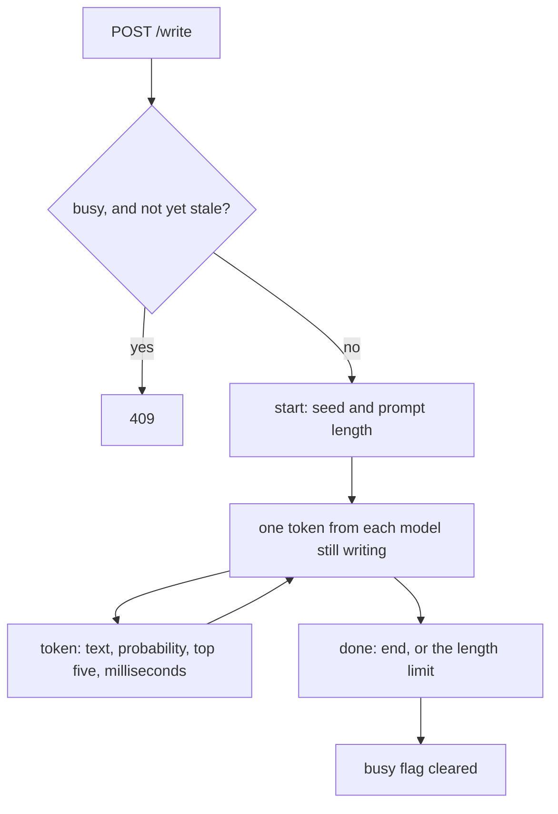

# 24. Serving

[Chapter 8](08-writing-sampling.md) writes one model from the command line and prints the story when
the run is over. This chapter serves the trained models on a page that stays on this computer.
v1 and v2 continue the same opening, one token each in turn, and each token is sent as soon as
it is chosen. The page tints a token by how unsure the model was, and it can ask both models to
judge a few possible next sentences, which is [chapter 23](23-judge-mode.md)'s task, or to write
with the switches from [chapters 17](17-the-kv-cache.md), [18](18-fused-attention.md) and
[19](19-cuda-graphs.md).

**Code:** [`hello_tokens/serving/app.py`](../../hello_tokens/serving/app.py) ·
[`hello_tokens/serving/static/index.html`](../../hello_tokens/serving/static/index.html) ·
[`hello_tokens/generation/sampling.py`](../../hello_tokens/generation/sampling.py) ·
[`hello_tokens/__main__.py`](../../hello_tokens/__main__.py)
**Tests:** [`tests/serving/test_app.py`](../../tests/serving/test_app.py)

## Words

- **Temperature**, **top-p**, **seed**, **greedy decoding**: see
  [chapter 8](08-writing-sampling.md#words). **bf16**: see
  [chapter 1](01-setup-and-the-data.md#words). The end-of-story token is
  [chapter 3](03-real-text-and-token-files.md)'s. **KV cache**: see
  [chapter 17](17-the-kv-cache.md#words). **Fused attention**: see
  [chapter 18](18-fused-attention.md#words). **CUDA graph**: see
  [chapter 19](19-cuda-graphs.md#words). **Summed** and **mean** scores, the judge's
  **temperature**, **confidence** and **threshold**: see
  [chapter 23](23-judge-mode.md#words).
- **Server**: a program that waits for requests and sends responses. The one here is a FastAPI
  application. An **endpoint** is one path on it, such as `/write` or `/judge`.
- **Status code**: the number on a response that says how the request ended. **422** means the
  request was refused before any story started: a setting out of range, a prompt that does not
  fit, an option the scorer will not take. **409** means a story or a judgement is already in
  progress.
- **Server-sent events**: one response that stays open. Each message is an `event:` line, a
  `data:` line holding JSON, and a blank line. The page paints a token when its message arrives.
- **Incremental decoder**: a UTF-8 decoder that keeps the bytes of an unfinished character and
  emits that character only when the rest of its bytes arrive, or when the stream is closed.

## The idea

`python -m hello_tokens play` loads each trained checkpoint that exists, runs a short warm-up,
and serves the page on `127.0.0.1` only. That address is this computer. The process is not
meant to be opened from anywhere else. The page is a single HTML file. It asks `/models` what
was loaded, then offers one opening, the sampling dials, and three switches: the KV cache,
fused attention, and CUDA graphs.

The server takes one new token from each loaded model in turn, and a model that stops drops
out. A token message carries at most five alternatives. `/judge` takes a context and from
two to eight possible next sentences. The messages, the dials, and that judgement are below.



`/judge` uses the same busy flag. The diagram is only the write path.

## The shapes

The write path encodes the prompt to a list of token ids and passes that list to
`generate_stream`. The list has to fit in the shortest context among the loaded models. v1 and v2 both keep `ModelConfig`'s context of 256, and the note in the HTML
states that same 256. The tests build models with context 32, and the limit those tests hit
is 32.

A token event's `top` list has at most five pairs. A judge response has one probability per
option, so between two and eight numbers, and they are a softmax, so they sum to one.

## The code

### What a write request may ask

<!-- from: hello_tokens/serving/app.py -->
```python
class WriteRequest(BaseModel):
    prompt: str = Field("", max_length=4000)
    temperature: float = Field(0.8, ge=0, le=2)
    top_p: float = Field(0.95, ge=0.05, le=1)
    max_tokens: int = Field(200, ge=1, le=400)
    seed: int | None = Field(None, ge=0, le=2**31 - 1)
    cache: bool = False  # use the KV cache (same text, less work per token)
    fused: bool = False  # use PyTorch's fused attention kernel (same text)
    graphs: bool = False  # replay each one-token step as a CUDA graph; implies the cache (same text)
```

The prompt may be empty and at most 4,000 characters. Temperature runs from 0 to 2, starting
at 0.8. Top-p runs from 0.05 to 1, starting at 0.95. Length runs from 1 to 400 new tokens,
starting at 200. A seed, when sent, runs from 0 to `2**31 - 1` inclusive, and omitting it is
allowed. The three switches start off. Their comments say the text stays the same. Chapter 17
bounds that claim: past the context, cached text can differ.

The page's temperature and top-p sliders use those bounds, in steps of 0.05. The length
slider is narrower: 10 to 400 in steps of 10, still starting at 200. A caller other than the
slider can ask for a length from 1 to 9. Several tests do.

<!-- from: hello_tokens/serving/app.py -->
```python
`POST /write` streams server-sent events while the models take turns, one token each:
  start  {"seed", "prompt_tokens"}
  token  {"model", "text", "probability", "top": [[text, probability], ...], "ms"}
  done   {"model", "text", "reason"}   ("end": the model ended the story; "length": the limit)
```

Three kinds of message. `start` names the seed and how many prompt tokens were kept. `token`
is one chosen piece. `done` closes one model: `end` when that model drew the end-of-story id,
`length` when the count of new tokens hit the limit. The id itself is not sent as a token.
`generate_stream` returns on the stop id, so the count stays short of the limit and the
reason is `end`.

### Taking turns

<!-- from: hello_tokens/serving/app.py -->
```python
ids = tokenizer.encode(request.prompt)
if len(ids) > context:
    raise HTTPException(422, f"the prompt is {len(ids)} tokens; the models read at most {context}")
ids = ids or [end_id]  # no prompt: start as if a new story begins
if not app.state.busy.try_start():
    raise HTTPException(409, "a story is already being written; wait for it to finish")
seed = request.seed if request.seed is not None else random.randrange(2**31)
```

`context` is fixed when the app is built: the minimum of the loaded models' contexts. A
longer prompt is 422, and the message names both lengths. An empty encoding is replaced by
one end-of-story id. The test calls that a new story. The server tries to take the busy flag
after that replacement, and before any event is sent. The start event's `prompt_tokens` is
the length after the replacement, so a blank prompt reports one token. A missing seed is
`randrange(2**31)`: every integer from 0 up to but not including 2**31. The largest value is
`2**31 - 1`, the field's cap, so a seed the server invented can be typed back in.

<!-- from: hello_tokens/serving/app.py -->
```python
def event(kind: str, data: dict) -> str:
    return f"event: {kind}\ndata: {json.dumps(data)}\n\n"
```

That string is one message on the wire. The page splits the stream on the blank line.

<!-- from: hello_tokens/serving/app.py -->
```python
yield event("start", {"seed": seed, "prompt_tokens": len(ids)})
streams, texts, counts = {}, {}, {}
for name, entry in models.items():
    entry.model.use_fused_attention(request.fused)
    # Each model gets its own random generator with the same seed, so one model's
    # draws never change the other's story.
    generator = torch.Generator(device=device).manual_seed(seed)
    streams[name] = generate_stream(entry.model, ids, request.max_tokens, request.temperature,
                                    None, request.top_p, end_id, generator, details=True,
                                    cache=request.cache, graphs=request.graphs)
```

`use_fused_attention` is chapter 18's switch, applied to every loaded model before any token
is drawn. The positional `None` is `top_k`: the page has no top-k dial. `details=True` asks
for the plain probability and the top five. `cache` and `graphs` are passed through. The
field comment says graphs imply the cache, and `generate_stream` does that even when `cache`
was left false. On a CPU, `graph` stays `None`, as chapter 19 says, and the same fixed-shape
step runs as ordinary code, so a CPU test can turn `graphs` on.

Each model gets its own generator, seeded with the same integer, so one model's draws never
move the other's.

<!-- from: hello_tokens/serving/app.py -->
```python
active = list(models)
while active:
    for name in list(active):  # take turns, one token each
        step = next(streams[name], None)
        if step is None:
            reason = "length" if counts[name] == request.max_tokens else "end"
            yield event("done", {"model": name, "text": texts[name].finish(), "reason": reason})
            active.remove(name)
            continue
        counts[name] += 1
        app.state.busy.alive()
        yield event("token", {
            "model": name,
            "text": texts[name].feed(step.id),
            "probability": step.probability,
            "top": [[token_text(i), p] for i, p in step.top],
            "ms": step.seconds * 1000,
        })
```

`list(active)` is a copy, so a model can leave the rotation mid-round. `ms` is the step's
`seconds` times 1,000. `alive` runs on every token, so a live story does not look abandoned.
`finish` may still emit a character the decoder was holding. That string rides on `done`,
and the page appends it when it is not empty. The `finally` around this generator clears the
busy flag, including when the page goes away mid-stream.

The chosen id goes through `TextStream.feed`. Each alternative goes through `token_text` on
its own. The end-of-story id becomes `[end of story]`. A character split across two tokens
stays whole in the column and can still show the replacement character in that list.

<!-- from: hello_tokens/generation/sampling.py -->
```python
seconds = time.perf_counter() - started
if next_id == stop_id:
    return
tokens.append(next_id)
pending = [next_id]
if not details:
    yield Step(next_id, seconds)
    continue
probabilities = torch.softmax(logits.float(), dim=-1)
values, top_ids = torch.topk(probabilities, 5)
top = tuple((i, p) for i, p in zip(top_ids.tolist(), values.tolist()) if p > 0)
yield Step(next_id, seconds, probabilities[next_id].item(), top)
```

`seconds` is the forward pass and the draw. The plain softmax, taken before temperature and
top-p, and the top five run after the clock stops. The docstring says they never count
towards the step's speed. `topk` asks for five, and a zero probability is dropped, so `top`
has length at most five. The chosen probability comes from that softmax, so it can sit below
the first entry of `top`.

The page sorts that model's step times and takes index `floor(n / 2)`: the middle when `n`
is odd, the later of the two middle values when `n` is even. It shows
`round(1000 / that element)`. The first step's `ms` is also shown, to one decimal, as the
first word, and the count is how many token events arrived. A token's background alpha is
`0.55 * (1 - probability)`, so a score of 1 is untinted. Hovering shows the chosen
probability and each alternative as a percent to one decimal, from `100 * p`.

The note under the columns says this live figure times only that model's own steps, and that
it comes out lower than the benchmark because of the odds and the first story's start-up.
Those odds do happen. They are not inside the milliseconds that formula divides. Which cell
`play` will show is below.

### A character that spans two tokens

<!-- from: hello_tokens/serving/app.py -->
```python
def __init__(self, tokenizer: Tokenizer):
    self.pieces = tokenizer.pieces
    self.decoder = codecs.getincrementaldecoder("utf-8")(errors="replace")

def feed(self, token_id: int) -> str:
    return self.decoder.decode(self.pieces[token_id])

def finish(self) -> str:
    return self.decoder.decode(b"", final=True)  # an unfinished character becomes "�"
```

A token is a piece of bytes. The test's comment says ids 0 through 255 are single bytes, and
that `é` is two bytes in UTF-8, so those two bytes can be two token ids. `feed` returns only
the characters that one id's bytes have now completed. `finish` closes the decoder, and bytes
that never became a character become the replacement character the comment writes.

<!-- illustration -->
```python
import codecs
raw = "é".encode()
held = codecs.getincrementaldecoder("utf-8")(errors="replace")
print(repr(held.decode(bytes([raw[0]]))))
print(repr(held.decode(bytes([raw[1]]))))
cut = codecs.getincrementaldecoder("utf-8")(errors="replace")
print(repr(cut.decode(bytes([raw[0]]))))
print(repr(cut.decode(b"", final=True)))
```

Run on the CPU, the four lines are `''`, `'é'`, `''`, and `'�'`. The first byte is held.
The second completes `é`. Closed after only that first byte, the decoder emits the
replacement character. The test runs the same sequence through `TextStream`.

### One story at a time

<!-- from: hello_tokens/serving/app.py -->
```python
def try_start(self) -> bool:
    with self.lock:
        if self.active and time.monotonic() - self.last_seen < self.stale_after:
            return False
        self.active, self.last_seen = True, time.monotonic()
        return True
```

The default `stale_after` is 30 seconds. A request while a story is active, and whose last
sign of life is younger than that, gets `False`, and the endpoint answers 409. The module
docstring gives the reason as one GPU. The flag does not look at the device, so a CPU run is
one request at a time as well. Tokens refresh `last_seen`. A story that produces nothing, for
example because the page closed before the stream started and the cleanup never ran, can be
replaced once 30 seconds have passed. `/write` and `/judge` share the flag and both clear it
in a `finally`.

### Judging, or writing instead

<!-- from: hello_tokens/serving/app.py -->
```python
class JudgeRequest(BaseModel):
    context: str = Field("", max_length=4000)
    options: list[str] = Field(min_length=2, max_length=8)
    fallback_tokens: int = Field(40, ge=0, le=200)  # when abstaining, write this much instead (0: don't)
```

Two to eight options, and a context of at most 4,000 characters. An option that is empty
once stripped, or longer than 500 characters, is 422 before any model runs. The page sends
the context and the options and does not send `fallback_tokens`, so a click uses the default
of 40. The box starts with a kite story, three filled sentences, and one empty field, which
the page drops before it posts. Run it quotes those sentences. They are the file's example,
not a measured result.

<!-- from: hello_tokens/serving/app.py -->
```python
question = Question(request.context, request.options, 0)  # the answer is unknown here
results = []
for name, entry in models.items():
    settings = entry.judge or {}
    method = settings.get("method", "summed")
    temperature = settings.get("temperature", 1.0)
    threshold = settings.get("threshold", 0.9)
```

The third field of `Question` is `answer`, the index of the true option. The server passes
0, and nothing in this endpoint reads it back, so there is no accuracy to compute. Scoring
is chapter 23's `score_options`: one batched pass, a leading space on each option, and a
`ValueError` when an option is longer than the context. That error becomes a 422 whose text
is the error's own message.

With no saved judge run, the method is `summed`, the temperature is 1.0 and the threshold
is 0.9. With a saved run, those three keys are whatever `judge` wrote into
`benchmarks/judge/<model>.json`. [Chapter 23](23-judge-mode.md) prints that file. This
chapter does not repeat the fitted values.

<!-- from: hello_tokens/serving/app.py -->
```python
probabilities = judgement.probabilities(method, temperature)
confidence, choice = probabilities.max(dim=0)
scoring_ms = (time.perf_counter() - started) * 1000  # the judging itself, not the fallback
answering = float(confidence) >= threshold
fallback = None
if not answering and request.fallback_tokens:
    ids = (tokenizer.encode(request.context) or [end_id])[-context:]
    fallback = tokenizer.decode(generate(entry.model, ids, request.fallback_tokens, temperature=0,
                                         stop_id=end_id, cache=True))
```

Confidence is the largest option probability. `choice` is its index, starting at 0. The page
labels option `choice + 1`, writes `answers: option N` when the decision is `answer`, and
writes `not sure` when it is `abstain`. The comparison is `>=`. The milliseconds start
before `score_options` and stop after the option softmax, before the fallback. The comment
says the fallback is outside that clock.

The continuation is greedy: the call writes `temperature=0` and `cache=True`. The judge
temperature only scales the softmax over the options. The ids are the tail of the context,
cut to `context` tokens, or one end-of-story id when the context encodes to nothing.
`fallback_tokens` of 0 abstains without writing. The response also records the threshold,
`calibrated` (true when `entry.judge` was present), and the fallback string or null.

### What `play` loads

<!-- from: hello_tokens/__main__.py -->
```python
PLAYGROUND_MODELS = {"v1": "classic GPT", "v2": "modern: RoPE, RMSNorm, SwiGLU, GQA"}


def run_play(args) -> int:
    """Load every trained model that exists, warm it up, and serve the playground on this machine only."""
```

The labels are what `/models` shows under the names. A checkpoint that is not on disk is
skipped. With none of them present the command prints one line and returns 1.

<!-- from: hello_tokens/__main__.py -->
```python
if not models:
    print("no trained models found in checkpoints/: run `train` first")
    return 1
```

<!-- from: hello_tokens/__main__.py -->
```python
device = "cuda" if torch.cuda.is_available() else "cpu"
dtype = torch.bfloat16 if device == "cuda" else torch.float32  # bf16 is slow and imprecise on a CPU
tokenizer = Tokenizer.load(args.data_dir / "tokenizer.bpe")
...
model = load_model(path, device).to(dtype)
generate(model, tokenizer.encode("Once upon a time"), 8, seed=0)  # warm-up: start-up costs paid here
row = benchmarks.get(f"{name} {'bf16' if dtype == torch.bfloat16 else 'fp32'}")
# Benchmark rows were measured on the GPU: only show one next to a GPU run.
speed = next((p["tokens_per_s"] for p in row["points"] if p["new_tokens"] == 224), None) \
    if row and device == "cuda" else None
judge_file = Path("benchmarks") / "judge" / f"{name}.json"
judge = json.loads(judge_file.read_text(encoding="utf-8")) if judge_file.exists() else None
models[name] = Entry(model, label, speed, judge)
```

The device is `cuda` when CUDA is available, otherwise `cpu`. bf16 is used only on CUDA.
The comment says bf16 is slow and imprecise on a CPU, so a CPU playground stays in fp32.
The tokenizer comes from `--data-dir`, whose default is `data`. The warm-up is 8 tokens of
`Once upon a time`, seed 0, through `generate`, which does not pass `cache` or `graphs`.

The speed on the entry is the saved point whose `new_tokens` is 224, from the row
`{name} bf16` or `{name} fp32` to match the dtype, and only when that row exists and the
device is `cuda`. On CUDA the dtype is bf16, so the bf16 row is the one that can appear.
On a CPU the entry stores no speed. The page prints the figure only when the field is set,
rounded with `Math.round`. That point is the published column `tok/s 16+224`: a prompt of
16 tokens and 224 new tokens. Chapter 25 reads the cells.

The judge file is the whole JSON when it exists, and `None` when it does not. `None` is
the uncalibrated path above.

<!-- from: hello_tokens/__main__.py -->
```python
url = f"http://127.0.0.1:{args.port}"
print(f"playground: {url}  ({', '.join(models)} on {device}; Ctrl+C to stop)")
if not args.no_browser:
    threading.Timer(1.5, webbrowser.open, [url]).start()
# 127.0.0.1: reachable from this computer only, never from the network.
uvicorn.run(create_app(models, tokenizer, device), host="127.0.0.1", port=args.port, log_level="warning")
```

The default port is 8000. The printed line has two spaces between the address and the
parenthesis. After 1.5 seconds the command opens a browser, unless `--no-browser` was set.
The log level is `warning`. The host is `127.0.0.1`, the limit the comment states.

`/models` returns, for each entry, the name, the label, `parameter_count()` (the tied
embedding table once), the benchmark speed or null, the model's context, and the device.

## What would go wrong the other way

**One generator for both models.** A shared generator spends draws in loop order, so the
second story depends on the first. A generator each, with one seed, keeps the two stories
independent.

**A fresh UTF-8 decode on every token.** The first byte of a split character would become a
replacement character in the column, and the next byte another. The incremental decoder
waits, and only closing the stream emits that replacement, once.

**One response when the story is finished.** The page could not tint or count a token until
the default 200 new tokens were done. The open event stream lets the columns grow together.

**A host other than `127.0.0.1`.** The comment says this process is not reachable from the
network. A wider host would offer the two local models, with no authentication in this app.

**A GPU benchmark beside a CPU run.** `play` stores a speed only on `cuda`, and only the
point with `new_tokens` 224. A CPU session stores `None`.

**Two requests at once.** The docstring's reason is one GPU. The flag does not check the
device, so a second `/write` or `/judge` is 409 on a CPU too. Silence for 30 seconds can be
replaced. A stream of tokens cannot.

## Proving it works

The tests build the app with `create_app`. They do not open a port.

<!-- from: tests/serving/test_app.py -->
```python
TEXT = "the cat sat on the mat. the dog sat on the log. a café by the sea. " * 10


@pytest.fixture(scope="module")
def tokenizer():
    return Tokenizer.train(TEXT, 280)


@pytest.fixture
def app(tokenizer):
    torch.manual_seed(0)
    config = dict(vocab_size=tokenizer.vocab_size, context=32, width=32, layers=2, heads=4)
    models = {"v1": Entry(GPT(ModelConfig(**config)), "classic"),
              "v2": Entry(GPT(ModelConfig(**config, norm="rmsnorm", position="rope", feed_forward="swiglu",
                                          kv_heads=2)), "modern")}
    return create_app(models, tokenizer, "cpu")
```

That text is repeated 10 times and trained to a vocabulary of 280. The weight seed is 0.
Both models have context 32, width 32, 2 layers and 4 heads. v2 adds RMSNorm, RoPE, SwiGLU
and `kv_heads` 2, the same four switches as the v2 preset, on this small shape. The labels
are `classic` and `modern`, shorter than `play`'s. The device string is `"cpu"`.

The helper posts to `/write`, requires status 200, and splits the body on a blank line into
an `event:` kind and a JSON `data:` payload.

**The stream matches `generate`.** Prompt `"the cat"`, temperature 0.9, top-p 0.9, 12 new
tokens, seed 5. `start` carries that seed and `prompt_tokens` equal to
`len(tokenizer.encode("the cat"))`. For `v1` and for `v2`, the joined `text` of the `token`
and `done` events equals `tokenizer.decode` of what `generate` returns for the same prompt,
length, temperature, top-p, stop id and seed. That call does not pass `cache` or `graphs`.

**The reported odds.** Prompt `"the dog"`, 6 new tokens, seed 1. Every token event has a
probability in `(0, 1]`, a `top` list of at most five positive probabilities sorted
descending, and the chosen probability is at most the first of those plus `1e-6`. `ms` is
greater than 0.

**Both models finish.** An empty prompt, 5 new tokens, seed 2. The `done` events name `v1`
and `v2`, and each reason is `end` or `length`.

**Refusals.** Temperature 3 is 422. `max_tokens` of 1000 is 422. The prompt
`"the cat sat " * 50` is 422. The comment says it is more than 32 tokens, this fixture's
context. On `/judge`, one option, or an option that is only a space, is 422.

**The busy flag.** `try_start` is called as if a story were running, and a second `/write`
is 409. After `finish`, a `/write` with `max_tokens` 2 is 200. A `Busy` built with
`stale_after=0.0` accepts a second `try_start` immediately.

<!-- from: tests/serving/test_app.py -->
```python
def test_a_character_split_across_two_tokens_comes_out_whole(tokenizer):
    stream_text = TextStream(tokenizer)
    first, second = "é".encode()  # two bytes; ids 0-255 are single bytes
    assert stream_text.feed(first) == ""  # held back: half a character
    assert stream_text.feed(second) == "é"
    assert stream_text.feed(first) == "" and stream_text.finish() == "�"  # cut off at the end
```

`first` and `second` are the two bytes of `é`. The asserts are the illustration: hold, then
`é`, then hold again, then the replacement from `finish`.

<!-- from: tests/serving/test_app.py -->
```python
def test_the_cache_fused_and_graphs_switches_write_the_same_story(app):
    client = TestClient(app)
    texts = []
    for switches in ({}, {"cache": True}, {"fused": True}, {"cache": True, "fused": True},
                     {"graphs": True}, {"graphs": True, "fused": True}):
        events = stream(client, prompt="the cat", max_tokens=10, seed=4, **switches)
        texts.append("".join(d["text"] for kind, d in events if kind in ("token", "done") and d["model"] == "v2"))
    assert len(set(texts)) == 1  # fp32 on the CPU: identical text whatever the switches
```

Six bodies, prompt `"the cat"`, 10 new tokens, seed 4, model `v2`. `len(set(texts)) == 1`.
The comment limits that to fp32 on the CPU. Status 200 means the prompt fits this fixture's
context of 32. Past that context, chapter 17 allows cached text to differ. The assert says
nothing about bf16 or a GPU.

**Judge, with no saved run.** Context `"the cat sat on the mat."` and options `"the dog sat
on the log."` and `"a café by the sea."`. The models come back as `v1`, then `v2`. Each
probability vector sums to 1, and confidence equals the max. The decision is `answer` or
`abstain`. `calibrated` is false. `fallback` is null exactly when the decision is `answer`:
the default of 40 fallback tokens writes only on an abstention.

<!-- from: tests/serving/test_app.py -->
```python
def test_the_judge_uses_a_saved_calibration(app):
    entry = app.state.models["v1"]
    entry.judge = {"method": "mean", "temperature": 1e6, "threshold": 0.99}  # huge T: equal odds, so abstain
    results = TestClient(app).post("/judge", json={"context": "the", "options": ["cat.", "dog.", "mat."],
                                                   "fallback_tokens": 0}).json()
    v1 = results[0]
    assert v1["calibrated"] and v1["decision"] == "abstain" and v1["fallback"] is None
    assert v1["probabilities"] == pytest.approx([1 / 3] * 3, abs=1e-4)
```

Method `mean`, temperature `1e6`, threshold 0.99, three options, `fallback_tokens` 0.
`results[0]` is v1 because the fixture inserted v1 first and the endpoint appends in that
order. The response is calibrated, the decision is `abstain`, and `fallback` is null. The
three probabilities are about one third, within `1e-4`. One third is below 0.99, so the
threshold abstains. The comment says the huge temperature makes the odds equal.

**The page and the list.** `GET /` contains `hello-tokens playground`. `GET /models` returns
the names `v1` and `v2`, in that order.

## Run it

```
python -m hello_tokens play
```

The command needs `tokenizer.bpe` under `--data-dir` (default `data`) and at least one of
`checkpoints/v1.pt` and `checkpoints/v2.pt`. This chapter does not run it. `--port` defaults
to 8000 and `--no-browser` skips the window. The printed line, including the two spaces, is
the one in the excerpt above.

Opened as a file, the page says it needs its server, names `uv run python -m hello_tokens
play`, and names `http://127.0.0.1:8000`. [Chapter 1](01-setup-and-the-data.md) is where
`uv run` is how this environment invokes the module. If the page loaded and the process is
gone, the failure text is "could not reach the server: is `play` still running?"

Before anyone types, the opening is `Once upon a time, a little fox`. The judge box opens
with `Lily had a small red kite. She took it to the park on a windy day. The kite flew high
in the sky.` The three filled options are `Lily laughed and ran with the string.`, `Lily
went to sleep in her bed.`, and `The kite was a big blue car.`

## What we got

Serving adds no row to the speed table. The switches select paths chapters 17, 18 and 19
already measured, and `/judge` applies settings chapter 23 already published. On the CPU, in
fp32, the six switch bodies write one v2 story.

A CUDA session may show the saved tokens per second at `new_tokens` 224, from that model's
bf16 row, rounded to an integer. The live number is `round(1000 / m)`. The page's note gives
its own account of why the two differ. Chapter 11 built the saved figure. Chapter 25 reads
the rows together.

## Check yourself

1. In the split-character test, what does `feed` return for the first byte of `é`, then for
   the second? What do `feed` and `finish` return if that first byte is fed again and the
   stream ends? What does the comment say those ids are?
2. Which six switch bodies does the sameness test send, with what prompt, length and seed,
   and which model's text must agree? What does `len(set(texts)) == 1` require, and what
   does the comment limit the claim to?
3. When `entry.judge` is missing, which method, temperature and threshold does `/judge`
   use? In the saved-calibration test, what is stored on v1, what is `fallback_tokens`,
   and what must `calibrated`, `decision`, `fallback` and the three probabilities be?

<details>
<summary>Answers</summary>

1. `feed` of the first byte returns `""`. `feed` of the second returns `"é"`. Feeding the
   first byte again returns `""`, and `finish` returns `"�"`. The comment says `é` is two
   bytes, and that ids 0-255 are single bytes.
2. The bodies are `{}`, `{"cache": True}`, `{"fused": True}`, `{"cache": True, "fused":
   True}`, `{"graphs": True}`, and `{"graphs": True, "fused": True}`. The prompt is `"the
   cat"`, `max_tokens` is 10, and the seed is 4. The joined `token` and `done` text of
   model `v2` is what gets stored. `len(set(texts)) == 1` means those six strings are
   identical. The comment says fp32 on the CPU.
3. The defaults are method `summed`, temperature 1.0, and threshold 0.9. The test stores
   `{"method": "mean", "temperature": 1e6, "threshold": 0.99}` on v1, and the request sets
   `fallback_tokens` to 0, with context `"the"` and options `"cat."`, `"dog."`, `"mat."`.
   `calibrated` is true, `decision` is `abstain`, `fallback` is null, and the probabilities
   are approximately `[1/3, 1/3, 1/3]` with absolute tolerance `1e-4`.

</details>

Next: [25. The results](25-the-results.md)
