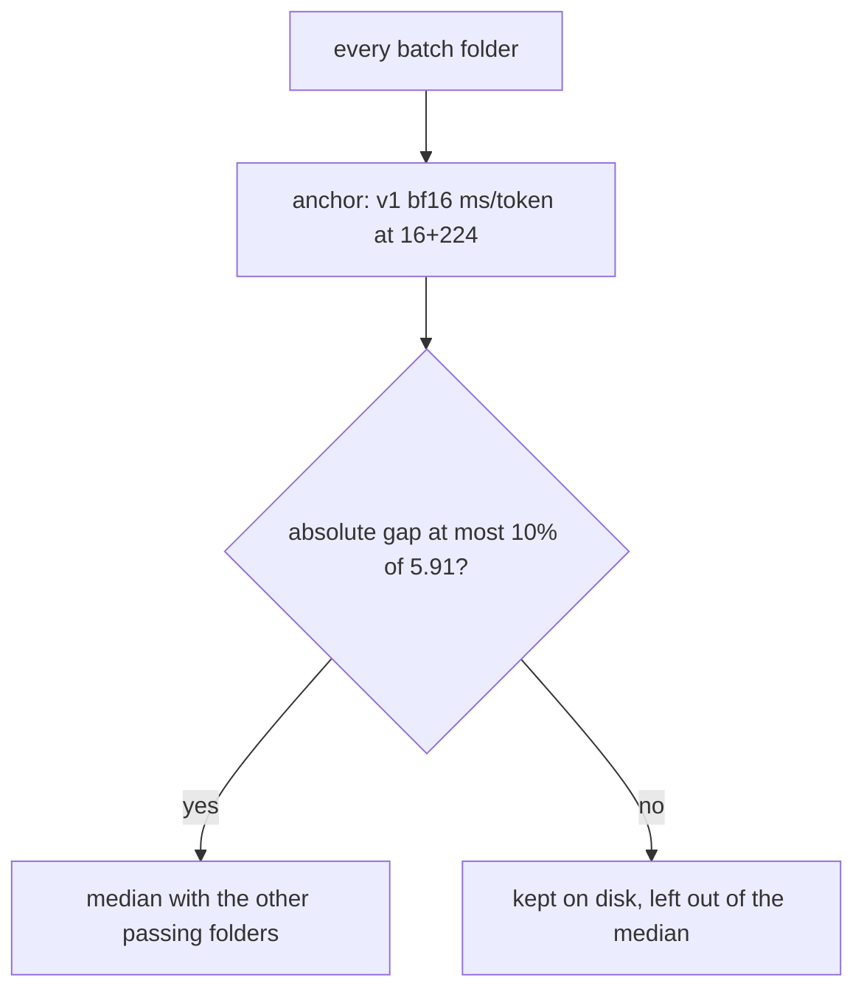

# 25. The results

[Chapter 10](10-profiling-one-step.md) timed one generation step and found the wait. [Chapter 11](11-the-benchmark-harness.md) fixed the workload and the way a row is saved. Chapters [17](17-the-kv-cache.md) to [21](21-speculative-decoding.md) each printed the rows for one change. This chapter reads those rows as one measurement: what that profile led the build to expect, what each change bought at this size, and which full batches were allowed into the median. The table is not retyped here. [`docs/benchmarks.md`](../../docs/benchmarks.md) is written by `python -m hello_tokens report` from [`benchmarks/results/`](../../benchmarks/results/). The README carries the same tables between its markers.

**Code:** [`hello_tokens/benchmark/aggregate.py`](../../hello_tokens/benchmark/aggregate.py) ·
[`hello_tokens/benchmark/report.py`](../../hello_tokens/benchmark/report.py) ·
[`hello_tokens/__main__.py`](../../hello_tokens/__main__.py) ·
[`scripts/gpu_benchmarks.py`](../../scripts/gpu_benchmarks.py)
**Tests:** [`tests/benchmark/test_aggregate.py`](../../tests/benchmark/test_aggregate.py)

## Words

- **Kernel**, **launch**, **wall time**, **median**, **interquartile range**: see
  [chapter 10](10-profiling-one-step.md#words). **Writer**, **first-token time**, **tokens per
  second**, **ECE**: see [chapter 11](11-the-benchmark-harness.md#words). **Perplexity**: see
  [chapter 9](09-measuring-it-perplexity.md#words). **bf16**: see
  [chapter 1](01-setup-and-the-data.md#words).
- **Point**: a pair of counts, prompt tokens then new tokens. The harness uses 16+64, 16+224, and
  128+128. Speed-up, the first token, milliseconds per token, and Batch IQR are taken at 16+224.
  Chapter 11 defines each of those.
- **Speed-up**: that row's long-answer tokens per second, divided by the same model in plain bf16.
  Chapter 11 shows the division. The lines below print it to two decimal places. It is not the
  quotient of the integers in the table.
- **Batch**: one full pass of the table, stored as a folder of JSON rows. The five runs inside one
  point already have their own median before the folder is saved. A batch is the whole pass.
- **Anchor**: the v1 bf16 milliseconds per token at 16+224 inside that folder. A folder joins the
  median only when this level is close to a reference measured on a quiet machine.
- **Batch IQR**: the interquartile range of long-answer tokens per second across the folders that
  were combined, as a share of their median, written as a percent. It is the spread between
  batches. It is not the spread of the five runs inside one of them.

## The idea

### The profile named the limit first

Chapter 10's profile, with power throttling off, measures a wall of 6.3 ms at contexts 16, 64, and
256, and 6.4 ms at 128, in both float32 and bf16. In bf16 the GPU is busy for 0.51 ms to 1.15 ms of
that wait, and the CPU launches about 200 kernels. The expectation taken from that profile is not
itself a result. A KV cache and a lower precision remove arithmetic the GPU is mostly not doing, so
at this size they should change speed little. Fewer launches, from fused attention or a CUDA graph,
and fewer sequential steps, from speculative decoding, should matter most. Removing the launch
overhead entirely would leave about the GPU time, roughly 6–10 times faster.

[Chapter 16](16-ablations-and-training-v2.md) keeps a different reading beside that expectation.
Section 18 of the build log, from before these batches, lists v2 bf16 at 75 tokens/s and 13.27 ms,
and v1 bf16 at 169 tokens/s and 5.91 ms, and calls v2 2.25× more slowly. The published long-answer
rates, in that same order, are 83 and 166 tokens/s.

### A whole folder can be slow together

Five runs taken within minutes can agree with one another and still all be slow. Their spread does
not reveal a folder whose level is low from the first run. A gate on that spread would also refuse
a folder measured on a quiet machine, because the rule would be about movement rather than about
the level. The selection uses a level, and the level was fixed before the folders were combined.
The simplest GPU row, v1 bf16 at the long answer, has to sit within 10% of that 5.91 ms.
Every folder stays on disk. The report's cells are medians of the folders that pass, and Batch IQR
shows how far those folders moved.



## The shapes

A saved row holds a `points` list. Each point carries `prompt_tokens`, `new_tokens`,
`first_token_ms`, `per_token_ms`, `tokens_per_s`, `spread_ms`, and `identical_runs`. After
combining, every point also carries `batch_spread_pct`, and the row carries `batches`,
how many folders went in. Perplexity and ECE are the median of the folders that measured them, or
null when none did. `measured_at` is copied from the last batch that was combined, so the
order of measuring stays visible. Peak memory is a median. `model_mb` and `setup` are not
averaged: a difference is a refusal.

Chapter 11 already shows how a speed-up is divided and how a missing number becomes an en dash.
These are the cells as printed. Tokens per second use no decimal places. The two times use two.
The speed-up uses two, and Batch IQR uses none. A row with no `batch_spread_pct` prints a dash in
that column.

<!-- from: hello_tokens/benchmark/report.py -->
```python
        cells += [_number(p["tokens_per_s"], 0) if (p := _point(r, pt)) else "–" for pt in POINTS]
        cells += [
            "–" if speedup is None else f"{speedup:.2f}×",
            # Only rows combined from several batches have a spread between batches.
            "–" if not long or long.get("batch_spread_pct") is None else f"{long['batch_spread_pct']:.0f}%",
            _number(long["first_token_ms"] if long else None, 2),
            _number(long["per_token_ms"] if long else None, 2),
```

The header of the generated table states the rest of the shape. Greedy writing, no stop token, and
the median of five runs. Speed-up is against the same model in plain bf16. Rows that only add the
KV cache, CUDA graphs, or speculative decoding keep the model's distribution, exact in fp32 as
tested, so perplexity and ECE are not measured again. Each published row is the median across 8
batches. Batch IQR is the interquartile range of tokens per second at 16+224 across those batches,
as a share of the median.

## The code

The reference and the tolerance are constants. The comment says the reference was measured on a
quiet machine. The excerpt's 5.91 ms is the earlier v1 cell quoted above, which chapter 16 treats
as the pre-batch reading. The published v1 bf16 cell is 6.03 ms. The four point fields, each
its own median, are named beside the constants.

<!-- from: hello_tokens/benchmark/aggregate.py -->
```python
ANCHOR_ROW = "v1 bf16"
ANCHOR_POINT = (16, 224)
ANCHOR_REFERENCE_MS = 5.91  # v1 bf16 ms/token at 16+224, measured on a quiet machine
ANCHOR_TOLERANCE = 0.10

POINT_VALUES = ("first_token_ms", "per_token_ms", "tokens_per_s", "spread_ms")
```

`anchor_ms` finds that row and that point. A folder with no such row raises, and the check does
not silently pass. `passes_anchor` allows either side of the reference. The absolute gap may be at
most the tolerance times the reference. A folder a little faster than the quiet machine is kept on
the same rule as one a little slower.

<!-- from: hello_tokens/benchmark/aggregate.py -->
```python
def anchor_ms(batch: list[dict], row: str = ANCHOR_ROW, point: tuple[int, int] = ANCHOR_POINT) -> float:
    """The anchor row's per-token time in one batch."""
    result = next((r for r in batch if r["row"] == row), None)
    if result is None:
        raise ValueError(f"the batch has no {row!r} row")
    return next(p["per_token_ms"] for p in result["points"] if (p["prompt_tokens"], p["new_tokens"]) == point)


def passes_anchor(batch: list[dict], reference_ms: float = ANCHOR_REFERENCE_MS,
                  tolerance: float = ANCHOR_TOLERANCE) -> bool:
    return abs(anchor_ms(batch) - reference_ms) <= tolerance * reference_ms
```

Folders that do not describe the same measurement are refused. The set of row names has to match.
For one name, `setup` and `model_mb` have to match.

<!-- from: hello_tokens/benchmark/aggregate.py -->
```python
        if set(other) != names:
            raise ValueError(f"the batches hold different rows: {sorted(names ^ set(other))}")
...
            if v["setup"] != first["setup"] or v["model_mb"] != first["model_mb"]:
                raise ValueError(f"{name!r} was measured with different setups across batches")
```

Each of the four point fields is its own median, so the published tokens per second are not
computed by inverting the published milliseconds. The batch spread uses the tokens-per-second list
again: the median, and the gap between the upper and lower quartile, then 100 times that gap over
the median. One folder forces the quartiles equal, and the spread is then 0. Perplexity and ECE
drop any folder that left them null, and stay null when every folder did. `measured_at` is the
last combined batch's time.

<!-- from: hello_tokens/benchmark/aggregate.py -->
```python
def _median_and_iqr(values: list[float]) -> tuple[float, float]:
    quartiles = statistics.quantiles(values, n=4) if len(values) > 1 else [values[0]] * 3
    return statistics.median(values), quartiles[2] - quartiles[0]
...
            for key in POINT_VALUES:
                merged[key] = statistics.median(p[key] for p in same)
            speed, iqr = _median_and_iqr([p["tokens_per_s"] for p in same])
            merged["batch_spread_pct"] = 100 * iqr / speed
...
        quality = {key: statistics.median(vals) if (vals := [v[key] for v in versions if v.get(key) is not None])
                   else None for key in ("perplexity", "ece")}
...
            # The order of measuring is kept: a row takes its time from the last batch.
            "measured_at": versions[-1]["measured_at"],
```

`select_and_combine` walks the subfolders in name order, keeps every anchor, and combines only the
folders that pass.

<!-- from: hello_tokens/benchmark/aggregate.py -->
```python
    folders = sorted(p for p in directory.iterdir() if p.is_dir())
    batches = {f.name: load_results(f) for f in folders}
    anchors = {name: anchor_ms(batch) for name, batch in batches.items()}
    used = [name for name, batch in batches.items() if passes_anchor(batch, reference_ms, tolerance)]
    return combine([batches[name] for name in used]), anchors, used
```

## What would go wrong the other way

A gate on the five-run spread accepts a folder that is slow from the first run to the last, and it
can reject a quiet folder whose five runs happen to move. The anchor compares a level with a
number chosen before the folders were opened. Moving that number after seeing which folders look
convenient would make the selection part of the result it is meant to protect.

A mean would let one slow folder pull the cell. The median test plants per-token times 5.0, 6.0,
5.5, 8.0, and 5.2. The combined time is 5.5. The 8.0 is present and does not move it.

Mixing folders that hold different rows, or the same row at a different `model_mb`, would publish
one number for two measurements. The refusal test adds a `v2 bf16` row in the second folder, then
a second folder whose `model_mb` is 16.1 instead of the helper's 28.6. Both raise.

## Proving it works

`test_each_value_is_the_median_across_batches_and_the_spread_between_them_is_kept` builds five
one-row batches from those per-token times. The combined `per_token_ms` is 5.5. `tokens_per_s` is
approximately `1000 / 5.5`. `batch_spread_pct` is greater than 0 and less than 50. `batches` is 5
and `perplexity` is 3.6. `measured_at` is the fifth batch's timestamp. The comment on the
assertion says the slow 8.0 batch does not pull the number up.

`test_batches_with_different_rows_or_setups_are_refused` expects `ValueError` matching
`different rows`, then one matching `different setups`.

`test_a_batch_is_used_only_when_its_anchor_row_matches_the_quiet_reference` calls `passes_anchor`
with reference 5.91 and tolerance 0.10. An anchor of 6.2 passes. An anchor of 7.25 does not. A
batch whose only row is `v2 bf16` raises, and the match text is `no 'v1 bf16' row`.

`test_selection_reads_every_batch_folder_and_reports_each_anchor` writes three folders: `0100` at
5.9, `0200` at 12.5, and `0300` at 6.1. Each file is the row name with spaces turned into hyphens.
The names used are `0100` and `0300`. The anchor stored for `0200` is 12.5. The combined
per-token times are 6.0 for `v1 bf16` and 12.0 for `v2 bf16`. Those three folders belong to the
test. The committed batches are the next section.

## Run it

The measurements are not run in this chapter. Rebuilding the saved rows from the committed folders
is:

`python -m hello_tokens combine benchmarks/batches/2026-10-07`

The two flags default to the constants.

<!-- from: hello_tokens/__main__.py -->
```python
    combine.add_argument("--reference-ms", type=float, default=ANCHOR_REFERENCE_MS,
                         help="quiet-machine v1 bf16 ms/token at 16+224 that a batch must match")
    combine.add_argument("--tolerance", type=float, default=ANCHOR_TOLERANCE, help="allowed relative difference")
```

The command prints every folder's anchor to two decimal places, and the word `used` or
`not used`. If none pass, it prints `no batch passed the anchor check; nothing saved` and returns
1. Otherwise it writes one JSON file per row under `benchmarks/results/`, with spaces in the row
name replaced by hyphens, and says how many rows and how many folders.

<!-- from: hello_tokens/__main__.py -->
```python
    rows, anchors, used = select_and_combine(args.batches, args.reference_ms, args.tolerance)
    for name, ms in anchors.items():
        verdict = "used" if name in used else "not used"
        print(f"{name}: v1 bf16 {ms:.2f} ms/token (reference {args.reference_ms}) -> {verdict}")
    if not used:
        print("no batch passed the anchor check; nothing saved")
        return 1
...
    for row in rows:
        path = RESULTS / (row["row"].replace(" ", "-") + ".json")
        path.write_text(json.dumps(row, indent=2) + "\n", encoding="utf-8")
    print(f"saved {len(rows)} rows to {RESULTS}, each the median of {len(used)} batches")
```

`python -m hello_tokens report` rebuilds `docs/benchmarks.md` from those files and replaces the
README region between the markers. `python -m hello_tokens report --check` exits non-zero when
either file has gone stale. Chapter 11 owns that replacement.

Before any speed row, `scripts/gpu_benchmarks.py` times one v1 step. The docstring says the normal
time on this machine is about 6 ms. The flag `--max-step-ms` defaults to 8.0. Above that limit the
script measures nothing. It also refuses a machine with no CUDA GPU, and returns 1. The build log's
account of why the gate exists is an earlier reading: a first full run had every row without graphs
at half its usual speed, one v1 step at 12.1 ms instead of 6.3 ms, with the same 189 GPU operations
and the same GPU-busy time. Those rows were set aside. They are not the published v1 bf16 row.

<!-- from: scripts/gpu_benchmarks.py -->
```python
    parser.add_argument("--max-step-ms", type=float, default=8.0,
                        help="refuse to measure if one v1 step is slower than this (machine not at full speed)")
...
    if not torch.cuda.is_available():
        print("no CUDA GPU visible: this batch measures GPU speed, so it does not run on a CPU")
        return 1
...
        print(f"machine check: one v1 bf16 step takes {step_ms:.1f} ms (limit {args.max_step_ms:.1f} ms)")
        if step_ms > args.max_step_ms:
            print("the machine is running slower than normal (power or performance profile?): speed rows "
                  "measured now would not be comparable. Nothing was run.")
            return 1
```

The same script's plan, as the build log lists it, runs the GPU graph tests first and measures
nothing until they pass, then the draft, then the speed rows, speculative decoding at k = 2, 4, and
6, int8 and int4, and at the end the report. Quality is measured only for rows that can change the
computed numbers: precision, the attention kernel, and quantization. Cache, graphs, and speculative
decoding skip that pass.

## What we got

### Eight folders out of eleven

`benchmarks/batches/2026-10-07/` holds eleven folders. Applied to that directory, `select_and_combine`
at the default reference and tolerance keeps eight of them, the count the README and the build log
give. In folder order the anchors print, to the two decimals the command uses, as `0153` 7.25 (not
used), `0208` 12.50 (not used), `0233` 6.22, `0256` 5.73, `0317` 5.72, `0338` 5.84, `0400` 6.23,
`0422` 5.90, `0443` 6.17, `0515` 7.23 (not used), and `0539` 6.21 ms. The medians of the eight
match the 21 files in `benchmarks/results/` on the long-answer tokens per second, the per-token
time, the first-token time, the batch spread, and `batches`. The slowest anchor, on `0208`, is a
selection input. The build log describes single batches as having varied by up to 2× in their
slowest rows. That sentence is the log's summary, not a speed-up cell.

The build log summarizes Batch IQR as 3–14% for most rows and 27% for the noisiest, the fused
speculative row chapter 21 names, `v2 bf16 fused spec-k4`.

The machine named under the table is an NVIDIA GeForce RTX 4060 Laptop GPU, with PyTorch
2.14.0+cu130 and Python 3.14.3.

### What each change bought

**Lower precision.** Chapter 11's published pair, at 16+224, is 167 tokens/s in float32 and 166 in
bf16, a speed-up of 1.01× on the float32 row. The size goes from 63.5 MB to 31.7 MB. The profile's
prediction holds: the time barely moves, and the stored model is smaller.

**The KV cache alone.** Chapter 17: both cache rows are 1.00×, and the long-answer rates stay 166
and 83. The first token is slower on both, 7.24 ms against 6.13, and 13.20 ms against 12.14. The
cache is still required. The README says the graph replays the cached one-token step, and chapter
19 notes that no graphs row is published without the cache.

**Fused attention.** Chapter 18: 1.46× on v1, at 242 tokens/s, and 1.27× on v2, at 105. The README
reads that pair as fewer operations per step. Cache added on top of the kernel, still without a
graph, is slower than the kernel alone: 1.29× and 1.17×.

**CUDA graphs.** This is the large gain, and the size of the model is why. Chapter 10's step spends
the wall on the launches it counted. Chapter 16's earlier profile of plain v2, a different session,
counts 431 kernels against v1's 189. A graph records the launches and replays them. Chapter 19's
long-answer cells are 1,880 tokens/s at 11.34× for v1 and 1,215 at 14.68× for v2, which is 0.50 ms
and 0.77 ms per token. The README calls the band 10–15× and writes the v2 move from 12.1 ms to
0.77 ms. The 12.1 ms is that summary of the published 12.08 ms. Chapter 19's four graph speed-ups
are what the build log summarizes as 10.5–14.7×. Those four sit above the profile's 6–10× range.
That expectation was for chapter 10's full-window step with the launches removed. Each new token
under a graph is a replay, which chapter 19 separates from that full-window re-read. The larger
ratio belongs to v2, the model with more launches to remove. The higher rate is still v1's 1,880.
Fused attention on top of the graph does not raise the long-answer rate: chapter 19 records
1,734 against 1,880, and 1,181 against 1,215.

**Speculative decoding.** Chapter 21 prints the four rows. On the long answer they are 139, 152,
162, and 173 tokens/s, at 1.68×, 1.84×, 1.95×, and 2.09×. The README and the build log summarize
that span as 1.7–2.1×. The best cell, 173, stays under that v2 graph rate. The first token is
slower than plain v2's 12.14 ms on every one of those rows. The long-prompt gain is the smaller
one; chapter 21 sets the printed long-prompt rates against the README's 1.1–1.25×. The gain over
plain decoding is still real, and `bench` will not attach a graph to it. Chapter 21 shows the
command returning 2 when `--graphs` and `--speculative` are both set. The build log counts the
draft at 1,725,696 parameters. The README rounds that to 1.7M, and states that v2 accepts the
trained draft's tokens 40–62% of the time. The speed table has no column for that rate. Perplexity
and ECE on these rows are an en dash.

**Quantization.** Chapter 20: int8 is 72 tokens/s at 0.87×, and int4 is 45 at 0.55×, both under
that plain v2 rate. The README's account is that unpacking the weights adds operations. The sizes are
16.1 MB and 10.2 MB, against 28.6 MB. int8 perplexity stays 3.568. int4 is 3.633, which chapter 20
reads as the README's +1.8%. ECE is 0.0078 and 0.0077, beside plain v2's 0.0077. With a graph the
same weights publish 902 tokens/s at 10.90× and 603 at 7.28×, which the README rounds to 11× and
7×. That remains well above plain bf16, and below that same v2 graph rate. The smaller file is the
reason those rows stay. On this GPU the speed is not.

The judge table in the same generated file belongs to [chapter 23](23-judge-mode.md).

## Check yourself

1. In the median test, which five per-token times are planted, what is the combined
   `per_token_ms`, and what does the comment say about 8.0? What does the test require of
   `tokens_per_s`, `batch_spread_pct`, `batches`, and `perplexity`? Which timestamp is kept as
   `measured_at`?
2. With reference 5.91 and tolerance 0.10, does 6.2 pass, and does 7.25? What match text does a
   batch of only `v2 bf16` raise? In the folder test, which names are used, what anchor is recorded
   for `0200`, and what are the two combined per-token times?
3. At 16+224, what do the published cells give for plain v2, the v2 cache row, `v2 bf16 cache
   graphs`, the fastest speculative row, and the two plain quantized rows? Why is the graph the
   large gain at this size, and what do speculative decoding and quantization still buy?

<details>
<summary>Answers</summary>

1. The times are 5.0, 6.0, 5.5, 8.0, and 5.2. The combined `per_token_ms` is 5.5. The comment says
   the slow 8.0 batch does not pull the number up. `tokens_per_s` is approximately `1000 / 5.5`.
   `batch_spread_pct` is greater than 0 and less than 50. `batches` is 5. `perplexity` is 3.6.
   `measured_at` is the last batch's timestamp, `2026-01-05T00:00:00`.
2. 6.2 passes. 7.25 does not. The match text is `no 'v1 bf16' row`. The used names are `0100` and
   `0300`. The anchor for `0200` is 12.5. The combined times are 6.0 for `v1 bf16` and 12.0 for
   `v2 bf16`.
3. Plain v2 is 83 tokens/s at 1.00×. The cache row is 83 at 1.00×. `v2 bf16 cache graphs` is
   1,215 at 14.68×. The fastest speculative row is `v2 bf16 fused spec-k4`, at 173 and 2.09×.
   int8 is 72 at 0.87×, and int4 is 45 at 0.55×. The graph is the large gain because the step is
   launch-bound: chapter 10's about 200 kernels, and chapter 16's earlier count of 431 kernels
   on plain v2 against v1's 189. Replaying the step removes that wait. Speculative decoding
   still buys 1.68× to 2.09× over plain v2, with a draft of 1,725,696 parameters, and `bench`
   returns 2 when `--graphs` and `--speculative` are both set. Quantization still buys the sizes
   16.1 MB and 10.2 MB, with perplexity 3.568 and 3.633 and ECE 0.0078 and 0.0077, and with a
   graph the speed-ups are 10.90× and 7.28×.

</details>

Next: [Contents](README.md)
