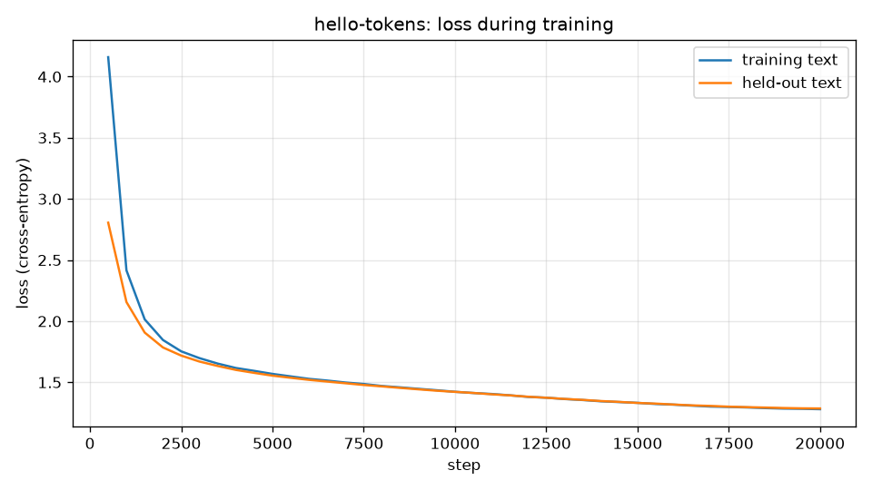

# Build log

What was built, in order, and why.

## 1. Repository setup

- **Layout.** A flat application layout, organized by capability; see
  [ADR 0001](decisions/0001-repo-structure.md).
- **Commit checks.** Every commit goes through `scripts/commit.py`, which runs the tests and a
  guard (`scripts/guard.py`) before committing. The guard refuses local-only files, absolute
  machine paths and commit-message trailers, and checks the author identity. The same checks run
  from the git hooks in `.githooks/`, including before every push.
- **License and data.** MIT license. The training data, TinyStories, is downloaded locally and
  never committed.

## 2. Environment and machine check

- **Versions.** Python 3.14 and PyTorch 2.14, the CUDA 13.0 build from PyTorch's own package
  index (CUDA builds are not published on PyPI). uv installs both and pins every version in
  `uv.lock`, so the environment can be reproduced exactly.
- **`python -m hello_tokens check`.** Reports the versions, then runs one matrix product on the GPU
  and copies the result back, which forces the GPU to finish the work. A broken CUDA setup fails
  here, before any training starts. It also reports bf16 support, used later for mixed-precision
  training.

## 3. Downloading the corpus

- **Data.** The GPT-4-only files of TinyStories: `TinyStoriesV2-GPT4-train.txt` (2.23 GB) for
  training and `TinyStoriesV2-GPT4-valid.txt` (22.5 MB), held out for evaluation.
- **`python -m hello_tokens prepare`.** Streams each file in 1 MiB pieces, so the 2 GB file is never
  held in memory. It writes to a `.part` file and renames it only once the byte count matches the
  known size, so an interrupted download never looks complete. A file that is already complete
  is skipped.
- **Testable without the network.** The function that opens the URL is passed in, so the tests use
  an in-memory stand-in: a fresh download, a skipped re-download, and a short download that is
  rejected.
- **Resuming.** The first real download dropped at 622 MB of 2.2 GB; the size check caught it and
  left the `.part` file. The download now resumes: each attempt asks the server for the remaining
  bytes only (an HTTP `Range` request, answered with `206 Partial Content`) and appends them, with
  up to 20 attempts. Tests cover resuming from a partial file, retrying after a drop, and giving
  up without leaving a finished-looking file.

## 4. Byte-pair encoding: the core algorithm

- **Bytes first.** Text is encoded as UTF-8 bytes, so the 256 byte values are the starting
  vocabulary and any text, in any script, can be tokenized. Nothing is ever "unknown".
- **Training** repeats one step: count every pair of neighbouring tokens, take the most frequent,
  and replace each occurrence with a new token. The recorded merges, `(left, right) → new id`, are
  the tokenizer. Ties go to the pair seen first, so training is repeatable.
- **Encoding** applies merges in the order they were learned, which reproduces training's
  decisions on new text. **Decoding** expands each token back into its bytes.
- **Tests** check the classic example `aaabdaaabac` against merges worked out by hand, and that
  text round-trips exactly, including emoji and characters never seen in training.

## 5. The tokenizer on real text

- **Pre-split into chunks.** A regular expression cuts text into words (with their leading space),
  numbers, symbols and whitespace, and merges never cross a chunk boundary. Tokens therefore align
  with words, and every character falls into exactly one branch, so the chunks always rejoin into
  the original text.
- **Count distinct chunks once.** Training works on each distinct chunk with its frequency instead
  of the full text: a 2 MB sample has 2,417 stories but only 5,989 distinct chunks.
- **`<|endoftext|>` is a special token.** Stories are split on it before training, so no merge spans
  two stories, and it encodes to a single fixed id, the last in the vocabulary.
- **Vocabulary.** Ids 0–255 are bytes, then the learned merges, then the special token: 4,096 ids in
  all. Training stops early if a text runs out of pairs.
- **Saved as plain text,** one merge per line in learned order, and reloaded identically. Training
  is deterministic, so `prepare` reproduces the same file.
- **Sample size, measured.** Training the full vocabulary on 5, 10 and 20 MB took 114, 113 and
  156 s, and all three compress held-out text to 3.95 bytes per token: TinyStories' vocabulary is
  covered by 5 MB. `prepare` uses 20 MB (197 s) for broader coverage of rare words. A typical
  sentence encodes to one token per word.

## 6. Encoding the corpus

- **Token files.** `prepare` encodes the training and validation text once into
  `data/tokens/{train,valid}.bin`: flat arrays of `uint16` ids, two bytes per token, which the
  4,096-id vocabulary guarantees will fit.
- **Streaming in blocks.** Text is read about 16 MB at a time and each block is cut back to its last
  `<|endoftext|>`; the unfinished story carries into the next block, so block boundaries never change
  the tokens (tested with 37-character blocks).
- **A chunk cache.** Each distinct chunk is encoded once and looked up thereafter. 20 MB of stories
  contain only 12,682 distinct chunks, so encoding runs at 5.2 MB/s on one core.
- **Memory-mapped reads.** Token files are opened with `numpy.memmap`, so training can sample from
  them without loading them into memory.
- **Result.** Training: 562,963,642 tokens (1.13 GB, 435 s); validation: 5,683,948 tokens. 3.96 bytes
  of text per token over the whole corpus. The largest id in both files is the special token, 4,095.

## 7. Embeddings and causal self-attention

- **`ModelConfig`** holds the shape in one frozen dataclass: vocabulary 4,096, context 256, width
  384, 8 layers, 6 heads of 64.
- **Embedding.** A learned token table plus a learned position table, summed, since attention alone
  is blind to order.
- **Attention, written by hand** rather than with PyTorch's fused kernel, so it can be inspected and
  later benchmarked against it. Scores are query·key / √64; a causal mask sets every future position
  to −∞ before softmax, so future tokens receive exactly zero weight; the output is the weighted sum
  of values.
- **Multi-head.** One linear layer produces queries, keys and values for all six heads; heads run in
  parallel as an extra tensor dimension and are recombined by an output projection.
- **Tests** include a hand-worked case (equal scores average the past: 0, 0.5, 1.0, 1.5) and a
  causality check: changing token 7 leaves outputs 0–6 exactly unchanged.
- **No dropout** in v1: with 563 million tokens and less than one pass over them, overfitting is not a
  risk.

## 8. The block and the full model

- **Block.** Pre-norm GPT-2 style: `x + attention(LayerNorm(x))`, then `x + feed_forward(LayerNorm(x))`.
  The feed-forward network widens each token 4× (384 → 1,536), applies GELU, and narrows back.
- **GPT.** Embedding, 8 blocks, a final LayerNorm, and an output layer giving one logit per vocabulary
  entry at every position. The output layer is tied to the token embedding table.
- **Initialisation.** Weights drawn with standard deviation 0.02, biases zero; the two residual
  projections per block are scaled by 1/√(2·layers) so the residual stream does not grow with depth.
- **15,867,648 parameters**, matched exactly against a hand-derived formula in the tests.
- **Sanity check at initialisation.** The loss on unseen random targets is ln(4,096) ≈ 8.32, the
  uniform-guess baseline. Using the inputs as targets instead gives 7.59, because a tied model
  initially favours repeating its input; the test uses independent targets.

## 9. The training loop

- **Batches.** Random 257-token windows from the memory-mapped token file; inputs are tokens 0–255
  and targets tokens 1–256, so each window holds 256 next-token predictions.
- **Loss.** Cross-entropy over every position: the negative log-probability of the true next token.
- **Optimizer.** AdamW (β = 0.9, 0.95) with weight decay 0.1 on weight matrices only; biases and
  LayerNorm parameters are not decayed.
- **Schedule.** Linear warm-up to the peak learning rate, then cosine decay to 10% of it.
- **Step.** Forward, loss, backpropagation, gradient-norm clipping at 1.0, update.
- **Proof of learning.** On one fixed batch the loss falls from about 4.2 to 0.007 in 150 steps.
- **Faster tests.** Limiting PyTorch to 4 CPU threads for the tiny test models cut the suite from
  42 s to 7 s; thread coordination outweighed the work.

## 10. The first training run

- **Throughput, measured.** On an RTX 4060 Laptop GPU (8 GB) with bf16 autocast, batch sizes 32,
  64 and 96 all ran at 73–81k tokens/s. Batch 64 (16,384 tokens per step, 3.7 GB) was chosen.
- **Run.** 20,000 steps, 327,680,000 tokens (about 20 per parameter), peak learning rate 1e-3 with
  1,000 warm-up steps and cosine decay to 1e-4. Evaluation every 500 steps on fixed held-out batches;
  resumable checkpoints every 1,000 steps.
- **Result.** Held-out loss 8.32 → **1.286** (perplexity 3.6) in 78.5 minutes. Training loss 1.280: the
  gap of 0.006 shows no overfitting. The curve was still falling at the end.

- **Samples.** From "Once upon a time" at temperature 0.8, the model writes coherent short stories
  with named characters and an ending, and stops by emitting `<|endoftext|>` itself.

## 11. Sampling and the `write` command

- **Sampling.** Temperature scaling (0 = greedy), top-k, and top-p (nucleus) filtering, then a draw
  from the remaining distribution with a seedable generator.
- **Generation.** One token at a time from the last-position logits, cropped to the 256-token context,
  stopping at `<|endoftext|>`. Each step recomputes the whole prefix; there is no KV cache yet.
- **`python -m hello_tokens write "<prompt>"`** with temperature 0.8 and top-p 0.95 by default.
- **Baseline speed: about 152 tokens/s (6.6 ms per token)** on the RTX 4060, flat between 50 and 200
  new tokens. This is the reference point for v2's inference work, which starts by profiling where a
  step's time goes.

## 12. Perplexity and the v1 release

- **Perplexity over the whole held-out file.** `hello_tokens/evaluation/perplexity.py` cuts the
  token file into back-to-back windows of 256 predictions, where the last token of one window is the
  first input of the next, so every token after the first is scored exactly once. Losses are summed in
  float32 and divided once at the end, so the shorter final window carries exactly its share.
- **`python -m hello_tokens eval`** scores the held-out file in float32 rather than bf16, so the
  reported number carries no rounding from mixed precision.
- **Tests.** The token count is exact; a model with all-zero weights, which gives every token equal
  probability, scores exactly the vocabulary size (64 for the test model); the batch size does not
  change the result; and the result matches scoring each window by hand.
- **Result.** 5,683,947 held-out tokens in 43 s: **loss 1.2866, perplexity 3.62.** This agrees with
  the 1.286 that training measured on a fixed sample of 50 batches, so the sample was representative.
- **v1 is complete.** The README now presents the results, sample stories, the loss chart and how each
  component works.

## 13. Profiling one generation step

- **`python -m hello_tokens profile`** times one generation step (a forward pass plus sampling) at
  contexts of 16, 64, 128 and 256 tokens. The contexts are interleaved over 200 rounds, and the
  median and interquartile range are reported. The PyTorch profiler then measures GPU kernel time and
  the number of kernels launched per step.
- **Windows power throttling.** The first measurements were three times slower than the baseline and
  noisy. Generation ran at 6 ms per token for about a second, then settled at 17-18 ms: Windows
  throttles processes it considers background work. A process can ask to be exempt
  (`SetProcessInformation` with `ProcessPowerThrottling`), which affects only that process. Every
  command now does so (`hello_tokens/generation/power.py`). Generation then holds a steady
  **6.0 ms per token (166 tokens/s)**. The earlier 152 tokens/s came from short runs, partly caught
  before the throttle started.
- **Result.** With throttling off, a step takes **6.3 ms at every context from 16 to 256 tokens**,
  in both float32 and bf16. The GPU is busy for only 0.8-2.5 ms of it (float32) or 0.5-1.2 ms (bf16).
  It sits idle 60-92% of the time, while the CPU launches about 200 kernels per step at roughly 30 µs
  each.

| context | wall (ms) | GPU busy, fp32 (ms) | GPU busy, bf16 (ms) | kernels |
|---|---|---|---|---|
| 16 | 6.3 | 0.83 | 0.51 | ~200 |
| 64 | 6.3 | 1.11 | 0.58 | ~200 |
| 128 | 6.4 | 1.58 | 0.72 | ~200 |
| 256 | 6.3 | 2.52 | 1.15 | ~200 |

- **What it predicts for v2.** Generation is bound by launch overhead, not computation. A KV cache
  and lower precision reduce work the GPU is mostly not doing, so they should change speed little at
  this size. Fewer launches (fused attention, CUDA graphs) and fewer sequential steps (speculative
  decoding) should matter most. If launch overhead were removed entirely, a step would approach its
  GPU time, roughly 6-10x faster.

## 14. The benchmark harness

- **`python -m hello_tokens bench`** measures one variant as one row of a shared table and saves it to
  `benchmarks/results/<row>.json`. The results are committed, so every speed figure in this
  repository can be traced to a measurement.
- **A fixed workload.** Greedy decoding and no stop token, so every variant writes exactly the
  requested number of tokens, at three points (prompt + new tokens): 16 + 64, 16 + 224 and 128 + 128.
  All stay within the 256-token context. The prompts are fixed random tokens: with no stop token,
  speed depends only on how many tokens there are, not which.
- **Method.** The process opts out of power throttling. A warm-up run is discarded, the GPU is
  synchronized before every clock reading, and each figure is the median of five runs, reported with
  its interquartile range. The time to the first token is measured separately; the per-token time is
  the rest of the run divided by the remaining tokens. Each row records whether every run wrote
  identical tokens, its full setup (model, dtype, cache, graphs, quantization, decoding), peak GPU
  memory, model size, held-out perplexity, and the machine.
- **The first two rows.**

| row | tok/s (16+224) | ms/token | model MB | peak MB | perplexity |
|---|---|---|---|---|---|
| v1 fp32 | 168 | 5.95 | 63.5 | 83 | 3.620 |
| v1 bf16 | 169 | 5.91 | 31.7 | 46 | 3.622 |

- **Reading.** bf16 halves the memory at no measurable cost in quality (perplexity +0.002), and does
  not change the speed, as the profile in section 13 predicted: the step is bound by kernel-launch
  overhead, not arithmetic. Repeat runs agree within about 2%.

## 15. Modern parts I: RMSNorm and rotary position embedding

- **Switches, not a rewrite.** `ModelConfig` gains `norm` (`layernorm` or `rmsnorm`) and `position`
  (`learned` or `rope`). The defaults are v1's design, and a checkpoint stores its own config, so every
  v1 checkpoint rebuilds the v1 model exactly.
- **Proof that v1 is untouched.** Before the model code changed, a small v1 model's weights and
  outputs were recorded (`tests/model/fixtures/v1_golden.torch`, made by `make_v1_golden.py`). A test
  loads those weights strictly into today's code and requires identical outputs within 1e-6. Loading
  them into a RoPE model fails, as it should. The full v1 checkpoint still writes the README samples
  token for token.
- **RMSNorm** (Zhang and Sennrich, 2019): divide by the root mean square and apply a learned scale,
  with no mean subtraction and no bias. Checked against a hand computation.
- **RoPE** (Su et al., 2021): each head's 64 numbers form 32 pairs, and the pair *i* of a token at
  position *p* is rotated by the angle *p*·*f*ᵢ, applied to queries and keys only. Since a dot product
  of rotated vectors depends only on the difference of their angles, attention scores depend on the
  distance between tokens, not their absolute positions. The test places the same query and key at
  distances 2 and 2 (equal scores) and 5 (different). The rotation tables are fixed by the shape, so
  they are not saved in checkpoints. An offset argument rotates a slice as if it sat later in a
  sequence, which the KV cache will need.
- **Parameters.** Together the two changes remove the 98,304-parameter position table and the 6,528
  LayerNorm biases (104,832 in all, pinned by a test).

## 16. Modern parts II: SwiGLU and grouped-query attention

- **Two more switches.** `feed_forward` (`gelu` or `swiglu`) and `kv_heads` (the number of key/value
  heads; unset means one per query head, as in v1). The v1 fingerprint still matches, and the full v1
  checkpoint still writes the README samples token for token.
- **SwiGLU** (Shazeer, 2020). Two layers widen each token, one to values and one to a gate; the gate
  passes through SiLU and multiplies the values, and a third layer narrows back. The hidden width is
  two thirds of v1's 4×, rounded up to a multiple of 64: 1,024 at width 384, so the three matrices hold
  exactly as many weights as v1's two (1,179,648, tested).
- **Grouped-query attention** (Ainslie et al., 2023). Six query heads share two key/value heads, three
  queries per group. Attention keeps one `qkv` layer, now `width + 2·kv_heads·head_width` wide (640
  instead of 1,152), and each key/value head is repeated across its group before the scores. With as
  many key/value heads as query heads, the layer is exactly v1's. A test builds an ordinary multi-head
  layer from a GQA layer's weights, with each key/value head copied to its group, and requires the same
  outputs. The point is the KV cache: it will store 2 heads instead of 6 per layer, 4 KB per token
  instead of 12 KB in bf16.
- **The v2 model** (RMSNorm, RoPE, SwiGLU, two key/value heads) has **14,189,952 parameters**, 10.6%
  fewer than v1, matched exactly in a test: −1,576,960 (GQA), −98,304 (position table), −6,528 (norm
  biases), +4,096 (SwiGLU's extra bias).

## 17. Ablations: what each modern part does

- **`train --model`** selects a preset; each adds one change to the one before (`v1`, `rmsnorm`,
  `rope`, `swiglu`, `v2`), and a test checks that exactly one setting differs between neighbours.
  Resuming a checkpoint with a different shape is refused.
- **Method.** Six short runs of 4,000 steps (65.5M tokens, 200 warm-up steps, otherwise v1's recipe),
  each scored on all 5,683,947 held-out tokens. v1 was trained twice with different seeds to measure
  run-to-run noise. The changes are cumulative, so each row's effect is measured on top of the rows
  above it. Results: [`benchmarks/ablations.json`](../benchmarks/ablations.json).

| run | held-out loss | change vs row above | perplexity | parameters |
|---|---|---|---|---|
| v1 (seed 0) | 1.5126 | | 4.539 | 15,867,648 |
| v1 (seed 1) | 1.5128 | +0.0002 (noise) | 4.539 | 15,867,648 |
| + RMSNorm | 1.5130 | +0.0004 | 4.540 | 15,861,120 |
| + RoPE | 1.4785 | **−0.0345** | 4.386 | 15,762,816 |
| + SwiGLU | 1.4686 | **−0.0099** | 4.343 | 15,766,912 |
| + GQA (= v2) | 1.4684 | −0.0002 | 4.342 | 14,189,952 |

- **Reading.** The two v1 seeds differ by 0.0002, so differences of that size are noise.
  - **RoPE** is the largest gain, about 170 times the noise: relative positions suit language better
    than a learned table of absolute ones.
  - **SwiGLU** adds a further gain, about 50 times the noise, with the same number of weights.
  - **RMSNorm** has no measurable effect on quality; its case is simplicity and cost.
  - **GQA** costs nothing measurable while removing 10% of the parameters, and will make the KV
    cache three times smaller.
  - In all, perplexity falls 4.3% at the same training budget.
- **Limits.** One seed per variant, and short runs: gaps at 4,000 steps can shrink or grow over a full
  run, which the full v2 run measures next. Training was also slower per step with the modern parts
  (16 → 19.5 minutes per run, evaluation included). RMSNorm and RoPE are written as several small
  operations, where LayerNorm is a single fused PyTorch kernel. That is a training-speed cost, not an
  inference result.

## 18. Training v2

- **Run.** The v2 shape (RMSNorm, RoPE, SwiGLU, two key/value heads; 14,189,952 parameters) trained with
  v1's exact recipe: 20,000 steps, 327,680,000 tokens, the same data, seed and schedule. 92 minutes,
  against v1's 78.5: the modern parts are written as more, smaller operations (section 17).
- **Quality.** On all 5,683,947 held-out tokens: **loss 1.2719, perplexity 3.568**, against v1's 1.2866 and
  3.620. That is 1.4% lower perplexity with 10.6% fewer parameters. v2 led at every evaluation, by 0.33
  at step 500, narrowing to 0.015 at the end. The modern parts mostly make learning faster, and v1
  recovers part of the gap over a full run.
- **Speed: v2 generates 2.25× more slowly.**

| row | tok/s (16+224) | ms/token | model MB | peak MB | perplexity |
|---|---|---|---|---|---|
| v1 bf16 | 169 | 5.91 | 31.7 | 46 | 3.622 |
| v2 bf16 | 75 | 13.27 | 28.6 | 42 | 3.568 |

- **Why.** Section 13 showed generation is bound by kernel-launch overhead, not arithmetic. v2 adds many
  small operations per token: RMSNorm as five element-wise kernels where LayerNorm is one fused kernel,
  the RoPE rotation of queries and keys in every layer, and the copying of key/value heads for GQA. Each
  adds launch cost while removing almost no computation. The modern parts are designed to save memory
  and computation at scale; at 14M parameters, in eager PyTorch, they cost time instead. This is the
  baseline the next lessons (the KV cache, fused attention, CUDA graphs) work from, and a profile of the
  v2 step comes first.
- **Profile.** `profile --dtype bfloat16` confirms it: a v2 step launches **431 kernels against v1's 189**
  (2.3×), while the GPU is busy for about 1.0–1.7 ms of a 14 ms step (v1: 0.6–1.2 of 7.8 ms, measured in
  the same session). Each extra kernel costs about 26 µs of launch time, and that accounts for the gap.

## 19. The playground

- **`python -m hello_tokens play`** starts a local web app (FastAPI, served on 127.0.0.1 only) and opens
  a page where every trained model continues the same prompt side by side. The models take turns, one
  token each, so both stories grow together. Sliders set temperature, top-p and length; a seed makes a
  story reproducible.
- **What it shows.** Each word is tinted by how unsure the model was, using its own probabilities before
  the sampling settings; hovering a word lists the five likeliest words and their odds. Each side shows
  a live speed, timing only that model's forward pass and sampling, beside its benchmark figure.
- **Implementation.** `generate_stream` yields one token at a time, optionally with the softmax
  probability and top five, which are computed after the step's timer stops; `generate` now wraps it,
  with unchanged output. Each model gets its own random generator, so one never alters the other's story.
  Text is decoded with an incremental UTF-8 decoder, because a character can be split across two
  tokens. One story runs at a time: a second request gets 409, and a story that stalls for 30 seconds
  counts as abandoned. The app is built by `create_app(models, tokenizer, device)`, so tests run on tiny
  random models.
- **Tests.** The streamed text equals `generate`'s output for the same seed, for both models. The
  reported odds are sorted, positive and at most five. Invalid settings and over-long prompts get 422.
  The busy and stale rules hold, and a split character is joined correctly.

## 20. The KV cache

- **What it removes.** Without a cache, writing each token re-reads the whole text so far through
  every layer. A token's key and value never change once computed, because a token cannot see later
  tokens, so they can be stored and reused: each step then runs the model on one new token.
- **`KVCache`** (`hello_tokens/model/cache.py`) allocates one key and one value buffer per layer, at
  full context size, plus a length pointer. Rolling back is moving the pointer, which speculative
  decoding will need, and fixed buffers are what CUDA graphs need. With GQA only the two key/value
  heads are stored: 4 KB per token in bf16 for v2, against 12 KB for v1, as tested.
- **One general mask.** Attention now takes a few new queries against all stored keys: query *i*
  may see keys up to position `keys − queries + i`. With as many queries as keys this is the usual
  triangle, so the uncached path is unchanged. RoPE rotates new keys and queries at their true
  positions (the offset), and keys are stored already rotated.
- **Past the context.** A full cache cannot simply slide. Every stored key in layers 2–8 was computed
  while the oldest tokens were still visible, so dropping one would leave stale keys behind. The
  generator therefore restarts from the last three quarters of the context, read in one pass, then
  continues token by token. Beyond 256 tokens the cached text can therefore differ from the uncached
  text, which always reads exactly the last 256.
- **Tests (fp32, CPU, v1 and v2 shapes).** One token at a time with the cache matches re-reading
  everything, at every position. A whole prompt read into the cache gives the usual outputs. A
  rollback forgets exactly the dropped tokens. Greedy writing with the cache is identical within the
  context, and past it matches an uncached reference reading the same windows. The cache refuses to
  overflow. The speed measurement follows in the next GPU session.

## 21. Fused attention

- **A runtime switch.** `GPT.use_fused_attention()` makes every layer compute attention with PyTorch's
  `scaled_dot_product_attention`: one kernel instead of the four written out by hand (scores, mask,
  softmax, weighted sum), and it never stores the full score table. The weights are the same, so it is
  not part of the model's shape. `bench --fused` measures it.
- **Masks.** The kernel's built-in causal mask lines up with the first key, which is correct only when
  there are as many queries as keys. So a single new query against the cache gets no mask (it may see
  every stored key), and a block of new queries against a longer cache gets an explicit bottom-right
  mask. A check confirms the built-in mask gives different, wrong results in that case. With GQA the
  kernel shares each key/value head across its group itself (`enable_gqa`), without copying.
- **Tests (fp32, CPU, v1 and v2 shapes).** It matches the hand-written attention on a whole prompt,
  token by token with the cache, and on a block of four new tokens over ten stored ones, the
  verification step of speculative decoding. It is causal, and the switch goes both ways. The speed
  measurement follows in the next GPU session.

## 22. Preparing speculative decoding

- **The sampled distribution, exposed.** `filtered_probabilities` returns the exact distribution a token
  is drawn from after temperature, top-k and top-p (one-hot at temperature 0). `sample_next` now draws
  from it, with unchanged output for the same seed. Speculative decoding's accept/reject rule compares
  two models' distributions, so it needs exactly these.
- **The draft model.** `DRAFT` is a classic GPT with 2 layers, width 192 and 3 heads: 1,725,696
  parameters, about 12% of v2, with the same vocabulary and context. It uses the classic parts on purpose:
  its step cost is also launch overhead, and LayerNorm (one fused kernel) and a learned position table
  launch fewer kernels than RMSNorm and RoPE. `train --model draft` trains it (next GPU session).

## 23. Speculative decoding

- **The algorithm** (`hello_tokens/generation/speculative.py`; Leviathan et al., 2023; Chen et al.,
  2023). Each round the draft model writes *k* guesses one at a time; the target reads all of them in one
  pass, which costs about one ordinary step. Guess *i* is kept with probability min(1, p/q), using the
  two models' filtered distributions. At the first rejection a replacement is drawn from max(0, p − q),
  renormalised. If every guess is kept, the target's last distribution gives one more token.
- **Caches.** Each model keeps a KV cache, tracked as a stretch of the text starting at a shared offset;
  after each round both roll back past the guesses that were not kept (the target read all *k*, the
  draft *k* − 1). When a round would not fit in the context, both restart from the last three quarters.
- **Correctness.** The rule makes every token follow the target's distribution exactly. Tests (fp32, CPU):
  - With greedy decoding the output equals ordinary greedy writing, token for token, for v1- and
    v2-shaped targets with a different draft, at *k* = 1 and 4.
  - Over 4,000 samples the first and second tokens' frequencies match the target's exact probabilities
    within 0.03.
  - A sabotaged rule that always keeps the guesses fails that test.
  - A draft identical to the target is never rejected.
  - Limits and the stop token are respected.

  On the real checkpoints, v2 with v1 as the draft writes greedily exactly what v2 writes alone, and
  keeps 97% of v1's guesses.
- **`bench --speculative DRAFT --k K`** measures it once the draft model is trained.
